# Using Cloudflare to Expose Local Applications

*Not every app needs a monthly subscription*

## Remote Access and Reverse Proxy

In a world filled with cloud-hosted applications, we’ve grown accustomed to the expectation that we can always access everything everywhere all the time. Many times, though, a locally hosted app (without ongoing subscription costs) is a better fit for the job that needs to be done. While similar results can come from allowing access through your firewall, that method significantly expands your attack surface. For me, solving this problem is a rabbit hole that began with trying to find a way to remotely access [Uptime Kuma](https://github.com/louislam/uptime-kuma), a program used for monitoring servers and devices on your network and publishing the status to a webpage. I use Kuma primarily to monitor local servers and wireless access points, so it needs to live on-prem to be able to gather data. However, I want to be able to safely view the dashboard and status page from anywhere while adding security rather than reducing it. After exploring using webservers like nginx or Caddy as reverse proxies, I finally settled on Cloudflare because of the additional security features and simple setup. Since then, I’ve used this method with many other servers with a range of sensitivity levels.

### Create a Cloudflare Account

The first step will be to sign up for a free Cloudflare account, and take the extra step of turning on MFA for your Cloudflare account.

### Purchase a Domain Name

You can use an existing domain that you already have access to, but for the sake of streamlining this doc, we’re going to do everything in Cloudflare because it saves time with configuration. The .uk domain is the cheapest offering they have at $4.17/year. To purchase a domain with Cloudflare, sign in and navigate to Domain Registration —> Register Domains and walk through the steps. If you want to use an existing domain name, there is a +Add Site button on the top banner of the Cloudflare dashboard where you can go to start the process of adding your existing domain. In the name of security by obscurity, if your domain doesn’t have to be look pretty, make it obscure and unrelated to your environment. If you work for ABC School System in Texas, no one would expect you to have a domain name like green.pickledokra.uk. If this is just a tool for you and your team, there’s no need for it to be a subdomain of your actual domain, because that just makes it too easy for those attackers who are enumerating your environment to identify a target. As an added bonus, you can re-use the same domain name with multiple subdomains, so many apps can “live” on one domain in Cloudflare.

### Install Cloudflare Tunnels on Your Server

This is where the magic starts. In Cloudflare, navigate to Zero Trust —> Networks —> Tunnels and click on **Create a Tunnel**:

[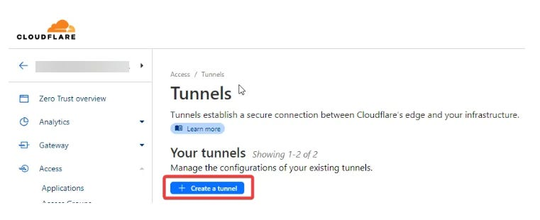](images/0aa8db3a-0eff-4cd5-bc7d-ae0d8add5ed4_761x310.png)

Walk through the wizard to name the tunnel. For most projects I usually use some form of Ubuntu for the OS, so I’ll select Debian —> 64-bit (though Windows, Mac, Red Hat, and Docker versions are also available) and you’ll copy the bit of code under “If you don’t have cloudflared installed on your machine.”

[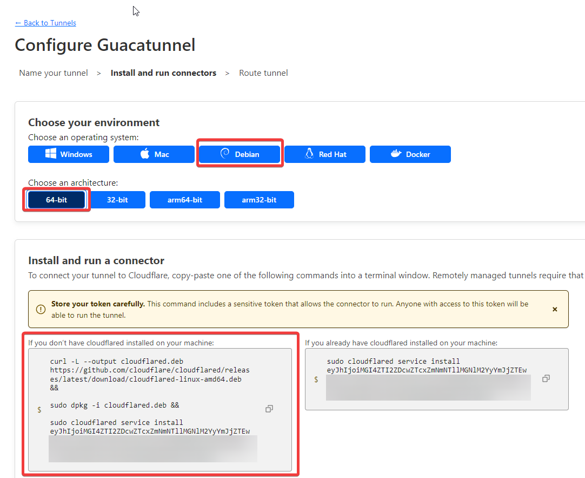](images/c74c1bbe-30fd-4f3f-8d73-f4af5a2b9996_1082x883.png)

Take this bit of code and run it on the server where your application lives. The code snippet is customized and contains a token to access your environment. Please safeguard this token. After the commands complete, finish the Tunnel wizard.

**Note:** If the curl command fails to download the file, check to see if you’re on a network with a content filter that’s blocking Github. If so, you can work around it by downloading the file and uploading it somewhere that isn’t blocked, like an AWS S3 bucket or Azure Blob, and change out the link in the code snippet to download the file from the new location.

### Assign a Subdomain and Domain to Your Site

The last step of the wizard is to make up a subdomain and select the domain you attached to Cloudflare. All this takes is clicking on the drop down and picking the domain. Finally, enter the IP and port where Cloudflare will access your application. The path can stay empty.

[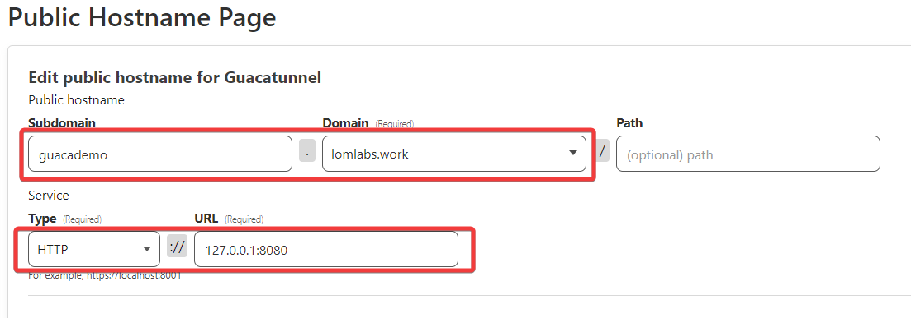](images/b70c8cc9-d211-48fb-9d10-bec28194bab2_1103x387.png)

*NOTE: Be sure that you’ve selected HTTP under type. If you select HTTPS, you’ll get a Bad Gateway error from Cloudflare. That doesn’t mean you’re unencrypted though. Cloudflare serves as a reverse proxy, so your traffic will be served as HTTPS.*

Your tunnel should now display as HEALTHY:

[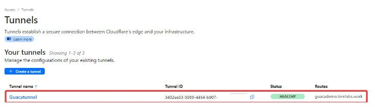](images/37b71a7f-9546-47b7-9017-ac112c040f1e_736x221.png)

At this point, the server at your indicated IP address should be accessible on the public internet (😬)

### Configure Cloudflare Access

Now that the application is publicly accessible, we need to place some additional restrictions on who can access it. From the main Cloudflare page, go to Zero Trust —> Access —> Applications. From here, you’ll click **+Add an Application** and select Self-Hosted.

[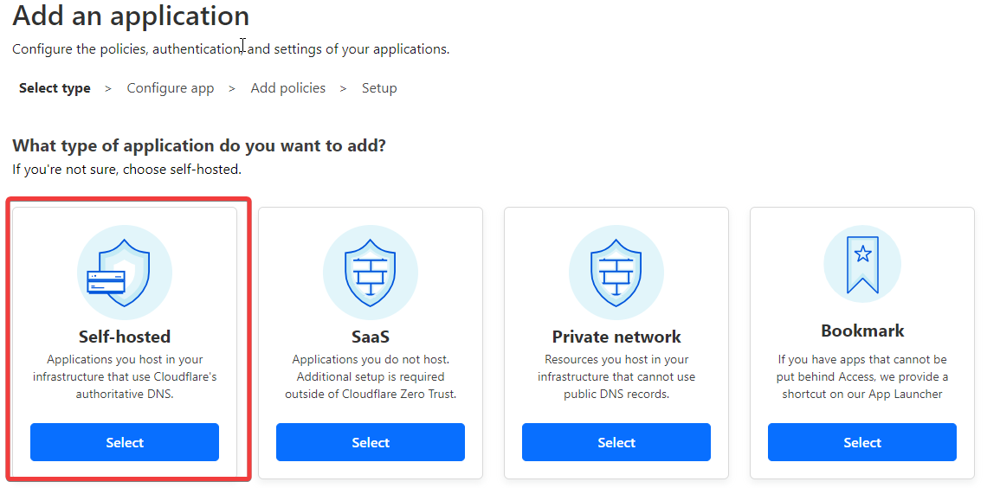](images/c2ce0f8a-fd22-4c16-9c31-c0abe04e98bd_1155x564.png)

Next, you’ll provide a name for the application, and enter the **same** subdomain and domain you previously entered for your tunnel.

[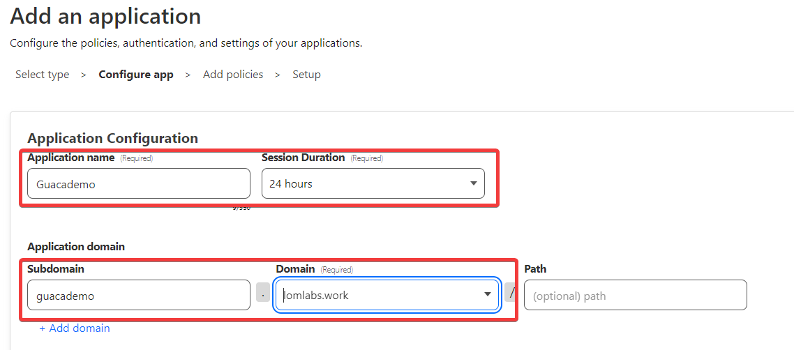](images/2547c1a9-4b3e-4dac-a112-36c40570a5e6_1138x502.png)

There are also some additional configurations you can make here on the Add an Application screen to customize error messages, add a logo, or add an identity provider (more on this later). To get started, you can accept all the defaults and click Next.

On the following screen, you’ll be asked to create an access policy for the application. Begin by giving it a name. Let’s call this rule **External Access** with the Action set to Allow. For session duration, you can choose how often you will want people to have to reauthenticate, from 15 minutes to 1 month. Balance this based on your threat model and the sensitivity of the application. If you have an application being used by teachers over the course of a day, 15 minutes will lead to pitchforks and torches coming your way, whereas 12 hours will require auth’ing only once a workday.

[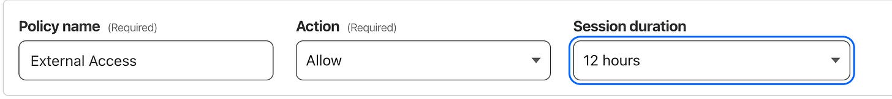](images/75f40681-2b7a-45ab-8602-e1d7dcd89779_1930x218.png)

In our most basic setup, we’re going to require a user to be located in the US and be using our organization’s domain name to be able to sign in to the app. To do this, we’re going to create a Require rule for Country = United States, and an include rule for Emails ending in = [@]edtechirl.com. What this will do is create a workflow BEFORE authentication that, before being allowed to even see your application’s login page, a user must be attempting to sign in from a US-based IP address AND receive and verify a time-based one-time passcode (TOTP) at an email address that’s from the included domain(s). Once they complete this process, the user will only then be able to see your local application. Note — if your application already requires MFA, they’ll have to do a second round of MFA to access it. If that’s too intensive for your use case, I’d recommend not including email domain as a condition for access.

[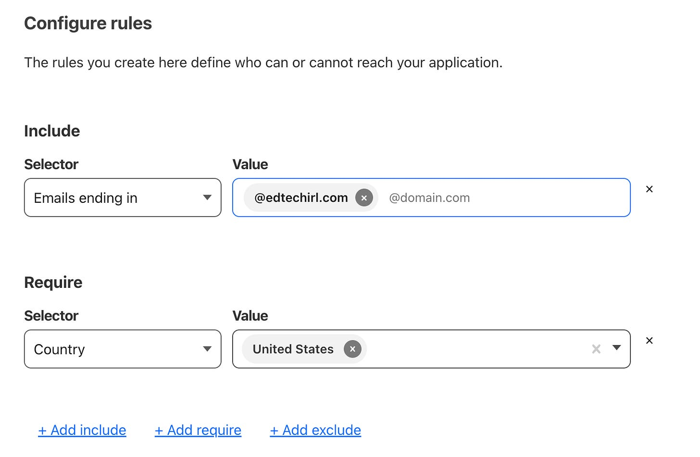](images/7327842c-2a4f-4976-9f37-619df1393598_1580x1032.png)

If you would like to restrict access to people with specific email addresses instead of just having the correct domain, you can click **+ Add include** and choose the selector **Emails** and enter the email addresses of the users you want to be able to receive passcode to access the app.

[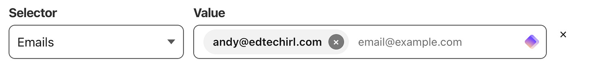](images/6208e54b-49de-422b-b9a0-e28bd1f9c405_1502x178.png)

If there are cases where people who don’t fit the above criteria who may request access to your app, you can provide a workflow that allows for temporary access requests under the Additional Settings section. This will require the user to make a request that must be approved prior to allowing access.

[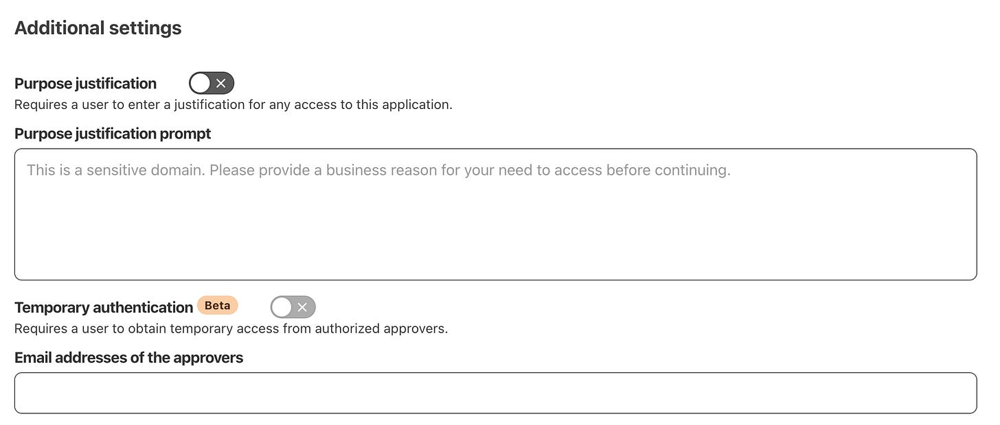](images/d17b2567-f602-4ada-aa5b-99bba46fdeef_2112x900.png)

From here, click next. The settings on the next page generally can stay with the defaults, depending on the application. If you leave it with the default and it doesn’t work, Googling your application name and Cloudflare Tunnel or Cloudflare Application can usually lead to someone who has found the right combination of settings (though not always… I have a few orphaned apps that I’ve never been able to get exposed correctly, usually due to security settings on the application side).

### Add an Identity Provider

A good step up from the previous setup is to configure an Identity Provider to use for Cloudflare authentication to your app. This adds a layer of security and scalability that’s easier to manage in the long run. If you’re using Azure, for example, you can create app-specific groups in Azure where only the people assigned to the group can access it, even if they have the correct email domain.

To get started, go to Settings on the left-hand navigation pane and then select Authentication. Scroll down to Login Methods and select Add New. You’ll be presented with the following choices:

[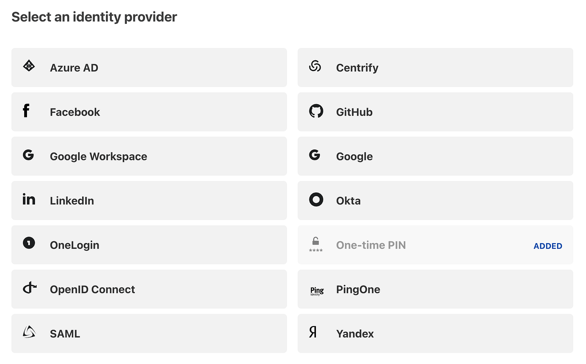](images/f4a6814c-5226-4195-bc30-34c65a78c33b_1742x1084.png)

When you select your IdP, Cloudflare will provide very granular step-by-step instructions, but the general idea is that you’re creating an application registration in Azure that will allow Cloudflare to query Azure when someone requests access, and if they’re not part of a group in Azure that allows access, they will be denied. A perk here is that for that communication to happen, the person has to authenticate in Azure, including performing MFA (if required by their tenant).

[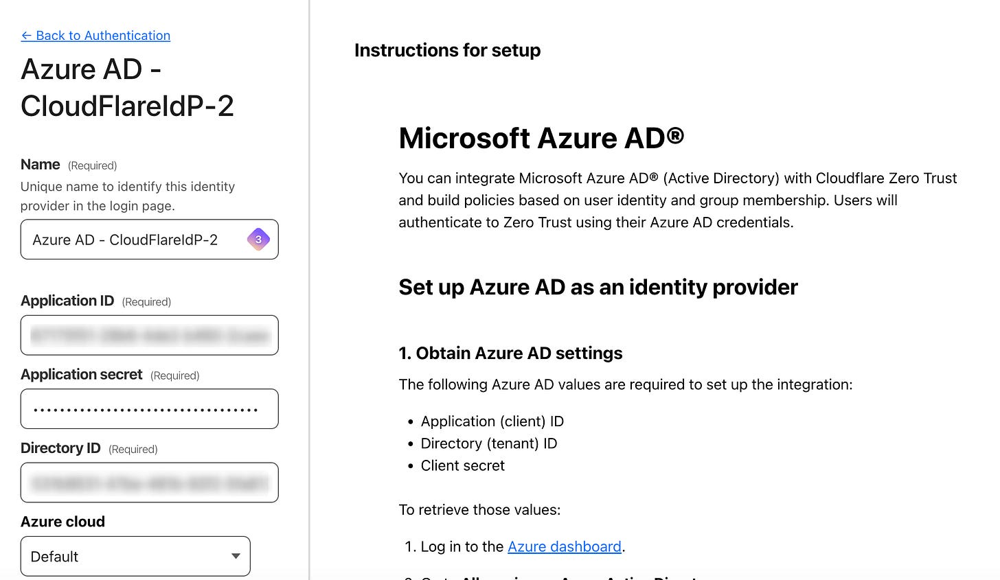](images/e26daa4c-f90f-4803-b4cd-3ec38af28589_2170x1260.png)

After you finish the setup process, click the Test button on the Settings —> Authentication page

[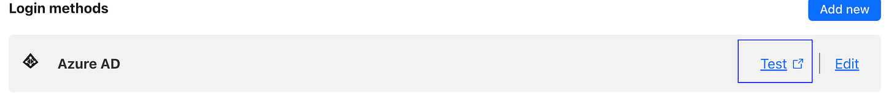](images/c147251b-1aef-418c-8745-d1311c24ba0e_2054x214.png)

If successful, you should see something like this:

[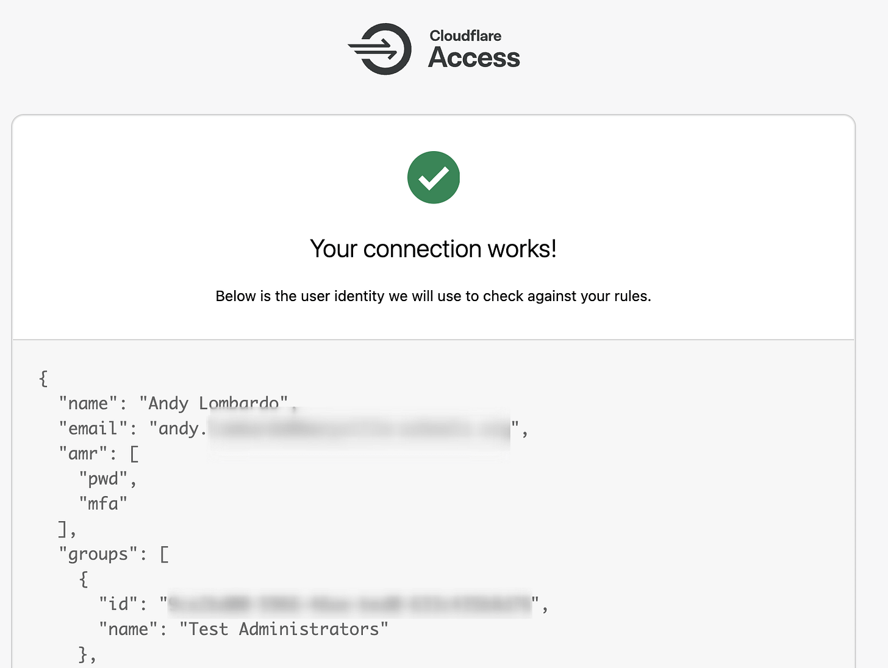](images/4c3c0340-fbfc-4460-8d02-f422250d87d4_1698x1278.png)

### Attach the New Identity Provider to Your Application

Now that you have a connection between Cloudflare and your IdP, you can use it as a condition for access to your application.

Head back to Access —> Applications —> Select your application —> Edit.

Then, click on Policies —> Policy you want to edit —> Edit.

Scroll down to Configure Rules and click on **+ Add Include**. For the selector, choose the IdP you set up previously, and enter the name of the group you want to allow access in the value box.

[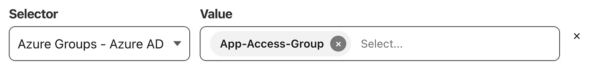](images/8be89c51-a803-496e-9ddb-9f6d24e557bb_1484x184.png)

Depending on your use case, you can use this in addition to the previous methods you set up, or you can remove them and only use this.

Finally, remember to hit the Save Application button.

[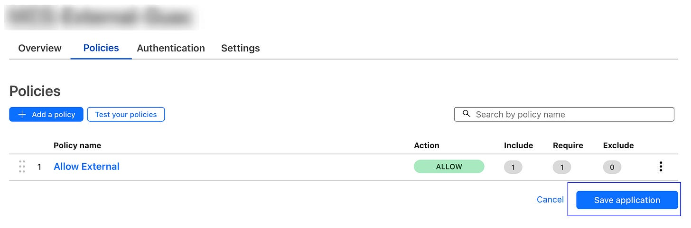](images/44e05c0a-51b2-4e7a-b8bf-baac74a1556c_2254x748.png)

### Leveling Up

As you’re considering next steps of things you can do with Cloudflare to expose and protect your application, you can choose to get more granular with your access policy. Possibilities include using an IP allow-list to only allow access from specific public IPs, or really level up with certificate-based authentication where the user has to have a unique security certificate installed on their device in order to access. You can also consider tapping into some of Cloudflare’s Web Application Firewall (WAF) features. Many of the WAF features are paid and free accounts are limited to fewer rules, but there are free options like bot blocking, DDoS protection, and Zone Lockdown to limit specific areas of your site to even more granular allow/deny listing (i.e., the Zone Lockdown rule template would let you expose the end-user areas of a site to everyone in group A, but only allow people in Group B with a specific IP address to access admin portions of the app).
