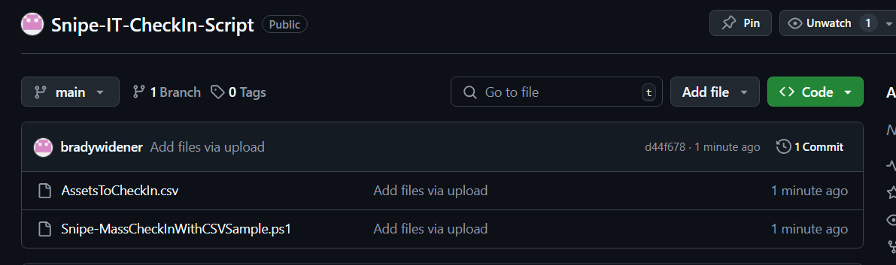
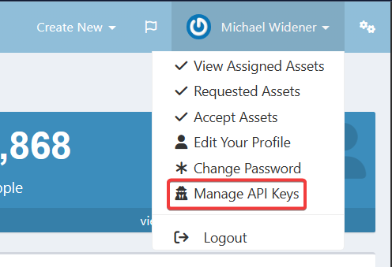
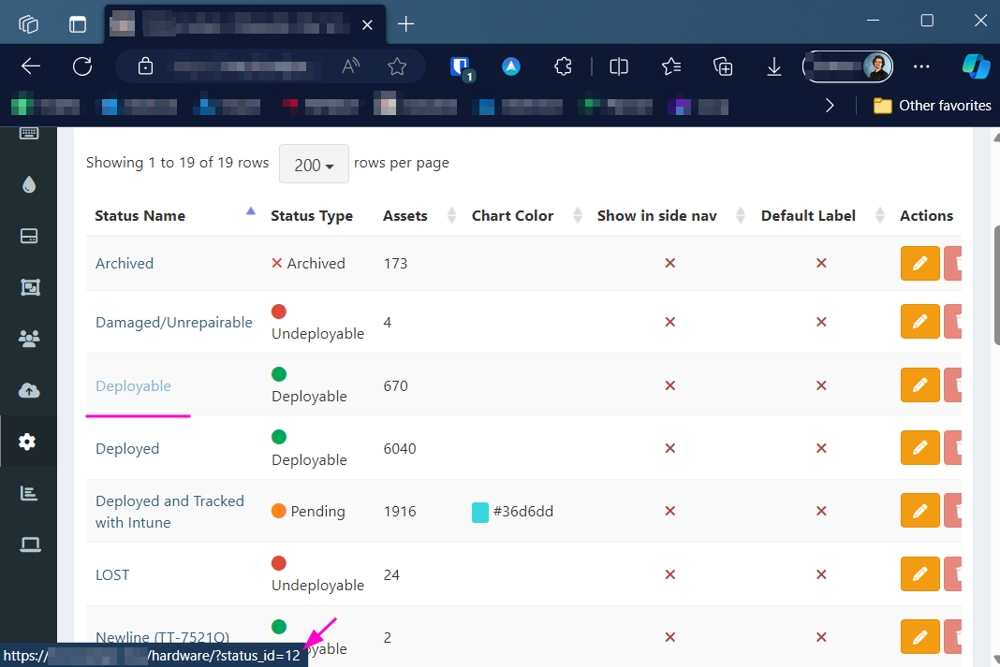
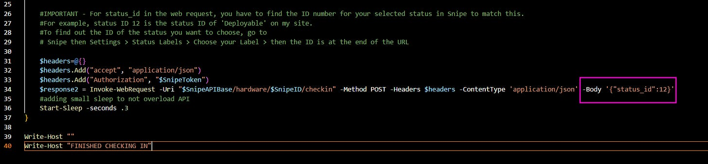
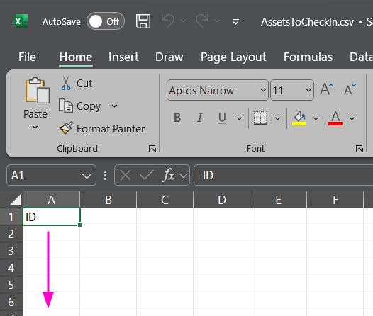
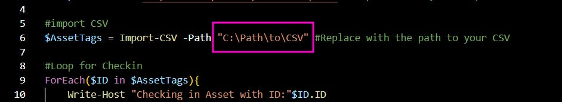

# Snipe IT - Device Check-in Script with Powershell

*Bringing in the missing feature of Snipe IT!*

### Introduction

Though I am an absolutely huge fan of Snipe IT, one of glaring missing features is a way to mass check-in a list of devices through the Import feature. There are some work arounds for this missing feature, but in general, these work arounds are more confusing than just having the device listed as available and not checked out to a user. While searching online to see if anyone else had made a solution, I found that this feature is wanted by a handful of others as well.

To fix this, I wrote a PowerShell script that will allow you to check-in a list of devices from a CSV, by using the Snipe IT API.

### Download the Script

First, you will need to [download the script](https://github.com/bradywidener/Snipe-IT-CheckIn-Script) from my GitHub. There is also a sample, blank CSV there as well. Download a copy of these items.

### Creating an API Token in Snipe

1. First, you will need to log into Snipe API and click on your profile in the top right, then **Manage API Keys**

1. Click **Create New Token**
2. Give it a name. As soon as you do, it will show you a long string. Copy this and keep it somewhere safe, after you close the window there is no way to view it again. You will also want to paste this in our script on line 2. The variable will look something like this after it is filled in. Note that Bearer must come before your token.

   **$SnipeToken = "Bearer eyJ0eXAiOiJKV1QiLCJhbGciOiJSUzI1N…”**
3. Next, on the API Keys page in Snipe, it also has your base API URL in the right corner. We will want to copy this down on the next line. It will look something like this.  
   **$SnipeAPIBase = "https://domain.snipe-it.com/api/vi"**
4. After this we need to figure out what status ID we would like to use. In general, I think it makes the most sense to use the status **Deployable**, when checking in devices. To find the status label you need, go to **Settings > Status Labels** in Snipe. When you hover your mouse cursor over one of the statuses, you can see what ID number is used for it in the URL preview at the bottom of the browser. For this example, Deployable uses status ID 12.

   
5. Once you have your status label, be sure it is correct on Line 34 of the script, like in my sample below.

   
6. After this, we have all of the information we need from Snipe.

### Filling out the CSV

As you’ll notice the Sample CSV is pretty blank. All you need to do is scan away and make a list of the Asset Tags you would like to check in, under the cell A1 that says **ID**.

Lastly, before you run the script, you will need to add the path of the CSV to line 6 on the script.

Once you have done all of this, you are ready to run the script. To start, I would recommend trying to run the script with just one asset to check-in, just to make sure everything behaves as expected.

Cheers!
