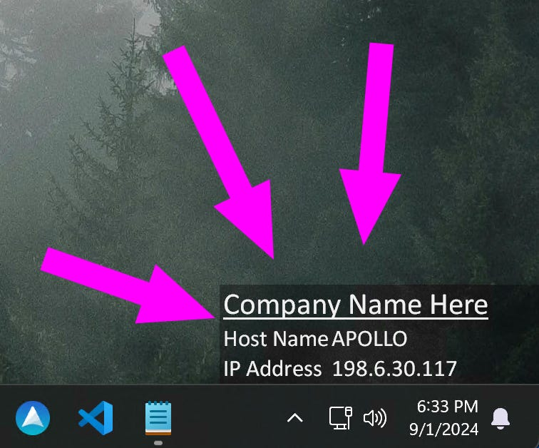
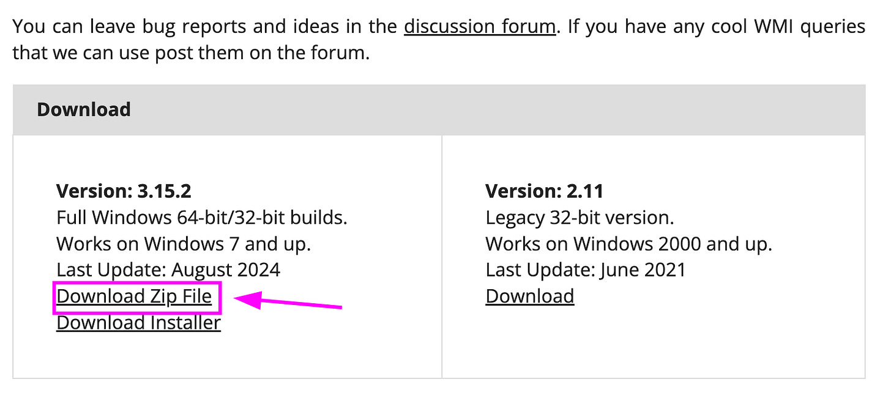
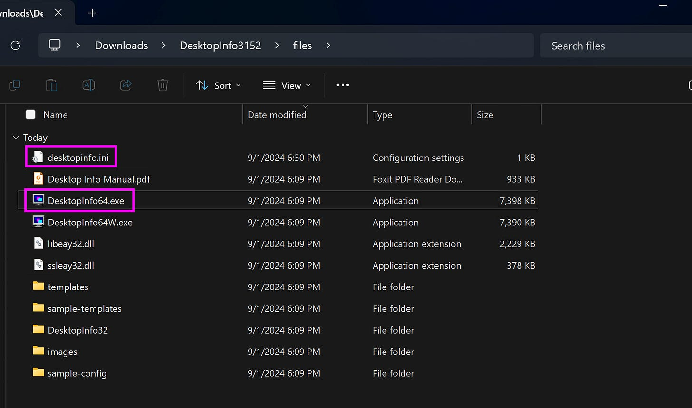
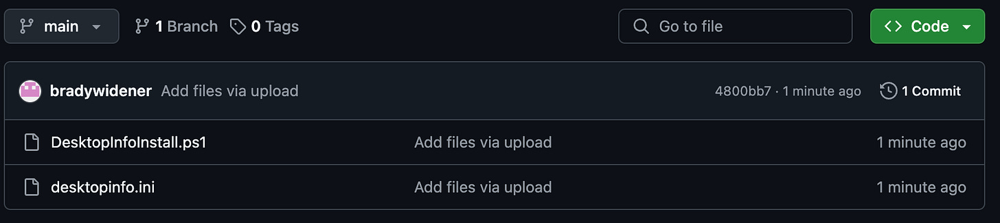
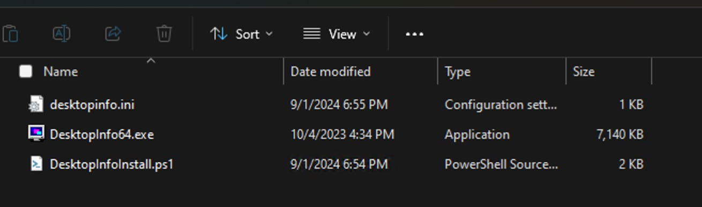
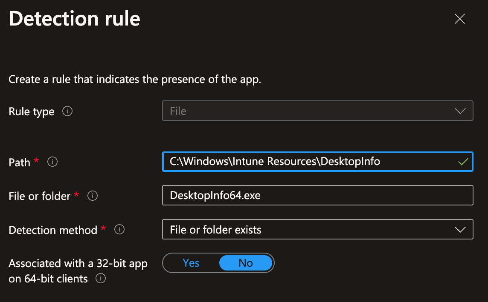

# Deploying DesktopInfo using Microsoft Intune (Modern BGInfo)

*The modern BGInfo that works with Docking Stations!*

[](images/561e2351-0ecf-47ae-b18e-68eee8720bf8_756x628.png)

### Introduction

How many times have you had to type up instructions for an end user on how to find their computer’s hostname, or to find their IP address? If you’re like me, way too many to count. A useful tool to fix this was [BGInfo from Mark Russinovich](https://learn.microsoft.com/en-us/sysinternals/downloads/bginfo), part of the infamous SysInternals Toolkit. This tool would take the user background image and add a little text box in one of the corners with information about the computer. This way, information like the computer’s name was visible on the desktop. However, as technology has progressed, BGInfo hasn’t kept up in all areas. Specifically, the fact that it doesn’t play well with docking stations was a non-starter for me. In comes [DesktopInfo by Glenn Delahoy](https://www.glenn.delahoy.com/desktopinfo/), a modern take on the above-mentioned tool.

This article is going to cover how to deploy this automatically to your Intune devices. I am also going to include my configuration if you’d like to borrow it :)

### Download the Tool

First, you will need to go to the [Desktop Info site](https://www.glenn.delahoy.com/desktopinfo/) and scroll down until you see the download links. For this tutorial, we are downloading the ZIP package.

[](images/a7af6f85-1af5-4bcb-9e19-d9c0eaba146e_1514x704.png)

### Making the Package

We are going to package this as a Win32, so go ahead and make a source folder. In this folder, we need to copy over two files from the zip folder we downloaded. We need **desktopinfo.ini** (the configuration file for the program) and **DesktopInfo64.exe** (a portable version of the program itself.)

[](images/af6bed0e-92a0-4194-903b-acfa04a9f136_1794x1060.png)

Next, you are going to need to go [to my GitHub](https://github.com/bradywidener/Intune-DesktopInfo-Deploy) and download the PowerShell script

If you want to create your own configuration for DesktopInfo, go ahead and do that now. It takes a lot of patience and tweaking to get it correct, but I think the effort is well worth it. There’s lots of customizability, including live graphs, hyperlink buttons, etc. and a great PDF manual for helping you configure these things. If you’re wanting to deploy my configuration, you can download that on my GitHub as well.

[](images/244467e7-f8a5-4c81-bed4-4fd6433e1ced_1826x408.png)

Go ahead and place the **DesktopInfoInstall.ps1** script in your Source folder for the Win32 package. If you’re using my desktopinfo.ini configuration file, go ahead and put it in the source folder. If you are going to create your own configuration file, put it in instead. Be sure that the file is named **desktopinfo.ini** .

When you are done, your source folder will look like this.

[](images/054a48ef-5b2e-4285-94e4-0902bca5a740_1310x388.png)

Go ahead and run the IntuneWinAppUtil.exe to package this. I’m going to assume you’re familiar with this process, but if not, there are many great guides are creating win32 packages for Intune. Note that for this, you will want to use the DesktopInfoInstall.ps1 as the install file and **NOT** the DesktopInfo64.exe

### Upload to Intune

When uploading this to intune, there’s nothing special here. For the Install command you will want to use the following. I don’t plan on uninstalling this, so I used the same line of code for the uninstall.

```
powershell -executionpolicy bypass -file DesktopInfoInstall.ps1
```

For the Detection Rule, I am having Intune check for a folder created by the script to house the executable. For this, you’ll want to **Manually Configure Detection Rules** and fill it out like below.

[](images/11bda812-09c9-4191-bb4d-1b0ca5f7bf88_1144x710.png)

After this, be sure to send this to a test device and make sure it works properly. Note that you will have to restart the device before it opens, as it is set to open on startup.

### Quick note about the install script

Lastly, I wanted to give a quick note about the install script and how it works.

The script will first check to see if a folder exists (**C:\Windows\Intune Resources).** I’ve found it helpful to have a dedicated folder to locally store things on devices for some Intune installs. If this folder doesn’t exist, it will go ahead and create it.

After this, it will create a new folder inside the Intune Resources folder called **DesktopInfo.** It will then copy over the **desktopinfo.ini** and **DesktopInfo64.exe** files to this folder.

It will then create a shortcut to the **DesktopInfo64.exe** file and copy this shortcut into the startup folder of each user that has signed on to the computer.

The reason I mention this is because there is a caveat with this. The way it is made currently, this will work for any users who have logged into the computer, but not future users who will log into the computer. This makes it a not great solution for shared device scenarios, but for designated user devices, it should work fine.

There’s the potential this could be rewritten to instead create a scheduled task, however, at this point this is how I have the script working in my environment.

I hope this helps someone out!
