# Fighting the Bear: Blocking Games for Students using AppLocker (in Intune)

*A K12 System Admin's guide to AppLocker!*

[](images/9537be63-1c83-4049-9b2f-2234ccf4c1a4_2048x2048.jpeg)

### Introduction

In IT, I have learned to never doubt a handful of things.

1. Murphy’s Law.
2. How gross kids are with student devices.
3. The lengths students will go through to get Games on their student devices.

This article will covering the third rule listed. I wanted to write this article as when I got started with AppLocker, I felt like a lot of the guides I found online gave a good overview of the process, but don’t seem to cover how to go about maintaining it. If you are unaware, AppLocker is a built-in Windows feature that allows you to block programs from opening on your devices. I have successfully maintained an AppLocker policy for over a year on 5000+ student devices without breaking anything, so I feel like I’m ready to share everything I haved learned. Just a warning, the title and artwork of this article isn’t just for fun. AppLocker and blocking games in general are a bear to handle, but at a certain point I feel like it becomes a necesity in the K12 enviornment.

### Things to Consider

1. **The Risk -** First, AppLocker is a policy that can be risky to deploy. I have accidentally bricked my test computers before by accidentally blocking explorer.exe. I don’t say that to scare you, but just to emphasize that AppLocker requires thorough testing and isn’t something you can just try and see how it works. I say this also to say that sometimes students downloading games should be a disciplinary issue instead of a technical issue. There are thousands of games out there, and it will be impossible to block them all. However, I know that once one kid finds a game they can put on their computer, they tell their friends and suddenly it’s on hundreds of devices. It’ll be up to you to decide where to draw that line.
2. **WDAC vs AppLocker -** There is a very similar alternative to AppLocker called WDAC (windows defender application control). In general, I think WDAC is going to be a better, more secure alternative in the future, however, when I first started experimenting with blocking apps, I found AppLocker to be more consistent. Your mileage may vary, but I think WDAC is worth giving a peak to see if it’s right for you.  
   [More info here on WDAC vs AppLocker](https://learn.microsoft.com/en-us/windows/security/application-security/application-control/windows-defender-application-control/wdac-and-applocker-overview)
3. **Windows Licensing -** Before you get started with AppLocker, a prerequisite is to have your windows licensing and editions in check. Specifically, you must have either **Windows Education** or **Windows Enterprise** on your devices. It will not work on other devices and you are likely to get inconsistent results, and/or a mess. When I first started trying to implement AppLocker, my test device was running Windows Pro and it took me a long time to figure out why the policies weren’t working the way I thought they should!

### Creating a ‘Test Enviornment’ for AppLocker

One thing I will continually preach throughout this article is that AppLocker **MUST** be tested before pushing anything. Below are a list of things you will need to set up to be able to test these things.

1. **A Virtual Machine or Device for Creating Policies** - I recommend a Virtual Machine for this, if possible. Being able to return to a snapshot after you export your policy makes life a whole lot easier. Don’t forget to make sure it’s licensed with Windows Edu or Enterprise!
2. **A Device for testing policies on** - You could also do this on a Virtual Machine, however I prefer to do it on one of the student devices. This helps make sure nothing device specific is getting blocked out unintentionally. This device should be in Intune and set up exactly like your other student devices.
3. **A group and filter for your test device** - To assign policies to just the one device and to be able to exclude it from any In Production policies, you will need to create a group and filter containing just your Test Device. For the group, I would just keep it simple and make a static group called **AppLocker Test Device** and just add the one device.

   [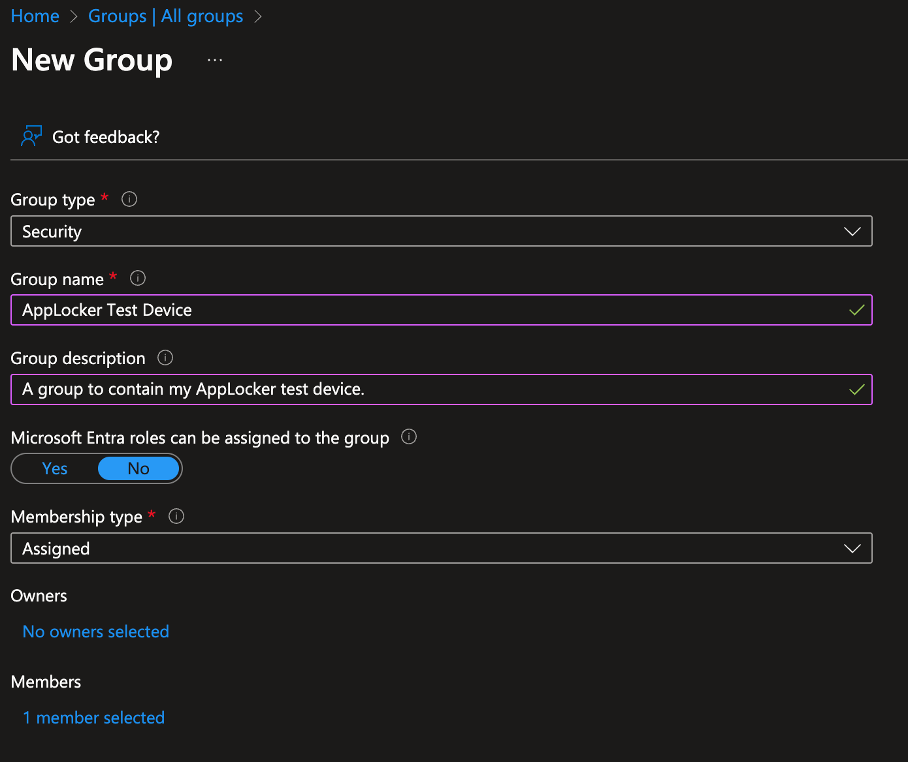](images/e098bb5f-d9b1-46be-83e0-b586a382ac58_1390x1168.png)

   For Filters (Under *Devices > Organize Devices > Filters*) you can’t target a single device with a static membership. However, you can make the filter target only devices with the exact device name as your AppLocker test device. This is what I have done below.

   [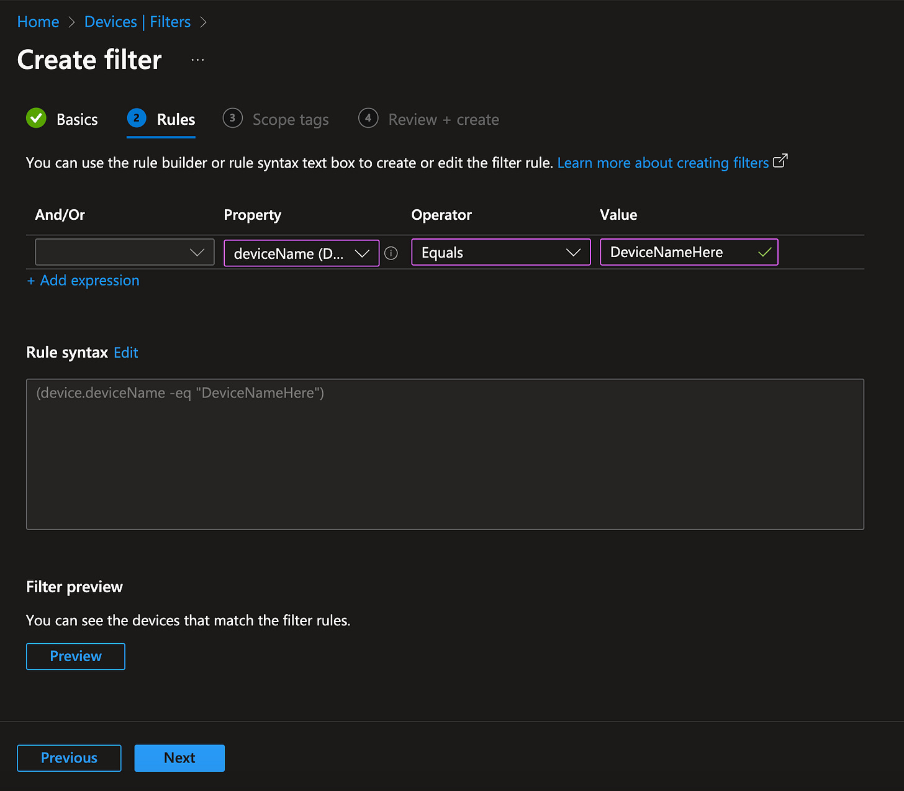](images/31beeb8b-1639-4e24-b570-98b1297a11a5_1600x1400.png)
4. Lastly, we are going to create **two** AppLocker policies. One that is the Production Policy that will be pushed out to student devices, and one that is the Beta Policy that will be our test policy that we use until it is ready to be copied over to production, after being tested and confirmed working. Instructions for creating the policies will be in the next step.

### Creating the AppLocker Policy Rules (XML)

First, install the program you wish to block or allow on your Device/VM for Creating Policies.

After this, search for **Local Security Policy** on the taskbar and open it.

[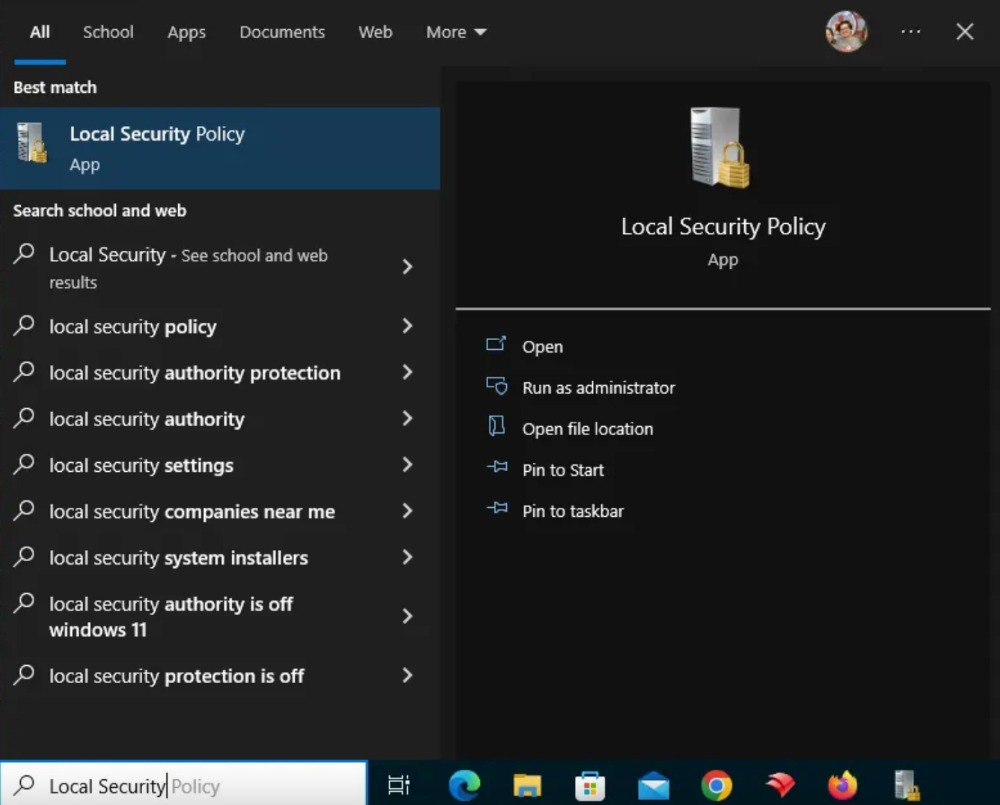](images/9d1ea36c-1865-4b98-be41-1d0c2d313b7e_1442x1162.png)

Once you have the program open, go to **Application Control Policies > AppLocker > Executable Rules**

[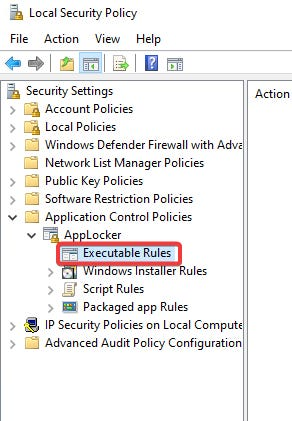](images/846aee6b-46cc-45ec-b669-d28595d39041_292x421.png)

Right click in the box to the right and click **Create Default Rules**

[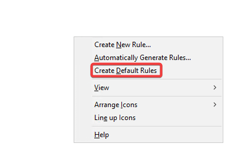](images/0443c8ca-4d9c-4dbd-b1f5-b3c3322fc36e_409x277.png)

Next, right click and **Create New Rule.**Walk through the wizard and create either an allow or deny rule. In this one, I'm creating an allow rule.

You will be asked to define what specifically to block/allow of the app. You can identify an app to block/allow in three different ways: the publisher, the file hash, and the file location/path. Typically I try to do this by publisher as it's the most all-encompassing. If you can't do it by publisher, the next best is by path usually, but depends on the app. The only time I do not go by publisher is when the exe of the app isn't digitally signed by the publisher.

[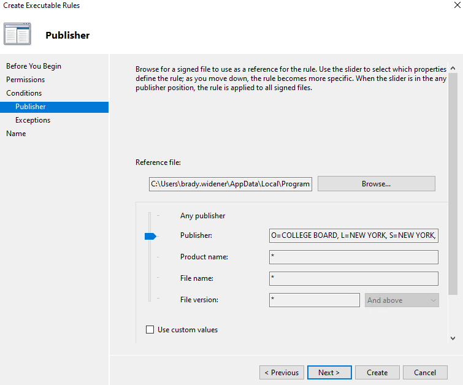](images/649eeed2-9f1f-4bf5-8290-22a0c40e5553_755x628.png)

When allowing/blocking the rule, I always do it at the publisher level. This means that everything created by this publisher is allowed or blocked. If you need to target something more specific, you can drag the arrow down and get more granular for what to allow/block by this publisher.

Once you have done this, create the rule. To test out the rule, I’ll normally give the machine a reboot before trying to see if the policy works, just to make sure it doesn’t break any windows startup processes. One windows is back up, try to open the app. If you are blocking it, typically you’ll get this infamous pop up box if the app is being blocked by AppLocker.

[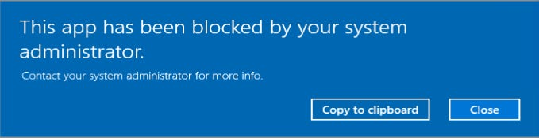](images/b67e131c-18e9-4736-8060-a878b380721b_679x175.png)

I would recommend doing these in bulk (i.e. go ahead and make rules for all the apps you need to block and allow at once. I would also go ahead and make allow rules for common software publishers you use like Microsoft, Google, Pearson, etc.)

Rinse and repeat until you have a full policy you are happy with. Once you are ready for uploading to Intune, go ahead and open up Local Security Policy, right click on AppLocker from the side menu, and Export Policy.

[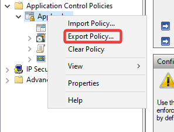](images/fb61b632-7c95-4349-a124-7ed539b6598a_297x225.png)

Lastly, before uploading this policy to Intune we have to make a slight change. There are multiple Rule Collections whenever you export the AppLocker policy, however, the only one we are configuring is the EXE collection. We will need to omit everything else and then save the XML. In the picture below, all that will remain in my XML is in the green rectangle. (Or, everything in <RuleCollection Type=”EXE” …> to where it closes, </RuleCollection>)

[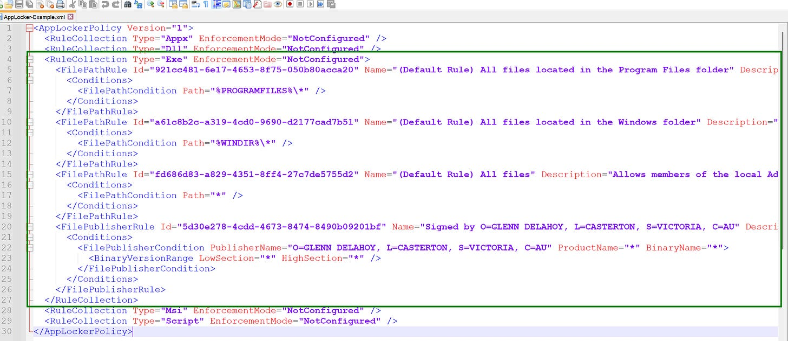](images/cc8f3bc7-acce-430e-9d95-d59730591313_2998x1304.png)

### Creating the AppLocker Policy (Upload to Intune)

To create your Intune Policy, first go to Devices > Configuration > Create > New Policy.

Your new policy will be under **Windows 10 and Later > Templates > Custom**

[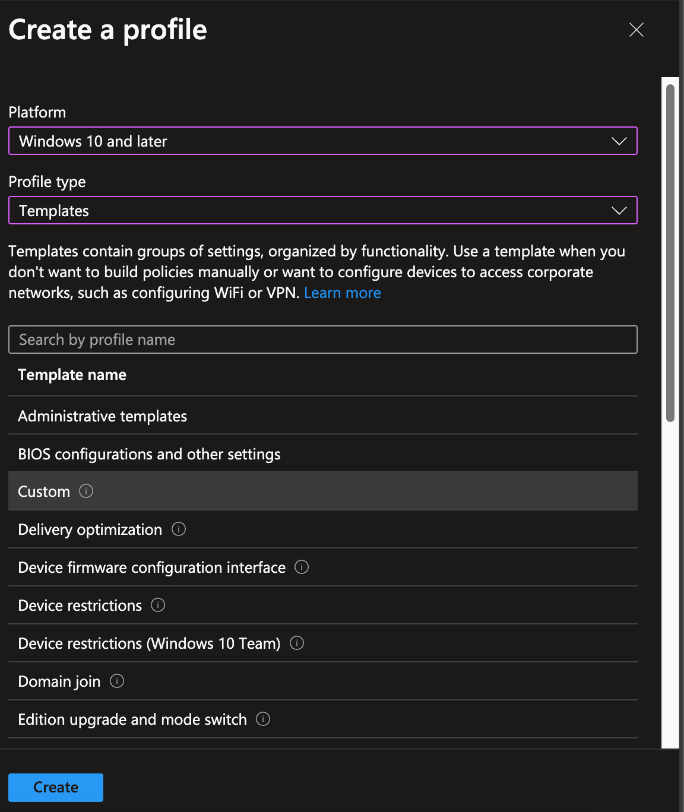](images/25336b85-8b31-47e1-be2e-457c092cc133_1152x1368.png)

On the next page you will be asked to name the policy, then on the page after that you will see a section called OMA-URI Settings. If you’re not familiar with Windows CSPs, no worries. Just copy my settings below. All you need to know is that there isn’t a way to configure some settings in Intune (like AppLocker), so we are creating this custom policy that targets AppLocker on the target devices instead.

[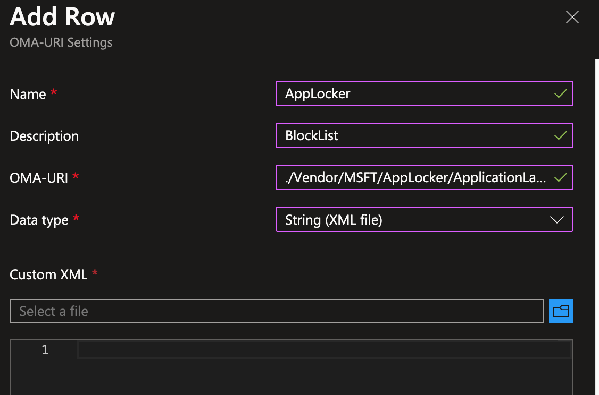](images/f0a323e1-ded9-4f90-b759-f3a27b219a5d_1126x744.png)

For OMA-URI, use the line below.

```
./Vendor/MSFT/AppLocker/ApplicationLaunchRestrictions/myapps/EXE/Policy
```

Lastly, you will need to upload the XML file we made by clicking on the Blue Folder icon. When you are done, push this to your AppLocker Test Device Group. Make sure everything is working as intended. Assuming it is, then push this to your student devices. Be sure to test other applications as well, and not just the apps you are blocking. Anything essential to daily use for your devices should be checked before implementing the policy.

### Maintaining an AppLocker Policy

Once you initially push out an AppLocker policy, stress will be lifted.. for a while. Some students won’t stop there and continue looking for games. Once they find some, you’re going to need to get ready to add more rules to your policy. Also more than likely, you’ll need to add some more allow rules as you’re going to find apps that are unintentionally being blocked. The biggest culprit I find for this are autoupdate apps.

To create new rules, simply go back to your Policy Creation VM/Device and create them as you normally would. Test away and make sure everything is blocking/allowing as expected. When you’re ready, export the policy like we originally did. Next, you'll want to open the exported policy in a text editor. Find the rule(s) you made. You want to copy everything inside of the <FilePublisherRule> to where it closes at </FilePublisherRule> , for each rule.

[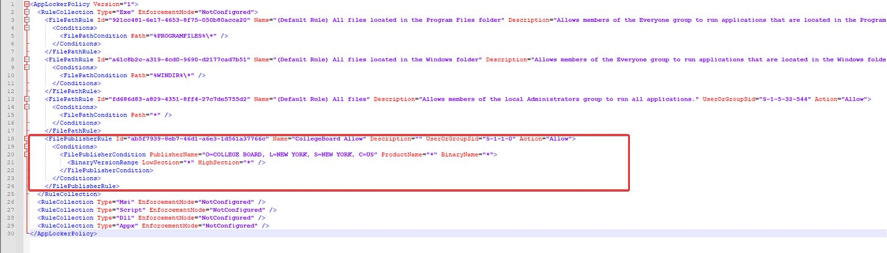](images/c4adf189-4c5a-4774-a877-aa758acb6e1c_1898x544.png)

Copy your current policy from intune and paste it in a new text editor window. Then, you’ll want to copy your new rule(s) above the default rule collection, like in the pictures below.

[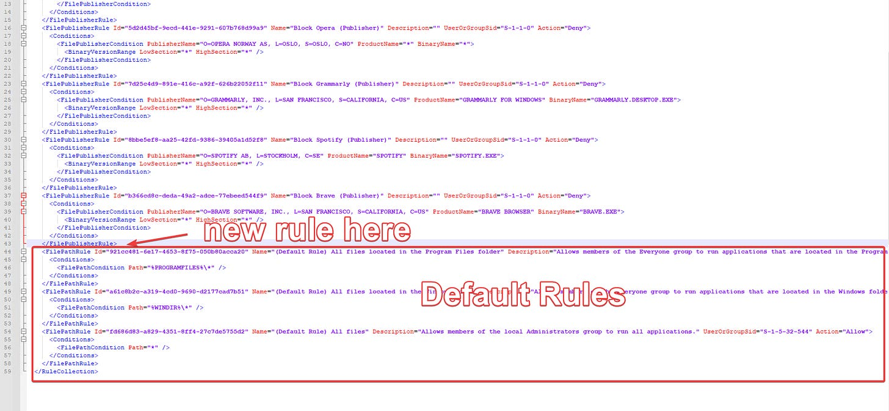](images/b1c9c116-d26c-4d0b-8094-e327ef38c7b0_1892x874.png)

[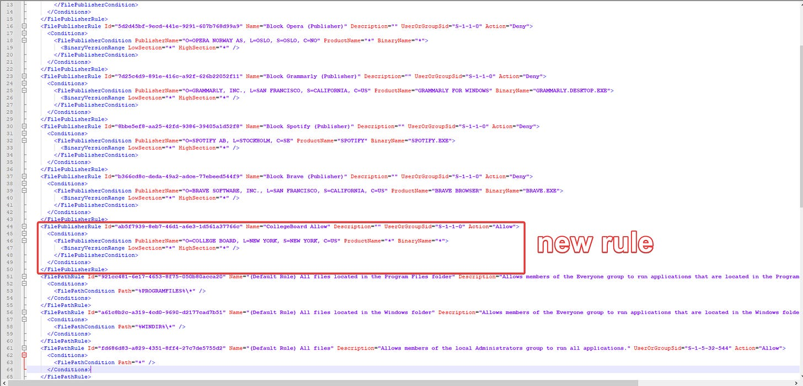](images/3d16a787-33dc-4baf-ae90-a4cc7af5d824_1905x917.png)

Save this new XML file.

Once you are ready to test the policy, we’ll apply it to our test device. First, apply a filter to the in-production policy that filters out your test device. This will make it to where the policy is lifted from your test device, but will stay the same on all other devices.

[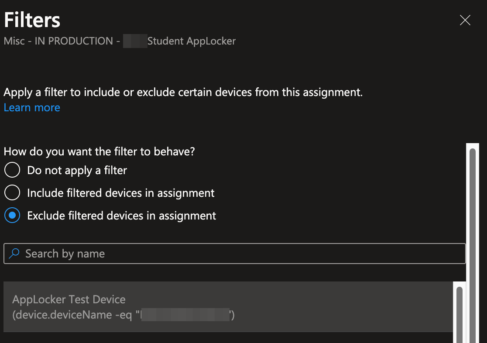](images/c675e2fd-7cdd-45cc-8393-4bbf80f4761c_1116x786.png)

Then after this, you can go ahead and assign your Beta policy to your test device. If you haven’t created a beta policy yet, go ahead and make one with all the same settings as the in-production policy, except upload our new XML and go ahead and push it to your test device.

Once you have confirmed the device has picked up the policy and is working as intended, we can then go ahead and take our XML and upload it to the In Production Policy, replacing our old XML.

[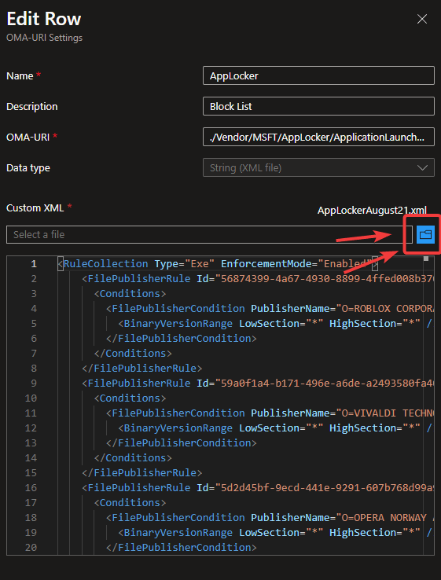](images/bc4f4b5b-bd87-44af-84d9-c6a3f743ae4d_561x738.png)

(Note: I would go ahead and remove that filter and remove the beta policy assignment from your test device, let it get the in production policy, and then upgrade the policy to the new XML. It gives me some peace of mind to watch the same policy get implemented to my test device and make sure it is working, as it is being sent out to others, thought I acknowledge this step is redundant.)

### Troubleshooting AppLocker

By far the most helpful tool when troubleshooting applocker issues is Event Viewer. There are logs for AppLocker that tell you everything that is being allowed by AppLocker and everything that is being blocked. It will also tell you the location of programs being blocked which is extremely helpful whenever you’re troubleshooting ‘false postive’ blocks.

[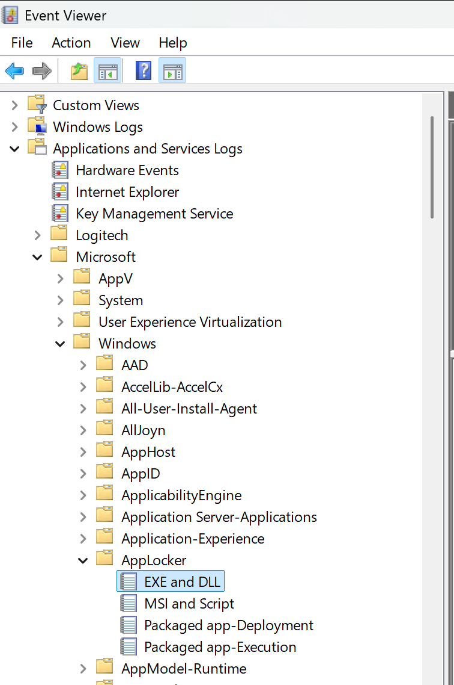](images/ecc7f297-e1be-45d6-955c-6ef8e0c89f31_756x1138.png)

The event viewer logs are under **Applications and Service Logs > Microsoft > Windows > AppLocker > EXE and DLL** . Programs prevented from running by AppLocker use Event ID 8004.

### Conclusion

Not going to lie, this article itself was a bear I had been avoiding. However, I hope it helps some of you out there trying to figure out how make this work and trying to find an effective routine way of doing it.

Cheers!
