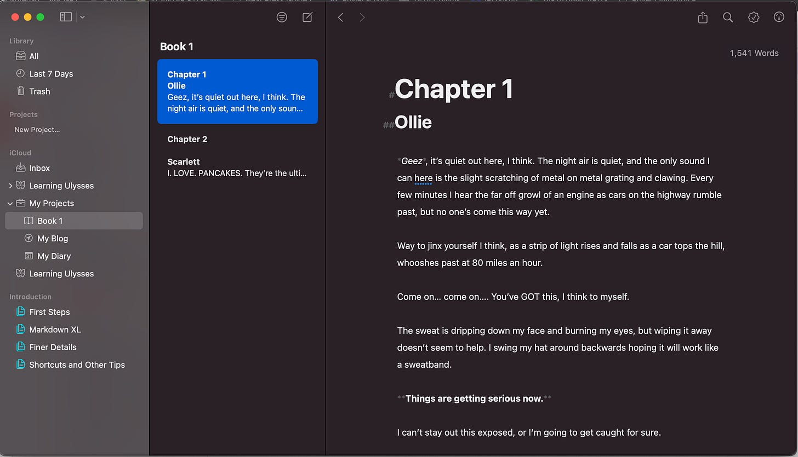
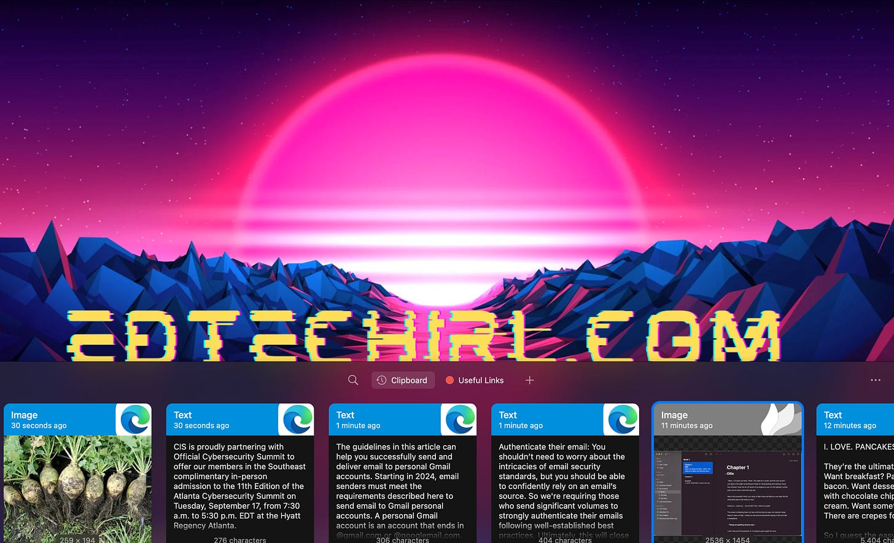
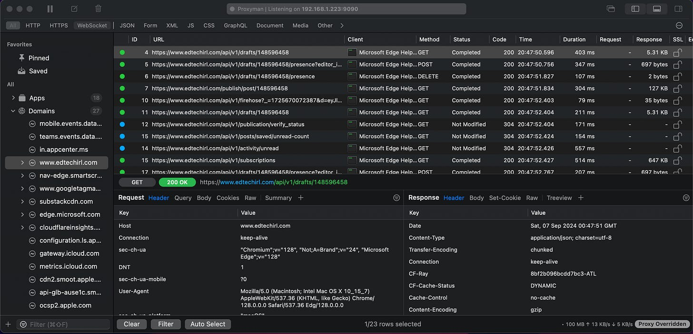
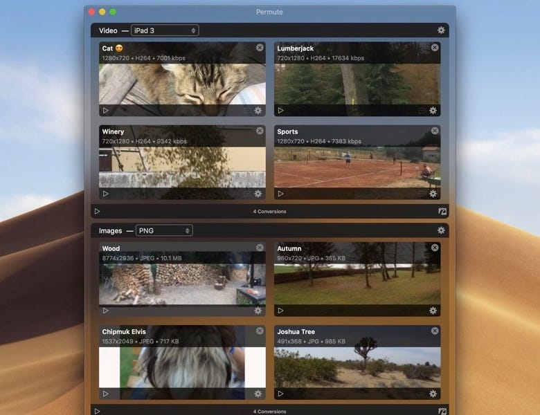
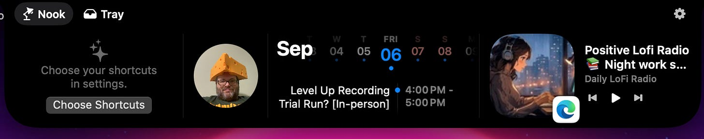
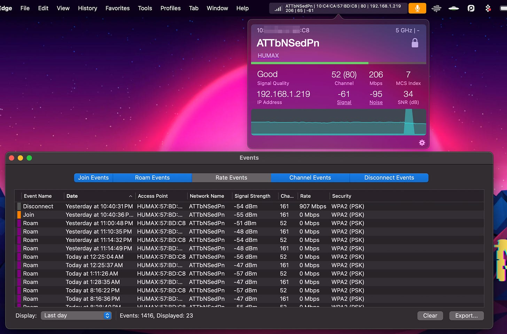

# SetApp: Mac App Repository as a Service

*MARaaS? 240+ Mac Apps for $9.99/month - My Top 6 Picks *

As a new Mac user, I’m always looking for new apps and tools to optimize my Mac. I really like and appreciate that a lot of Mac tools are one-time purchases and not subscription-based software, BUT while I’m experimenting and trying things out, all the $2.99-$19.99 purchases were starting to add up. This is especially tough for apps I’m not sure that I want to commit to.

To meet both my A Goal of TRY ALL THE UTILITIES and my B Goal of DON’T SPEND ALL MY MONEY, I’ve found a nice balance with an app/service called SetApp (setapp.com). SetApp’s model is that you pay a single price ($9.99 for 1 mac per month) and you get access to their library of over 240 apps, many of which have regular prices over $9.99/month when purchased directly from the provider.

Updates: I just learned that SetApp has a referral program that will give you (and me 😀) a free month if you start a subscription after your free trial. [My referral link is here](https://go.setapp.com/invite/azoecke4) . Also, SetApp offers a 50% discount for students and teachers. [More details here](https://setapp.com/educational-discount).

Below are the top 6 tools I’ve been wearing out in the two months I’ve subscribed:

## Ulysses

### What’s it do?

Ulysses is a writing app designed for authors, bloggers, or anyone who needs a distraction-free, flexible writing environment. It has a clean, minimalist interface and powerful features that help organize and streamline the writing process. As a former English teacher, I know that the first hour of any day we did a typed writing assignment in class was ALWAYS spent waiting for students to pick the font, adjust the spacing, change type colors, ETC. Ulysses uses markdown formatting to strip all of that away so you’re just typing words.

### Key Features:

1. **Distraction-Free Writing**: Ulysses offers a minimal writing environment, removing unnecessary distractions to help writers focus on content.
2. **Markdown Support**: The app uses markdown formatting, allowing writers to format text easily without traditional word processing tools, making it especially useful for bloggers and content creators. If you’re a Notion user, this should feel very comfortable.
3. **Organization**: Ulysses provides a robust organizational structure, allowing users to break projects into sheets, organize them into folders or groups, and set up filters based on tags or keywords.
4. **Export Options**: Ulysses offers various export formats, including PDF, Word documents, ePub, and direct publishing to WordPress, Ghost, or Medium.

### What do I use it for?

When I have a task where I just need to get words down with no frills, Ulysses is my go-to. Once I create the content, it’s super simple to organize and the export options are robust for the types of writing I do.

### Regular Price:

$5.99/month

---

## Paste

### What’s it do?

**Paste** is a clipboard manager designed to extend the standard clipboard functionality. It allows you to manage and access a history of copied items, making it easier to retrieve and reuse them.

### Key Features:

1. **Clipboard History**: Paste keeps a record of everything you copy (text, images, links, etc.), so you can revisit and reuse items without having to re-copy them.
2. **Searchable Clipboard**: It allows you to search through your clipboard history quickly, making it easy to find previously copied items.
3. **Pin Important Items**: You can pin frequently used items to keep them readily available for future use.
4. **Organize Clips**: You can organize their clipboard history into collections for better management, grouping similar types of content.

### What do I use it for?

My love of Clipboard History in Windows is [well-documented](https://www.edtechirl.com/p/clipboard-history?utm_source=publication-search), and this is a Mac app I was subscribing to on its own prior to finding SetApp. Paste is just a super simple, super slick Clipboard History / Clipboard Manager for Mac. Did you copy and paste something yesterday that you NEED? Pull up Paste and scroll back through your history to find it. I also use it a lot for “canned responses” that I find myself having to type a lot. For example, any time a student in my district requests a WiFi hotspot they submit an application that opens a ticket that’s assigned to me so I can track the requests. I then create a new school-specific ticket for the student’s school site help desk. By pinning my canned response in Paste, any time I have to process one of those requests I can just grab it from Paste instead of having to sort through old tickets to copy and paste from there.

Pro-tip: You can set Paste to NOT save items from your password manager or other sensitive apps. You can also set the retention limit. It’s set to a month by default, but can be set for anywhere from a day to forever. You can also clear the history manually.

### Regular price:

$3.99/month

---

## Proxyman

### What’s it do?

Proxyman is a network debugging and proxy tool designed to help developers inspect and modify HTTP/HTTPS requests and responses.

### Key Features:

1. **Debugging network traffic**: Developers can monitor network requests between apps, servers, and the internet.
2. **Analyzing APIs**: Proxyman lets users inspect API calls, headers, and payloads in real time, making it useful for debugging and optimizing app performance.
3. **Modifying requests/responses**: You can intercept and modify the requests or responses to simulate different scenarios or troubleshoot issues.
4. **SSL Proxying**: It can decrypt HTTPS traffic to inspect secure communications, making it valuable for analyzing encrypted data.

### What do I use it for?

I only use a fraction of Proxyman’s features as I primarily use it for troubleshooting content filtering issues. When I raise a ticket with a vendor over their site’s performance, their default tier 1 response is usually that the site is either being blocked by our content filter or our firewall. The visibility Proxyman gives into HTTP/S transactions helps to see any sources that are being blocked, which can sometimes be difficult when the site being blocked is a dependency on the backend that isn’t disclosed in the vendor’s allow-list requirements. I have other tools I use for this purpose though — namely the Chrome extension SAML Tracer, the personal firewall Glasswire, and the cybersecurity tool Burp Suite, so with my current work flows I would be unlikely to pay full price for this one. However, if I follow through with my resolution to get better with APIs, I think Proxyman will be in heavy rotation.

### Regular Price:

$69 - one time, single license

---

## Permute

### What’s it do?

**Permute** is a media file conversion app for macOS designed to simplify the process of converting various types of media files into different formats.

### Key Features:

1. **Media Conversion**: Permute can convert audio, video, and image files into a wide variety of formats, supporting many file types such as MP4, AVI, MKV, MP3, WAV, JPG, PNG, and more.
2. **Batch Processing**: Users can convert multiple files at once with Permute’s batch processing feature, making it convenient when dealing with large numbers of files.
3. **Device Optimization**: The app includes presets optimized for different devices (iPhones, iPads, game consoles, etc.), so you can easily convert media to the appropriate format for playback on specific devices.
4. **Simple Interface**: Permute is designed to be easy to use with a drag-and-drop interface, making the conversion process intuitive and accessible for all skill levels.

### What do I use it for?

Whenever I’m stuck with an image, video, or audio file that isn’t supported for what I want to do, Permute is a quick and easy way to convert the item. Most recently, I was working on adding some royalty-free music to a video project, but ALL of my royalty free music is in WMA format, which is not Mac-friendly. After a few minutes in Permute, I was able to convert it all to AAC in just a few clicks. These are tasks I would usually use Zamzar for, but the free version of Zamzar heavily throttles the number of files you can do in a day, whereas Permute handles bulk with ease.

### Regular price:

$14.99/one-time

---

## NotchNook

### What’s it do?

**NotchNook** is an app designed to enhance and customize the use of the "notch" area on MacBooks that have a notch at the top of the display, similar to the Dynamic Island on iPhone. The app aims to make the notch area more functional and aesthetically pleasing.

### Key Features:

1. **Custom Content in the Notch Area**: NotchNook allows you to display useful information, such as the time, system stats, or even app shortcuts, in the unused space around the notch, effectively turning it into a productive area.
2. **Enhanced Display Usage**: It helps to maximize the usability of the screen by placing content or widgets in the notch area, reducing wasted screen space.
3. **Integration with System Utilities**: NotchNook can integrate with macOS utilities and menu bar items, helping users keep track of important information like battery life, Wi-Fi status, or other system metrics right near the notch.

### What do I use it for?

The main settings I have configured in NotchNook are (left to right): Mirror for my webcam, Calendar, and Media Controls. Simple, but super handy!

### Regular Price:

$3/month or $25/one-time

---

## WiFi Signal

### What’s it do?

The **WiFi Signal: Strength Analyzer** app for macOS is a tool designed to help users monitor and optimize their Wi-Fi connection. It provides detailed information about your Wi-Fi signal and can be useful for troubleshooting network issues, improving signal strength, and optimizing the overall Wi-Fi experience.

### Key Features:

1. **Real-Time Signal Monitoring**: The app provides real-time data on your signal strength, allowing you to see how strong or weak the connection is in different areas of your home or office.
2. **Network Information**: It displays important network information such as signal-to-noise ratio (SNR), noise levels, connection speed, channel information, and other technical details to help diagnose network performance.
3. **Signal Quality**: The app helps you assess the quality of your Wi-Fi signal by showing whether the current signal is optimal, marginal, or weak, which can guide you in improving your setup.
4. **Channel Optimization**: Wi-Fi Signal can suggest the best channel to use for your network based on the congestion in your area. This helps reduce interference from neighboring networks and can lead to a more stable connection.
5. **Troubleshooting**: The app helps identify common issues that might affect your Wi-Fi performance, such as interference or suboptimal signal strength, and provides tips to improve network stability.
6. **Historical Data**: It can track and show historical data of your Wi-Fi performance over time, allowing you to identify trends or recurring issues with your connection.

### What do I use it for?

There are tons of troubleshooting applications for WiFi signal strength and channel interference, but the connect/disconnect history is also very insightful. When there are mysterious reports of the internet “dropping” that we can’t really see in action, it’s helpful to head to the affected area and have visibility into what’s going on.

### Regular price:

$4.99/one-time

---

## Other SetApps I have installed right now:

**Backtrack** — Backtrack is a tool designed to record audio from your computer retroactively. It runs in the background, constantly recording the audio from your microphone and system sound (saved locally, not in the cloud), and allows you to "go back in time" and save the audio you need, even if you didn't hit record beforehand. (Regular Price: $12/month)

**PDF Pals** — PDF Pals is a tool that allows you to securely chat with any PDF document locally and without cloud costs or data risks. It uses OCR to support scanned PDFs and complex forms. Through SetApp there is a limited number of interactions you can take each month, but you can connect an OpenAI API token for added use. This is insanely useful for documentation and studying. It’s like having a ChatGPT conversation with your PDF, but without the data from your PDF leaving your device. (Regular Price: $34/one time)

**Speeko** — Speeko is a tool to improve public speaking and communication skills. The training tool is designed to help users improve their speaking. It provides various features aimed at boosting confidence, clarity, and overall communication skills. Essentially, you can record or upload audio of you speaking, and it will provide analysis of your speed, tone, pitch, use of filler words, etc. Based on this feedback, you can take coaching courses intended to improve your speaking in these areas. (Regular Price: $17.99/month OR $279/one time)

**Whisk** — Whisk is an app designed for web development, providing real-time HTML and CSS editing with live previews. It helps you build and preview web pages while writing code. (Regular Price: $29.99/one time)

**Snippets Lab** — SnippetsLab is a code snippet management application for macOS, designed to help you store, organize, and retrieve reusable pieces of code efficiently. I’m a script kiddie at best, but this helps me keep track of all my little PowerShell tools. (Regular Price: $14.99/one time)

**Side Notes** — The Sidenotes app is a note-taking tool designed for convenience and quick access. It allows you to keep notes, ideas, or references on the side of your screen, easily accessible with a swipe or a shortcut. (Regular Price: $19.99/one time)

**Nitro PDF Pro** — Nitro PDF is a suite that provides tools for creating, editing, converting, and managing PDF files. It's widely used as an alternative to Adobe Acrobat for working with PDFs. (Regular Price: $14.99/month)

**Leave Me Alone** — Leave Me Alone is an email app designed to help you manage and unsubscribe from unwanted email subscriptions, sort bulk mail into daily or weekly digests, and screen unwanted emails. I’ve tried A LOT of tools to help me get to inbox zero, and this is the most promising I’ve found. I’m planning to include a standalone article on LMA after a few more weeks of use, but so far I’m blown away by its usefulness. (Regular Price: $16/month)
