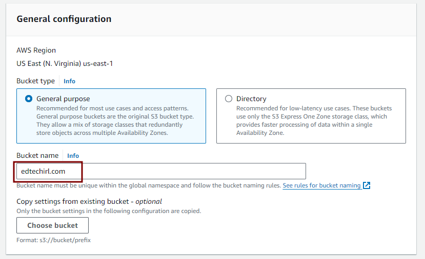
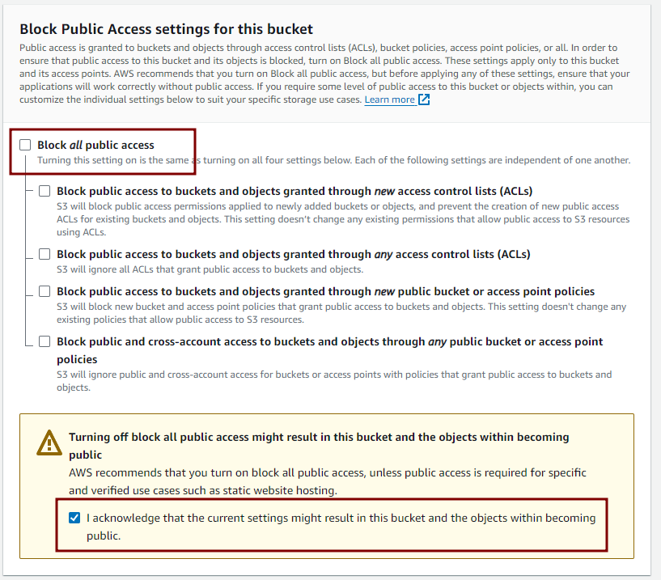
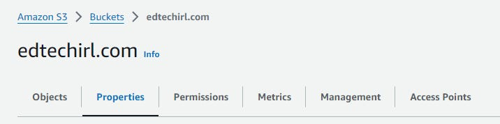
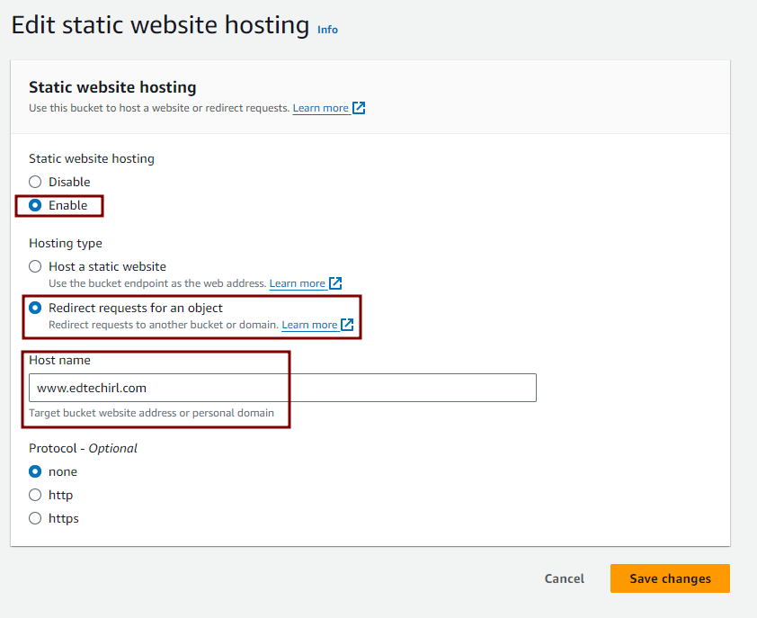
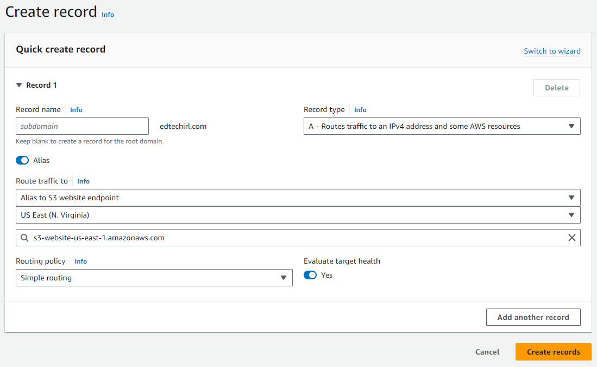

# Substack URL Doesn't Work Without WWW? 

*Using an S3 Bucket to Forward to Your Substack Domain*

We’ve had this newsletter going for a little over 2 years now, and one annoying quirk is that Substack doesn’t allow much control over how DNS and forwarding plays with your Substack site. To use a custom domain, you have to purchase that feature. The fee is a one time $50 payment, so I’m good paying for it, but the setup is very basic, and ONLY works for www.yourdomain.com and not yourdomain.com. So when we send people to “edtechirl.com,” they usually tell us they can’t get to it without adding the “www.” Since this isn’t 1994, I wanted to find a way to fix that, so that typing **edtechirl.com** in the address bar will take you to the desired site. My registrar for this site is AWS and the steps to do this are \*NOT\* intuitive, so I hope this helps someone in a similar pickle. What we’re basically going to do is create an S3 Bucket in AWS, set it as a static website, and make it redirect your apex domain (i.e., yourdomain.com) to your www. domain that Substack requires (www.yourdomain.com).

## Create an S3 Bucket for Redirection

### **Create a New S3 Bucket**

- Open the [S3 Management Console](https://s3.console.aws.amazon.com/s3/home).
- Click on **Create bucket**.
- Name the bucket **exactly** as your root domain (e.g., `edtechirl.com or yourdomain.com — WITHOUT the WWW`).

  
- Disable/Uncheck **Block all public access** (since it’s a public website, you want to not block public access.
- Since allowing public access is the number one cause of data breaches due to leaky buckets, you’ll also need to check the box to confirm that this is really what you want to do.

### **Configure the Bucket for Website Redirection**:

- Open the bucket settings.
- Go to the **Properties** tab.

  
- Scroll down to **Static website hosting** and click **Edit**.
- Select the option **Redirect requests**.
- Under **Host name**, enter `www.yourdomain.com` (you DO include the www on this one)
- Leave the **Protocol** as none. For HTTPS to work, you’ll need to do some additional configuration in Cloudfront. Since my goal is just for being able to type edtechirl.com into the address bar, I’m not going to worry about this. Since the destination www.edtechirl.com site is https, there isn’t a negative impact from using regular http because it’s only for the redirect.
- Save the changes.

  

### Configure Route 53 for Redirection:

- Go to the [Route 53 Management Console](https://console.aws.amazon.com/route53/).
- In your hosted zone for `yourdomain.com`, click on **Create Record**.
- Keep the subdomain portion **Record name** blank to represent the root domain.
- Choose **Record type** as **A**.
- Toggle on the **Alias** button
- In the **Route traffic to** field, select **Alias to S3 website endpoint**
- Next, In the **Choose endpoint**, pick the region where you created your bucket
- Click in the new **seach field** that pops up, and your newly created S3 bucket should show up as an option to select
- Choose **Simple routing** and **Evaluate Target Health** - yes (they’re the defaults)
- Click **Create records**.

  

### Verify the Setup

- Once the DNS changes propagate, go to `http://yourdomain.com` and it should automatically redirect users to `www.yourdomain.com`. One of my favorite things about AWS for DNS is it propagates very fast, so you should be in business within a minute or two.

Thanks for reading EdTech IRL! Subscribe for free to receive new posts and support my work.
