# Unlocking Remote Access on Azure Arc

* Secure SSH and RDP Connections in PowerShell and Azure Cloud Shell*

[](images/93d018ac-813a-4445-b052-b41eb2eda428_1024x1024.webp)

Now that we [onboarded a server to Azure Arc](https://www.edtechirl.com/p/enrolling-on-prem-servers-in-azure), the first thing I want to do is add the ability to remotely control it using either SSH or RDP. The cool thing about doing this with Azure Arc is it allows you to create the connection through Azure, so you aren’t having to open any ports or permissions on your firewall or tunnel through a VPN, and you can do it from anywhere you’re permitted to login from your Microsoft account. This should work as long as your account can pass any Conditional Access restrictions — and you NEED Conditional Access restrictions if you’re going to rely on Identity as your perimeter. More on this in a future article.

## Install the SSH Extension

First, we need to add SSH to your Azure Arc machine. To do this, log in to your Azure portal and go to the Azure Arc —> Machines page (**[azhybridcompute](https://azhybridcompute.cmd.ms/)**[.cmd.ms](https://azhybridcompute.cmd.ms/)) and click on the name of the machine you want to access. For me, it’s WIN-B6G313GKDVH. *(Note: I renamed this to Lab-Server-01, so you may see that referenced in the device property screenshots and at the CLI for that server.)*

Thanks for reading EdTech IRL! Subscribe for free to receive new posts and support my work.

After selecting your machine, go to the Extensions page.

[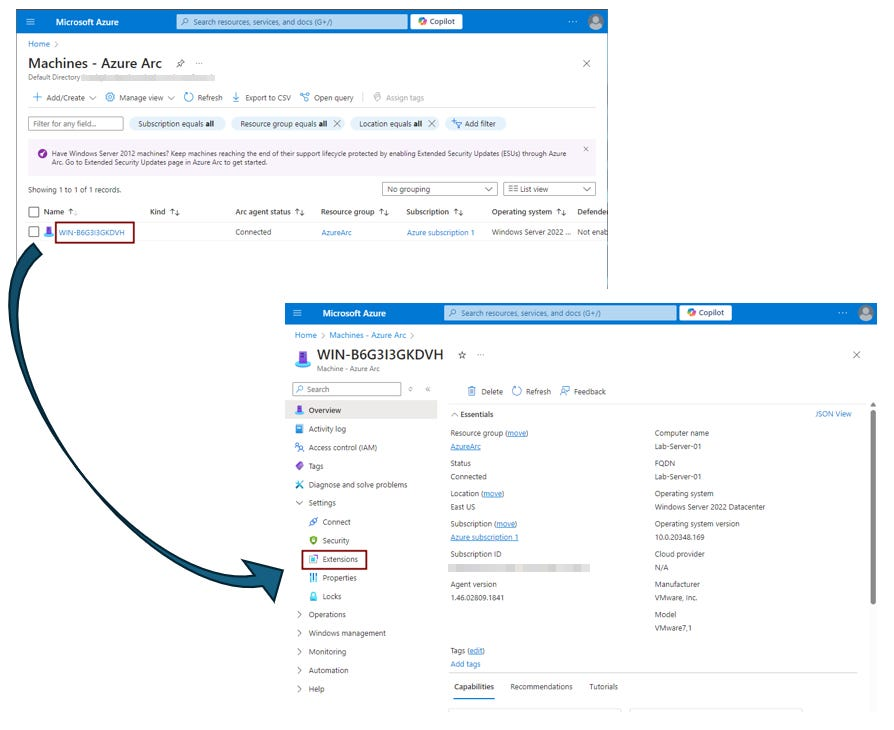](images/5f1cb161-1014-449b-88d7-e02f481a9378_894x730.png)

From the Extensions page, search for/select OpenSSH for Windows - Azure Arc, then click **Next** to start the Wizard, and then click **Create.**

[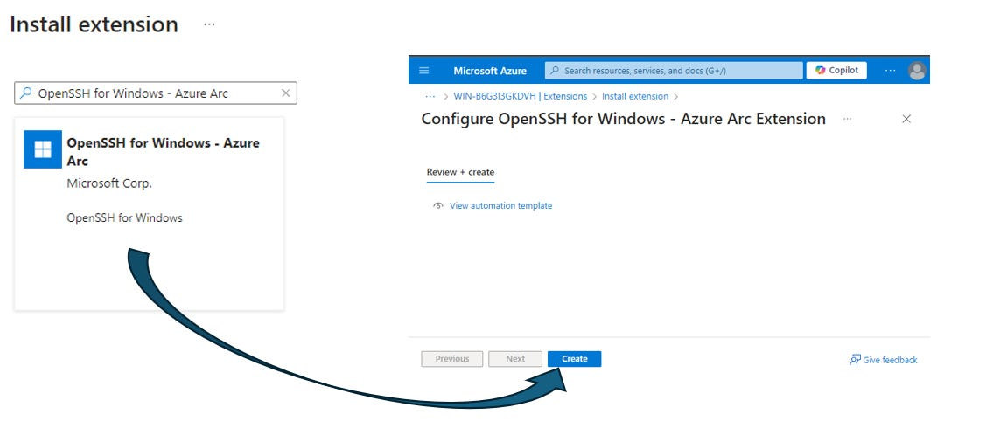](images/1e2e33ff-6e6d-4487-b177-0f28baf16cf8_1143x490.png)

You should then get a message that **Deployment is in progress:**

[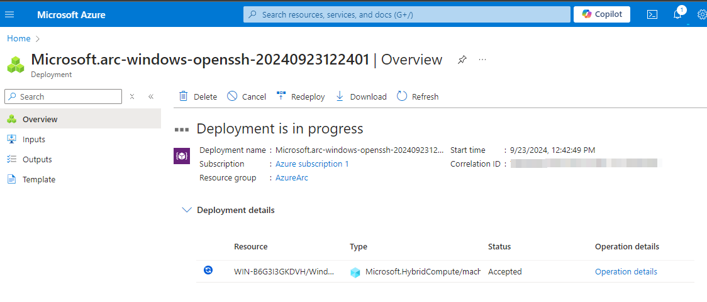](images/cec5b3b4-eaac-4a58-8377-7d7abd6d06be_1124x482.png)

After a few minutes, it should update to **Your deployment is complete.**

[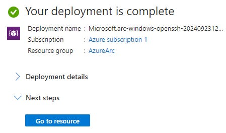](images/f6086391-35b3-4434-97d4-513fa0dfd931_449x264.png)

## Cloud Shell or Local PowerShell?

At this point, we now have a choice in how we connect to the remote Arc machine. We can either connect through PowerShell installed on our local machine, or you can use the Cloud Shell available inside of Azure. We’ll look at both, but there is a richer feature set using PowerShell, so we’ll start there first.

### PowerShell

#### Locally Installing the Azure CLI

First, you’ll need to install the Azure CLI for Windows. The installer and instructions are available from [Microsoft here](https://learn.microsoft.com/en-us/cli/azure/install-azure-cli-windows?tabs=azure-cli) but [if you love Winget like I do](https://www.edtechirl.com/p/winget-with-the-program), this is your easiest option… run this command from Terminal AS ADMIN:

```
winget install -e --id Microsoft.AzureCLI
```

[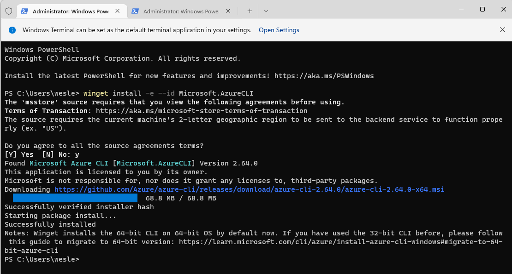](images/d46740f9-7b7f-420d-97d8-9f73343eb3ad_1110x596.png)

After installing Azure CLI, it can be used from a normal PowerShell prompt through the PowerShell application, PowerShell ISE, or the Terminal app. Whichever you choose, be sure to run as admin.

*Note: There have been times when I’ve installed the Azure CLI that I’ve had to close the Terminal app and restart before PowerShell recognized that the AZ module was installed. If you get the red error message that “az is not recognized as the name of a cmdlet,” grab a coffee, close Terminal, and try again. Reboot if that doesn’t do the trick.*

#### Login to Azure

Next, login to Azure with the command:

```
az login
```

You’ll then be prompted for interactive sign in to either choose an M365 account that you’re already signed in with, or sign in with a different one like below:

[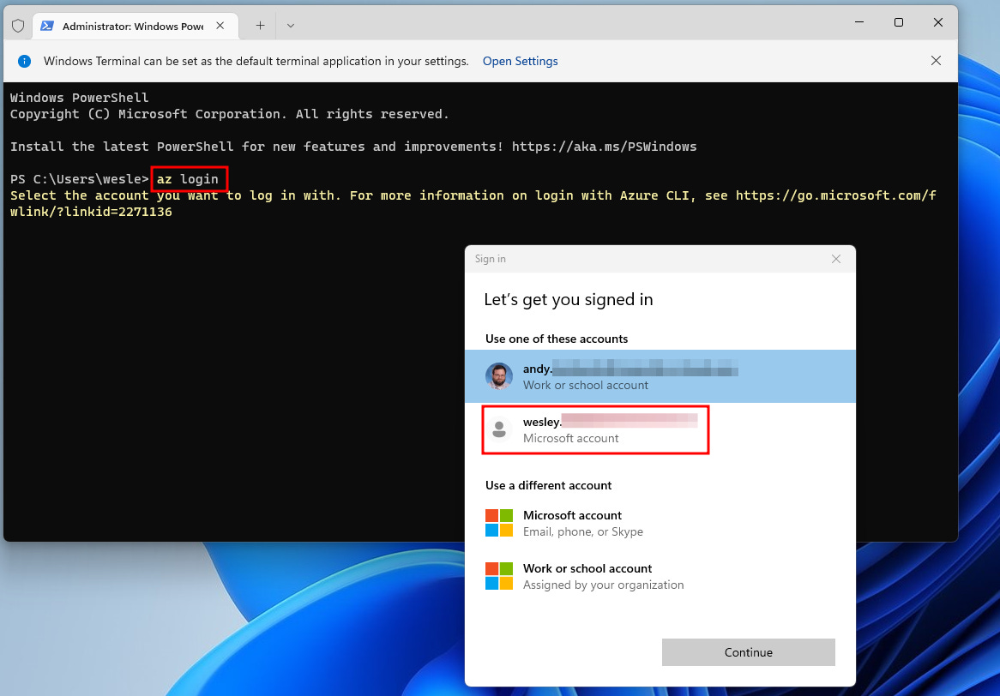](images/ed6529b5-dd45-42ec-bf06-49f704bb09e3_1166x812.png)

After logging in, you’ll be prompted to select the applicable Azure subscription. If you don’t do much in Azure, there will likely be only one option, and you can hit enter to accept it. If there are multiple Azure subscriptions, be sure to select the right one so you can access the right resources.

[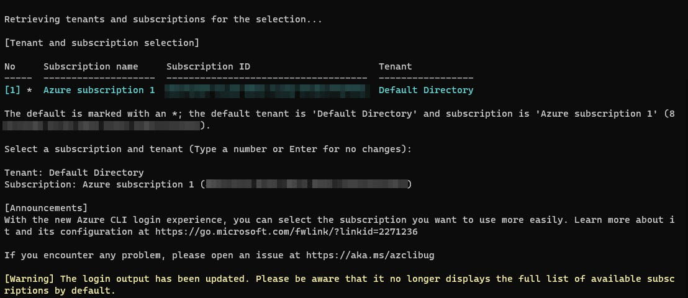](images/0e8740a0-2f48-4e9b-9e1f-3b34d49ab07b_1108x480.png)

If you’re not sure of the subscription, you can go to the Azure Arc —> Machines page in Azure and the subscription will be listed next to your machine.

[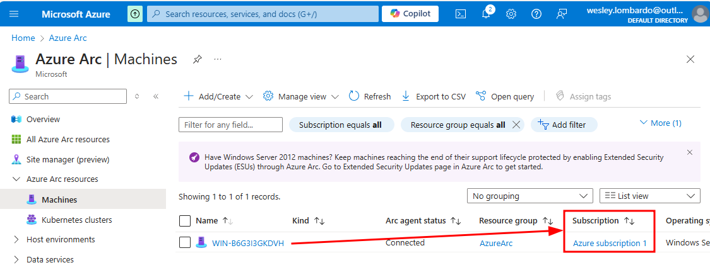](images/95274752-d66a-40da-bf23-e49dcf0b8bed_1125x429.png)

#### Connecting to the Azure Arc Machine Remotely

If everything has worked as expected, we can now remotely SSH into our Arc machine using a single command in PowerShell. You’ll need to know the name of the Resource Group (**AzureArc**, in this case), the remote computer’s name (mine is **WIN-B6G3I3GKDVH**), and the name of the account you’ll be logging in as (my account is the default account name **Administrator**):

```
az ssh arc --resource-group AzureArc --name WIN-B6G3I3GKDVH --local-user Administrator
```

If the SSH Extension hasn’t been added on your local machine yet, you’ll be prompted to install it after running the above command. You may also be prompted to say “Yes” to the machine’s fingerprint and be prompted to enter the user’s password. After that, you should arrive at a prompt on that machine, and you can now execute commands. In my case, I’m running the command from my home computer and it’s executing on a VM server in our dev lab at the office that’s a 10-minute drive away, with no VPN, tunnel, or firewall exceptions in place. Like the Zero Trust mantra, my identity is the perimeter.

[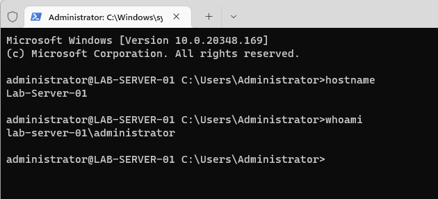](images/049bc825-98e3-49f5-b47c-c7e2961c7d00_630x286.png)

#### RDP Access

SSH access is great, but if we want to take it a step further, we can also use RDP to interact with the server graphically using this command. (Be sure to Exit the SSH session first by using the command **exit**):

```
az ssh arc --resource-group AzureArc --name WIN-B6G3I3GKDVH --local-user Administrator --rdp
```

You’ll be prompted to enter the credentials for that machine twice… once in your Terminal, and once in a Windows Security popup.

[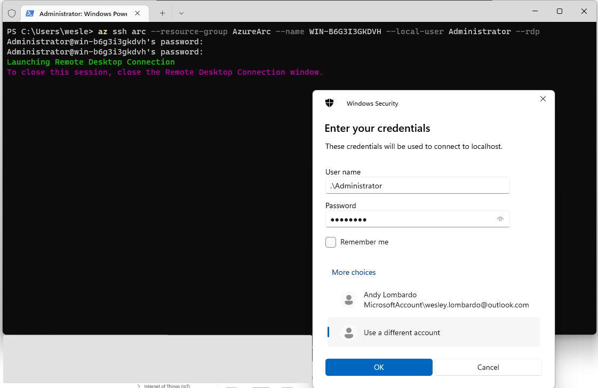](images/52e22e57-30dd-4d07-bc7d-e49503fdb1e5_1121x727.png)

If the remote machine you’re connecting to is Entra-joined, and your M365 account is in the same Entra tenant, you can just use your Microsoft account. In my test scenario, this is a non-Entra, non-AD machine. To log in with a local user account, you’ll need to put .\ in front of your username to tell RDP/Windows that you’re logging in locally and not through a directory.

After entering creds (and saying yes on the “Are you sure you want to connect” popup), I’m now remotely accessing the Desktop of my Azure Arc machine from the comfort of my home:

[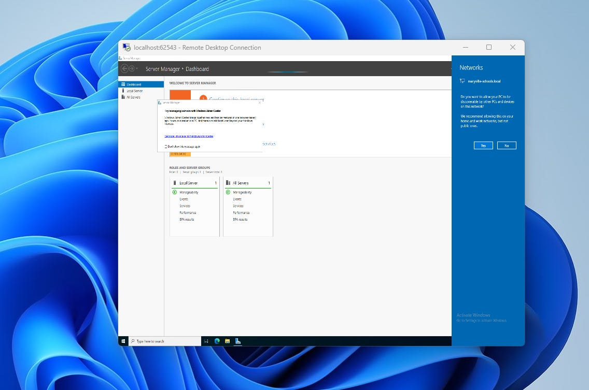](images/38c9256f-c9c9-4215-819f-f1d82e73277a_1136x753.png)

### Opening the Cloud Shell

If you’re in a position where you need to use Cloud Shell, the process is a little simpler, but doesn’t have the ability to RDP. To begin, open the Cloud Shell by clicking on the PowerShell icon in the top bar from anywhere in Azure. If you haven’t run Cloud Shell before you’ll be prompted to pick a default shell. We’re going to pick PowerShell.

[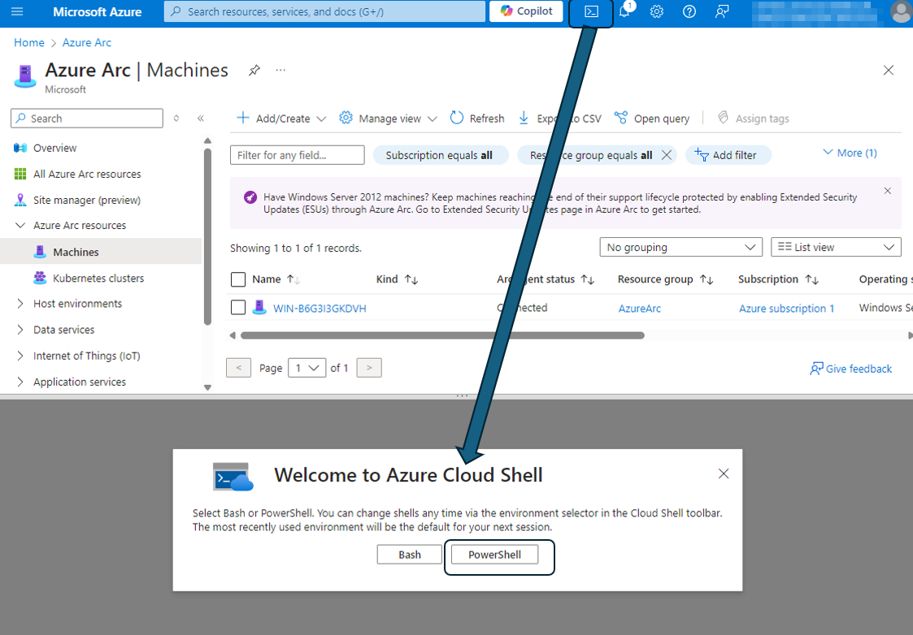](images/c33a0cb6-06cf-40c4-9441-09eac5d155c9_1123x782.png)

If this is your first time launching Cloud Shell, you’ll also be prompted to pick a storage account. This is for if you want to have saved files and installed tools persist across sessions. If you do, you can choose Mount Storage account. You’ll then be prompted to either select an existing storage account, or create one. For this tutorial, you don’t have to set a storage account, but it’s worthwhile to set this up. I selected **Mount storage account** and then selected the option for Azure to create a storage account for me.

[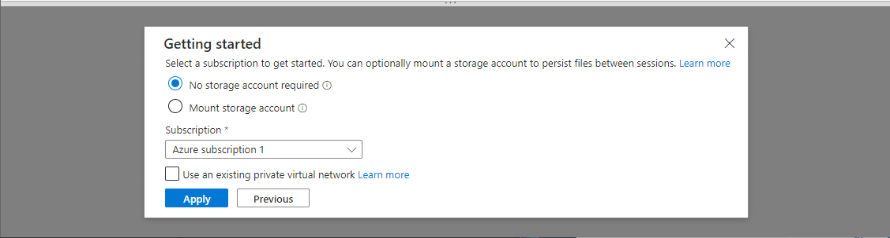](images/41e734db-5f27-4812-b416-1b86743aa65f_1127x303.png)

After the deployment completes, you should see a PowerShell prompt like below:

[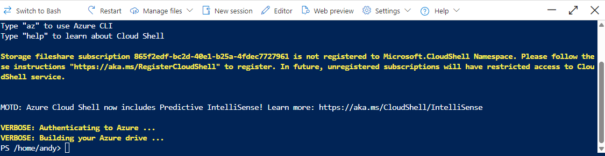](images/5fb24bad-cd3d-4e95-af3d-76f2eaa0d76e_1125x291.png)

The easy part about doing the Cloud Shell is that since you’re initiating it from inside Azure, you’re already logged in and don’t have to connect to it. All you have to do after launching the Cloud Shell is enter the command below, substituting your server name, resource group name, and user name

```
az ssh arc --resource-group AzureArc --name WIN-B6G313GKDVH --local-user Administrator
```

[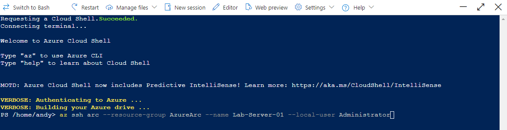](images/6ce2abcf-bdd2-4a92-b085-3596e0f9d49c_1159x299.png)

If this is your first time doing this with this machine, you’ll be prompted to have the remote machine allow connections on port 22 for SSH. You’ll need to answer **y** to allow:

[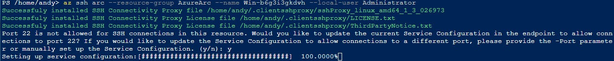](images/fbe4f6be-33b0-48ba-a668-6b3c52f03257_1348x135.png)

After running the command and allowing port 22, you should then get a prompt on your remote machine inside of the Cloud Shell like below. You’re now remotely controlling your server from the CLI!

[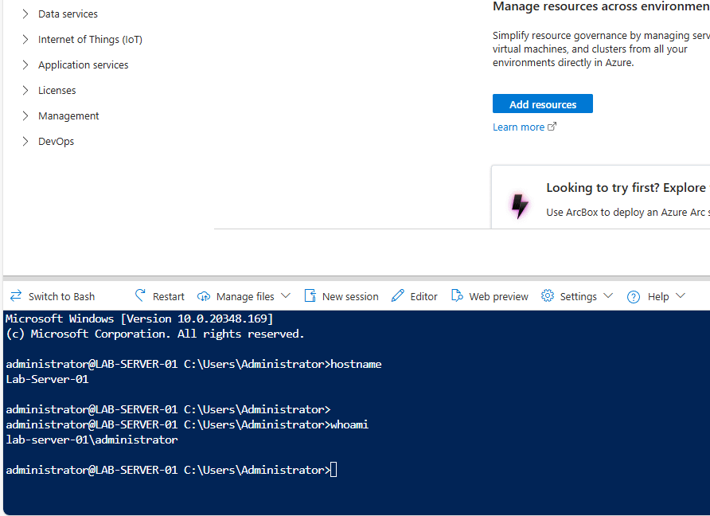](images/cffab001-3afb-400b-ac7d-db68b7daef28_892x648.png)

The main limitation to using the Cloud Shell method is that it only works for SSH. If you run the RDP command like we did in PowerShell, you’ll get an error that the Cloud Shell is an unsupported platform:

[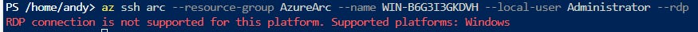](images/8ace22e1-d818-4bbe-852e-a360174b52f8_875x41.png)

## In Conclusion

And just like that, you have two methods for remotely accessing a single Azure Arc machine. This can be beneficial for real life server management, but everything in this article is also do-able in a homelab scenario for free. Over the next few articles, we’ll also explore managing Arc servers through Windows Admin Center, as well as automating server updates with Azure Update Manager.

Thanks for reading EdTech IRL! Subscribe for free to receive new posts and support my work.
