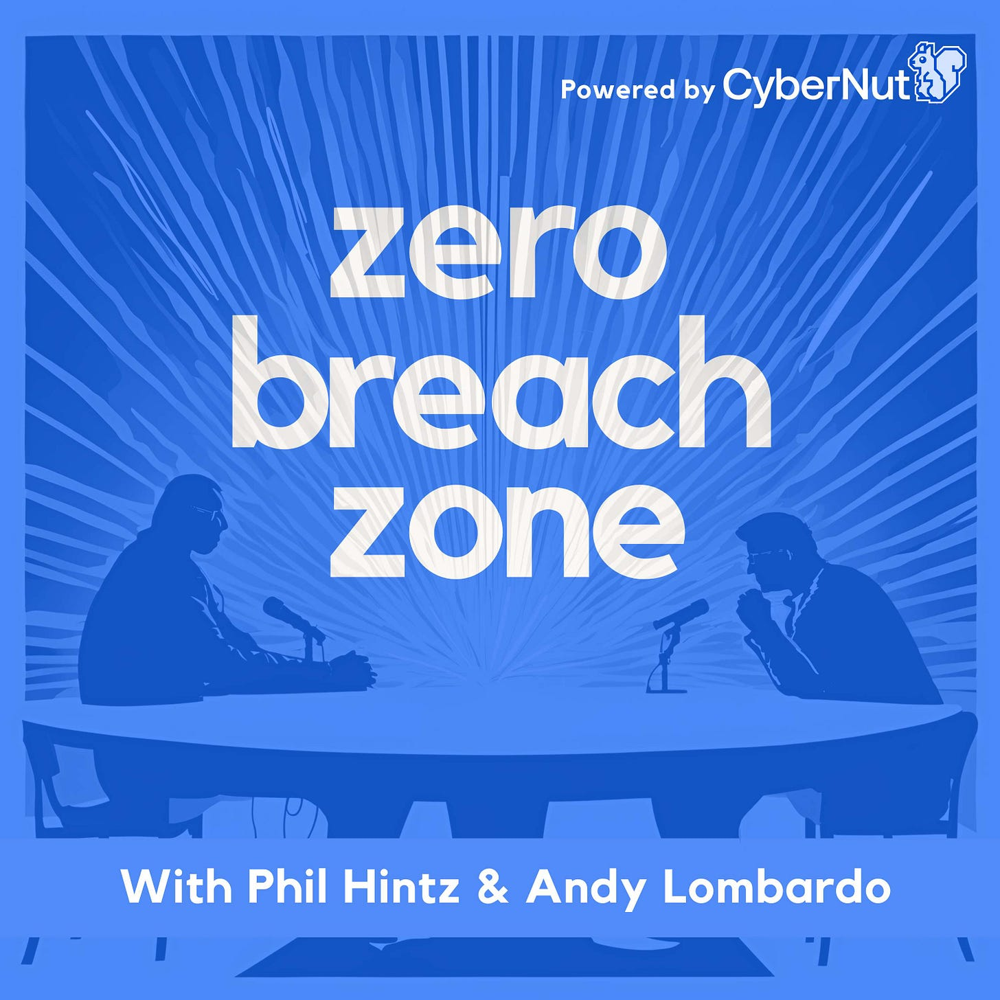

# Unlocking Security Insights with the Zero Breach Zone Podcast

*Happy Cybersecurity Awareness Month!*

This newsletter/blog’s mission has always been to equip K-12 stakeholders with the tools and knowledge they need to enhance education and protect our schools from digital threats. That’s why I’m thrilled to share a new resource to amplify this goal: the Zero Breach Zone Podcast!

The Zero Breach Zone is a series of conversations that delve into the unique cybersecurity challenges facing our schools today. Each episode brings together leading experts in cybersecurity, education, and technology, exploring actionable strategies to help secure our classrooms from breaches and phishing threats. From understanding the latest digital risks to implementing real-world security measures, the show is a hub of practical knowledge tailored specifically for the K-12 community.

Thanks for reading EdTech IRL! Subscribe for free to receive new posts and support my work.

Why should you tune in? As you already know, keeping up with the rapidly evolving landscape of cybersecurity is crucial. The podcast is an opportunity to gain insights and hear firsthand from professionals who are on the front lines of educational security. With each episode, you’ll discover new ways to empower your school and community against today’s most pressing cyber threats.

For now, we’re shooting to release episodes bi-weekly, and we’re working on scheduling interviews for upcoming episodes. If there’s someone in this space you’d like to hear from (or if you have something to offer our listeners!), please reach out to andy@edtechirl.com.

Whether you’re an educator, technical staff, administrator, or some role in-between, the Zero Breach Zone has something valuable to offer. Join us as we work together to keep our schools secure—one episode at a time!

## How to Get into The Zone:

### Connect!

[LinkedIn](https://www.linkedin.com/company/zero-breach-zone/?viewAsMember=true)

[Phil on X/Twitter @phintz](https://x.com/phintz)

[Andy on X/Twitter @edtechirldotcom](https://x.com/edtechirldotcom)

### **Podcast**

[Transistor.fm](https://zerobreachzone.transistor.fm/)

[YouTube Channel](https://www.youtube.com/@ZeroBreachZonePodcast)

[Spotify](https://open.spotify.com/show/1roj2sVP57PDZ95xoq84Jm)

[Apple Podcasts](https://podcasts.apple.com/us/podcast/zero-breach-zone/id1770486213?uo=4)

[Amazon Music](https://music.amazon.com/podcasts/09693298-ddef-4a32-8534-9166d260b0d9)

# Obligatory Sponsor Shout Out

Thanks to [Cybernut.com](https://www.cybernut.com/) for helping make this happen! I previously wrote a [fan-boy article about Cybernut last May](https://www.edtechirl.com/p/cybernut-phishing-simulation-and?utm_source=publication-search), so we’ll let that be my testimonial. The show is \*not\* a bi-weekly sales pitch for Cybernut, so I’ll put the plug in here: if you’re looking for a Security Awareness/Phishing Simulation provider that is K-12-centric, [Cybernut.com](https://www.cybernut.com/) should be your destination!

Thanks for reading EdTech IRL! Subscribe for free to receive new posts and support my work.
