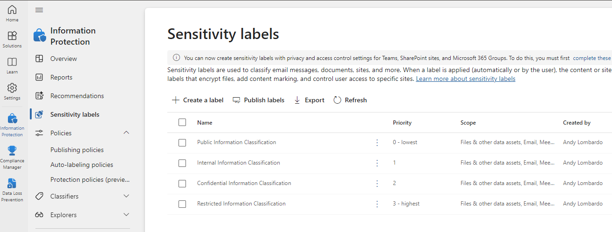
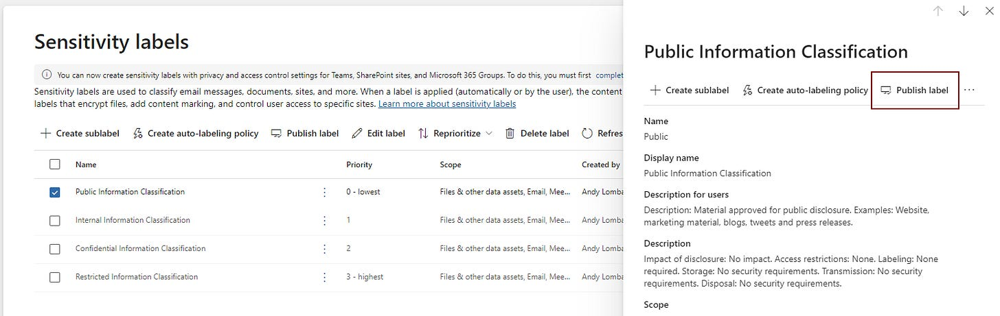
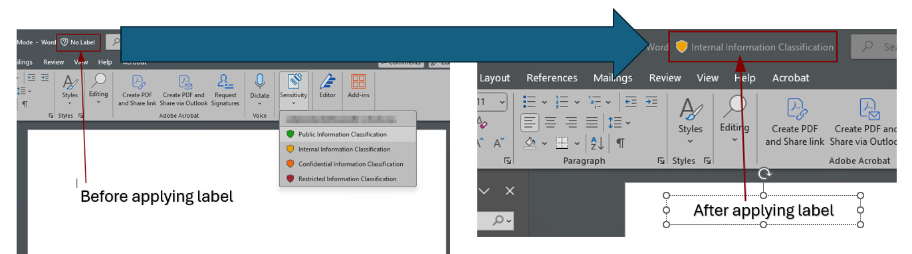
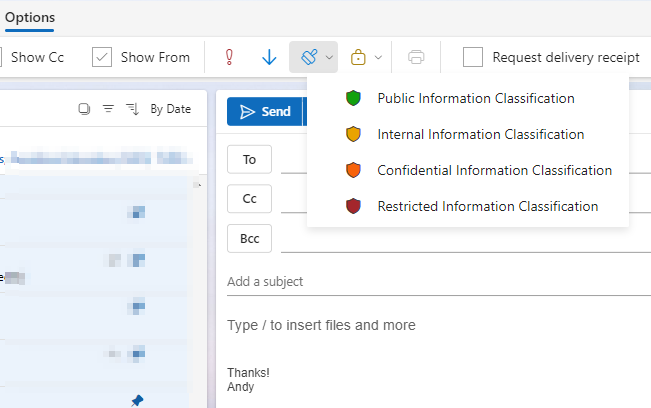

# Data Classification and Sensitivity Labels in M365

*Create and apply labels to match your data handling policy*

One of the key tenets of security is that you can’t secure what you don’t know about. This extends beyond physical assets to data as well. If your security policy includes a policy for the classification and handling of your school’s data, then using Sensitivity Labels in Microsoft may be a good solution to help ensure data is classified and handled appropriately. Sensitivity labels allow you and your users to classify and protect data based on its sensitivity. These labels can enforce protection settings such as encryption, content marking, and access controls, ensuring that sensitive information remains secure across various platforms and devices. Note that an A3/E3 license is required to use sensitivity labels.

## Classification Levels

A common data classification system has 4 tiers, but the key is to have this mirror any data handling requirements in your security policy. A common set of tiers would include classifications like:

- **Public Information:** material approved for public disclosure
- **Internal Information:** information to be kept private to the organization (or approved third parties, contractors, etc.)
- **Confidential Information:** Information limited to my org’s employees on a need-to-know basis (PII, protected communications, system configurations, etc.)
- **Restricted Information:** highly sensitive information intended for named employees only (PHI, passwords, private keys, etc.)

This is similar to the Traffic Light Protocol (TLP) that’s widely used in information sharing. If you’re familiar with TLP Red, Amber, Green, and White classifications, Public information is similar to TLP:WHITE, Internal is like TLP:GREEN, Confidential equates with TLP:AMBER, and Restricted lines up with TLP:RED. You can read more on TLP classifications at the [Cybersecurity Navigator newsletter](https://www.cybernavigator.org/p/the-traffic-light-protocol-tlp-explained) linked below.

[The Cyber Navigator The Traffic Light Protocol (TLP) Explained](https://www.cybernavigator.org/p/the-traffic-light-protocol-tlp-explained?utm_source=substack&utm_campaign=post_embed&utm_medium=web)

The Traffic Light Protocol (TLP) is a system used in cybersecurity to communicate and classify the sensitivity of information in a structured way. It was designed to streamline how sensitive data is shared and to ensure the right audience receives the information without it being inappropriately disclosed…Read more2 years ago · Tobias Faiss

## What can you do to protect information?

Sensitivity labels in M365 go a step beyond classification by enabling you to define how specific data should be handled. They allow you to enforce protection settings, such as encryption and rights management, based on the assigned label. Sensitivity labels can be applied manually by users or automatically by leveraging M365's ML capabilities. For example, you can create a label called **Confidential** and apply rules that automatically encrypt documents labeled as such. This ensures that even if the document leaves your organization’s systems, the encryption remains intact, protecting the data from unauthorized access.

## Working with Sensitivity Labels

Implementing Sensitivity Labels comes in two parts: creating labels and publishing labels. In the label creation process, you’re setting up labels to match your data classification tiers and determining what policies should be applied when that label is given to an object. In the publishing process, you’re making the labels you created available to users, and you’re deploying them to the user groups you specify.

### **Creating Sensitivity Labels:**

1. **Access the Compliance Center:**
    - Navigate to the Microsoft Purview compliance portal ([decm.cmd.ms](https://decm.cmd.ms)).
2. **Navigate to Information Protection:**
    - In the left-hand navigation pane, select **Information protection** > **Sensitivity labels**.
3. **Create a New Label:**
    - Click on **+ Create a label**.
    - Provide a **Name** and **Description** for the label to help users understand its purpose.
4. **Define Label Scope:**
    - Choose where the label will be applied:
      - **Files & emails**: For documents and emails.
      - **Groups & sites**: For Microsoft Teams, Microsoft 365 Groups, and SharePoint sites.
      - **Meetings**: For Teams meetings and chats.
    - Select the appropriate scope based on your district’s needs.
5. **Configure Protection Settings:**
    - Depending on the selected scope, configure settings such as:
      - **Encryption**: Restrict access to authorized users and define permissions.
      - **Content Marking**: Apply headers, footers, or watermarks to content.
      - **Site and Group Settings**: Control privacy, external user access, and external sharing.
6. **Review and Create:**
    - Review the configurations and click **Create** to finalize the label.

### **Publishing Sensitivity Labels:**

After creating sensitivity labels, they must be published to make them available to users:

1. **Select Labels to Publish:**
    - Choose the labels you want to include in this policy.
2. **Define Policy Settings:**
    - Specify which users or groups the policy applies to.
    - Set default labels for documents and emails, if desired.
    - Decide whether to require justification for label changes or removals.
3. **Review and Publish:**
    - Review the policy settings and click **Publish** to deploy the labels.

### **Applying Sensitivity Labels:**

Once published, users can apply sensitivity labels in supported M365 applications:

- **Office Applications (Word, Excel, PowerPoint):**
  - Open the document.
  - On the **Home** tab, select **Sensitivity**.
  - Choose the appropriate label from the dropdown menu.

    

- **Outlook:**
  - When composing a new email, go to the **Options** tab.
  - Click on **Sensitivity** and select the desired label.

    

## Best Practices for Data Classification and Labeling

The key to effective use of sensitivity labels is ensuring users understand their importance and when to apply them. M365 allows organizations to create labeling policies that require users to label their documents and emails, making it part of the workflow. With an A5/E5 license (or A3/E3 with A5/E5 Compliance add-on), administrators can also configure automatic labeling based on content conditions, ensuring that sensitive information is labeled appropriately without user intervention. Automating labeling, and sensitivity labels in general, is something that should be done with a clear rollout plan and communication. Especially since a policy can apply restrictions for documents, emails, etc., it’s important that users know what this process involves.

1. **Define Clear Policies**: Before implementing classification and sensitivity labels, it's crucial to define a clear policy that aligns with your organization's data protection objectives and compliance needs.
2. **Start Simple**: Begin with a small number of labels and gradually expand as your organization becomes more comfortable with the labeling process. Too many labels can lead to confusion and inconsistent usage.
3. **Educate Your Users**: Effective data protection requires everyone to be on the same page. Training users on the importance of data classification and how to apply sensitivity labels is essential for a successful implementation.
4. **Automate Where Possible**: Leverage M365's AI-powered automation capabilities to classify and label data where applicable. This can significantly reduce the burden on end users and ensure consistent protection across the organization.

## Conclusion

Data classification and sensitivity labels are powerful features in Microsoft 365 that can help organizations manage and protect their data effectively. By categorizing your data and applying appropriate sensitivity measures, you create a robust framework for safeguarding sensitive information while complying with regulatory requirements.

Implementing data classification and sensitivity labels can seem like a daunting task, but with a clear strategy, user education, and the use of M365's automation tools, it becomes a manageable and highly beneficial endeavor. Start small, iterate, and continually refine your approach to ensure your organization's data is always protected.

## Sample Security Policy

### Classification and Handling of Company Data Policy

#### 1.0 Purpose

This policy is intended to help employees determine what information can be freely disclosed, as well as the relative sensitivity of information that should not be disclosed outside of ORGANIZATION without proper authorization. This policy also addresses proper handling of different categories of information.

#### 2.0 Scope

This policy applies to all data and documents produced by ORGANIZATION employees and contractors. It includes, but is not limited to, information that is either stored or shared via any means. This includes: electronic information, information on paper and information shared orally or visually (such as telephone and video conferencing). All employees should familiarize themselves with the information labeling and handling guidelines that follow this introduction. It should be noted that the sensitivity level definitions were created as guidelines and to emphasize common sense steps that you can take to protect ORGANIZATION data.

#### 3.0 Policy

ORGANIZATION information can be broken down into four distinct categories. These are public, internal, confidential and restricted. Each have their own restrictions on disclosure and handling.

#### 3.1 Public Information Classification

*Description*: Material approved for public disclosure.

*Examples:* Website, marketing material, blogs, tweets and press releases.

Impact of disclosure: No impact.

Access restrictions: None.

Labeling: None required.

Storage: No security requirements.

Transmission: No security requirements.

Disposal: No security requirements.

#### 3.2 Internal Information Classification

Description: Information to be kept private to ORGANIZATION employees.

Examples: Employee contact information, organizational charts, contract templates and information not made publicly available.

Impact of disclosure: Limited impact.

Access restrictions: Generally available to employees, contractors and authorized third parties.

Labeling: Appropriate marking in subject, header or footer indicating “Internal Only”. Strongly recommended but not required.

Storage: Electronically on protected systems in directories with appropriate access control. Physically stored in appropriate file cabinets.

Transmission: Destination of transmission should be to a verified account or system which restricts access to internal employees.

Disposal: Delete file or directory. Physical documents should be shredded.

#### 3.3 Confidential Information Classification

Description: Information limited to ORGANIZATION employees on a business need to know basis.

Examples: Personally identifiable information regarding employees, customers, contractors. Education records. Benefit and compensation information. Credit card data. Communications protected by attorney client privilege. Product source and object code. System configurations.

Impact of disclosure: Significant impact including but not limited to financial or legal liability. Adverse competitive impact and/or harm to company reputation.

Access restrictions: Restricted to employees with a business need to know. May be shared with third parties with management approval and an in place non-disclosure agreement.

Labeling: appropriate marking in subject, header or footer indicating “Confidential” is strongly recommended but not required.

Storage: Electronically on protected systems in directories with appropriate access control. Recommended that corporate approved encryption be used, especially with portable media. Physically stored in appropriate key locked file cabinets.

Transmission: Corporate approved encryption is recommended. Use of encryption is mandatory for credit card information.

Disposal: Delete file or directory. File space overwritten when possible. Physical documents should be shredded.

#### 3.4 Restricted Information Classification

Description: Highly sensitive information intended for named ORGANIZATION employees only.

Examples: Medical records. Passwords, passphrases and digital certificate private keys. Contractual agreements, or similar information not shared through company wide communication channels.

Impact of disclosure: Severe financial and/or legal impact. Extreme harm to competitive position and/or company reputation.

Access restrictions: Restricted to named individuals only.

Labeling: Requires appropriate marking in subject, header or footer indicating “Restricted”.

Storage: Electronically on protected systems in directories with appropriate access control. Corporate approved encryption shall be used, especially with portable media. Physically stored in appropriate key locked file cabinets.

Transmission: Corporate approved encryption is recommended. Use of encryption is mandatory for credit card information. Destination authenticated via additional means.

Disposal: Delete file or directory. File space overwritten when possible. Physical documents should be shredded.

#### 3.5 General Information

Questions regarding the proper classification of a specific piece of information should be addressed to your manager. Questions about these guidelines should be addressed to the Director level or higher manager of Security.

#### 4.0 Enforcement

Any employee found to have violated this policy may be subject to disciplinary action, up to and including termination of employment.

#### 5.0 Definitions

#### 6.0 Revision History

##### Date            Signatory               Title
