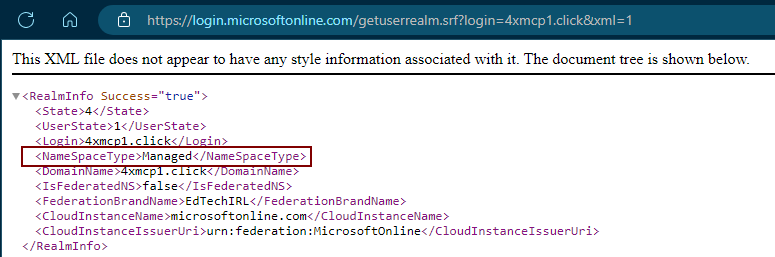
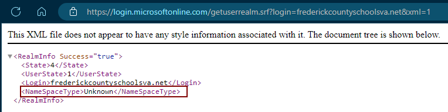

# Gaining Initial Access Part 1: How Do Attackers Find People to Target?

*A look at how to enumerate users accounts in a M365 tenant*

[![A cartoon-style illustration showing a hacker from a distance, peeking at a school building with a network symbol above it. The hacker has a mischievous smile and a magnifying glass, representing reconnaissance and enumeration. The school building has icons of user accounts and passwords floating around, symbolizing a digital attack on school data. The scene is colorful and approachable, with a lighthearted, educational tone, designed to demystify the concept of cybersecurity threats in education.](images/22a6c2f3-9d16-4868-bf41-55689df9e3f4_1024x1024.webp "A cartoon-style illustration showing a hacker from a distance, peeking at a school building with a network symbol above it. The hacker has a mischievous smile and a magnifying glass, representing reconnaissance and enumeration. The school building has icons of user accounts and passwords floating around, symbolizing a digital attack on school data. The scene is colorful and approachable, with a lighthearted, educational tone, designed to demystify the concept of cybersecurity threats in education.")](images/22a6c2f3-9d16-4868-bf41-55689df9e3f4_1024x1024.webp)

In today’s digital landscape, many educators assume they’re unlikely targets for cyber attacks, believing that malicious hackers focus their efforts on high-profile organizations or that hacking itself requires advanced skills only accessible to an elite few. However, these assumptions are far from reality. Educators, schools, and even individual accounts are frequently targeted by attackers who use straightforward methods to gain unauthorized access to valuable data. This series of articles is going to focus on the steps attackers take to target your systems, as well as tips for ways you can defend against these tactics, techniques, and procedures.

In part 1, we’re going to discuss reconnaissance and how attackers find out information to target a Microsoft 365 environment, as well as how they enumerate user accounts to cultivate as targets. In part 2, we’ll talk about password spray attacks, one of the most common forms of cyberattack. For part 3, we’ll look at a method attackers use to evade or bypass MFA. Something notable about this series is we’re only going to explore attack methods that do NOT require user interaction—no social engineering tactics, no phishing, no malicious links. These will all be things someone with a limited skillset can do with patience, a computer, and YouTube (and maybe some AI for good measure).

## What is enumeration?

One common technique used by attackers to find targets is account enumeration — the process of identifying usernames that belong to an organization or system. This is a process that only requires a few tools like Google, your school website, and a few open-source programs. Once an attacker has gathered details on their target, they can then launch an attack to try to gain unauthorized access to victims’ accounts.

### Identifying your tenant: is the target M365?

The first question is does your target use Entra ID? You can probably figure this out with OSINT by browsing your school’s webpage. There are likely public-facing documents that reference either Microsoft of Google tools in use. If that fails, checking meeting notes from school board meetings can also show you what vendors and products are purchased by the school. Many schools stack their technology purchases for the beginning of a new fiscal year, which for most schools is July. Accordingly, the July board agenda could be a treasure trove of information. Unfortunately, as a public institution, there’s not a great way to protect against this data leakage and maintain compliance with public meeting transparency requirements. If you don’t want to dig through meeting notes, however, there is a quick and easy technical way to find out if a target used Entra: visit this webpage, substituting the domain of the target in place of my test domain (4xmpc1.click)

```
https://login.microsoftonline.com/getuserrealm.srf?login=4xmcp1.click&xml=1
```

This should output an xml file that looks like this. Note the **NameSpaceType** of **Managed**:

[](images/7f60b23a-bea2-4bcc-87d9-d78cab10beb0_775x257.png)

By contrast, a non-Microsoft District will return a **NameSpaceType** of **Unknown**:

[](images/f4ae901a-3819-4d61-ac62-e380bb3f72e5_764x191.png)

It’s worth noting that none of these methods are failsafe, especially in schools. Many schools maintain both a Microsoft domain and a Google domain. I’ve seen these broken up into some interesting ways, as well. In some cases, schools will provide Google Workspace for students and Microsoft 365 for teachers, or Google for students and teachers but Microsoft for admin, or any other combination of services.

[![A cartoonish illustration depicting a strong relationship between families and schools. Show a friendly school building with large windows, surrounded by children and adults holding hands in a circle. The adults include diverse family members like parents, grandparents, and guardians, while the children look happy and engaged. Some family members hold school-related items like books or art supplies, symbolizing support for learning. In the background, there are trees and a bright, sunny sky to add warmth to the scene. The style is colorful, friendly, and inviting.](images/5ad83764-45ca-4635-adf0-587ef4611693_1024x1024.webp "A cartoonish illustration depicting a strong relationship between families and schools. Show a friendly school building with large windows, surrounded by children and adults holding hands in a circle. The adults include diverse family members like parents, grandparents, and guardians, while the children look happy and engaged. Some family members hold school-related items like books or art supplies, symbolizing support for learning. In the background, there are trees and a bright, sunny sky to add warmth to the scene. The style is colorful, friendly, and inviting.")](images/5ad83764-45ca-4635-adf0-587ef4611693_1024x1024.webp)

## How do Attackers know what users to target?

This is another area where schools have it tough. We have a mandate to build strong relationships between school and home, and the last thing schools want to do is make it hard for parents to communicate with teachers. In this spirit, most schools publicly list all of their employee emails on their website. Many also include the job role in the directory. This makes it exceptionally easy for an attacker to harvest a list of users. It also helps them to see relationships between users, and that can help them come up with pretexts for social engineering or phishing attacks. For example, I’ve seen many times where an attacker sends out emails to a specific school, grade level, or department while impersonating the principal/team leader/department chair, and they’ll target all of the addresses for that school, grade, or department except for IT staff and administrators. Providing these email lists makes attackers’ jobs much easier and helps them carry out attacks much more efficiently. If it’s possible to not post these directories publicly while still providing seamless access between teachers and parents, I strongly suggest doing that. Having a truly secure environment is impossible, but the best bet is to place enough defenses around your systems that it makes your school look harder and less appetizing to an attacker than other schools. It’s like the old joke about not having to outrun a bear, just the slowest person in your group.

### What if you don’t post email directories?

If you don’t post your directory, there are other methods for attackers to generate a list of possible accounts to attack. One way is to still use your website, but using it to manually generate a list of peoples’ names and using it to enumerate user accounts using a tool like **[o365enum](https://github.com/gremwell/o365enum)**.

Say, for example, we were trolling a website for edtechirlacademy.net and saw that there is a teacher named Betty White. We can leverage a tool like this [Username/Email Wordlist Generator from Github](https://github.com/hac01/uwg/) to give us a list of possible usernames, but ChatGPT is a fast way to get similar results with a prompt like this:

```
I have a user at the domain edtechirlacademy.net whose name is Betty White. Can you give me a list of 5 possible usernames for Betty?
```

This will give us an output of possible usernames using common conventions:

- betty.white@edtechirlacademy.net
- bwhite@edtechirlacademy.net
- bettyw@edtechirlacademy.net
- betty_w@edtechirlacademy.net
- b.white@edtechirlacademy.net

I’m now going to add those usernames to a file called **users.txt**.

Using a tool called [o365enum](https://github.com/gremwell/o365enum), all it takes is one command:

```
./o365enum.py -u users.txt -n 1 -m office.com
```

The output will look like this:

```
username,valid
betty.white@edtechirlacademy.net,0
bwhite@edtechirlacademy.net,0
bettyw@edtechirlacademy.net,0
betty_w@edtechirlacademy.net,0
b.white@edtechirlacademy.net,1
```

Note the **1** after the final address—this tells us that b.white@edtechirlacademy.net is a valid account at this domain. Now that they know the email domain and the convention edtechirlacademy.net uses for email addresses, the attacker can create a username list for as many users as they can find in this organization. In our example, they found these five users:

```
d.parton@edtechirlacademy.net
k.rogers@edtechirlacademy.net
d.grohl@edtechirlacademy.net
k.deal@edtechirlacademy.net
f.black@edtechirlacademy.net
```

The next step is verifying that these are valid users using o365enum like we did previously. After adding them to the **users.txt** list, we run the command

```
./o365enum.py -u users.txt -n 1 -m office.com
```

and it gives us the following output, telling us that all but one of the accounts we found are valid.

```
username,valid
d.parton@edtechirlacademy.net,1
k.rogers@edtechirlacademy.net,1
d.grohl@edtechirlacademy.net,1
k.deal@edtechirlacademy.net,1
f.black@edtechirlacademy.net,0
```

## Next Steps

At this point, we’ve potentially gone from not knowing anything about a target to knowing that they are an M365 school, what their email address convention is, and a list of target accounts. Understanding how attackers conduct reconnaissance and enumerate accounts sheds light on just how easy it can be to gather the information needed for a cyberattack. Schools face unique vulnerabilities due to their open and accessible information—staff directories, public-facing documents, and shared resources that make it simpler for attackers to target educators and administrators alike.

In the next article, we’ll look at what happens after an attacker has a list of target users and tackle **Password Spray Attacks**—a technique used widely due to its simplicity and effectiveness—and explore how schools can detect and prevent these attacks. Remember, a robust security stance isn’t about outrunning the attacker, but making your organization a less attractive target.
