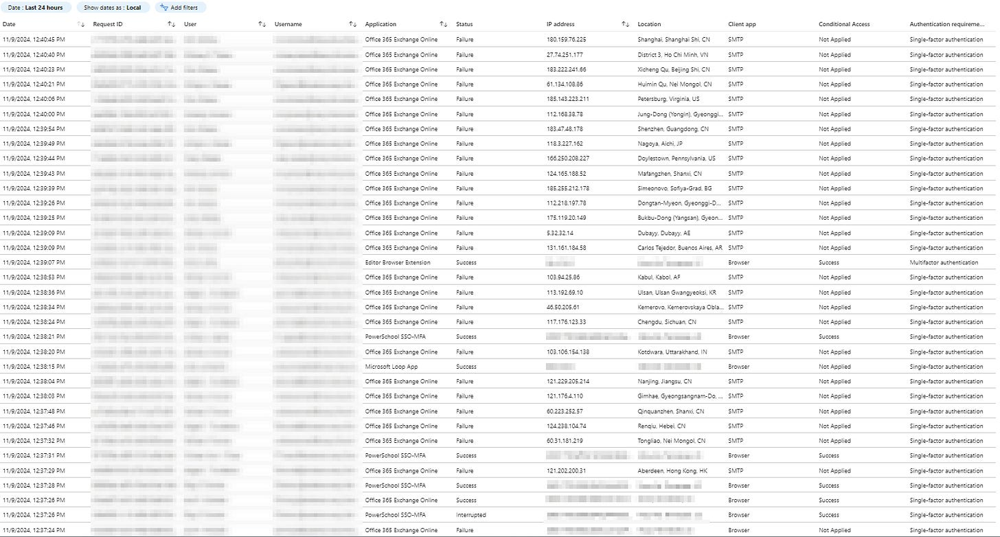
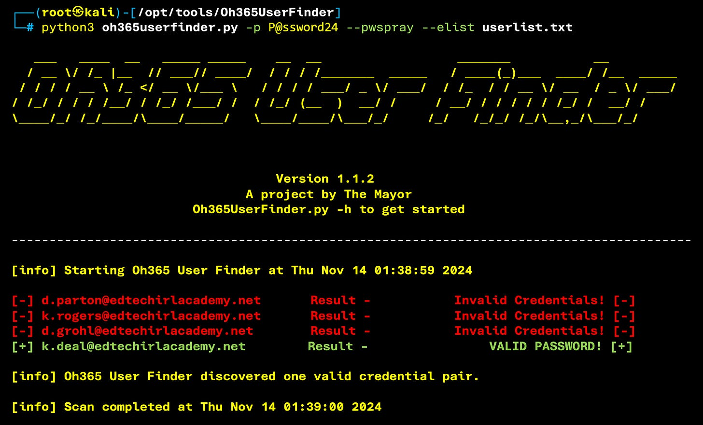
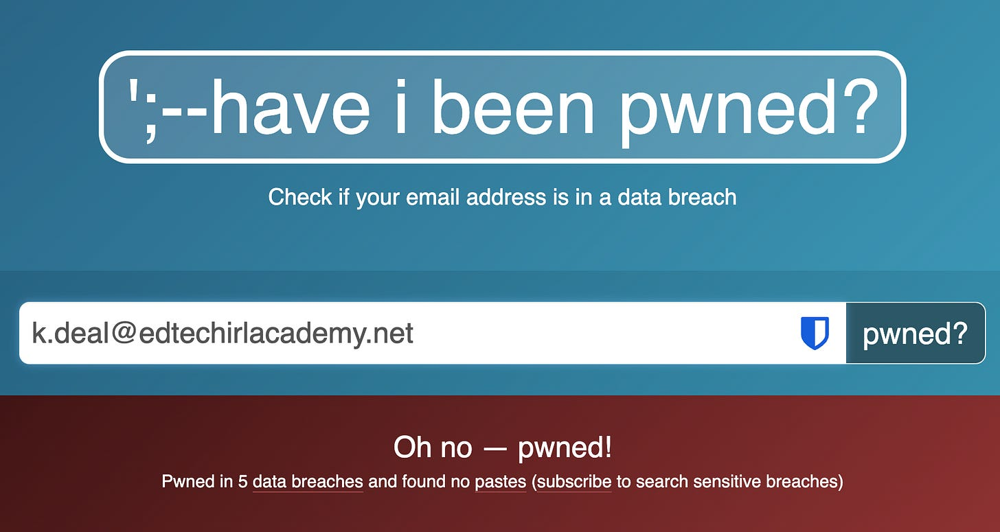
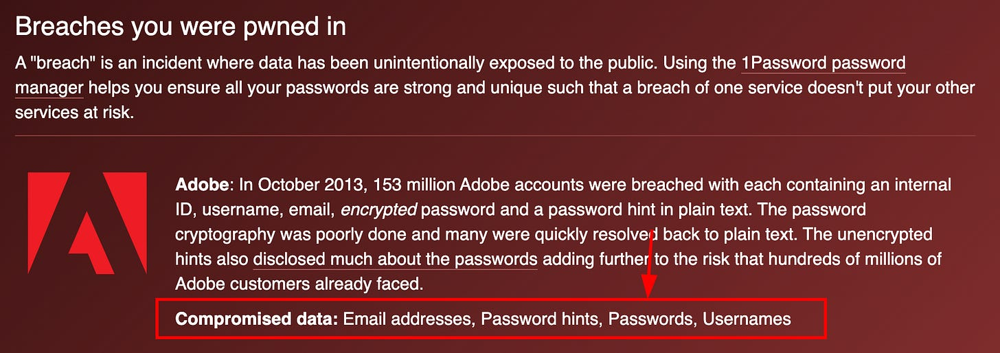

# Gaining Initial Access Part 2: Password Spray Attack Detection, Defense, and Execution

*What does an attacker do once they have target accounts?*

[![A cartoon-style illustration depicting the concept of a password spray attack. A mischievous hacker character stands with a spray can labeled 'passwords,' spraying common passwords like '123456,' 'password,' and 'qwerty' at a wall of digital locks. Each lock represents a user account. Some locks appear unaffected, while one or two look like they're about to open, illustrating the idea that a few accounts might be vulnerable. The background includes symbols like question marks and exclamation points to add a sense of suspense. The mood is educational yet playful, with bright colors and exaggerated expressions.](images/953f85ef-087e-43d9-83a5-699002978cc2_1024x1024.webp "A cartoon-style illustration depicting the concept of a password spray attack. A mischievous hacker character stands with a spray can labeled 'passwords,' spraying common passwords like '123456,' 'password,' and 'qwerty' at a wall of digital locks. Each lock represents a user account. Some locks appear unaffected, while one or two look like they're about to open, illustrating the idea that a few accounts might be vulnerable. The background includes symbols like question marks and exclamation points to add a sense of suspense. The mood is educational yet playful, with bright colors and exaggerated expressions.")](images/953f85ef-087e-43d9-83a5-699002978cc2_1024x1024.webp)

## An Attacker knows you use M365 and has a list of users in your environment… now what?

As our attacker continues their research from [part 1](https://www.edtechirl.com/p/gaining-initial-access-part-1-how), they have a list of 4 users in our org, a list of their usernames, and has verified that the accounts are valid. She’s added these to a file called userlist.txt

```
d.parton@edtechirlacademy.net
k.rogers@edtechirlacademy.net
d.grohl@edtechirlacademy.net
k.deal@edtechirlacademy.net
```

## Now that they know what organization and users they’re attacking, they need a password for access.

This can happen a lot of ways. While you hear horror stories of people’s identities being sold on the dark web (which definitely happens, but *thank you*, cyber marketing), the most effective way is through phishing. We’ve looked before at [how creds can be captured through phishing](https://www.edtechirl.com/p/why-is-phish-resistant-mfa-important), so this time we’re going to look at the most common method of credential compromise that I see attackers use against my schools: password spray.

### What is a Password Spray Attack?

A password spray attack is a type of brute-force attack where an attacker tries a small number of common or weak passwords (like "password123" or "welcome!") across many different accounts within an organization, rather than attempting many passwords on a single account. This method reduces the risk of detection, as it avoids account lockout mechanisms that are typically triggered by multiple failed login attempts on a single account. In a password spray attack, attackers often target publicly accessible login portals, like email or VPN, and aim to identify accounts with weak passwords. Once they gain access, they can potentially escalate their access or move laterally within the network, posing significant security risks.

### What does a Password Spray Attack look like?

The image below is a classic example of a password spray attack. If I sign in to view Azure sign-in logs for my tenant, there is a high chance that this is what I’m going to see at any given point. My tenant has about 7000 users, but **we average about 40K malicious login attempts via password spray \*every day\***.

I blurred the usernames in the screenshot below, but basically every line is a different user. Notice that IPs and Locations vary widely, but the time stamps are clustered very closely together. This, coupled with the SMTP client app is a dead giveaway for password spray, because you can see the attacker is cycling through a list of users and automatically changing location to try to avoid detection. The use of SMTP is because MFA is frequently not configured for SMTP, and there may be more relaxed lockout rules.

[](images/bf9ad4ce-357a-4a04-955d-1adb3aeb8ae1_1632x877.png)

### How do you protect against Password Sprays?

To reduce your attack surface, use a password deny list that prevents users from using passwords in Microsoft’s dictionary of banned passwords. Since spray attacks are trying logins against common passwords, using a banned word list can help shore up accounts on the front end before an attack. You can additionally block legacy authentication methods, which will thwart any of the SMTP attempts. Further, if you don’t have a reason for logins from outside your country, you can use conditional access to deny logins based on login location, which would automatically thwart any login attempts from outside the country. If someone does make it past this perimeter, that’s where the traditional controls like multi-factor authentication (MFA), strong password policies, and monitoring login activity for unusual patterns comes into play.

In terms of monitoring, with a Microsoft Entra ID P2 plan (A5/E5, or A5/E5 Security Add-on), Microsoft Entra ID Protection can be coupled with Conditional Access to pre-emptively take action against accounts in the case of a password spray attack. Entra ID Protection categorizes password spray activity into categories for Risk Detections, Risky Sign-ins, and Risky Users based on what sign-in activity is detected, and then Conditional Access rules can be crafted to take action on those risks by locking the account, requiring a password reset, etc.

For an idea of scale, out of the most recent 34 sign on attempts shown in the screenshot, 26 were part of password spray attacks, and 8 were legitimate user sign in attempts. Thanks to the defense strategies described above, even if an attacker had the password for one of these 34 accounts, none of their login attempts would have been successful. Prior to implementing these controls a few years ago, any one of those failed malicious login attempts could have been successful.

### How easy is it to spray passwords?

Using the free [Oh365 User Finder](https://github.com/dievus/Oh365UserFinder) tool, it’s one command to spray the accounts in our userlist.txt file:

```
python3 oh365userfinder.py -p P@ssword24 --pwspray --elist userlist.txt
```

Running the above command launches Oh365 User Finder and will test the credentials provided in the command (P@ssword24) against all 4 of the user accounts in the userlist.txt.

[](images/cfea2644-3391-4ab9-bbbf-9f38954dd0f4_2384x1442.png)

At this point, the attacker’s research and luck has paid off. With a sample size of four users, it’s unlikely that they would have hit paydirt with P@ssword24 in real life, but there are a lot of other factors in their favor. For example, as the sample size of user accounts increases, the higher the likelihood that one of those users will be using a common password. Second, since the attacker knows this is an M365 tenant, they can automatically avoid words that they know M365 blocks from passwords. Finally, if they have done more targeted research, they can possibly find credentials for an account if it was previously compromised or released in a data leak, and the user never changed the password. To see if your email has been involved in a known data breach, you can visit [haveibeenpwned.com](https://haveibeenpwned.com/), enter your email address, and see if it was involved in any known data breaches. If it was pwned like the account below, you can scroll down and learn what breach your account was involved in, and what pieces of data were included. If any of your accounts had passwords or password hashes included in a breach, you should change that password anywhere you use it in conjunction with your email address. If you manage a domain, you can also sign up for domain monitoring, and you’ll get notifications any time an account in your domain is included in a documented data breach.

[](images/cf1e15d9-d754-498a-aebe-60509e894c6a_1924x1024.png)

[](images/98dee563-8e9d-465f-a81b-c43fd77fc717_1936x684.png)

## What’s Next?

At this point in our attacker’s journey, they’ve now identified a set of valid user accounts, and they’ve identified valid credentials for one of them. Their next step is to continue to avoid detection while figuring out a way to bypass k.deal’s MFA that’s required to sign in to her email. Part 3 in this series will look at a possible method for exploiting gaps in MFA.
