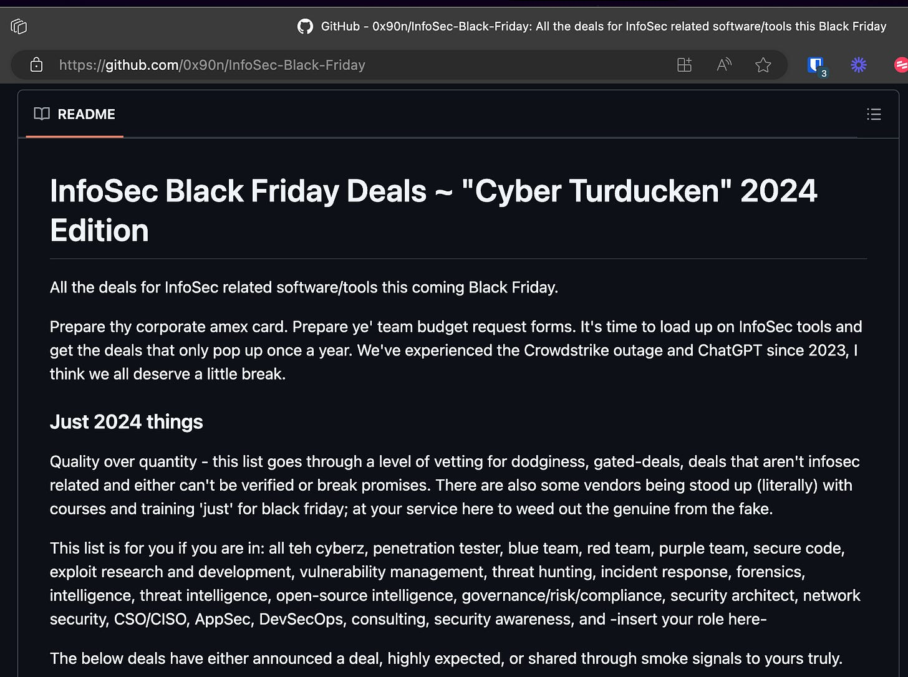

# 'Tis the Season to Maximize Your Training Budget: The Ultimate Guide to Black Friday InfoSec Deals

[![A vibrant, cartoon-style illustration for a blog article about Black Friday cybersecurity deals. The scene shows a busy digital marketplace, where various cybersecurity items like certifications, tools, and lab access icons are on sale with discount tags. In the foreground, a happy cybersecurity professional, holding a shopping bag filled with items like secure communication tools, training certificates, and lab access keys, is excitedly looking at a 'Cyber Black Friday Deals' sign. The background features festive holiday elements, such as banners that say '2024 InfoSec Deals' and small icons representing cybersecurity, like locks, shields, and computers. The overall mood is festive, energetic, and conveys a sense of smart shopping and budget maximization in cybersecurity.](images/3666fbbe-8b53-4760-8c76-1068c77cd903_1024x1024.webp "A vibrant, cartoon-style illustration for a blog article about Black Friday cybersecurity deals. The scene shows a busy digital marketplace, where various cybersecurity items like certifications, tools, and lab access icons are on sale with discount tags. In the foreground, a happy cybersecurity professional, holding a shopping bag filled with items like secure communication tools, training certificates, and lab access keys, is excitedly looking at a 'Cyber Black Friday Deals' sign. The background features festive holiday elements, such as banners that say '2024 InfoSec Deals' and small icons representing cybersecurity, like locks, shields, and computers. The overall mood is festive, energetic, and conveys a sense of smart shopping and budget maximization in cybersecurity.")](images/3666fbbe-8b53-4760-8c76-1068c77cd903_1024x1024.webp)

Cybersecurity tools and training can put a hefty dent in any budget, especially with rising demands for cutting-edge software, certifications, and hands-on labs. But here’s the good news—this Black Friday, you can supercharge your InfoSec team’s resources without breaking the bank. Thanks to securitymeta\_’s annual Black Friday Deal Tracker on Github, you can find some killer deals on Infosec training, tools, labs, hardware, books, games, and services. This list is curated to filter out sketchy, unverified deals and focus on genuine discounts, from top-notch penetration testing labs and secure code training to secure communication tools and defensive software. Two of my favorite training platforms/providers are included at 50% discounts — [Let’s Defend](https://letsdefend.io/) and [TCM Academy](https://academy.tcm-sec.com/). If you’re impatient like me, you can really skip the rest of this article and [go straight to securitymeta\_’s list here —> https://github.com/0x90n/InfoSec-Black-Friday](https://github.com/0x90n/InfoSec-Black-Friday), but if you want more details, read on.

## **What to Expect: Some of the Best Deals on the Market**

Here's what you'll find in this guide:

- **Top-Tier Training Programs and Certifications**: Huge discounts on courses from trusted names like TCM Academy, LetsDefend, and CloudBreach. It’s the perfect time to skill up and certify your team at a fraction of the usual cost.
- **Cybersecurity Software and Tools**: Access specialized tools, like PortDroid and ProtonMail’s secure suite, designed to enhance network security, cloud protection, and encrypted communications.
- **Hands-On Labs and Practical Learning**: Programs from platforms like PentesterLab and Blu Raven Academy offer practical, scenario-based training to keep skills sharp and ready for real-world challenges.
- **Hardware and Security Gadgets**: For those who want to boost red team capabilities, KSEC Labs and Hak5 are providing deep discounts on some of the best hardware tools and devices on the market.

## **How to Get Started**

Mark your calendar for **November 20th**—many of these deals go live in just a few days. Keep the Github page bookmarked, as the list will update frequently through Black Friday. Each deal has been reviewed for legitimacy, so you can shop confidently.
