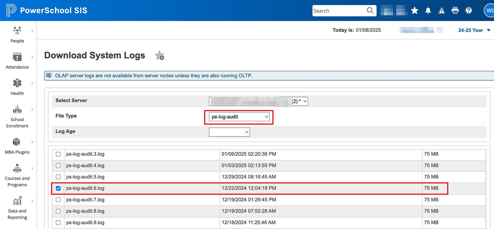
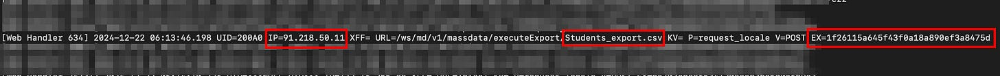
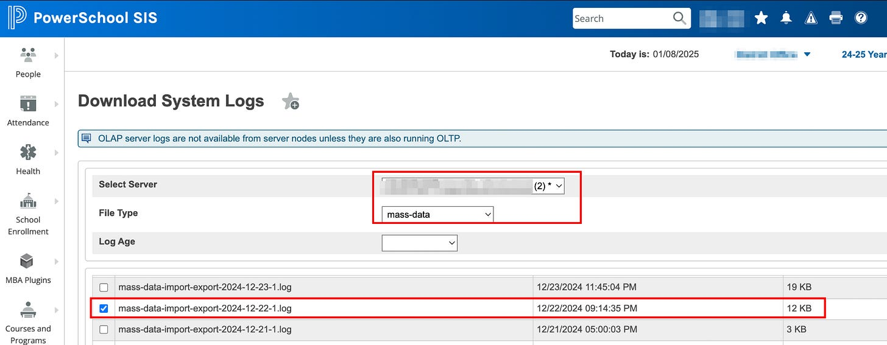
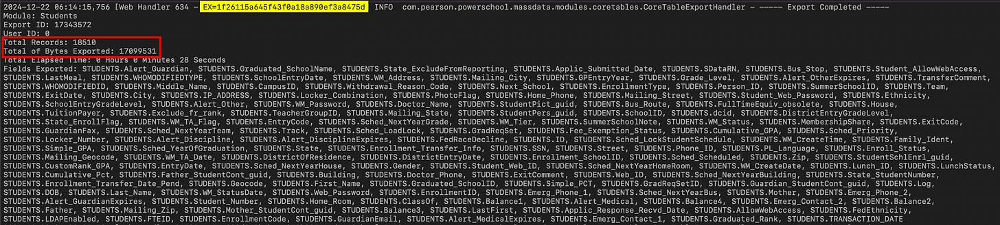

# The PowerSchool Data Breach: What we know today, how to check your exposure, and how to see what fields were exfiltrated

[ scatter dramatically from the computer's screen. The background is a dimly lit room with scattered papers and a simple desk, creating a humorous yet dramatic cyber-themed scene.")](images/dabb4e39-da5a-40f2-923b-647e835f9bf5_1024x1024.webp)

It’s been an eventful 36 hours for PowerSchool customers. As news stories have filtered out over the course of the day, a depressing picture is forming around what could shape up to be the single largest data breach impacting K12 schools. While PowerSchool states that only a subset of schools are affected, there are wide-ranging reports of impact. Considering that PowerSchool hasn’t released a public statement that I’m aware of, here’s what we know so far.

## Timeline

- On Dec. 19, initial access was gained by an attacker with compromised credentials to PowerSource, PowerSchool’s support platform.
- As indicated by PowerSchool’s logs, the attackers performed reconnaissance through Dec. 21. PowerSchool has stated that they’ve collected 15TB of logs from the time period in question.
- On Dec. 22, the attackers used automated scripts to exfiltrate data from the tenants’ Students and Teachers database table from PowerSource using a data export tool used for remote support. Because of the nature of this remote data export tool, even self-hosted customers are impacted by this event. **.**
- These files were written to two CSV files: students\_export.csv and teachers\_export.csv. It’s worth noting that the PowerSource platform only has access to the PowerSchool SIS product, so no other PowerSchool products were involved in this incident.
- On Dec. 28, PowerSchool became aware of the breach, presumably in the form of a ransom demand.
- Between Dec. 28 and Jan. 7, PowerSchool enlisted the services of incident response company [CyberSteward](https://cybersteward.com/), a firm described on their website as “Trusted Advisors in Threat Actor Engagement, Negotiations, and Cyber Resolutions.” With CyberSteward’s assistance and negotiation, PowerSchool has stated that they watched a video of the adversary deleting the sole copy of the data. As a result, they stated that “we have taken all appropriate steps to prevent the data involved from further unauthorized access or misuse. We do not anticipate the data being shared or made public, and we believe it has been deleted without any further replication or dissemination.” When asked how trustworthy that assessment is, PowerSchool’s CISO and VP of Information Security Mishka McCowan stated that the adversary’s business model relies on trustworthiness, so they have a high level of confidence that the exfiltrated data was truly deleted and won’t resurface. McCowan posits that fear of reputational damage will prevent the attackers from keeping a copy of the data for future sale. I will withhold commentary on that point for now. Additionally, PowerSchool enlisted CrowdStrike for incident response and forensics. They have concluded that there is no evidence of malware or continued unauthorized activity in the PowerSchool environment.
- On January 7, PowerSchool sent [this email](https://go.powerschool.com/index.php/email/emailWebview?email=ODYxLVJNSS04NDYAAAGX54SCHJyJDTiMCENPXALMSEBHwqUJTXSRPNfwxwvH547XtpWRshMqFh48M-kYTHHck-yogqLY68bc9amiiDZjqH7OF0yBA2Haig) to impacted customers.
- On January 8, they held the first live information webinar for impacted customers, led by CEO Hardeep Gulati, CISO Mishka McCowan, and Chief Customer Officer Paul Brook. A second run of the webinar will occur today (Jan. 9) at 11am. Registration for the webinar can be accessed [here](https://event.on24.com/wcc/r/4822032/4FC5031AFEE95B0C22071FF13DE6C794).
- On January 17, PowerSchool plans to release CrowdStrike’s finalized forensic report.

## **Have the holes been plugged?**

To harden the PowerSource platform, PowerSchool has deactivated the compromised credential and restricted PowerSource access, while also conducting a full password reset and increasing password length and complexity requirements. While none of the customer communications or FAQ documents have mentioned MFA, during the Jan. 7 webinar McCowan mentioned that MFA has been implemented for PowerSource. As of Jan. 8 at least, MFA is not required for customer PowerSource accounts. It was also mentioned during the webinar that the remote access export feature has been disabled for PowerSchool-hosted tenants, but that self-hosted tenants that wish to disable the feature will need to do so manually.

## How to verify that you were impacted, and find the specific date of compromise

While PowerSchool has notified all impacted customers, you can also check yourself for indicators of compromise (IOCs) by searching logs. To do this, navigate to System Management → Server → Download System Logs. Select your PowerSchool server, choose the **ps-log-audit** File Type, and choose the log file that encompasses Dec. 22 (it’s possible you may need to check the log that contains Dec. 21 or 23 if you don’t see indicators on the Dec. 22).

Once you download the log, you can search for the IP address **91.218.50.11.** There will be several entries, but you’ll be able to see the logs where they downloaded the exported CSVs like below:

Characteristics to take note of include the adversary’s IP address, the name of the CSV, and the EX string at the end. We’ll need this to determine what fields were accessed.

## What fields were accessed?

The list of impacted fields is pretty expansive. It’s easiest to assume everything in the Students and Teachers tables was exfiled, but to get a more precise picture, however, you can navigate to System Management → Server → Download System Logs like in the previous step. Again select your PowerSchool server, but this time select the **mass-data** file type, and select the .log files from the time period of the logs where you found the 91.218.50.11 IP address above.

Depending on the time of day the log file was created and when your data was accessed, you may need the log from Dec. 21, 22, or 23.

Once you download the log file, you’ll need the EX number we identified in the previous step. Search the mass-data log for that EX= #. In this example, the id number for the students\_export.csv is EX=1f26115a645f43f0a18a890ef3a8475d. The teachers\_export.csv will have a different number, but it can be found using the same method.

This will lead to a list of the fields that were accessed in that export, along with the total number of records and the amount of data exfiltrated. Not all districts populate all of these fields, so the actual data stolen will vary from tenant to tenant.

## What’s next for PowerSchool customers?

The name of the game right now is breach notification for impacted people. During the Jan. 8 webinar they stated they would be releasing an interim communication plan later in the day. As of this morning I’m not yet aware of its release. A more comprehensive communication plan is promised to come “in the next few days.” Since notification laws vary by state, guidance will be local. Tennessee schools have 45 days to notify impacted stakeholders, beginning with their own notification on Jan. 7.

##### Reference Notes:

Since there hasn’t been a lot released on this event yet, this article was written with details released from PowerSchool, presented during the incident webinar from Jan. 8, Reddit, [details](https://docs.google.com/document/d/1FCJEENhLTJGUyEpr4oLJ0jNJPP2IIZrDdRpVPeqg8-E/preview?tab=t.0) from Romy Backus, and a smattering of other posts on LinkedIn and other social media. While I have access to the confidential PowerSchool FAQ document, I’ve not included anything here from that document that hasn’t also been released through other sources or gleaned from personal experience. As the situation and my understanding evolve, I’ll attempt to make updates and corrections.
