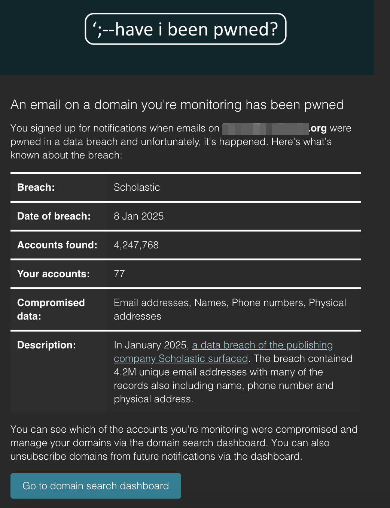
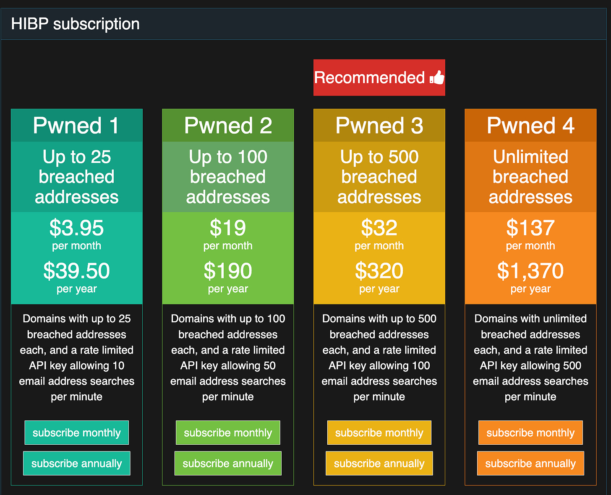

# Another Day, Another Breach: Scholastic Exposes Records for 4.2M Accounts

*What we know so far, and how you can stay in the loop on breach notifications from HaveIBeenPwned.com*

[![An illustrative image of a quaint bookstore with a broken front window. The setting is a cozy, old-fashioned bookshop with wooden shelves visible through the glass, filled with books. The broken window has jagged glass edges, and a few books are scattered outside on the sidewalk. The scene is set in soft, warm lighting during twilight, creating a slightly mysterious and atmospheric tone. The surroundings include a cobblestone street, a lamppost, and a sign hanging above the door with the shop's name.](images/52ff5b6f-297d-4ff1-9b46-e0401ed3660f_1024x1024.webp "An illustrative image of a quaint bookstore with a broken front window. The setting is a cozy, old-fashioned bookshop with wooden shelves visible through the glass, filled with books. The broken window has jagged glass edges, and a few books are scattered outside on the sidewalk. The scene is set in soft, warm lighting during twilight, creating a slightly mysterious and atmospheric tone. The surroundings include a cobblestone street, a lamppost, and a sign hanging above the door with the shop's name.")](images/52ff5b6f-297d-4ff1-9b46-e0401ed3660f_1024x1024.webp)

With many districts still trying to process the PowerSchool breach and what it means for them, it’s not surprising that the Scholastic breach announced last Friday (Jan. 10, 2025) has flown somewhat under the radar. Originally reported by [The Daily Dot](https://www.dailydot.com/debug/furry-hacks-scholastic-8-million-records-stolen/), the scholastic breach has a far less damaging scope than the PowerSchool breach (i.e., no Social Security Numbers were involved). However, this is an unsettling pattern for the beginning of 2025.

### What data was breached?

According to [haveibeenpwned.com](https://haveibeenpwned.com/PwnedWebsites), the attacker was able to compromise email addresses, names, phone numbers, and physical addresses for 4.2 million accounts, though it’s important to note that not every field was present for all of the 4.2 million accounts.

### How does this compare with the PowerSchool Breach?

Aside from the smaller footprint and less impactful data set, this breach seems to not be financially motivated. The hacker, under the handle “Parasocial,” contacted The Daily Dot with details of the hack, claiming that they had no intention of making the data public. They also mocked Scholastic’s lapses in security: “To Scholastic; lol get pwned. This is a lesson to be learned the hard way. Don’t let your customers take the hit for your security failures, use MFA.” Like PowerSchool, the initial attack vector was an employee account with compromised credentials.

While the lack of MFA is a common trait between these two attacks, Parasocial stated that they could have accessed more than the 4.2M accounts, but Scholastic had export limits on the compromised web portal.

### How are schools involved?

At this point, reporting has been non-existent on what parts of Scholastic were impacted. As a large multinational company, Scholastic has three divisions: Children's Book Publishing and Distribution, Education Solutions, and International. Even within those areas, there are products that are offered directly to public consumers, and others that are sold to schools. As of Jan. 15, Scholastic has yet to comment aside from a statement that they will thoroughly investigate the incident. It’s possible, and likely, based on the records received by The Daily Dot, that the breached data comes from the public-facing Scholastic web resources where students, families, and teachers sign up for their own accounts. If this ends up being the case, schools should largely be unaffected. However, if Scholastic’s investigation indicates that data shared from schools are impacted, it will be time to start notifying affected families.

### What’s next?

For now, everyone is waiting for an announcement from Scholastic with more details about what products were impacted, whose data was accessed, and what information was included. While you’re waiting for that information, you can get a head start bysigning up for notifications for [haveibeenpwned.com](https://haveibeenpwned.com/), a free intelligence source that allows you to either look up an individual email and see if it’s included in a known data breach, or for those who manage domains, it also allows you to set up domain-based notifications where hibp will send you emails to notify you when addresses at your domain has been included in a breach. In my case, I received this email from haveibeenpwned on Jan. 12, two days after the breach was originally reported:

Setting up the notification at a domain level has to be done by an IT administrator with either access to the domain’s DNS records to create a TXT record, or access to a specified email address at your domain (like security@domain.com, admin@domain.com, etc.)

While an individual user can still enter their email address and see any breaches that impact their address, HIBP has moved the ability to look up all of the impacted addresses at your domain behind a pay wall in recent years. I can’t begrudge them that, because they are still offering a crucial service that’s costly to maintain and that fills a critical gap. Also, the general bulk notification like above is still accessible for free. For what it’s worth, if the PowerSchool attackers end up to be not as trustworthy has PowerSchool has stated they are, HIBP will likely be the outlet that verifies the dataset when it shows up in online marketplaces. Subscriptions for HIBP notifications listing specific impacted addresses is below.

At this point, I’ve not been able to find a source to verify whether Have I Been Pwned obtained the list from the attacker, Scholastic, or The Daily Dot.
