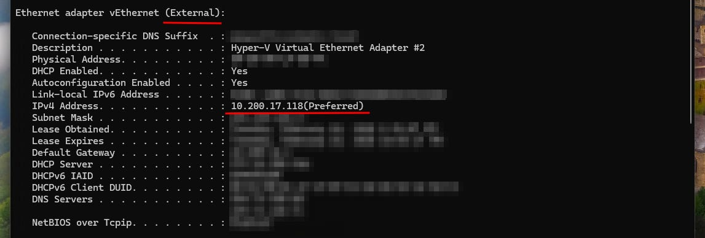
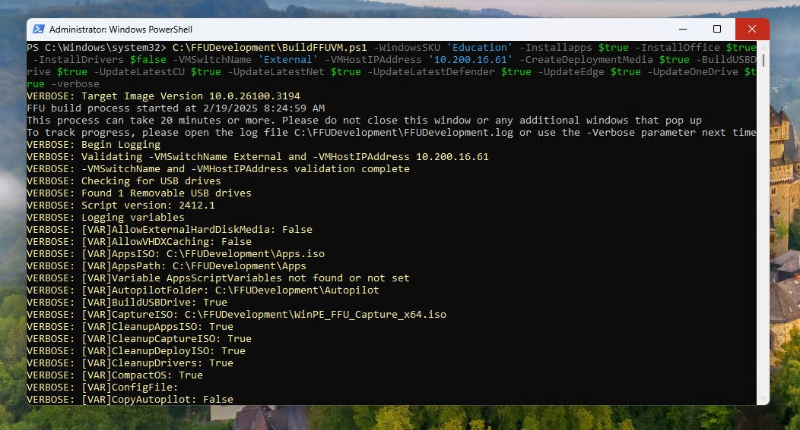

# Zero Touch USB Imaging - New and Improved in 2025

*A guide on custom imaging computers with a flash drive, with barely any user interaction, FAST.*

[](images/31938cd5-ea86-42da-ac00-56ac0068e94e_1024x1024.webp)

### Introduction

Back in April 2022, I wrote an article on how to deploy autopilot from scratch using a zero touch USB method. The article had some really good traction, and I know there were others using this same method in their own environments. First off, thanks! The great reception from that article inspired me to continue writing and sharing solutions.

Unfortunately, I am no longer able to get that method to work. I believe there was a change to Windows PE that has broken it. That being said, I have found a new method that’s even faster and more customizable. Oh, and of course, with minimal user interaction. By the end of this article, you are going to have the tools to create a flash drive that will quickly clear the drive of a computer, image the computer with whatever apps you’d like available out of box, and having the latest windows cumulative, and defender security updates at the time of making the drive.

### FFU Tool by Richard Balsley

***DISCLAIMER: I DID NOT WRITE THIS SCRIPT. ALL CREDIT GOES TO RICHARD BALSLEY FROM MICROSOFT.***

As mentioned, this is an FFU tool. So what is FFU? Well, FFU stands for **Full Flash Update**. This is a method of imaging computers where you can take a ‘golden image’ of a computer and compress it into a .ffu file, and then deploy it to a computer through Windows PE. Think of PXE booting, but all locally on a flashdrive. This is a common method of device imaging for factories and manufacturers.

### So, what makes this script special?

Well, it does a LOT of work for you. It will do the following things.

- Creates a VM in Hyper V
- Installs the latest version of windows, including cumulative updates and security patches
- Installs M365/Office, OneDrive, Company Portal, New Teams (And any other app you configure it to add. More on that later)
- Automatically creates the FFU image, and writes it to your USB Drive

All of this, with one command. Oh, and it’s super customizable.

### Getting Started

First, we’re going to go over how to create the ‘default’ image without any extra customizations. After we finish going over that, we’ll go through the extra goodies you can apply, and I’ll let you know which configurations I am using.

##### Prerequisites

- A windows computer with the [Hyper V Optional Feature enabled](https://learn.microsoft.com/en-us/windows-server/virtualization/hyper-v/get-started/install-hyper-v?pivots=windows) (I would recommend doing this on a fresh windows image, I had issues trying to run this on my Entra ID/Intune joined computer.)
- Create a [virtual switch in Hyper V](https://learn.microsoft.com/en-us/windows-server/virtualization/hyper-v/get-started/create-a-virtual-switch-for-hyper-v-virtual-machines?tabs=hyper-v-manager&pivots=windows)
- The [GitHub Package](https://github.com/rbalsleyMSFT/FFU/releases/tag/v2412.1?scrlybrkr=9ae6f2e5). Download it and copy the FFUDevelopment folder to C:\

After you have all of your prerequisites set up, there is one last thing we need, the IP address of your virtual switch. This can be found by running **ipconfig /all** on cmd. You should see an entry like below, with your Virtual Switch’s name and IP (I named mine External).

[](images/a064f3e3-eb9c-480e-9327-fa89420fb201_1147x388.png)

Once you have that, we should have all of the information needed to kick off the script. You will want to open Powershell as Admin, cd C:\FFUDevelopment , and then run the command below (throughout the article, I will be referring to this as the ‘BuildFFUVM command’. This will kick off the process to create your zero touch USB drive.

```
C:\FFUDevelopment\BuildFFUVM.ps1 -WindowsSKU 'Education' -Installapps $true -InstallOffice $true -InstallDrivers $false -VMSwitchName 'External' -VMHostIPAddress '8.8.8.8' -CreateDeploymentMedia $true -BuildUSBDrive $true -UpdateLatestCU $true -UpdateLatestNet $true -UpdateLatestDefender $true -UpdateEdge $true -UpdateOneDrive $true -verbose
```

##### Thing to Note

- Change WindowsSKU to your desired SKU, if necessary.
- There’s a handful of ways to deploy drivers with this package that we’re going to go over later, so for now I’m leaving it set to $false.
- Change VMSwitchName to the name of your virtual switch, if necessary.
- VMHostIPAddress refers to the virtual switch IP address we grabbed in the last step.

Once you have your command ready, go ahead and run it!… then be ready to wait a *long* while before it finishes. The first time you run the script, it has to download the latest version of windows, all of the updates, office, yadayada, so it may take a few hours to run the first time. After you’ve ran it before, the script will check for updates to those things and only download them again if necessary.

[](images/939fc6c8-8752-45ae-9cfb-3be342080be6_1052x567.png)

Once it finishes, there will be a message at the end of the terminal saying so, along with the time it took for the script to run. Your jump drive should have two partitions. One called *Deploy* and one called *BOOT*. Go ahead and plug it into a computer and boot to the drive. It should boot to Windows PE (a blue screen with a black terminal window open) and start running commands. After 20ish minutes or less depending on your hardware, it should boot to windows Out of Box Experience. Once you set it up, it should have the latest updates already applied, along with having office installed. Awesome! Now let’s go over the customization options so you can really dial this in.

### Customization Options

I feel where this really shines over a lot of FFU tools I’ve seen in the past is the amount of customization options.

#### Apps

**Change M365/Office Apps** - By default, the program will add the entire office suite, excluding Access, Lync, Publisher, Bing, Teams, and Outlook. This can be changed by editing the configuration file *C:\FFUDevelopment\Apps\Office\DeployFFU.xml*.

**Add apps to be installed through Winget** - By default, the program will install the company portal app and the new version of teams, if you use the *C:\FFUDevelopment\Apps\AppList\_Sample.json* file. To use these apps and this feature, you will need to change the file name to *AppList.json**.***  You can then add and change the apps you wish to be installed via Winget.

**All other apps** - You can also add any other app to your image as well. To do this, copy the installers over to *C:\FFUDevelopment\Apps.* You then need to edit the *InstallAppsandSysprep.cmd* file and the command line options to silently install each of your apps.

#### Drivers

There’s two different ways you can do drivers. If you want to do this for a single model of device, you can have the drivers added to the FFU image. The other option is to add the drivers on the jump drive to be installed immediately after applying the FFU. Option one is faster, but option two allows for multiple devices models from the same flash drive.

**Drivers in FFU Image** - To do this, simply add the switches *-make* and *-model* to your BuildFFUVM command. This will trigger the script to search for the drivers of your make and model device. Note that Only Microsoft Surface, HP, Dell, and Lenovo devices are supported with this method. Also, don’t forget to change the *-InstallDrivers*switch to $true, in your BuildFFUVM command.

**Drivers after FFU Image (multi model support) -** To do this, you will need to go download the SCCM driver package for each of your model devices. When you run the BuildFFUVM command, you will want to have the switch *-InstallDrivers* set to $false. After the flash drive has been made, create a folder on the *Deploy* partition named *Drivers.* Go ahead and create a folder for each model of device you have, and copy the drivers into each folder. Whenever you boot to the drive, it will prompt the user to choose which driver package they would like to load after the image.

#### Naming Templates

After booting to the FFU, you can have it to where the jump drive’s script will prompt the user what device name prefix they would like to use. *NOTE: If you do this method and also plan to provision or enroll the device with autopilot, you should take the naming template out of those methods.* To use this feature, go to *C:\FFUDevelopment\unattend\SamplePrefixes.txt*and change the file name to *Prefixes.txt**.*** When running your BuildFFUVM command, you must also add -CopyUnattend $true. Each line on this text file is a different prefix option. Replace these with the prefixes of your choice. Whenever the user boots to the drive, it will ask them which prefix for the device name they would like to use. The device name will be the prefix, followed by the computer’s serial number. For example, if we have a device with the serial number bw1234 and have STAFF- in our naming templates, the device name would be STAFF-bw1234.

#### Provisioning/Enrollment Support

This script also supports many enrollment methods for both AD and Entra ID/Intune.

**AutoPilot**

AutoPilot User Driven, AutoPilot Self-Deploying, and AutoPilot Pre-Provisioning are all supported. For these methods, you don’t have to configure anything on the script or jump drive. You must have the devices enrolled in these systems beforehand. If you’re looking to enroll the devices in autopilot, I would recommend using a provision package to get them into Intune/Entra ID, then assign an AutoPilot profile targeting those devices, with the ‘Convert devices to autopilot’ toggle on. There is more information on this in my last article regarding [zero touch USB](https://www.edtechirl.com/p/mass-deployment-of-autopilot-from).

**Provisioning Packages**

You can also create provisioning packages using Windows Configuration Designer and similar to the driver multi device support, you can also have multiple Provisioning Packages to choose from. To do this, you would create a folder named **PPKG** on the *Deploy* partition. In that folder, create a folder for each of your unique provisioning packages. When a user boots to the drive, it should ask them which provisioning package they would like to apply.

**Custom Windows Recovery Environment**

Though this is not an automated feature, there are options to add your own custom WinRE.wim file to your drive. I haven’t played with this setting yet but wanted to mention it. If you would like more information, refer to the video at the bottom of this article where Richard goes in detail on it.

### Conclusion

This is a really slick device imaging solution. Moving forward, my school district is going to start using this. In general, instead of doing a thin image that has just windows and letting Intune install all the apps after, and instead of doing a thick image, where our golden image has everything, we’re going to do something in between (a medium image maybe?). We’re going to deploy our devices with base windows, the drivers, and all of the programs’ students would need day 1. After that, we will let Intune take care of the less necessary app installs throughout the first week of school. We are going to use the following customizations

- **Multiple Driver Packages** - So we can image all of our devices using the same USB.
- **Custom Apps** - Installing Company Portal and TestNav using the winget method to ensure it is on every device before students need it.
- **Device Naming Template** - Currently, our student and staff devices are dynamically grouped based on the device name.
- **Provisioning Package** - Instead of using autopilot, we are going to use a provision package to enroll them. Note that all of our devices are in Autopilot and overall, we prefer autopilot as a solution, however, for summer imaging, we want to go ahead and set these devices up all the way and log in for the student. Because of this, the provisioning package is a better solution for that scenario.

For more information on this program, I highly recommend reading the documentation on [Richard’s GitHub](https://github.com/rbalsleyMSFT/FFU/releases/tag/v2412.1?scrlybrkr=9ae6f2e5), and checking out the Deep Dive video he made. It’s a long one, but very worth watching.

I hope you all find this as handy and as cool as I did. Cheers!
