# Level Up: Creating a Professional IT Resume Website and Email Address

*Create a sleek website for potential future employers, while also learning some new skills :)*

(Just FYI - I know resume is really supposed to be *résumé* but I do not have the patience to add accented e’s all over this article.)

### Introduction

A few months back, I had a realization. After over 5 years of working in IT and being interested in tech all of my life, I have never made a website. Sure, I’ve made webpages with HTML, but I’ve never actually made a website and hosted one myself. I wanted to change this, and thought what better project than to make an online resume!

This was inspired by the popular [cloud resume challenge](https://cloudresumechallenge.dev/), an ebook that takes you from zero to hero in a cloud provider of your choice while creating a resume website. I highly recommend this resource if you are interested in learning the cloud and becoming proficient in that area. However, for my needs, this resource goes further into detail than I would like. All I want is a polished website with a custom domain and a matching email address to have on my resume. This article is going to cover the solution I came up with and give step by step instructions so you can achieve the same.

### Overview of what we’re doing

1. Buying a domain name from Cloudflare, or another provider of your choice
2. Creating a Static Web App and hosting it in Azure
3. Using HTML and CSS to create our web resume
4. Uploading it to our static webapp and updating it using Git source control
5. Creating a custom domain email address

### What is this going to cost?

It’s overall pretty affordable. For example, my website I originally made costs me roughly 50 cents a month to host it in Azure. You can also set up budgets in Azure to set a hard line of how much you’re willing to pay per month. Mine is set at $10 and I doubt I will ever reach that, unless I add a bunch more resources. The domain name is the less predictable cost. Depending on your provider and the ‘marketablility’ of the domain name you choose, this price can vary a lot. In my experience, with enough patience and creativity, you can find a good looking domain for cheap. For example, I just bought sudovoodoo.com for this project from Cloudflare, and it will cost me $10-$11 a year. The last expense to worry about is your email hosting provider. For this, I’m going to use iCloud as many people have subscriptions with iCloud and if you do, then you can use them as your email provider for no additional costs. There are other alternatives as well such as [Zoho Mail](https://www.zoho.com/mail/) or [Dreamhost](https://www.dreamhost.com/products/email/#email-plans) that offer affordable email hosting plans (Zoho is free for 5GB or less mailboxes, Dreamhost costs roughly $18 yearly, but with 25GB mailbox). Overall, you can expect this product to cost you **roughly $35 USD yearly**.

### The Hard Part: Finding the Perfect Domain Name

Finding the perfect domain name is truly an artform. We can get started by going to [www.cloudflare.com](http://www.cloudflare.com) and signing up for an account. Once you have the account made, navigate to the **Register Domains** from the sidebar menu.

[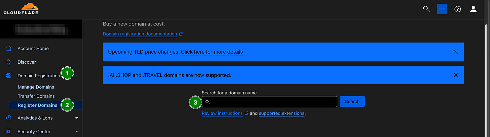](images/4b992dec-545f-42f2-935c-3735d309d13d_3004x844.png)

Pick out your perfect domain and go ahead and buy it. This process should be fairly straight forward, and by the end of it, you’ll be able to go to **Manage Domains** in the sidebar and see the domain you purchased.

[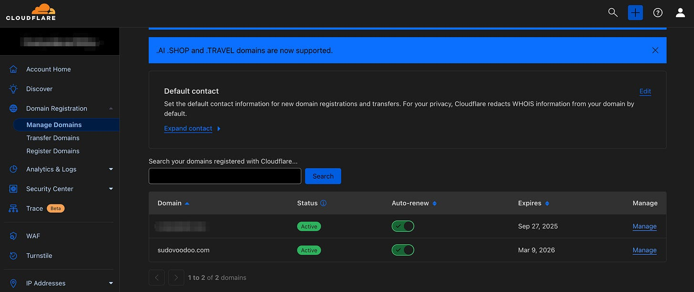](images/894cf57c-3d18-4948-8ef7-9d1fea4e945c_2964x1250.png)

Once you have that, great! We’re going to come back here later to tie our Azure Web App to our new domain.

### Setting up Source Control for the Site

Start by installing the following programs if you don’t already have them on your computer.  
[Visual Studio Code](https://code.visualstudio.com/)

[Github Desktop](https://desktop.github.com/download/)

Next, you’re going to need a [GitHub](http://www.github.com) account. Go to the website and create one. Once you’re there, click on the + icon in the top right and click **New repository**.

[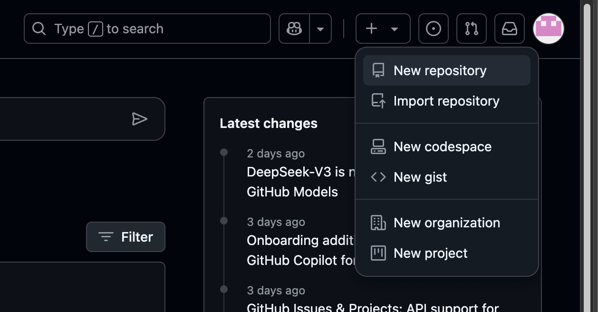](images/577d733f-6e6c-4d3f-98a0-dafd2350453a_1258x656.png)

On the Repository settings, I normally just name it after my website and leave everything else as the default (expect making it a Private vs Public repo. Choose whatever you think is best). Once the repo is created, you’ll get some information on how to connect to it. Click on the **Set up in Desktop** button. This should open the Github Desktop app. From there, click the clone button to add this repository to the Github app. Next, with your repository set in the top left, go ahead and click the **Open in Visual Studio Code** button.

[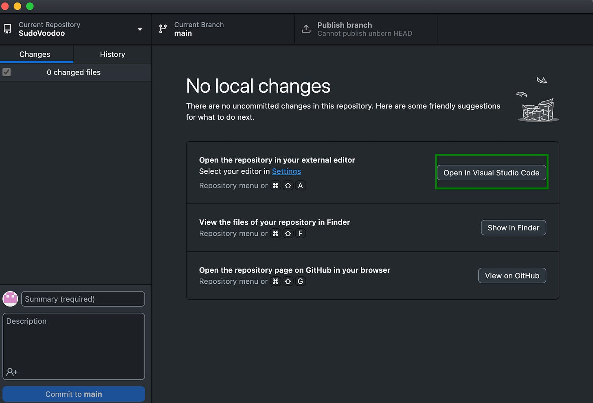](images/ae792792-a6d3-4469-b715-532fa9f2d5f1_1906x1296.png)

In Visual Studio, you’ll now see the your Repo’s name under your open folders.

[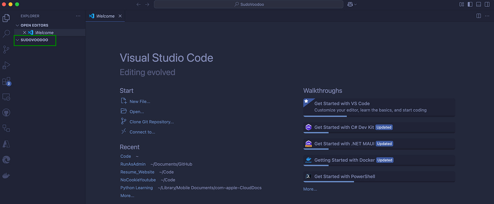](images/c48c3727-f7db-47a1-9384-a960222156fb_3010x1244.png)

### Actually creating the site and applying the changes to our Repo

There are lots of different options on how to proceed. If you’re familiar with HTML and CSS, great! Go ahead and make your resume to your liking. If you’re new to web design, there’s lots of great resources like [w3schools.com](https://www.w3schools.com/html/default.asp) . Since this is my second go around on it, I’m having ChatGPT generate me a basic resume website. You can find my website template [here if you want to use it yourself](https://github.com/bradywidener/ResumeWebsiteTemplate). Don’t forget, this challenge is about learning as well as the end product! If you use the template I provide, personalize it and tweak it to fit yourself so it fits your style.

[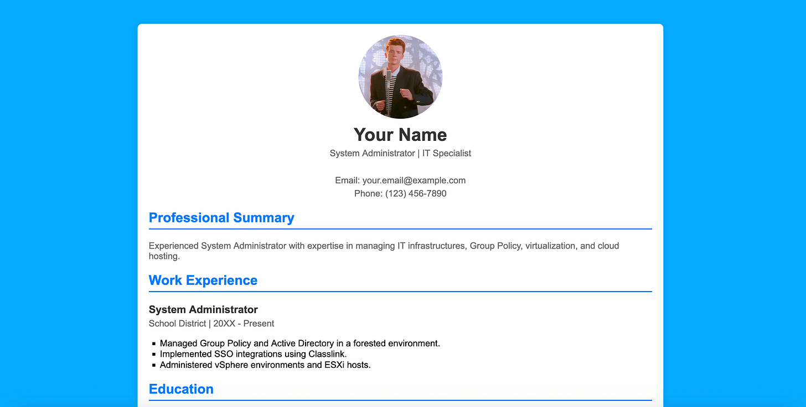](images/6ed70879-6068-4fb3-895f-d74fdf02c8c9_2876x1456.png)

Once you have your webpage files, make sure the files show up in VS Code under your repository. If they do not, you can drag and drop them there. Make sure your home page is named index.html.

[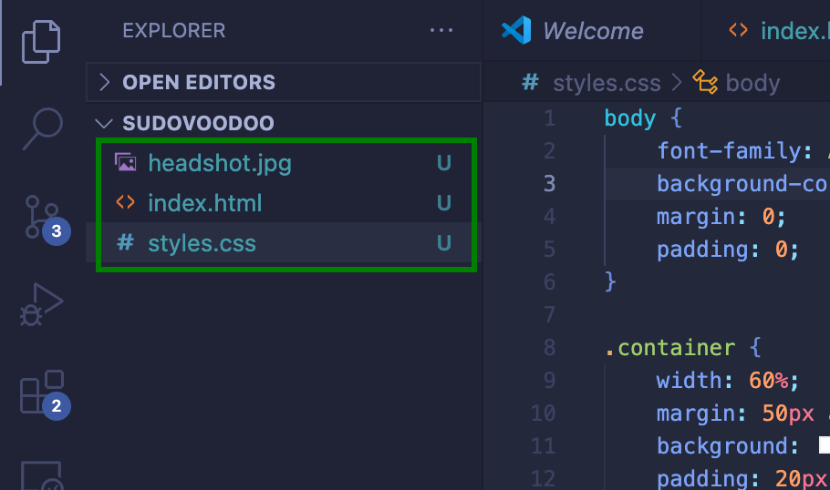](images/a25e83af-faed-4fd8-aa73-50ab938b424f_910x538.png)

Now, lets go back to Github Desktop and you should see the new files on the left side bar. In the bottom left, save our changes to the main branch by adding a summary and then clicking the **commit to main** button.

[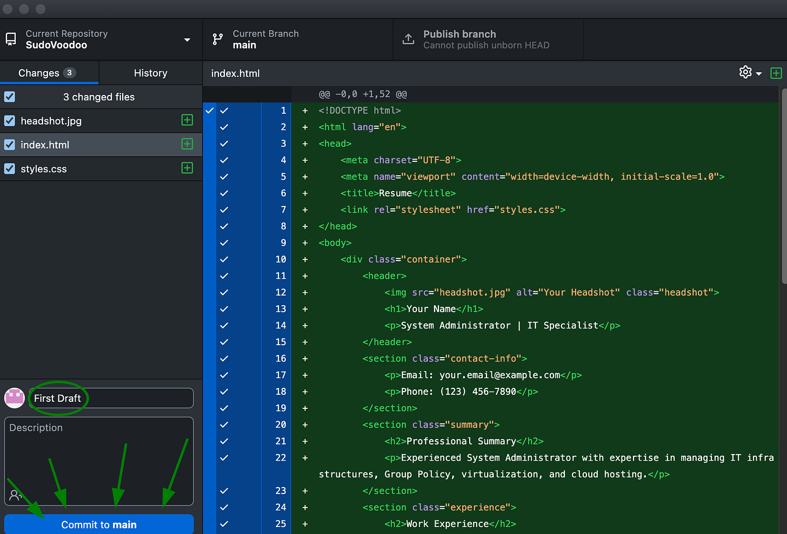](images/e20ca3c1-8994-42e7-ab23-971f308ee474_1900x1292.png)

Lastly, click the **Publish branch** button in the top right to upload the changes to the GitHub Repository. I would go to github.com after this and verify you see the files under that repository now.

[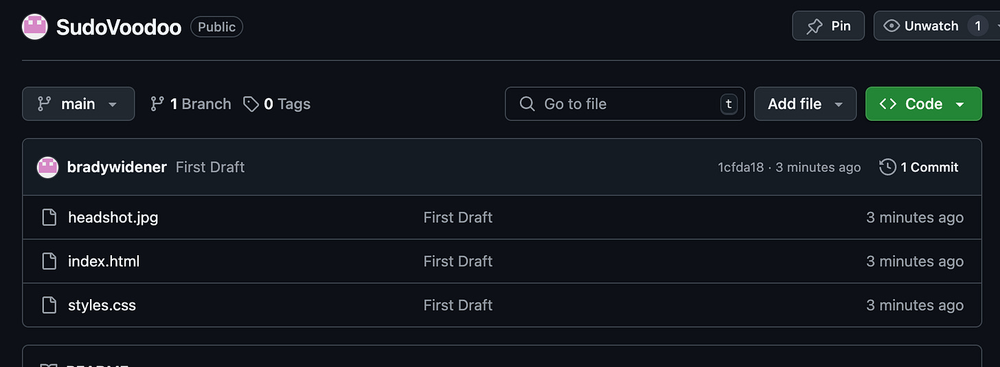](images/dacd1aae-3739-42d5-b43e-abc299e571a6_1866x686.png)

### Next, let’s go to Azure

Go to [Azure](https://portal.azure.com) and create your account. If I remember correctly, when signing up for an azure account, they go ahead and ask you for billing information and to set up a subscription. I went with the Pay As You Go model.

Once you have an account, search for **Resource Groups** in the search bar at the top. Resource Groups are effectively folders for organizing your cloud resources. Let’s go ahead and create one for our project.

[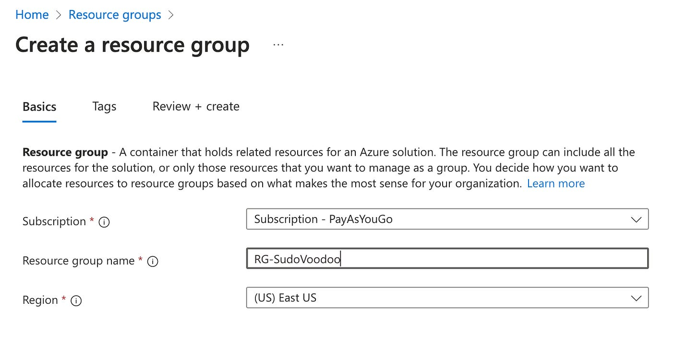](images/089df7cc-e86b-4eb2-9c32-c83498bde2ec_1562x772.png)

Next, search for **Static Web Apps** in the top search bar and click on the option that comes up. On the Static Web Apps page, click the Create button.

You will be asked to give a name to your web app, choose a resource group for it, etc. etc. For plan type, choose Free. After this, you will see an option called **Deployment details**. Here we are going to link our GitHub account to our Azure account so we can have Azure check our GitHub repo for changes to the webpage.

[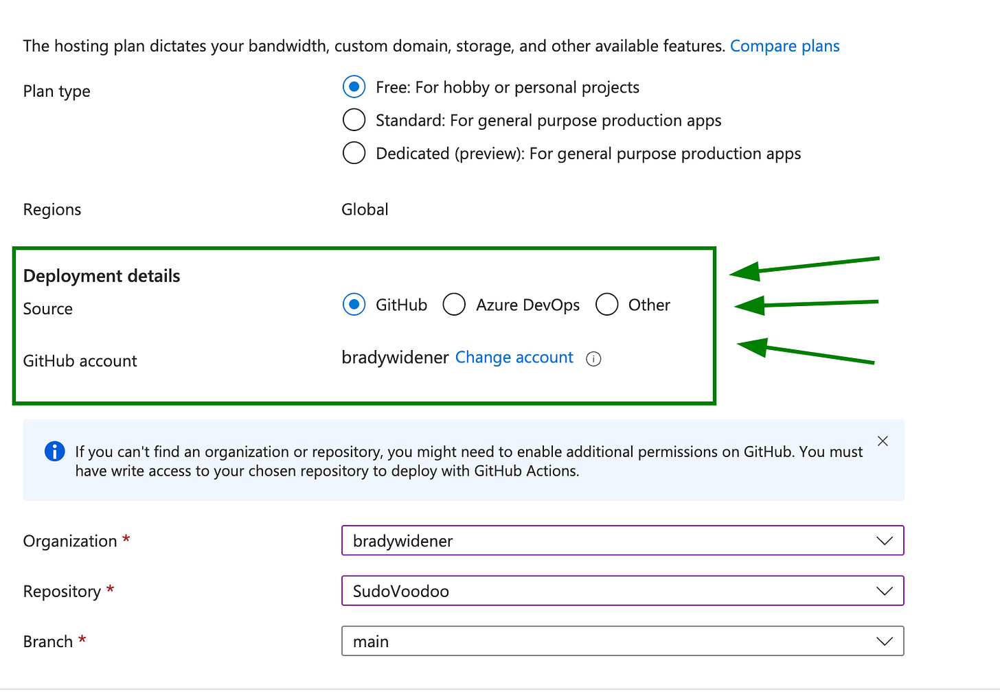](images/f6ea5f6f-e98a-4d30-920a-cc7cea613860_1570x1100.png)

If you have anything come up under Build Details, just leave those as default, and click the Create button in the bottom left. After a few moments, it should retrieve the information for your web page and give you an option to go to the resource. Do this, and you should see a crazy looking URL in the top right. Click on this and you should see your webpage (it’ll take a few minutes to apply. You can check the status using the Deployment History option at the bottom of the page).

[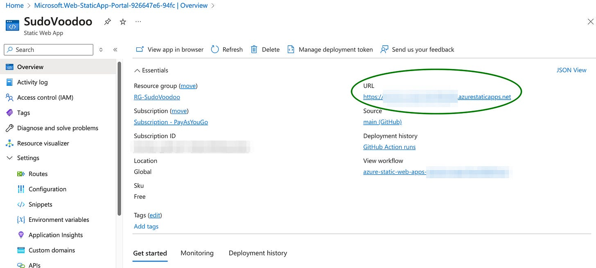](images/3dc50874-0356-4fc9-b49a-2375dabf5af4_2492x1122.png)

[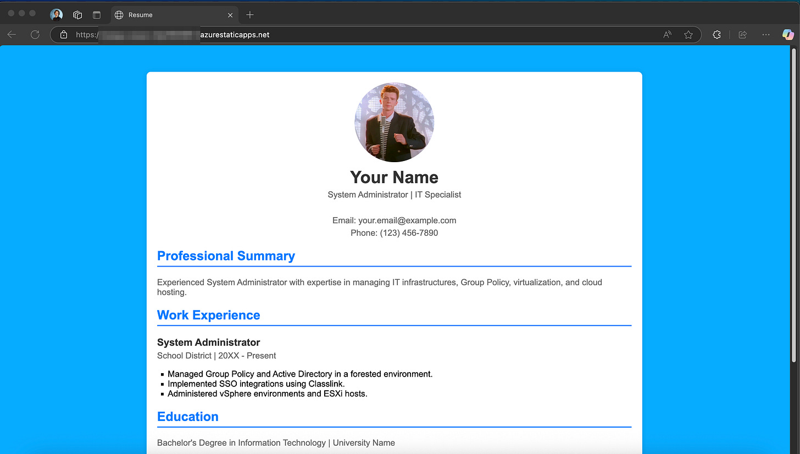](images/b0e869e6-f24e-4893-a8a9-77c13249019d_3012x1708.png)

### Adding the Custom Domain

To add your domain instead of the using the crazy one Azure gives you, scroll down on the Static Web App page and you should see a button to add a custom domain.

[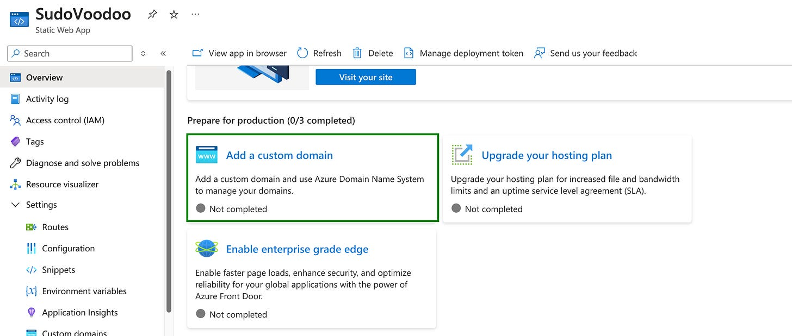](images/b0a5c65d-15ab-4449-b2fa-673eb0194d54_2368x1006.png)

From here, click the Plus icon in the top left and choose the option for ‘Custom domain on other DNS’.

[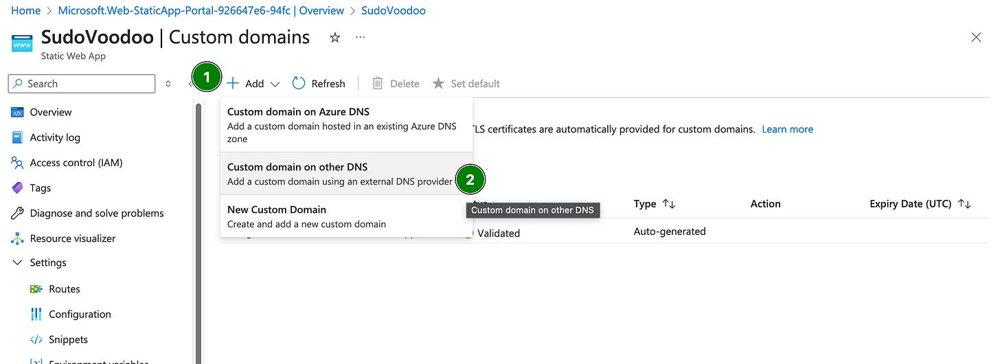](images/d45a0ed8-59ac-4351-9c2e-0c2d8ed7e1e5_2534x922.png)

From here you will be asked for your domain name, and then it’s going to give you a TXT record to add to Cloudflare under our domain. Go ahead and copy this TXT value.

[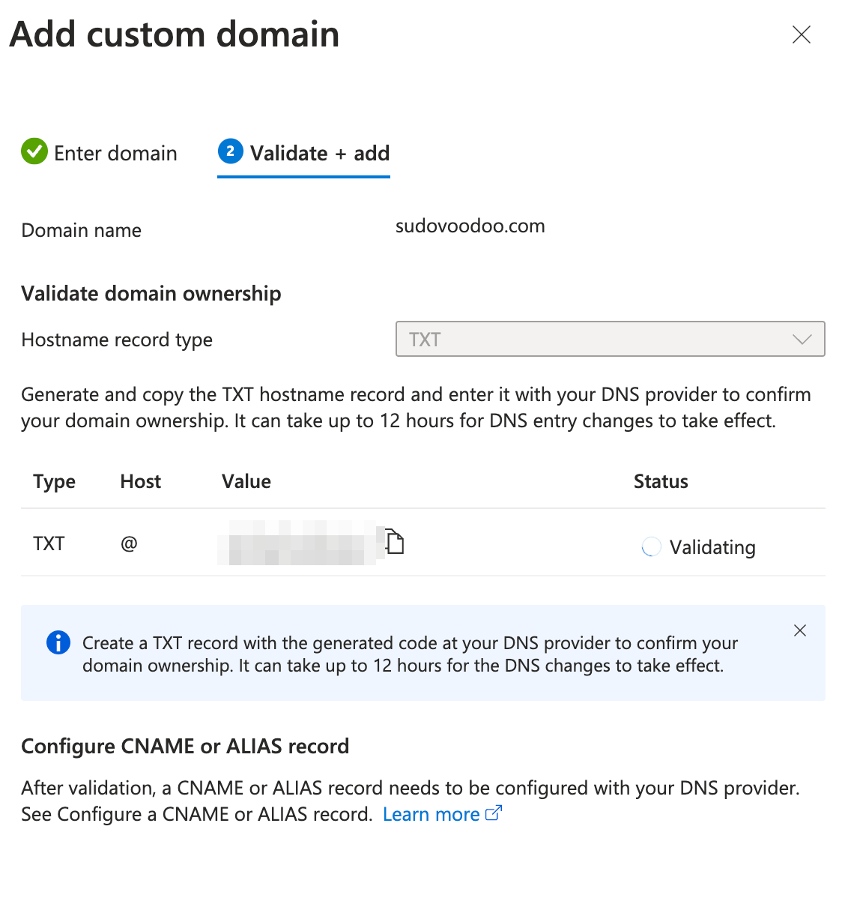](images/c93dc60b-3593-427b-876d-291701c03c4c_1136x1214.png)

Open up Cloudflare again and go to **Domain Registration > Manage Domains >** and click the **Manage** link beside your purchased domain. After this, click the **Update DNS Configuration** on the right.

[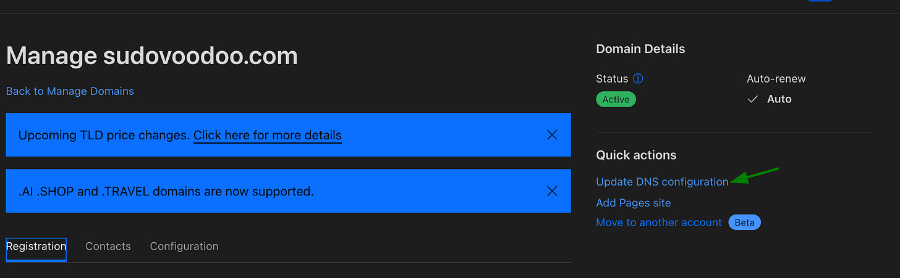](images/18fa8e10-cdbd-4fd3-b1e2-8b51917fd388_2298x712.png)

Scroll down and you should see a spot where you can add a DNS record.

[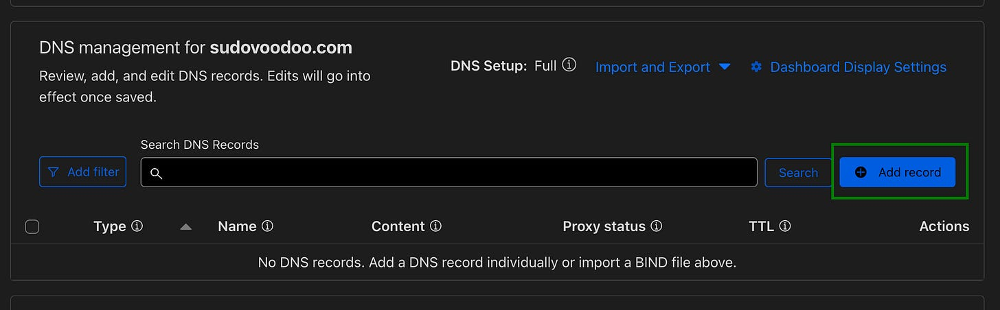](images/c2a185c9-aff9-44e8-8234-956ce32f77cd_2270x704.png)

Choose the following options and add the value we copied from Azure earlier for the content.

[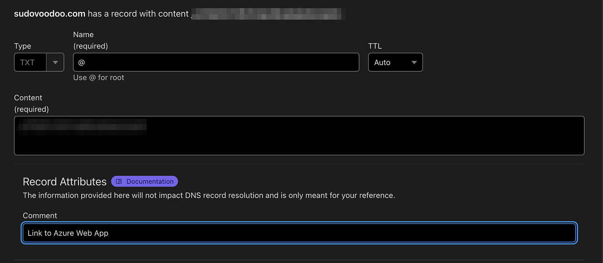](images/030ea469-7f22-4dc1-9914-ccfb7bf94064_2198x962.png)

Once you have saved the new DNS record, return to Azure. It will take it a while, but it should eventually validate that you own the domain name and allow you to use it for your web app. For me, it took like 30 minutes before it finally said Validated. While we’re waiting, let’s go ahead and create two more DNS records. One that redirects all traffic that goes to that Azure URL to our new custom domain, and one that redirects the www subdomain of our website to the same page. When adding these entries, be sure to turn the Proxy status on the side to Off.

[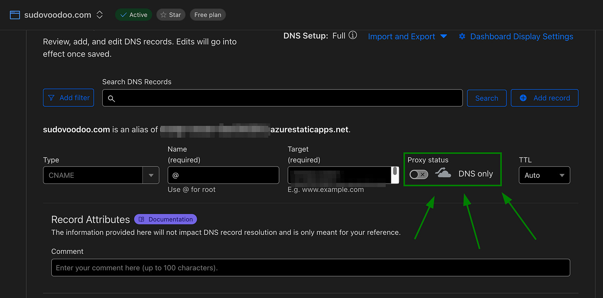](images/644bdf31-9e16-42dc-8e5f-323e8aa63a53_2342x1160.png)

[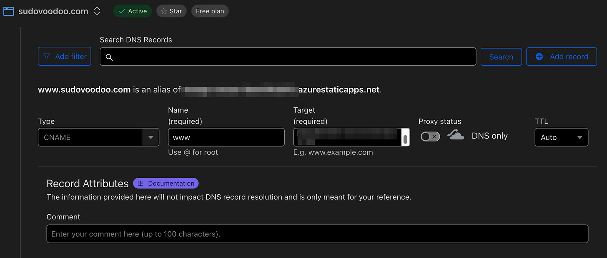](images/ba0ac7c3-3f01-4ecc-a4cc-5d322142e95d_2258x962.png)

(These entries make it to where someone can type in sudovoodoo.com OR www.sudovoodoo.com and they’ll both take them to our site.)

After some waiting and refreshing, your website should eventually show on your custom domain.

[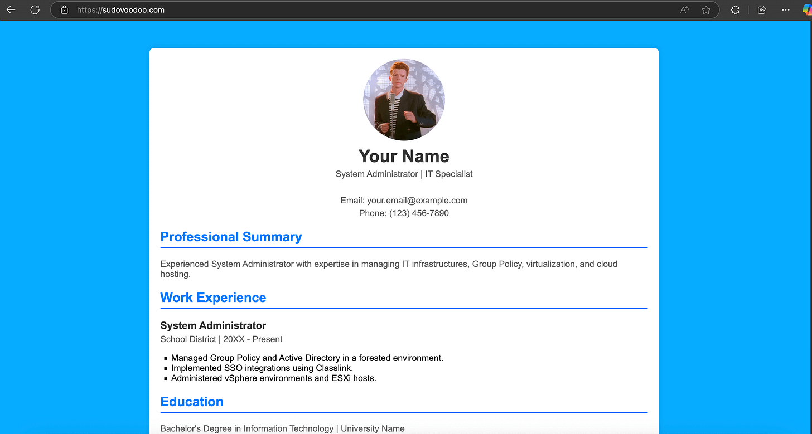](images/d4fa588a-f90a-4c63-a520-208edc783fa4_2976x1592.png)

### Making the Custom Email Address

As mentioned before, I’m going to do this with iCloud as I’m already paying for that service, as are many others. Under the Costs section, I mentioned a couple of alternatives. I haven’t used these myself, but I imagine the process for setup will be similar.

First, we’ll need to go to [iCloud.com](http://www.icloud.com) and sign in with our account. Click on your profile icon in the top right, then iCloud Settings. On the next page, click the **iCloud+ Features** button. Here you’ll see a spot for Custom Email Domain.

[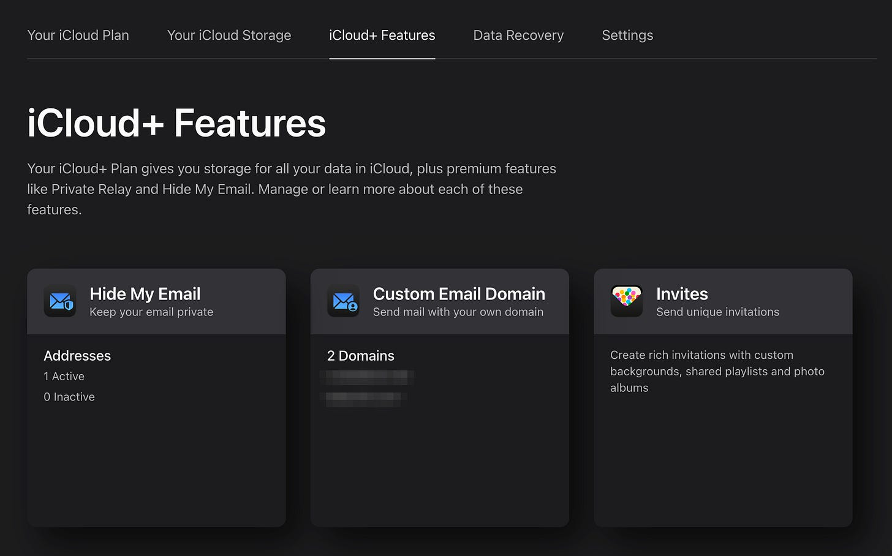](images/b56686ab-d8ba-4963-8ac1-a12312ec19a6_2172x1354.png)

Go ahead and click this, then the option that says **Add a domain you own.** Here you can choose whether the domain is just for you or if you’d like to create multiple accounts for the domain. You will then be asked what your domain name is and ask if you have **existing** emails already under that domain. Since we don’t have existing emails, we can skip this, and then click the **continue** button.

[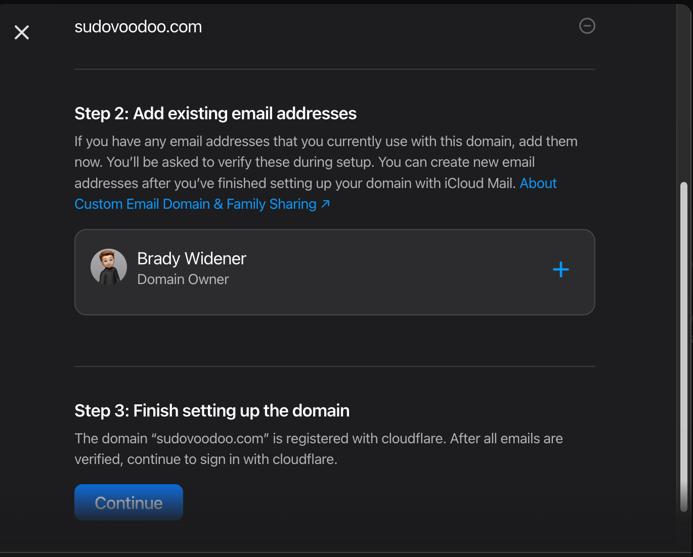](images/7d5dbbfe-1831-45f2-8ca0-5468e43b856f_1370x1102.png)

This will open up cloudflare in a small window. Sign in and it will ask if it can automatically add the DNS records needed to make this work. If you use another DNS provider, it’ll give you instructions to manually add these.

[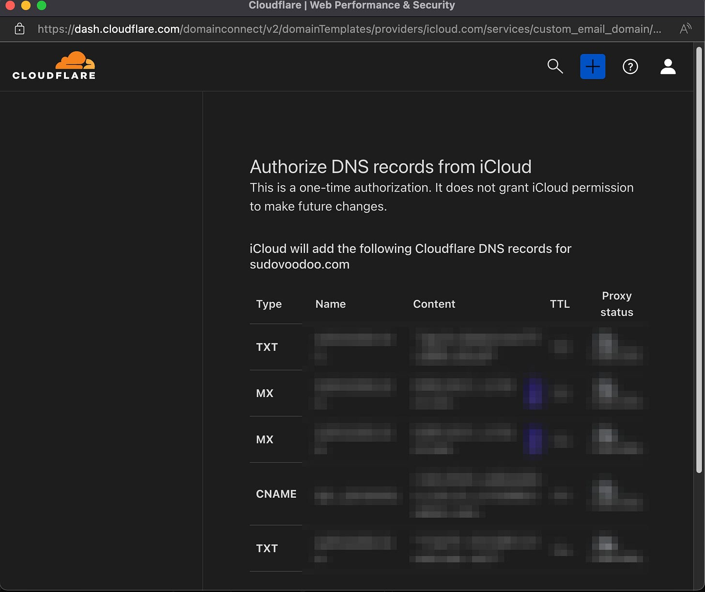](images/397a45f1-d293-42d7-acf4-3d61bdc5cd5c_1798x1512.png)

After this click OK and it will work on verifying your domain. This takes a few minutes, but once it does, you should be able to open the Custom Email Domain settings again and add an email address.

[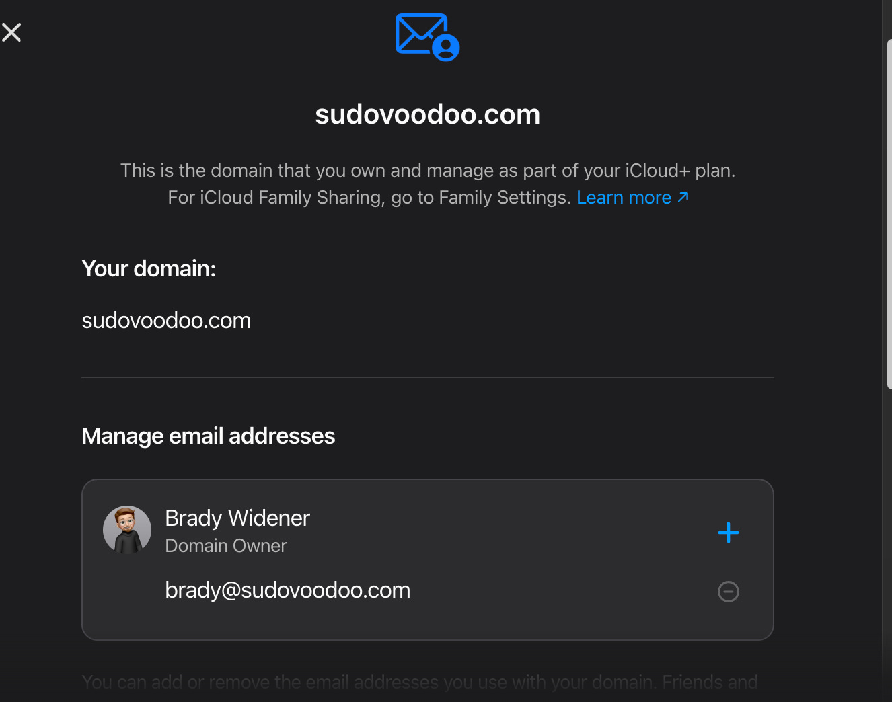](images/48712882-b34a-4273-a229-cec5fb1dfd23_1326x1044.png)

After this, go to mail in your iCloud account, then go to the settings. Make sure you see your custom domain added. Here you can also add those email addresses as your ‘send from’ addresses.

[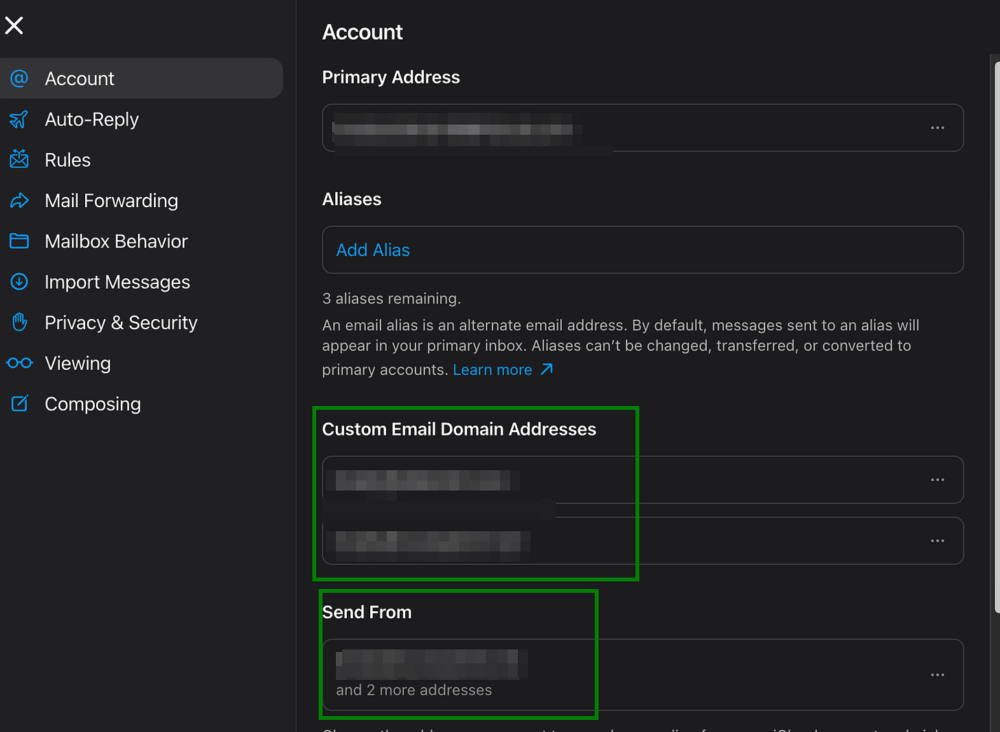](images/ef1d1484-a208-461f-8346-a9bb52be21db_1572x1152.png)

Now, all emails sent to our custom address should be accessible in our iCloud Mailbox, and we now have the option to send emails from that address as well.

### Closing notes

Now, aside from having a new professional email address and resume website, you also have some new skills to add to your resume! Specifically, you have done the following:

- Worked with Cloudflare for website hosting.
- Worked in Azure, Microsoft’s cloud platform.
- Developed a website in HTML and CSS
- Used Source Control and Github for file management on your website

Nice! Now if you want to update your website, simply open GitHub Desktop, open that repository and click the option to open it in VS Code, edit your site as needed in VS Code, then go back to GitHub Desktop to commit to main and sync changes.

One last tip, now that you have a resume website, put it EVERYWHERE. Add it to your LinkedIn profile, put a QR for it on your paper copy Resume’s, add it to your business cards, make it your BlueSky handle, do all the things to potentially get employers to see it.

Happy Hunting!
