# RustDesk: Moving Beyond TeamViewer

[](images/532088e6-e009-48b6-9901-e3b1754d8319_1024x1024.webp)

There was a time when TeamViewer was the go-to tool for remote access and IT support. It was easy to use, widely available, and—let’s be honest—one of the only decent options out there. But times have changed, and so have my feelings about it.

Now? I loathe it. Between the constant connection issues, the aggressive licensing nags, and the ever-growing list of security concerns, TeamViewer has gone from a useful tool to a never-ending headache. So that begs the question… what will take it’s place?

Over the past few years, I’ve tinkered with other remote access options, usually landing on Apache Guacamole as my favorite. However, it’s not as versatile for ad-hoc connections, and sometimes it’s just buggy. Like printers, Guacamole can usually smell the stress and tell when something is important or time sensitive, and it usually picks those times to have trouble connecting.

Thus, the search for a solid remote access tool has led me on a hunt for a tool that checks all these boxes:

- easy to set up and maintain
- can provide unattended access
- requires MFA
- can be used on-prem or off-prem
- open source
- cross platform
- useful for remote support in addition to remote access

The winner of this search?

## [RustDesk](https://rustdesk.com/)

[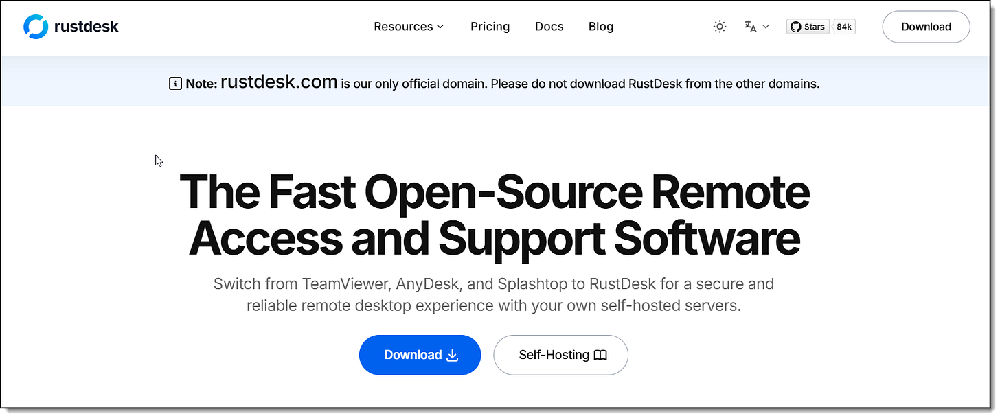](images/1362c825-cabc-49af-8baf-95dd61073f84_1615x675.png)

RustDesk checks off all the elements of my criteria, with the added bonus that it’s self-hosted. Let’s get started!

## Download and Install the RustDesk Client

To start out, select a computer you want to access remotely, and a computer you want to use to access that computer. On each one, download the latest stable RustDesk client from the official RustDesk Github repo at rustdesk/rustdesk ().

Once you have the clients downloaded and installed, the next question to ask yourself is…

## Cloud or On-Prem?

There are several ways you can do this, but for my solution, I’ll be hosting the RustDesk Signaling Server and Relay Server in a public cloud virtual private server on Linode. If you haven’t used Linode before, [score a $100 credit from my referral link here](https://www.linode.com/lp/refer/?r=49850bdb651dd7b02402081bdfef8fb8499a5893). If you don’t want to go this route, you can install on a local server and set up port forwarding so it can be accessible from the internet. I haven’t tested it yet, but in theory, I believe the same result should be possible using [a Cloudflare tunnel as described in our previous article here](https://www.edtechirl.com/p/using-cloudflare-to-expose-local). Additionally, if you only want to access it from your LAN, you can just spin up the server on your network. The steps for that are similar, just on a local server instead of in the cloud. Linode, however, is probably the quickest and easiest way to get this project up and running. In terms of cost, it’s not too bad because we can use the cheapest Linode VPS that’s $5/month.

*BILLING NOTE: With Linode, even if you power off the server, monthly billing will continue until the machine is deleted.*

## Setting up a Cloud Server

In Linode, click on +Create and select Linode:

[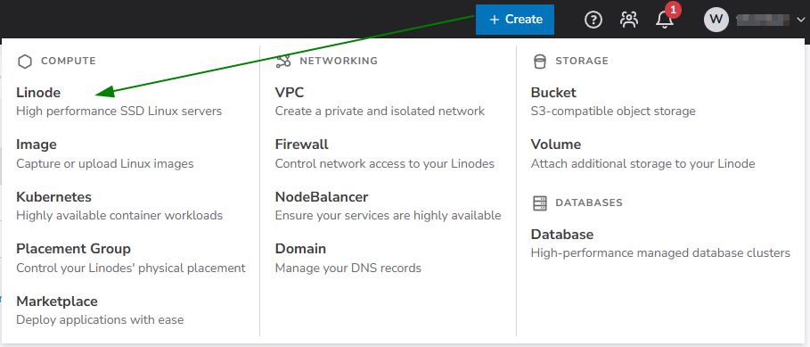](images/64cd9c84-ee37-4b0d-9730-78acb4085834_909x389.png)

On the Create screen, select a region close to you, select the most recent LTS version of Ubuntu Linux, and select the $5/month Nanode from the Shared CPU tab. Depending on the size of your deployment and number of users, you may need to upgrade to a more robust plan, but this is a great place to start.

[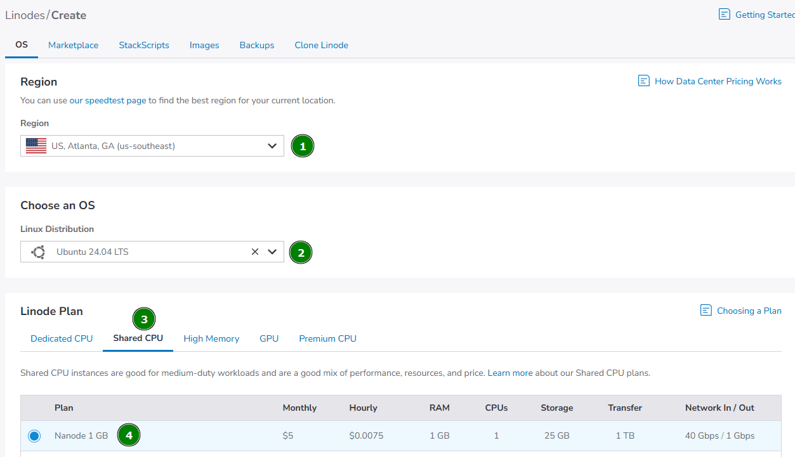](images/53b2acde-22e8-4ce5-b48f-5e849036de36_1253x721.png)

Next, name your server and add any tags if you’d like, then set the root password. Be sure to make a note of this.

[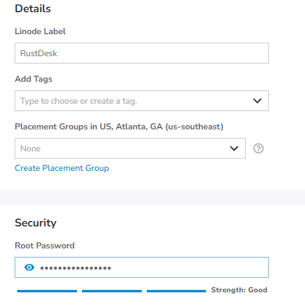](images/35b3307b-8155-44c1-a4c7-e685c7d4b389_499x503.png)

Then, click “Create Linode”

It will take a few minutes to spin up the virtual machine. Once it does, we’ll be installing Docker.

## Connecting to Your Server

Once your server is Running in Linode, your Public IP Address will be displayed. Make a note of your IP… mine is 45.79.200.147 (don’t worry… this machine will be deleted before I publish the article). Next, open the terminal on your computer and connect to the VM via SSH using this command:

```
ssh root@45.79.200.147
```

You’ll then be prompted to continue connecting, and then prompted to enter your root password:

[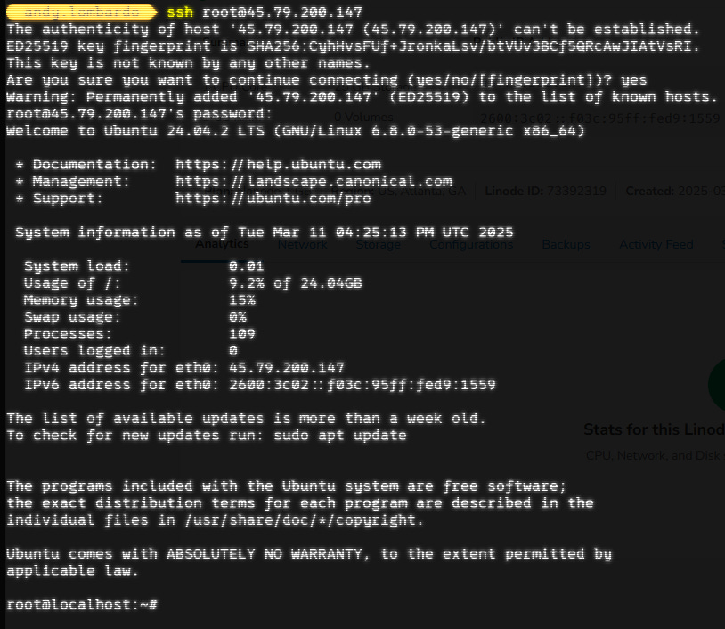](images/3930676f-fa12-483c-b964-2118feb83b6b_814x706.png)

Next, run the following command to update your server and repositories:

```
sudo apt update && sudo apt upgrade -y
```

## Docker Install

Now that you’re at the command line of your new, freshly-updated server, we’re going to install Docker. Docker is a platform that allows you to load pre-bundled applications into a nice, tidy package called a container that has all the resources necessary for the application to run.

First, go to the [Docker Install page for Ubuntu found here](https://docs.docker.com/engine/install/ubuntu/) (**or copy the code below**) to set up Docker’s apt repository:

```
# Add Docker's official GPG key:
sudo apt-get update
sudo apt-get install ca-certificates curl
sudo install -m 0755 -d /etc/apt/keyrings
sudo curl -fsSL https://download.docker.com/linux/ubuntu/gpg -o /etc/apt/keyrings/docker.asc
sudo chmod a+r /etc/apt/keyrings/docker.asc

# Add the repository to Apt sources:
echo \
  "deb [arch=$(dpkg --print-architecture) signed-by=/etc/apt/keyrings/docker.asc] https://download.docker.com/linux/ubuntu \
  $(. /etc/os-release && echo "${UBUNTU_CODENAME:-$VERSION_CODENAME}") stable" | \
  sudo tee /etc/apt/sources.list.d/docker.list > /dev/null
sudo apt-get update
```

Paste that block into your server’s terminal and hit enter, and it will do its thing:

[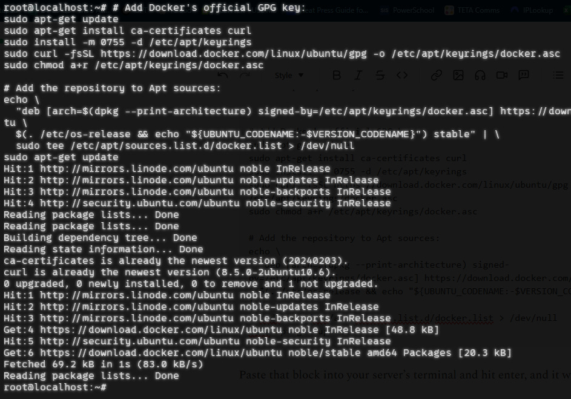](images/aa9cfdd9-248a-4322-8831-d2e9f7cb70d6_943x659.png)

Next, you’ll copy and paste this command (also from the Docker Ubuntu install page linked above):

```
sudo apt-get install docker-ce docker-ce-cli containerd.io docker-buildx-plugin docker-compose-plugin
```

After that runs, you can test to make sure Docker is running with this command:

```
sudo docker run hello-world
```

If successful, you should see:

[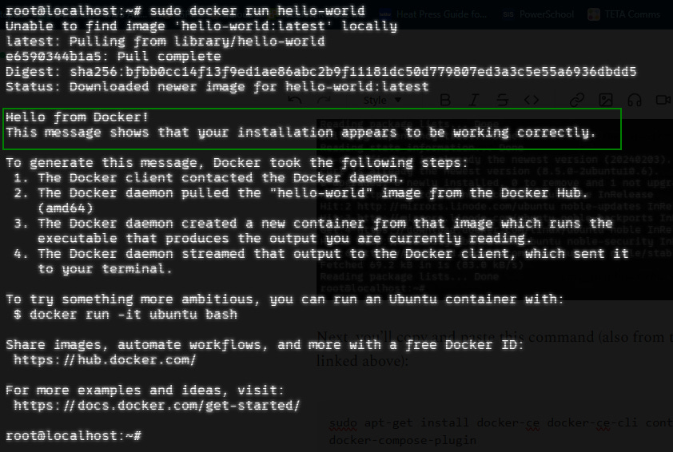](images/2df0a140-9c1c-4aa1-a37f-37de712c1224_842x566.png)

## Setting Up RustDesk Servers

Now that Docker is up and running, installing RustDesk will be SIMPLE. There is a documentation page available from [RustDesk here](https://rustdesk.com/docs/en/self-host/rustdesk-server-oss/docker/) that outlines the install process with Docker.

On your RustDesk server, we’re going to make a rustdesk directory where we’re going to put a yaml configuration file:

```
mkdir rustdesk
```

now navigate to the directory:

```
cd rustdesk
```

and create the yaml file:

```
nano docker-compose.yml
```

[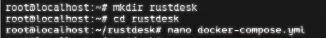](images/4b3fb1fe-37f4-4e5f-927c-63359335ddc5_543x64.png)

This will open a Nano window like below. Paste the following text into Nano, and then save and exit by hitting ctrl-X then Y then Enter.

```
services:
  hbbs:
    container_name: hbbs
    image: rustdesk/rustdesk-server:latest
    command: hbbs
    volumes:
      - ./data:/root
    network_mode: "host"

    depends_on:
      - hbbr
    restart: unless-stopped

  hbbr:
    container_name: hbbr
    image: rustdesk/rustdesk-server:latest
    command: hbbr
    volumes:
      - ./data:/root
    network_mode: "host"
    restart: unless-stopped
```

[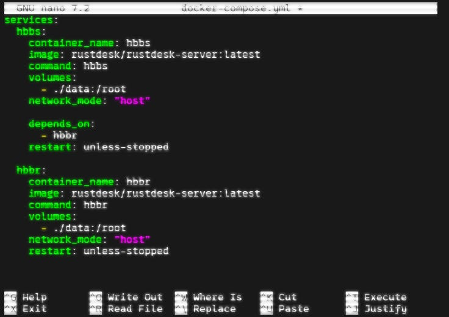](images/72ee7bbb-a4fa-419c-94f6-c37ad0a8ac1e_736x521.png)

This yaml file is basically telling Docker to download the rustdesk-server image and spin up two containers for RustDesk - HBBS is the Signaling Server, and HBBR is the relay server.

To get Docker to create the containers, we need one last command:

```
docker compose up -d
```

In just a few seconds, the images should download and start:

[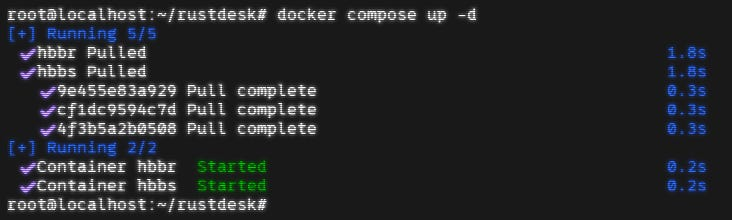](images/350b30b4-d7d3-4a64-a006-ab5d2972f9d0_732x220.png)

## Connecting the RustDesk Containers to the RustDesk Client

Now that we have the RustDesk clients downloaded and the RustDesk servers are running, we need some information to be able to link the two. While still SSHed into the virtual machine in the rustdesk directory, change directories to the data directory.

```
cd data
```

Inside the data directory, run the ls command and there should be a .pub public key file. Run the cat command to view the key:

[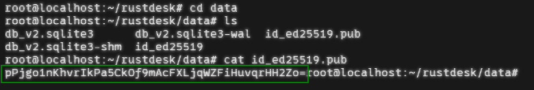](images/7b033d6d-8af2-4bea-a516-15e2626ca44a_780x132.png)

You will need to copy the part of the key that comes before your username. For the example above, the key is:

```
pPjgo1nKhvrIkPa5CkOf9mAcFXLjqWZFiHuvqrHH2Zo=
```

You’ll also need the server’s IP address. If you are using a Linode server, it’s the same IP you used to initiate your SSH session. If you’re not sure, you can run the ifconfig command to see what IP is attached to the eth0 interface

```
ifconfig
```

[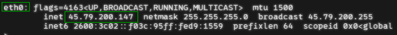](images/27302d8a-8cfa-4be1-accc-7efa2ca6962d_795x72.png)

Now that you have the public key and the IP address, we’re ready to connect the server and the clients.

## Configuring the Clients

Open the client and click on the 3 dots next to the ID:

[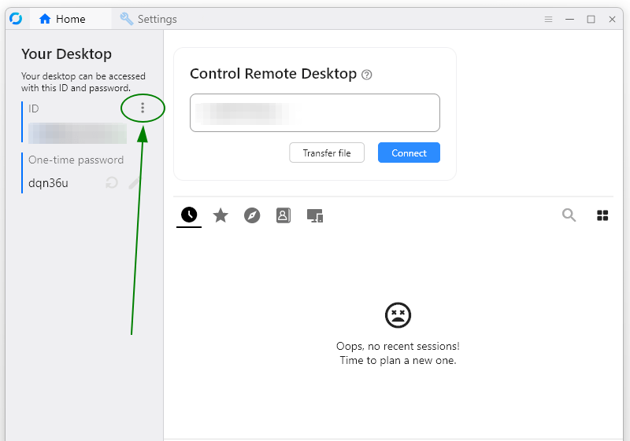](images/1c5e2316-70a3-4192-af88-56a8aa838d7a_800x561.png)

Then, select Network → ID/Relay Server

[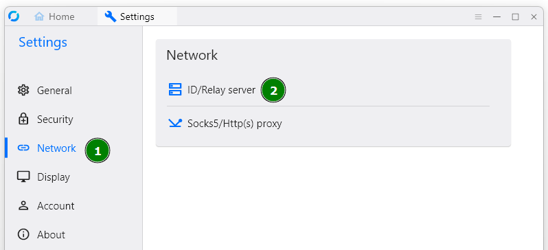](images/221e893e-0f7c-4a09-a1e4-db715b54073b_798x364.png)

Next, enter the IP address of your Docker server in the ID Server field and the Relay Server Field. Then, enter the public key in the Key field.

[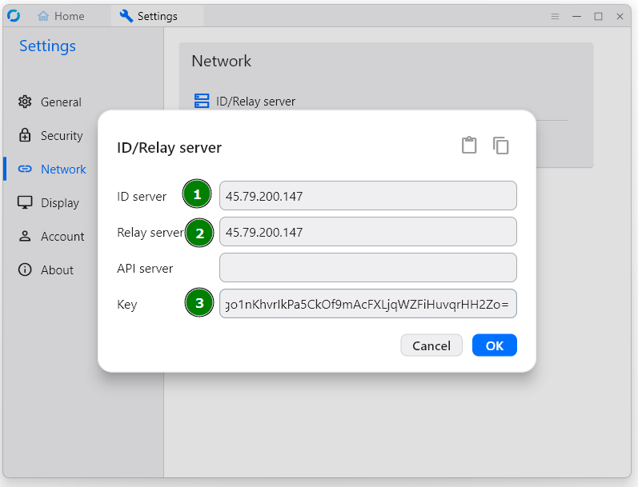](images/b37a18a9-639f-48c1-ad77-3197340033d7_797x609.png)

Repeat this process on any other devices that you will be remoting to or remoting from. This step tells the client to make connections through your RustDesk servers.

When finished, the bottom of your RustDesk screen should show this Ready indicator:

[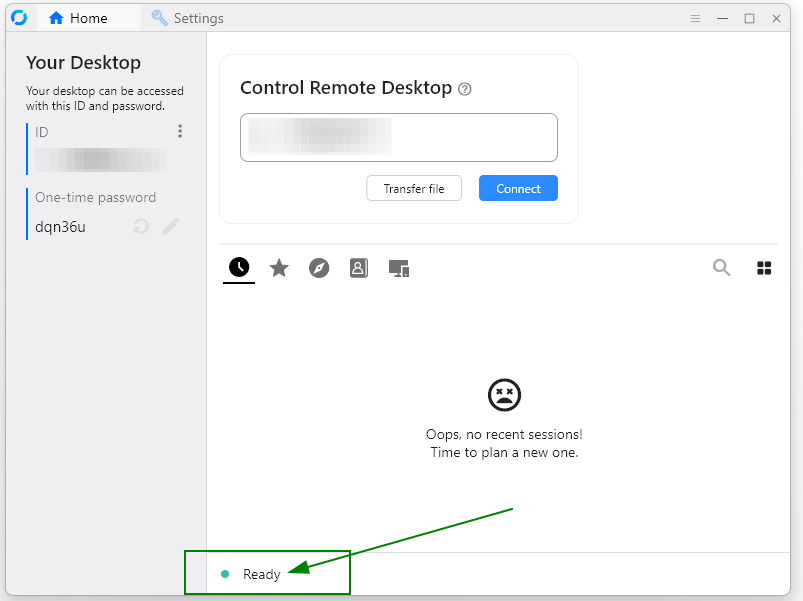](images/8439d79d-fe51-44bc-a0ff-fb74cab42e25_803x601.png)

## Take It for a Spin!

Once you have the clients configured, getting them to talk is relatively easy, and if you’ve used TeamViewer before, it will be very intuitive.

By default, each client has an area that displays an ID and a One-time password. To connect, simply enter the ID from the device you want to remotely access into the “Control Remote Desktop” box in RustDesk on the device you’re using to connect to the remote device.

[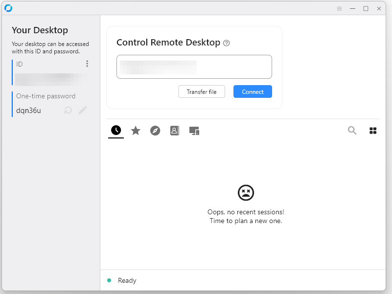](images/e8100bf4-5fed-4f4e-9b69-b58f80282b07_801x601.png)

When making the connection, you’ll be prompted to enter the RustDesk password for the device, which by default is the One-time password displayed in the RustDesk client, though you can optionally configure a persistent password that can be used for unattended access.

[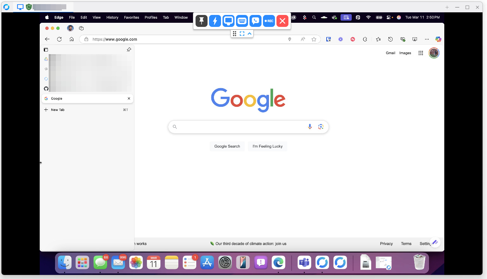](images/e2ed241c-fb65-4cd7-8cfa-cf94f8536d38_1300x747.png)

Note: The first time connecting to a Mac, expect to have to set a handful of permissions to allow connection and remote control, but you’ll be prompted for those changes as needed.

Now that the servers and clients are configured and connected, the next suggested step is to enable MFA.

## Add MFA

To configure MFA, click on the 3 dots next to ID again, and this time select Security.

At the top, there will be a banner to click on to **Unlock security settings**. You’ll be prompted for admin rights to be able to access the settings.

[](images/c64e4068-88e7-41b5-b1dd-84ca9d2f6b34_534x47.png)

Once Security settings are unlocked, scroll down to 2FA and check the box.

[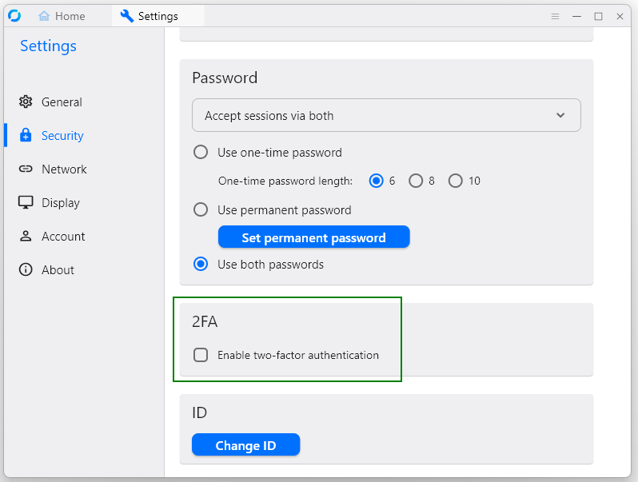](images/39b4872d-03c6-4d5e-ba88-4a42997b925e_798x603.png)

*Note that the section to set a persistent password is directly above the 2FA settings.*

You’ll then be prompted to set up MFA using any standard authenticator app:

[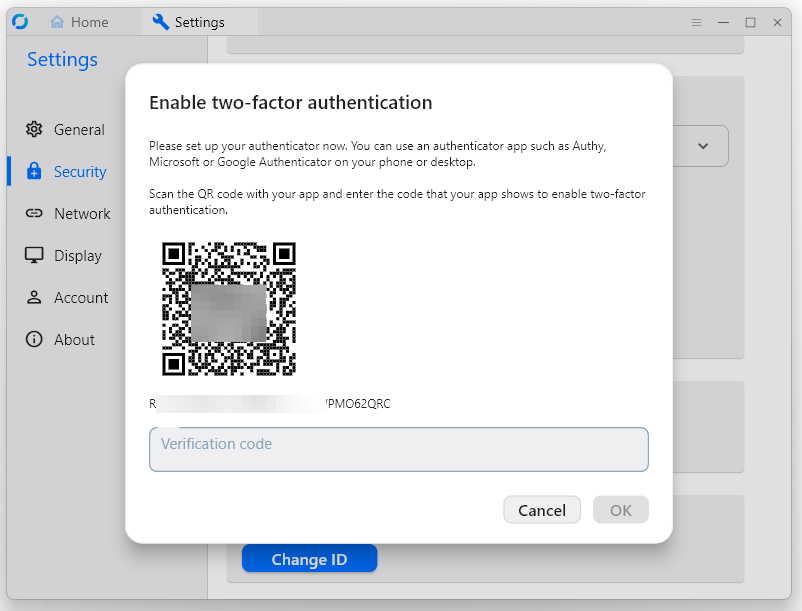](images/8d339c14-fc82-4749-a221-1939fb9fc1e8_802x611.png)

## Other Notable Features to Explore:

### Session Recording

Under the “General” settings tab, you can configure RustDesk to automatically record all incoming sessions and/or all outgoing sessions. There is also a button to record on-the-fly at the top of the RustDesk menu bar.

[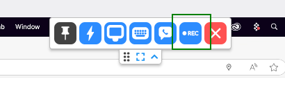](images/401b6fe6-8b6f-48ee-9555-8a411b472bae_410x127.png)

### File Transfer

If you only need to send some files to the computer, you can do so without fully connecting by selecting “Transfer file” instead of “Connect”:

[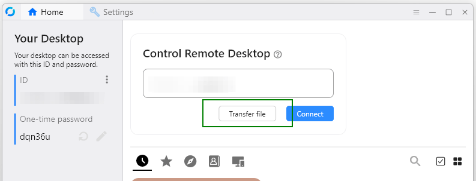](images/07c88a67-64a8-427c-b68c-b6a18ffd880e_793x303.png)

### Direct IP Access

If all the devices you’re managing are on the same LAN, and you want to avoid setting up a server, there is an option for direct connection between devices. To enable, go to Settings → Security and check the box for Enable Direct IP Access and assign a port number. Do this on all applicable clients.

[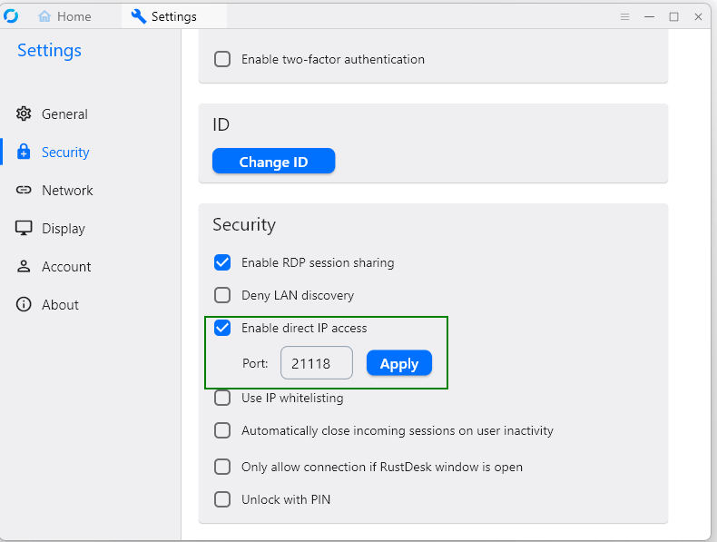](images/48fe2a14-e7f2-4790-b0ae-6b9c3d2160bc_790x597.png)

### End-to-End Encryption

There’s nothing to configure here, but when RustDesk is deployed as described here, communication is end-to-end encrypted by default, with no additional configuration needed.
