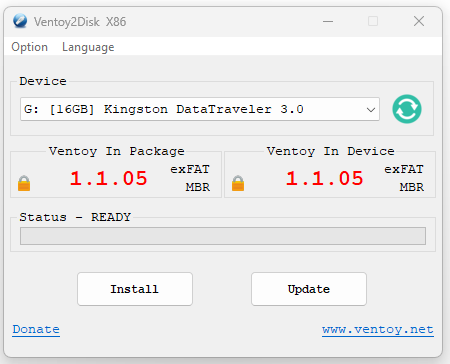
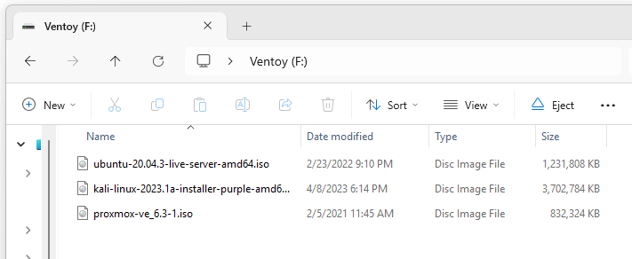
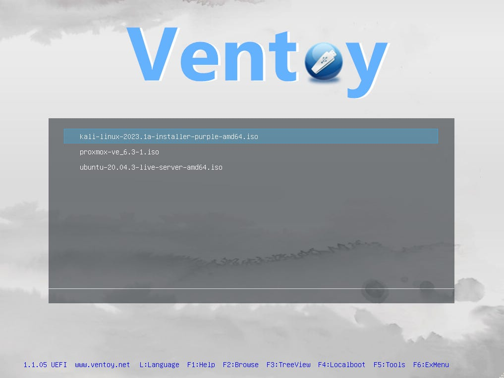
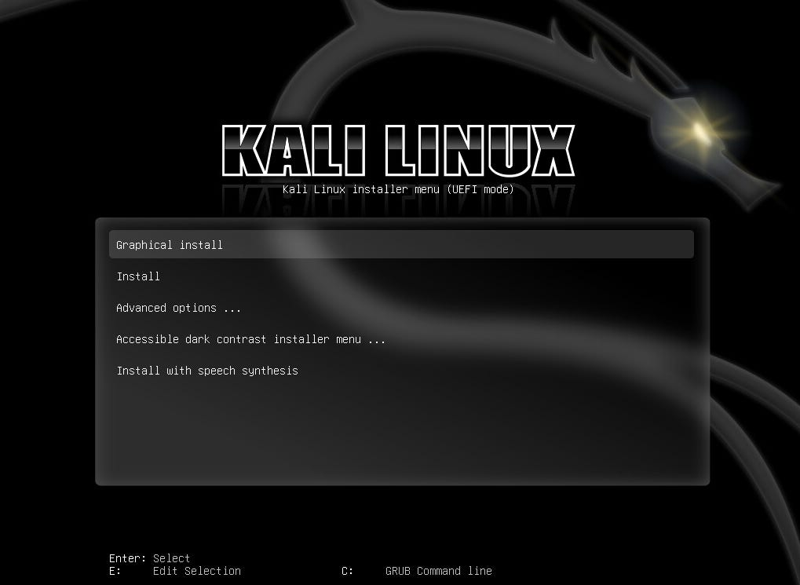

# Ventoy: Creating a MultiBoot Linux Drive to House All Your ISOs

*Level up your day-to-day everyday carry for work or homelab*

Do you collect bootable flash drives? If I dig through my desk or my backpack, I’m likely to find flash drives for the previous 4 Ubuntu LTS releases, pfSense, a few Kali drives, VMware, a ProxMox for good measure, and about every version of Windows under the sun. Naturally, none of them are labeled. To level up your USB game, it’s quick and easy to make a multiboot drive that can be used to store bootable images of all your ISOs.

## Getting Started

Whereas 10 years ago making a drive and keeping it current could be a headache, today there are a ton of tools available for making bootable USBs. The easiest I’ve found is a tool called Ventoy. To get started with Ventoy, go to <https://www.ventoy.net/en/download.html> (the direct download from SourceForge is available [here](https://sourceforge.net/projects/ventoy/files/v1.1.05/ventoy-1.1.05-windows.zip/download)) and download a zip folder with the install files. Extract the folder and run the Ventoy2disk.exe installer.

## Make Your Drive Bootable

When it launches, select your flash drive as the device and click Install.

## Add OS Images to Your Bootable Drive

After installation completes, go to File Explorer and open the flash drive. It should just be an empty folder.

This is where the simplistic beauty comes in. Just add ISOs to the folder. That’s it.

After you save the ISOs to the drive, the next time you boot to the flash drive it will give you the option to select which ISO to boot to:

Once you select the ISO, hit enter, and it will boot like a normal bootable flash drive.

***While I only used Linux ISOs for this tutorial, please note that it also works with Windows ISOs and WIM files, as well as IMG, VHD(x), and EFI files.***

## Update the ISOs on Your Drive

Finally, when it’s time to update your drive to new ISOs, just add the updated ISO files to the flash drive.

## Level Up Again

- If you want to be able to boot to an OS and maintain persistence, check out the [documentation from Ventoy here](https://www.ventoy.net/en/plugin_persistence.html). It doesn’t work for every distribution, but Kali, Ubuntu, Fedora, and other common distros are included.
- Want to do auto installation? There is [info here](https://www.ventoy.net/en/plugin_autoinstall.html) on how to use Ventoy with the unattend XML file for Windows, a kickstart script from Redhat, autoYast xml for SUSE, and preseed script for Debian without having to alter the original image file.
- You can also boot to and install through network PXE using the [iVentoy tool here](https://www.iventoy.com/en/index.html).
