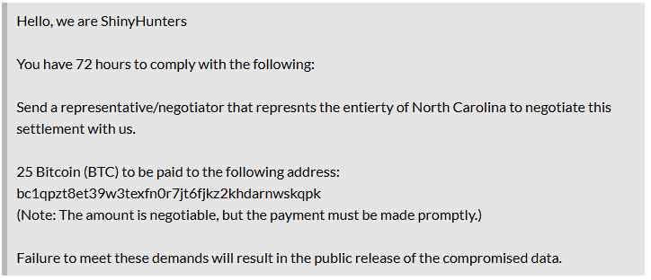

# PowerSchool Data Breach Developments

*Same Breach, Different Verse*

When PowerSchool announced in January that they had been the victim of a data breach in December 2024, they informed customers that they had paid the ransom and had witnessed the attackers deleting the compromised data. The explanation given in the PowerSchool-hosted webinar was that the attackers’ business model depended on victims trusting them to **really** delete the data in order for them to be able to viably collect ransoms from attacks in the future. Since then, we’ve all sort of been waiting for the other shoe to drop.

That shoe seems to have dropped.

Around 2pm EDT today, PowerSchool sent out notices to schools impacted by the December breach to warn them that individual school districts have begun to receive extortion demands from ShinyHunters, the same group that was responsible for the initial breach. PowerSchool does not believe this is a new breach, but that it is connected to the original December 2024 breach. So far, all the reports of this I’ve seen have come from North Carolina schools, but they have indicated that the data they’ve been shown as proof has been consistent with what was breached in December. Conjecture is that the extortion demands are being released in a rolling manner.

I’ll try to share additional information if I learn anything more, but [K12SIX](https://www.k12six.org/) is actively investigating and sending notifications classified as TLP:Amber to members that are intended for internal use.

UPDATE: Databreaches.net posted a copy of the extortion message [here](https://databreaches.net/2025/05/07/powerschool-paid-a-hackers-extortion-demand-but-now-school-district-clients-are-being-extorted-anyway/). The site is currently down, though, so I’m posting a screenshot of the notice I grabbed earlier from Databreaches.net below at least until the site comes back up.

## **What actions do you need to take?**

If your district was impacted by the December 2024 PowerSchool data breach, you may want to consider the following steps:

1. **Be alert for extortion attempts**
    Monitor official district communication channels (email, contact forms, etc.) for any messages that appear to be extortion demands. These may be targeted and appear credible, using data from the original breach.

2. **Do not click links or open attachments**
    If you receive a message that appears to be an extortion attempt:

    - Do not open links or attachments unless you are in a sandbox or other safe, isolated environment such as a malware analysis VM or a site like [any.run](https://any.run) or [urlscan.io](https://www.urlscan.io).
    - Immediately report the message to your cybersecurity team or managed service provider.
3. **Notify key contacts**
    - Alert your **IT director**, **legal counsel**, **superintendent**, and **public information officer** if your district receives a threat (or now, to let them know to be on the lookout)
    - If you have an incident response plan, activate it.
4. **Contact your cyber insurance provider**
    Your policy may have specific instructions or limitations about responding to ransom demands, including prohibitions on negotiating or paying ransoms.

5. **Share Information**
    - Share any threat indicators with K12SIX or your regional ISAC under appropriate TLP controls.
6. **Credit monitoring for impacted individuals**
    PowerSchool continues to recommend signing up for the credit monitoring services offered in the original breach notification. If you haven’t already distributed that information to affected staff, students, or families, now is a good time.

## RESOURCES:

[Notification from PowerSchool, including communication template for stakeholders](https://pages.powerschool.com/index.php/email/emailWebview?email=Mzg3LVNCRy01NDEAAAGaSy_kSW2Itpd8Oi3cTCYxkh3aTPXSQTzUQbF7d7N2R4KvxCe2js9MwCNEivJY6JLG1PsZ4r64PFxoBu0pZNnlydiRzWGI2g-3)

[Notice from North Carolina Department of Instruction](https://content.govdelivery.com/accounts/NCSBE/bulletins/3df5e3f)

[Bleeping Computer:](https://www.bleepingcomputer.com/news/security/powerschool-hacker-now-extorting-individual-school-districts/) **[PowerSchool hacker now extorting individual school districts](https://www.bleepingcomputer.com/news/security/powerschool-hacker-now-extorting-individual-school-districts/)**

[DataBreaches.net: PowerSchool paid a hacker’s extortion demand, but now school district clients are being extorted anyway](https://databreaches.net/2025/05/07/powerschool-paid-a-hackers-extortion-demand-but-now-school-district-clients-are-being-extorted-anyway/)
