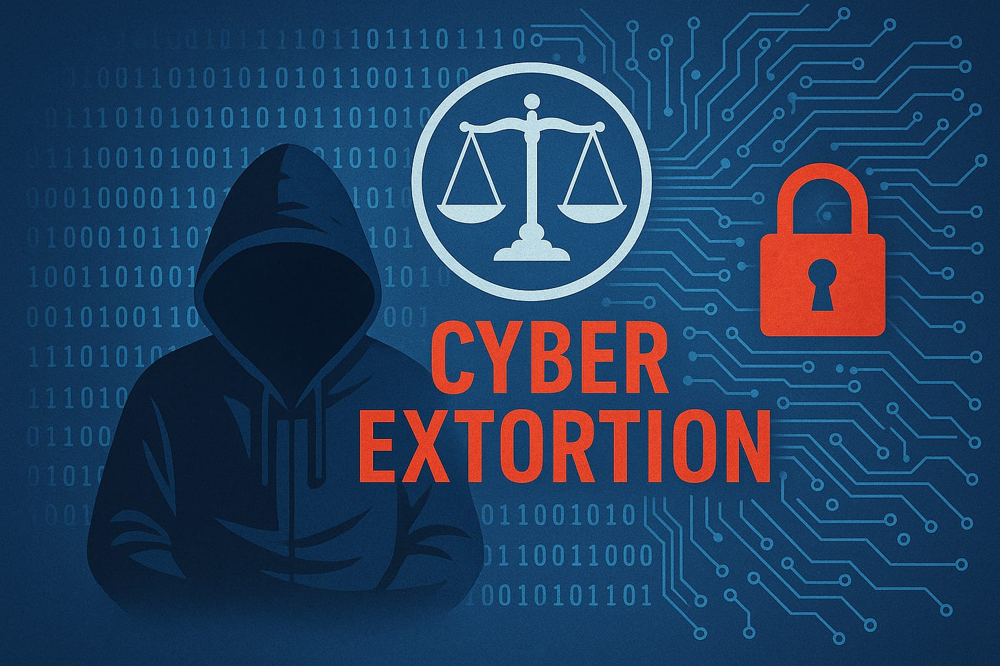

# Closer to PowerSchool Breach Closure

For those of us keeping up with the PowerSchool data breach, a 19-year-old student at Assumption University in Worcester, Massachusetts, has agreed to plead guilty to several federal charges after hacking into the systems of two U.S. companies and attempting to extort millions in ransom payments (one telecom provider and an unnamed educational software company that has been confirmed elsewhere as PowerSchool).

### What Happened?

According to the U.S. Department of Justice, Matthew Lane of Sterling, Mass., is facing charges of cyber extortion conspiracy, cyber extortion, unauthorized access to protected computers, and aggravated identity theft. Prosecutors say that Lane worked with an unnamed co-conspirator to breach and extort a telecommunications firm and an educational software company, i.e., PowerSchool.

In the PowerSchool case, Lane accessed PowerSchool and stole a massive trove of personally identifiable information (PII), including names, addresses, Social Security numbers, dates of birth, medical records, and even parent contact information for millions of students and teachers.

The stolen data was reportedly moved to a server in Ukraine, and Lane then demanded a $2.85 million Bitcoin ransom, threatening to leak the sensitive data “worldwide” if payment wasn’t made.

### Connection to Recent Double-Extortion Attempt

In the [recent spate of districts reporting being extorted again](https://www.edtechirl.com/p/powerschool-data-breach-developments) over the PowerSchool data that had supposedly been destroyed (ha), attribution was made to a group called ShinyHunters. While the court filings indicate that a breach of a telecom provider was part of Lane’s activities, and ShinyHunters has been attributed as extorting AT&T previously, no connection between Lane and ShinyHunters is detailed in the documents. The DOJ’s statements about Lane focus exclusively on his hacking and extortion activities against two specific U.S. companies—not on any group affiliations. Thus far, his activities appear to have been individually orchestrated. There are no mentions in court filings or in U.S. Attorney/FBI announcements of ties to ShinyHunters, or any other organized hacking syndicate. The narrative centers on Lane’s personal actions, not a broader operation. Lane’s methods of stealing creds, exfiltrating PII, and extorting the victim is consistent with ShinyHunters tactics, but their tactical similarity doesn’t necessarily imply a connection. As a clarification, the recent filings do not include the recent extortion attempts aimed at individual schools, per a notice from K12SIX (TLP:CLEAR) earlier today.

### Legal Outcome and Next Steps

Lane has signed the plea agreement but has not yet been sentenced. He faces up to five years in prison for each of the cyber charges, plus a mandatory two-year sentence for aggravated identity theft. The case is being prosecuted by the U.S. Attorney’s Office’s Securities, Financial & Cyber Fraud Unit. In the meantime, federal officials are encouraging any educators or families concerned about potential exposure to contact their local school districts. It should be noted that PowerSchool has completed parent notifications as part of the incident response, but since the data involved in the breach goes back decades, there are instances where families whose data was involved in the breach have been unable to receive notifications due to changes in contact information since they were part of the impacted school districts.

### Primary Sources

Below are links to the Department of Justice’s announcement as well as links to the charges and the plea agreement, along with AI-generated summaries. These documents help give bigger picture of the tactics employed in this incident and the attack timeline.

#### AI-Generated Summary of the Charges Filed:

[(Link to original charges document)](https://www.justice.gov/d9/2025-05/us_v._matthew_lane_-_information.pdf)

##### 🧾 **Overview**

This document is a formal criminal information filed in the **U.S. District Court for the District of Massachusetts** against **Matthew D. Lane**, detailing multiple charges related to **cyber extortion**, **unauthorized access to protected computers**, and **aggravated identity theft**. The case involves two victims—**a telecommunications company (Victim 1)**and **a school-focused software and cloud storage company (Victim 2)**.

---

##### 🚨 **Key Charges**

1. **Count One – Cyber Extortion Conspiracy**
    - Lane and others conspired to extort $200,000 in Bitcoin from Victim 1.
    - They threatened to release stolen confidential data unless paid.
2. **Count Two – Cyber Extortion; Aiding and Abetting**
    - Lane personally sent threats via email, demanding ransom from Victim 1 to avoid leaking data.
3. **Count Three – Unauthorized Access to Protected Computers; Aiding and Abetting**
    - Lane used credentials belonging to an employee of Victim 2 to illegally access data from its network, including student and teacher records.
4. **Count Four – Aggravated Identity Theft**
    - Lane used the employee’s credentials unlawfully while committing the above crime.
5. **Forfeiture Allegation**
    - The government seeks to recover $160,981, the amount derived from Lane's crimes, and any related property.

---

##### 🕵️‍♂️ **Notable Criminal Actions**

###### **Against Victim 1 (Telecom Company)**

- Between **April and May 2024**, Lane:
  - Sent multiple extortion emails using anonymized accounts.
  - Communicated via **Signal** (encrypted messaging) with a co-conspirator (CC-1).
  - Threatened harm to company employees if ransom wasn’t paid.
  - Reduced the ransom from $200,000 to $75,000 at one point.
  - Proposed selling the stolen data if ransom was not paid.

##### **Against Victim 2 (Educational Software Company)**

- On **September 4, 2024**, Lane:
  - Gained unauthorized access to the company’s network using stolen employee credentials.
  - Extracted sensitive student and faculty data.
  - Transferred this data to a server in **Ukraine**.
  - Sent a ransom demand in **December 2024**, asking for **30 Bitcoin (~$2.85 million)** under threat of exposing personal information of over **60 million students and 10 million teachers**.

---

##### 🔒 **Types of Data Involved**

- Social Security Numbers
- Dates of Birth
- Medical Records
- Contact Info
- Student and guardian information
- Login credentials

---

##### ⚖️ **Legal References**

- **18 U.S.C. § 371** – Conspiracy to commit cyber extortion
- **18 U.S.C. §§ 1030** – Fraud and related activity in connection with computers
- **18 U.S.C. § 1028A** – Aggravated identity theft
- **18 U.S.C. § 982** – Criminal forfeiture provisions

---

#### AI-Generated Summary of the Plea Agreement:

[(Link to original plea document)](https://www.justice.gov/d9/2025-05/us_v._matthew_lane_-_plea_agreement.pdf)

##### ⚖️ Charges and Plea

Matthew D. Lane agreed to plead **guilty** to all charges in the criminal information:

1. **Count 1** – Cyber Extortion Conspiracy (18 U.S.C. § 371)
2. **Count 2** – Cyber Extortion and Aiding & Abetting (18 U.S.C. §§ 1030(a)(7)(B), 2)
3. **Count 3** – Unauthorized Access to Protected Computers and Aiding & Abetting (18 U.S.C. §§ 1030(a)(2)(C), 2)
4. **Count 4** – Aggravated Identity Theft (18 U.S.C. § 1028A(a)(1))

Lane **admits guilt**, waives indictment and any procedural defects, and acknowledges full responsibility.

---

##### 📏 Sentencing Guidelines & Penalties

- **Counts 1–3**:
  - Up to **5 years** each in prison
  - **3 years** supervised release
  - Fines up to **$250,000 or double the gain/loss**
  - **$100 special assessment** per count
  - Restitution and forfeiture as charged
- **Count 4**:
  - Mandatory **2 years in prison**, consecutive to other sentences
  - **$100 special assessment**
- **Estimated Guidelines Offense Level**:
  - Base offense level: 27
  - Includes enhancements for:
    - Over **$9.5 million in loss**
    - Use of **sophisticated means**
    - **Personal data theft**
    - Use of **special skills** to commit the crimes
  - Reductions for:
    - **Acceptance of responsibility**
    - **Minimal criminal history**
- **Sentence Recommendation**:
  - Incarceration consistent with the Guidelines, **plus 2 years for Count 4**
  - **No fine**, 3 years of supervised release, $400 special assessment, restitution (amount TBD), and asset forfeiture

---

##### 💰 Forfeiture Terms

- **$160,981** money judgment
- Forfeiture includes Monero (XMR) cryptocurrency wallet addresses (9+ listed on page 6)
- Lane consents to forfeiture of all assets derived from or used to facilitate the crimes
- If assets are unavailable, the U.S. may seize substitute assets

---

##### 🚫 Waiver of Rights

- Lane **waives** his rights to:
  - Appeal the conviction or any sentence **≤111 months**
  - Challenge forfeiture, restitution, or fines
- Exceptions: claims of **ineffective counsel** or **prosecutorial misconduct** are preserved

---

##### 🧾 Other Key Terms

- Defendant must disclose full financial information and cooperate in transferring forfeitable assets
- Lane **waives civil claims** to all seized property
- The plea agreement **does not shield** him from potential **civil liability**, such as taxes
- Any breach of the agreement may:
  - Void concessions by the prosecution
  - Re-open dismissed charges
  - Waive statute of limitations and Speedy Trial rights

---

##### ✅ Final Acknowledgment

Matthew D. Lane and his attorney **signed** the plea agreement on **May 20, 2025**, confirming that:

- The agreement was entered **freely and voluntarily**
- Lane is **satisfied with his legal representation**
- He **understands** the implications and is **guilty** of the offenses
