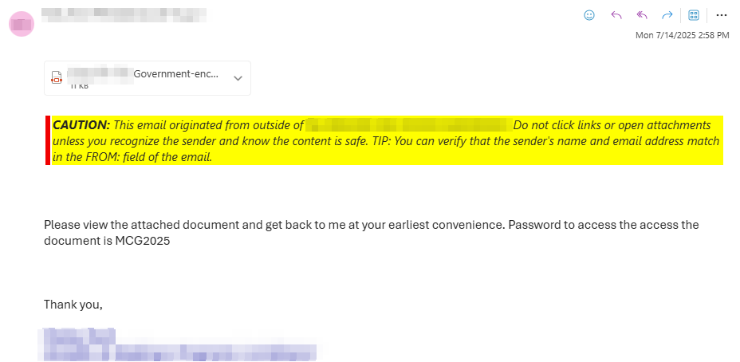
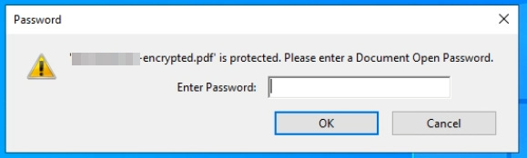
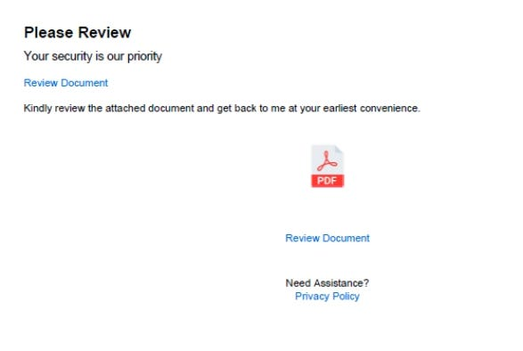
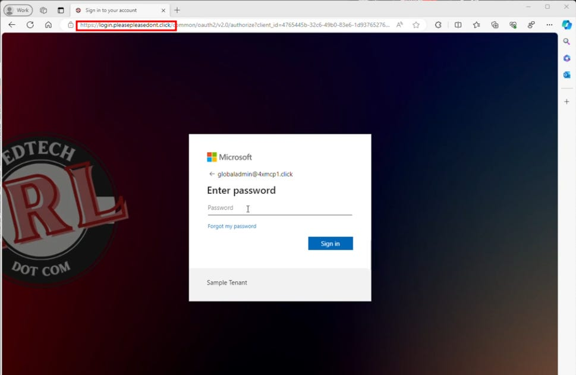
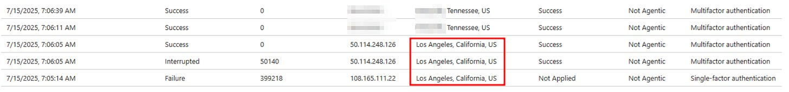

# Summer Phishing Trip

*MFA-bypassing Cookie Theft Attacks are on the Rise thanks to Sneaky 2FA and Phishing as a Service*

I don’t know about what you’re seeing, but my organization has seen a large uptick in cookie-theft phishing attacks that are consistent with the Sneaky 2FA phishing toolkit. I’ve traditionally only seen one or two of this style of email each month, but in the past two weeks, I’ve seen 60+. The scary part about this toolkit is that it’s built specifically to get around multifactor authentication, one of the core defenses most organizations rely on today. Instead of brute-forcing or password spraying, this tool intercepts MFA tokens in real-time, rendering that second step effectively useless.

This kit first popped up in October 2024 and is tailored to specifically target Microsoft 365 accounts. It’s sold as a PhaaS (Phishing-as-a-Service) package over Telegram, complete with obfuscated code that lets cybercriminals set up their own deployments without needing to build from scratch. What makes it even trickier is how well it avoids detection. It uses techniques like [Cloudflare Turnstile](https://www.cloudflare.com/application-services/products/turnstile/) (anti-bot challenges) and IP filtering to block security researchers and automated scanners.

## So what have these looked like?

1. Someone receives an email from someone they already communicated with. Unfortunately, that person's account has been compromised, and they send an email that has an attached PDF, and a body that says something like "Please see the attached document. The password is Blahblah2025."

2. To add a feeling of legitimacy to the email, when the user opens the PDF, they're asked to enter the provided password.

3. Next, the PDF loads with a link to review the document. Users are made to jump through plenty of hoops, so there are many chances to back out before being pwned with this one.

4. After clicking any of the links in the document, it forwards to a docsend address (here, docsend\[.\]com/view/riaueat2wckm3jg5) that forwards to a subdomain of the site nauportal\[.\]com. Other attacks of this style have come from a variety of other domains (as in the screenshot below from a demo I did for this attack), but these two have been consistent in this most recent campaign. It definitely doesn’t hurt to deny-list \*.nauportal\[.\]com and/or the specific docsend address.

    Through this domain, it passes you to your organization’s legitimate M365 login page. It’s literally a textbook example of a AitM (Adversary in the Middle) attack. You see your correct login page, but it’s being pulled through a domain controlled by the adversary.

5. And here’s where it gets gross. If you ignored all the red flags up to here and then enter your credentials and perform MFA, the attacker who controls the malicious domain now has a copy of your password in clear text, as well as a copy of your session cookie. They can then load the session cookie into their browser, and voila! They are logged into Microsoft 365 as you. The worst part? If you realize what you’ve done at this point, even if you change your password, the attacker still has the session cookie and access to your account.

## What can attackers do after a successful attack?

- **Hijack Sessions in Real-Time**
  Attackers don’t need passwords if they can grab an active session. This toolkit lets them jump straight into user accounts without setting off MFA alerts or login notifications.

- **Stick Around for the Long Haul**
  By capturing authentication tokens, attackers can hang onto access even after a user logs out. That means long-term persistence allowing them to return over and over without re-authenticating.

- **Exfiltrate Sensitive Data**
  Once inside, threat actors can quietly dig through emails, create mail flow or forwarding rules, download confidential documents, and pull sensitive data stored across Microsoft 365.

- **Take Over Entire Accounts**
  This isn’t just about reading email. Attackers can reset passwords, change MFA settings, and fully lock out the legitimate user.

- **Move Laterally Across the Organization**
  With one account in hand, attackers can pivot. They can use trusted access to phish coworkers, request sensitive files, or dig deeper into shared drives and systems. One compromised account often leads to many. The cases I’ve seen this month have all started as emails from existing contacts in other organizations, which builds in an inherent layer of trust.

## How do you defend?

### **Awareness**

The first line of defense is people. I know there’s an argument over whether people should be trusted as the front line of defense, or if it’s the job of IT/security to place enough technical controls between the user and the world that it doesn’t matter. However, I think the idea of relying on a technical control for every novel scenario is untenable at best, and a BS cop-out at worst. Especially in this campaign, the messages were coming from known, trusted users outside of our organization, and the messages were not wholly out-of-line of normal messages from those people. Sure, put technical controls wherever you can, but also train your people and create a culture where it’s ok to report phishing or anything else suspicious, even if users don’t realize it till AFTER they’ve clicked. Without trust, security awareness will fail. If you are a K12 in search of a security awareness/phishing simulation platform, I’m a little biased, but a huge fan of [Cybernut](https://www.cybernut.com/).

### Prevention with Phish Resistant MFA

The technical control for this situation would be using phish-resistant MFA like Passkeys or FIDO tokens. While it’s still possible to compromise an account that uses phish-resistant MFA, it’s A LOT harder, and this specific campaign and tooling would not have been able to overcome a Yubikey. If you’re interested on more about phish-resistant MFA, [I’ve been on this soapbox before](https://www.edtechirl.com/p/why-is-phish-resistant-mfa-important).

### Investigation

#### Logs

In Azure signin logs, AFTER a user has fallen for the phish, it will show up like this… Based in Tennessee, it’s definitely abnormal for me to see a random successful California login in the logs. If you have a list of people who received these messages, especially if you don’t have a consistent reporting structure for phishing emails, it’s worthwhile to check their signins for the period after they receive the message to see if there are any anomalies. For me, I ran a report in Microsoft Defender’s Email Explorer and generate a CSV of all the users who received the malicious messages, removed the message from their inboxes, and then I correlated the list with signin logs looking for anything phishy.

#### Dig in the Sandbox

If you haven’t seen [Any.Run](https://any.run), go ahead and stop reading and check them out. They are a free\* dynamic malware investigation sandbox you can use to detonate phishy files or links and get really detailed analysis of what happens.

The free version has the drawback that anything you submit is publicly available (hence the \*), so if you suspect your link or file could be legit or contain any personal or organizational information that shouldn’t be public, don’t do it. I’ve subscribed to Any.run for 5+ years at this point, and it’s a product I can’t live without.

The bonus of their free version is that you can go look through the publicly available samples people have uploaded, including [a deep dive on Sneaky 2FA](https://any.run/malware-trends/sneaky2fa/), that admittedly I drew upon to help me complete this writeup. [This article is a little older, but the things I love about Any.Run haven’t changed since then](https://www.edtechirl.com/p/dynamically-investigating-malware).

#### Microsoft Security

Finally, if you have access to Microsoft Defender, it’s trained to detect these sorts of attacks based on IOCs that they’ve gathered. This type of attack will show up under Incidents as “User compromised by known AiTM phishing kit (attack disruption).” Further, if you have Microsoft Defender for Identity configured, it may be able to automatically lock the account when the compromise is detected, limiting access and blast radius.

##
