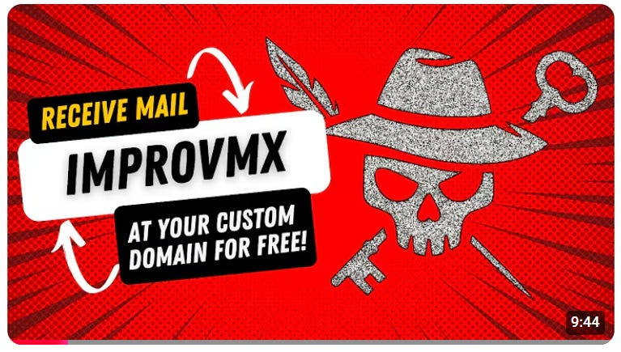

# Add Email to a Custom Domain

You can tell I’m an optimistic person by looking over the list of domains I’ve purchased over the years. Every purchase is hope in the future: hope that future Andy will follow through with an idea, plan, or project. Some are temporary (pleasepleasedont.click served its purpose before expiring), some had a complete lifecycle and ran their course completely (independentmaryville.com had a good run in the early 2000’s), some have never made it past the brainstorming stage (I’ve not given up on skeezypdf.com yet!), and others have hit the mark and are still running (hello, edtechirl.com).

One thing that all of these domains have in common is that at some point I’ve wanted to use them for email. Back in the late 90s/early 00s, before the CAN-SPAM Act, many domain registrars included this ability for low or no cost. Today, it can be a bit tricky. [Check out the video above](https://youtu.be/-hjhHFnW4tA) for a walkthrough of how to add the ability to receive mail in your existing mail account from a new custom domain for free.

I’ll jump to a key spoiler, too… Receiving mail at your domain is free with this service, but the ability to send with Gmail requires the $9/mo paid version to take advantage of ImprovMX’s SMTP service.
