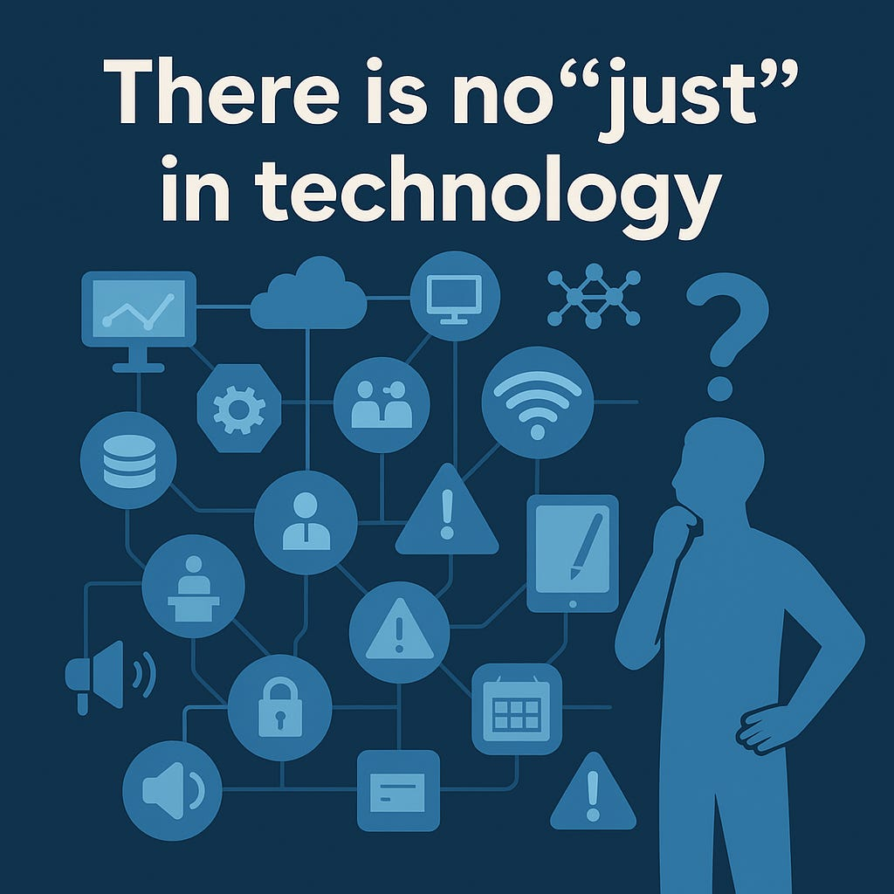

# "Just" Technology

*What do I wish stakeholders knew about technology in schools?*

A co-worker in another department recently asked me what I wish people outside of IT knew about IT. I gave one of many correct answers to the question, but it kept nagging at me: if I could have people outside of tech know one thing about technology, what would it be. After a few days of reflection, I think I’ve settled on what that one thing would be:

There is no “just” in technology.

I’m not talking about fairness or equity or justice, but rather the interconnected nature of technology in the modern school or workplace. It’s a similar topic that comes up in cybersecurity tabletop exercises: technology is everywhere, and it’s so pervasive that it touches facets of every group of stakeholders, frequently in profound depth. As technology sprawls, it’s literally impossible for an IT department to service ALL technology in an organization.

In a school, for example, there are very few parts of the day that aren’t touched by technology. Chances are, before you get out of your car in the parking lot in the morning, you’re already being recorded by a district surveillance camera and the students are getting off a bus that has been tracked by GPS connected to an app their parents can use to see the bus’s location. As you approach the door, you may find yourself fumbling with a keycard to let you in through an access-controlled door. You step inside and you’re met by a blast of cold air from the internet-connected and managed HVAC system. As you settle into your classroom, an announcement comes over the IP-based intercom system. You fire up your computer (because of course you shut it down every night), and it connects to the interactive whiteboard, speakers, and possibly classroom amplification system. Attendance is taken digitally, lessons are presented digitally, and digital hallpasses even manage how many students can be sent to a specific bathroom at the same time. In that bathroom, there is a vape sensor connected to the internet. As the day progresses, you make calls on your network-connected VOIP classroom phone and use your cell phone for MFA. As you walk to the cafeteria, you see the lunch options on digital signage. While you’re at lunch, you’re served food that was stored in a freezer that has internet-connected temperature monitoring that sends text messages to your maintenance staff if the temperature exceeds a set threshold. If it fails, a repair technician will likely have to come onsite and sign in to a visitor management kiosk that scans their driver’s license and performs a rapid background check.

And this is just the surface. As you peel back the layers, almost every service I mentioned above requires either a server or a subscription-based service behind it in order to function, complete with software updates, firmware updates, rostering, rights management, onboarding, offboarding, and on and on. Every bit of what we do requires an underlying infrastructure in order to bring value to our students and teachers.

When you have IT departments with constrained resources (as is the case with virtually every school district in the country), these are factors that are often overlooked, but come into play when trying to describe the depth and breadth of what IT is responsible for. Granted, it’s not every day that someone on my team has to troubleshoot with our facilities department to fix an HVAC system, but it’s also not rare. As schools get more and more connected, if staffing doesn’t grow with the scope creep, the result is an expanding backlog of technical debt and increasing challenges around documentation.

One way to bring this situation to life is to hold a discussion, conversation, or exercise with folks from admin, finance, HR, etc., and start asking questions like:

**If the internet goes down, at what point do we send students home?**

Almost always, the initial answer is simply “We don’t” - followed by an explanation about how teachers teach, and school can go on without a computer. School existed before computers, and it can still go on without the internet. While this is entirely true, if you walk through the list of impacted systems from earlier, the question quickly turns from it being a question about what’s necessary for instruction to happen and turns into a question of student safety.

For example, if the network is down, and student schedules are all stored online, and the intercom is down, and classroom phones are down, how does a parent check out a student for a medical appointment? Or, if 10% of your students text their parents to tell them the internet’s out and they want to be picked up from school, what happens when 100 parents show up to pick up their students and no one in the office knows where they are? In an emergency situation, whether weather-related, medical, or safety-related, these communication gaps become even more critical. As you start to talk through some of these scenarios, the importance of technology rapidly comes into focus.

So, back to the initial question… what do I really want people outside of IT to understand? One insight I hope more people consider is that technology isn’t just a collection of tools—it’s an ecosystem. And every time a new device is purchased, a new system is implemented, or a new service is adopted, that ecosystem grows. But unless staffing and support structures grow with it, we’re setting ourselves up for increased risk of service disruptions and staff burnout.

It’s easy to get excited about the promise of new edtech solutions or infrastructure upgrades. But each “innovation” brings with it a demand for maintenance, integration, training, troubleshooting, and long-term management. These aren’t one-time tasks; they’re ongoing responsibilities that require not just people, but skilled, knowledgeable people who understand how all the pieces fit together.

So when decision-makers are evaluating new purchases or planning for the future, it’s ideal that they partner with IT from the outset to prevent surprises down the line. Not just to approve the tech, but to assess what it will take to support it. When IT and leadership collaborate early, we can maximize value and minimize surprises. Otherwise, even the most promising tools can become burdens at best, or vulnerabilities at worst. Understanding the depth and sprawl of technology isn’t just an IT concern, it’s a shared leadership responsibility. Making informed, sustainable decisions means recognizing that technology success is as much about people as it is about platforms.
