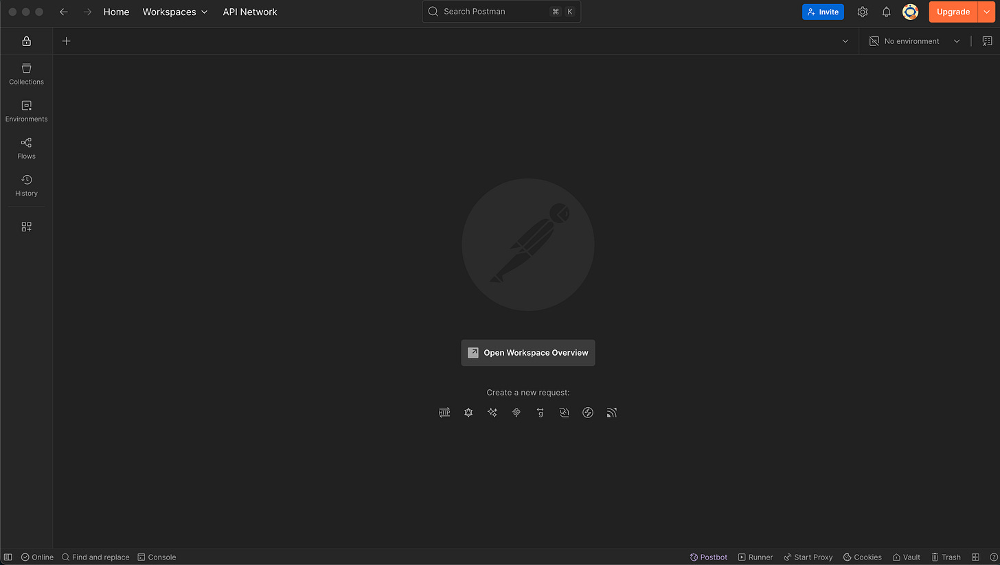
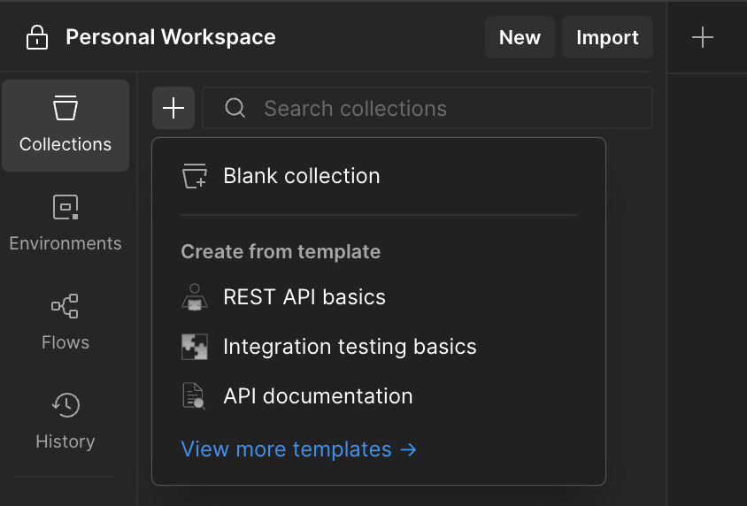
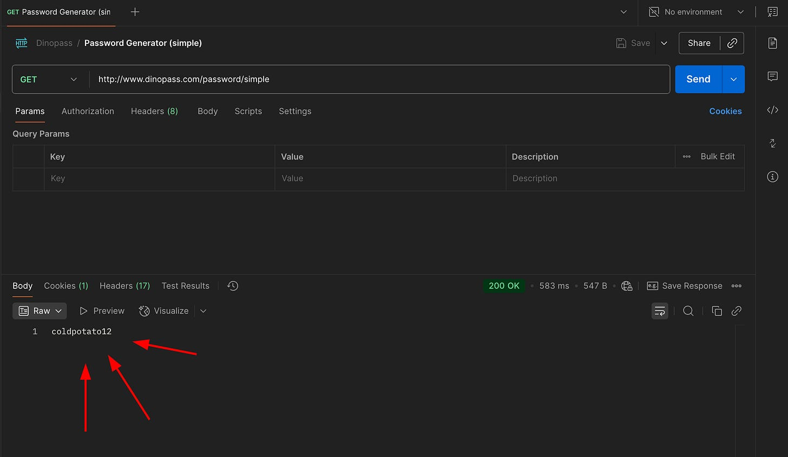
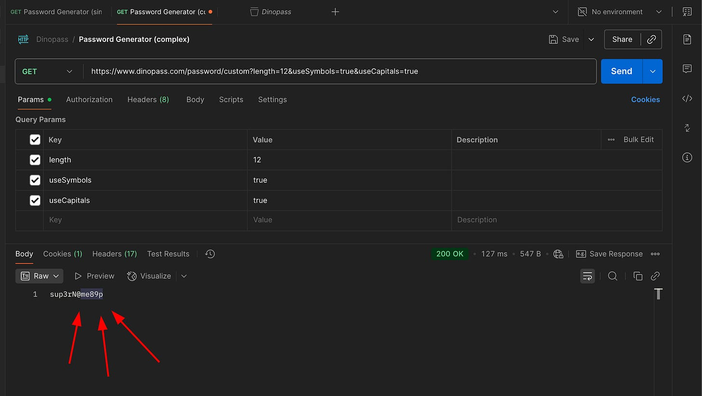
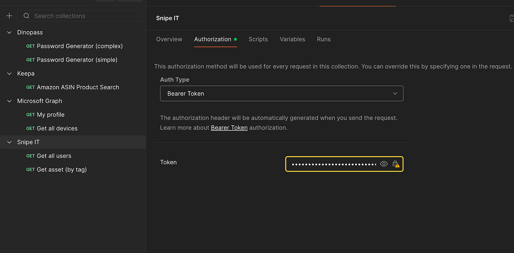
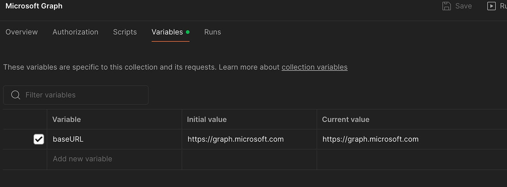
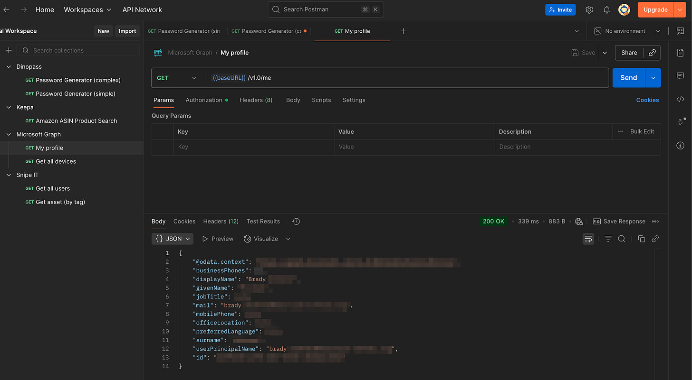
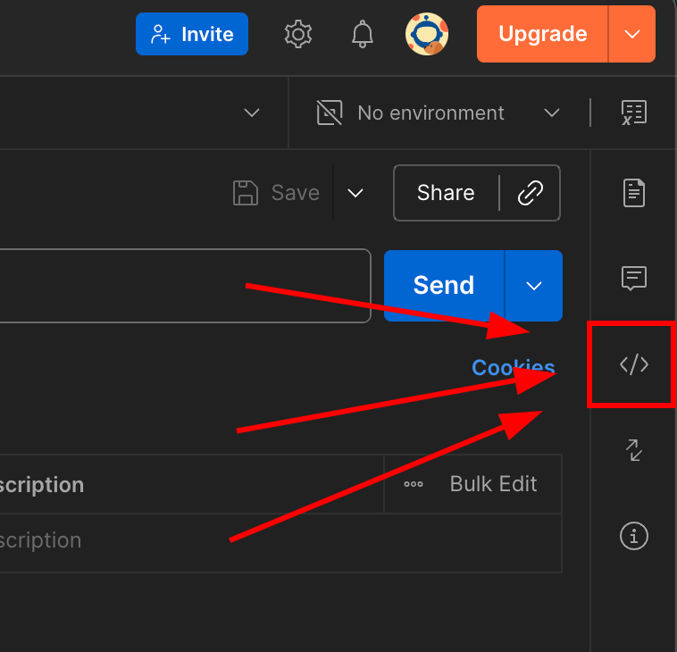
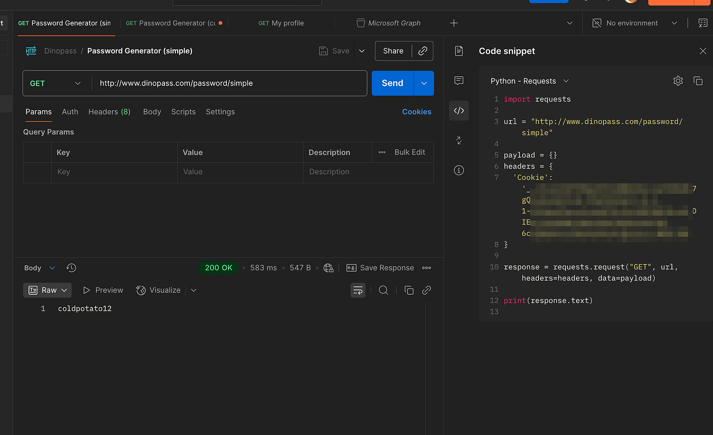

# Getting started with Postman

*Use API's without code!*

[](images/2f001292-eff6-4293-8916-b3ada5b6b8a6_1536x1024.webp)

### Introduction

After writing my [API Pie in the Sky](https://www.edtechirl.com/p/apis-the-automation-pie-in-the-sky?utm_source=publication-search) article, I decided that this was something I wanted to share and teach other people how to do in person, so I ended up giving a presentation on it back in late 2024.

One piece of feedback I got from the session was that the attendee felt like APIs were still unapproachable because of the prerequisite of needing knowledge on coding. And honestly, fair point. However, after some time I found out that the application [Postman](https://www.postman.com/), solves this problem. In this article I’m going to go over the basics of postman, so you can start utilizing APIs, without the hastle of needing to code.

Last thing, Postman is a very feature rich tool. It’s used for accessing APIs all the way up to developing them. I’m going to pick and choose features that will be helpful for accessing and using APIs but just know we’re barely scratching the surface on the features in Postman.

### Which version?

There are actually a handful of different ways you can use postman. In this demonstration, we’re going to be using the [desktop application](https://www.postman.com/downloads/). However, you can also utilize the [web based version](https://identity.getpostman.com/login) if you don’t want to install it, or there is also a pretty robust [VS Code extension](https://marketplace.visualstudio.com/items?itemName=Postman.postman-for-vscode) that allows for running your requests directly from VS Code. Note that you **have** to have an account for each of these versions, excluding the desktop app that can be used in guest mode. That being said, having an account is helpful, and allows you to save your queries, so I would recommend it regardless.

### Getting Started

Once you have the app installed and are signed into your account, you should see something like this.

[](images/81eec159-2e37-4796-be18-4eff09159aac_3014x1704.png)

To start, lets create a collection. **Collections** serve as folders for your API requests you wish to save. To create one, click on Collections from the side bar and click the plus icon to create one. Note that you have a few options here. They have a few premade templates (the rest API basics one has some good info), but we are going to use the blank collections option.

[](images/a371139a-350e-46c8-963f-8ddafec82c6a_844x572.png)

Once you add in a collection, click the link under it to create a new request.

### Making Requests

I’m going to start by showing you how to get started by creating a simple request to [Dinopass](http://www.dinopass.com). If you haven’t heard of Dinopass, it is an online password generator aimed at K12, generating safe and simple passwords for people of all ages.

Let’s start with generating a simple password. In your request, you’ll need to put the following in the address bar.

```
http://www.dinopass.com/password/simple
```

Once you do, go ahead and click send and you should see a simple password in the response below.

[](images/1f393faf-68a1-446e-841b-720b1b0955af_2264x1314.png)

Awesome! Now let’s expand on this with parameters. Let’s say we want to create a more complex password and define things like character length, use of symbols, use of capitals, etc. These options can be configured on API’s by changing the parameters of your request. For dinopass, they have a seperate API request you have to use when customizing your password requirements. Type in the following for your request URI and fill in the bullet points below for your paramters.

```
https://www.dinopass.com/password/custom
```

- Key: length Value: 12
- Key: UseSymbols Value: true
- Key: UseCapitals Value: true

As you put in the parameters in the table, you’ll notice that Postman will automatically update your request URI. To find the paramters that can be set for a given request, refer to your API documentaiton.

[](images/ba5c7a7c-d7e6-451d-aaee-dea17a30ebca_2282x1288.png)

Got it? Great. You now have your first two API requests. Let’s go over some additonal features in Postman that make life easier.

### Authorization

Dinopass is an API that doesn’t require any form of authorization, as the data is randomized and you just request it as needed. But what about accessing API’s that require authorization? Well, there’s two ways you can do that. You can either go to your request and click the authorization tab, or you can add authorization settings at the Collection level and it will automatically apply to the requests inside it. I would recommend doing it this way.

[](images/29fa5634-e23a-4f1a-b077-817d41390253_2094x1032.png)

Here I’m adding a bearer token to the collection Snipe IT, so all of my Snipe IT API requests will automatically use this to gain access to the data, instead of me needing to define it each time for each request.

### Variables

Variables are definable place holders you can create in the Variables tab of your collection. As mentioned, they are place holders. With them you can put in data that you wished to be replaced with something else. The most common example of this is to create a variable for your base URL of your API. In the picture below, you can see my base URL I have defined for microsoft graph and how I am able to use that in my request for ease of use.

[](images/7250f55c-f1a8-43f7-b27e-f9744070e3eb_1672x618.png)

[](images/8ef18fc6-fb36-4258-92d9-1901f253b793_2858x1572.png)

### Code Samples

Lastly, in my other article I mentioned how API’s sometimes have code examples for various programming languages and how much easier that makes life. Well, Postman has this as a built in feature. To see this, simply go to your request and click on the code < / > symbol on the right side bar.

[](images/f43ab6db-51be-411f-b6f9-d118ce214bab_758x730.png)

[](images/eb5b3726-665e-4b98-b453-e6d89dc37440_2290x1400.png)

From here you can click the drop down arrow by the coding language to select another.

Cheers!
