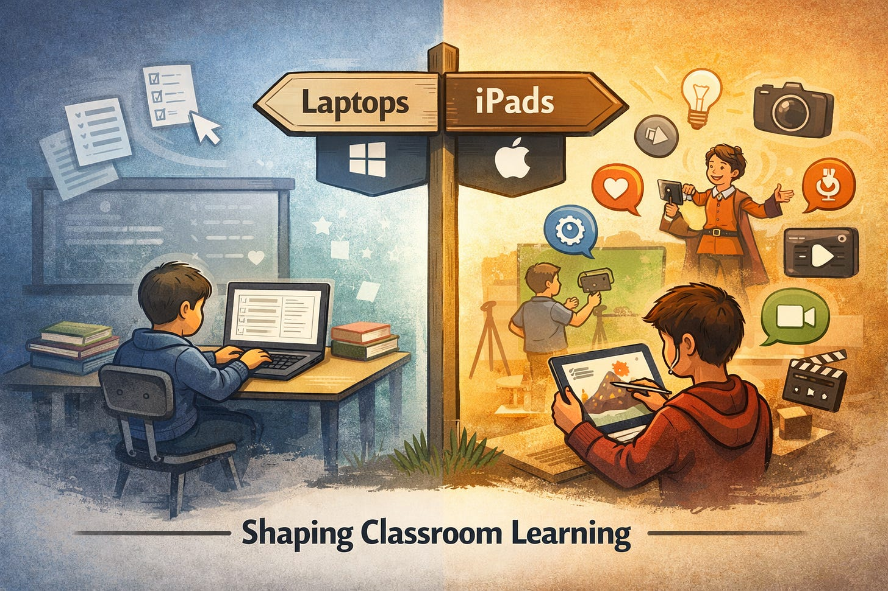

# Rethinking 1:1 Computing in K-12

*How Device Choice Can Shape Pedagogy*

After over a decade as a 1:1 district, my district is now considering a shift from Windows laptops in grades 4–12 to a new platform. This discussion has sparked more than just tech debates; it’s a rare chance to reevaluate how well our instructional practices align with the tools we provide. Too often in education, 1:1 devices are reduced to digital textbooks or workbooks, missing the opportunity for deeper learning. As we navigate our decision-making process, I’ve found myself dusting off my teacher hat and reflecting on how the right platform can unlock, rather than dictate, better pedagogy.

# **Device Platforms and Pedagogy**

Skepticism toward “digital worksheets with a backlight” is healthy. It reflects an intuitive truth that technology often reproduces the same instructional patterns it was meant to disrupt.

Thankfully, this outcome is not inevitable, and it is not a moral failure on the part of teachers or students. It is structural.

A laptop makes substitution easy. Mouse, keyboard, browser, document editor, learning management system. The shortest path mirrors paper. Type instead of write. Click instead of circle. Upload instead of turn in. The medium changes, but the cognitive demand does not.

A touch-based tablet like an iPad alters the default posture. Touch instead of pointer. Camera and microphone as first-class tools. Markup, sketching, and immediate media capture as baseline affordances. Creation is not a special event that requires planning, setup, and justification. It is the first thing the device invites students to do.

This distinction matters, because platforms shape behavior through friction. They quietly reward some actions and discourage others. The iPad lowers friction for multimodal expression and raises it for extended passive typing. That shift nudges classrooms toward different practices even before professional learning catches up.

It’s important to note that this is not an argument that iPads inherently make instruction innovative. Pedagogy still matters. Design still matters. Teachers still matter.

The claim is narrower and more honest: I am not saying iPads make teachers better. Rather, I’m suggesting they remove structural incentives for low-effort digitization.

## **Grades 4–8 Is Where This Matters Most**

Middle School sits at a critical developmental intersection. This is where students should be learning that “show what you know” does not always mean “write a paragraph.”

Audio explanation. Annotated video. Visual modeling. Quick prototyping. Iterative drafts. These are not enrichment activities. They are literacy, broadly defined.

Students in grades 4–8 are still developing writing stamina, executive function, and metacognition. Many can explain their thinking clearly before they can encode it fluently in text. When written output is the only accepted proof of understanding, comprehension and composition become conflated.

Traditional laptops, whether Windows, Chromebooks, or Macbooks, CAN support multimodal work, but they do not invite it. The setup cost is nontrivial. App selection, mic permissions, file handling, exporting, uploading. Each step adds friction. Each step forces the teacher to ask, often subconsciously, “Is this worth the hassle?”

iPads remove that calculation. The camera, microphone, markup tools, and share pathways are always one gesture away. That invitation matters at scale.

## **The Risk Worth Naming**

An iPad does not automatically produce deep creation. It produces different defaults.

Without aligned professional learning, curriculum design, and assessment expectations, shallow use simply changes costumes. Camera instead of keyboard. Video instead of document. Novelty without depth.

That risk is real; however, it is not a reason to stop. It is a reason to define creation precisely and measure quality of thinking, not just engagement.

## **Start With Constraint, Not Vision**

In grades 4–8, creation must function inside real classrooms. There are challenges of limited time, uneven teacher comfort, and state testing pressure, not to mention that students are still learning how to organize their thinking. If creation only works as a big project, it fails at scale. Creation must mean frequent, small acts of sense-making. That constraint keeps the definition honest.

### **An Operational Definition of Student Creation**

A student is engaged in creation when they produce an original artifact that requires them to organize, explain, model, or demonstrate understanding in a way that cannot be completed by simple selection, copying, or transcription.

Three qualities matter:

Originality  
Organization  
Demonstration

The medium is secondary.

### **What Creation Looks Like in Practice**

Creation in grades 4–8 should show up as micro-artifacts, not polished finales. Examples can include:

· A 60-second audio explanation of a math strategy.

· A short annotated screen recording walking through a science diagram.

· A photo of a physical model with voiceover reasoning.

· A quick reenactment of a historical event with student narration.

· A sketch paired with an explanation of a solution path.

· A brief video response to a reading prompt in the student’s own words.

These take minutes, not weeks, and that’s why they matter. The pedagogical value is not the artifact. It is the forced externalization of thinking. These aren’t activites that receive local media coverage, but when offered consistently the impact can be deeper with a longer-lasting impact.

### **Why iPads Change the Default**

On a laptop, each of these tasks requires setup. Login. App choice. Permissions. File management. Uploading.

On an iPad, capture, annotate, and share are integrated behaviors. That difference removes friction not just for students, but for teachers’ decision-making in the moment. Creation becomes routine instead of exceptional. This is the real shift.

### **What Creation Is Not**

Creation is not typing longer answers. It is not making slides instead of writing paragraphs. Nor is it using digital worksheets with drawing tools or watching videos followed by multiple-choice questions. These are substitutions with cosmetic changes. Naming these misconceptions early prevents unwanted pedagogical drift later.

Creation does not need constant surveillance to be visible. The concept of the “big project” has tarnished the implementation of creative student products. When a project requires so much time investment that it warrants having a showcase or special presentation, it undermines the true need for ongoing and continuously embedded multimodal student creation. Instead of measuring the success of student product creation by the flashiness of a few big projects each year, success can instead be measured with more realistic metrics. For example, the frequency of student-generated audio, video, or annotated artifacts; the variety of response formats over time; patterns of assignments, not isolated showcases; student ability to explain reasoning verbally or visually. Sampling is sufficient. The goal is to see whether creation becomes normal, not perfect.

Creation-based micro-artifacts expose process, not just answers. They reveal misconceptions early, when they are still flexible. In grades 4–8, where misunderstandings form quietly and persist loudly, that visibility is invaluable.

### **A Shared Anchor**

A single belief can align curriculum, instruction, and technology:

Students are expected to regularly explain their thinking using voice, visuals, and annotation, not only written responses.

That statement is specific. It is testable. It sets expectations.

More importantly, it defines the purpose of the platform choice. The device is not the goal. The default behavior it enables is. Platform decisions are rarely neutral. They encode assumptions about how learning should look. Choosing a device is choosing which behaviors are easy, which are possible, and which quietly fade away. Over hundreds of classrooms and thousands of students, those defaults compound.

In the end, platform debates are never just about hardware. They’re about what kind of thinking we make easy, expected, and frequent in our classrooms. The right device can lower the barrier to authentic expression and raise the floor for all learners. As districts navigate complex decisions, we should anchor our choices not in specs or price alone, but in the kind of learning we want to normalize at scale.
