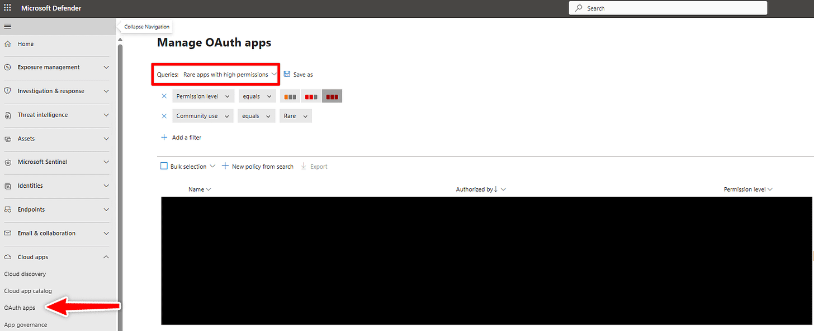
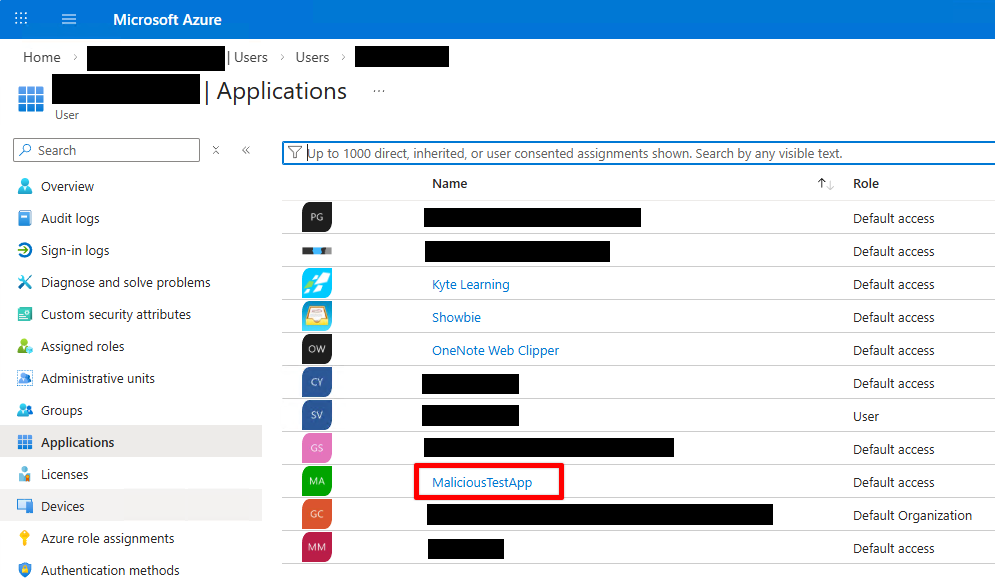
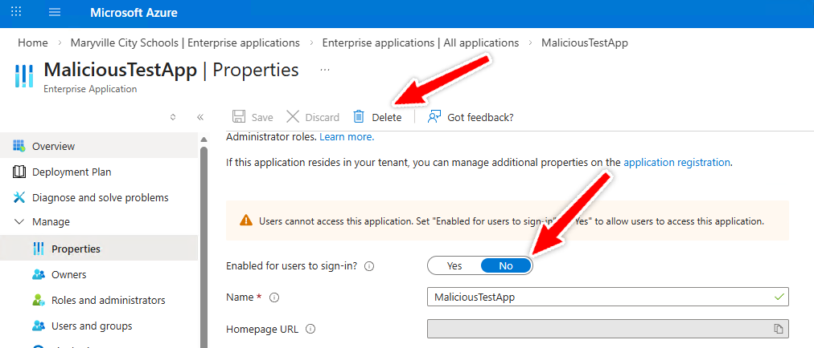
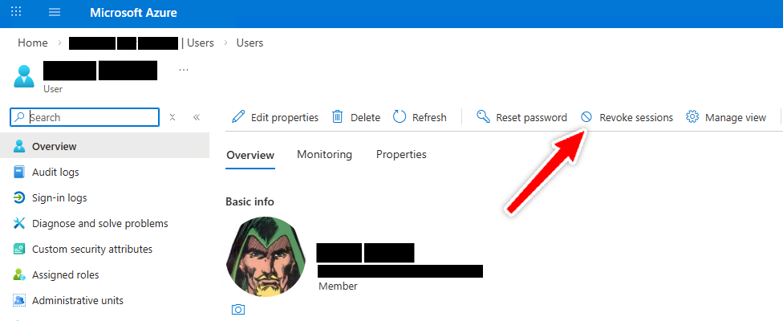

# M365 Compromised Account Triage: OAuth Persistence

*Changing passwords doesn't always help if attackers are already inside the account*

[](images/4f3c54c2-becf-4086-9495-c6b984c2f0b0_1200x800.png)

I’ve been working on an article on what I do when I encounter a potentially compromised account in Microsoft 365. It’s one I’ve stopped and started several times over the past year, and one of the main reasons for stoppage is because when I got to the Refresh Token section, it kept growing and growing. So, I’ve decided to pull it out into it’s own article that I’m going to post here without pushing to the regular newsletter, that way I can link to it from my Compromised Account Checklist. This is part of Step 5 of the [main article that will be linked here once it’s published](https://www.edtechirl.com/p/phishing-persistence-10-steps-to), too.

## Audit App Registrations and Revoke OAuth Refresh Tokens

Attackers increasingly abuse OAuth applications to maintain persistent access after an account compromise. In many cases, the attacker doesn’t need the user’s password long-term at all. Instead, they rely on delegated access through OAuth tokens and app consent.

This is why recovering an account through password reset alone is often incomplete.

OAuth refresh tokens can allow continued access even after a user appears to be signed out, especially if a malicious or overly-permissive application has been granted consent.

When defenders talk about “OAuth tokens,” they’re often lumping several different token behaviors into one bucket. In practice, Microsoft 365 uses a small ecosystem of token types, and understanding the difference matters during compromise triage.

#### Access tokens (short-lived)

Access tokens are the “proof” presented to Microsoft services like Exchange Online or Microsoft Graph. They are typically valid for about an hour. Attackers can use them immediately, but they expire quickly, which makes them less useful for long-term persistence.

#### Refresh tokens (longer-lived)

Refresh tokens are the real prize. They allow a client or application to request new access tokens without the user signing in again. This is what keeps Outlook, Teams, or a browser session working seamlessly across the day.

From an attacker’s perspective, a stolen refresh token is far more valuable than a stolen access token because it can be used repeatedly to mint fresh access.

#### Persistent refresh tokens (“offline access”)

The most dangerous variant is the refresh token issued alongside the offline\_access scope. This is what allows applications to keep working even when the user is not actively signed in, such as background sync or long-running API access.

In compromise scenarios, offline access is a classic persistence mechanism: even if the user changes their password, the attacker may still be able to maintain API-level access until refresh tokens are explicitly revoked and malicious consent is removed.

#### Refresh token rotation

Microsoft has introduced refresh token rotation, meaning refresh tokens are periodically replaced with new ones. This reduces the window of reuse, but it does not eliminate the threat if the attacker continues operating within the token lifecycle or has established malicious app consent.

### Where to Look

#### Microsoft Defender for Cloud Apps (if licensed)

Defender for Cloud Apps provides one of the best investigative views for OAuth abuse:

- Go to [Microsoft Defender](https://security.microsoft.com/) → Cloud Apps → OAuth apps

This helps you identify suspicious consent grants and cloud app behavior across the tenant. Pro-tip: filter for “Rare apps with high permissions”

[](images/8fbcf9b5-6f7b-41af-8e4a-9b8b2ee9a5c9_1534x626.png)

#### Entra ID Portal (User-Consented Applications)

To review apps a specific user has authorized:

- [Entra ID](https://portal.azure.com/#view/Microsoft_AAD_IAM/ActiveDirectoryMenuBlade/~/Overview) → Users → *Select user* → Applications

This view reflects Enterprise Applications the user has consented to, not developer-created App Registrations.

[](images/73ee05be-783d-414f-b4a2-2c55c9cc9092_995x584.png)

#### Enterprise Applications (Tenant-Wide Risk)

Attackers may also abuse apps that have been granted admin consent tenant-wide, which persists beyond a single user.

Check:

- Entra ID → [Enterprise Applications](https://portal.azure.com/#view/Microsoft_AAD_IAM/StartboardApplicationsMenuBlade/~/AppAppsPreview/menuId~/null) → *Select app* → Permissions

A malicious service principal with tenant-wide permissions is a much larger issue than a single compromised mailbox.

### What to Review

Audit OAuth applications the same way you would triage a phishing email: assume nothing is benign until it earns that trust.

#### Application Identity

Look for:

- Generic or misleading names (“Microsoft Support Service,” “SSO Upgrade Tool”)
- Misspellings or impersonation attempts
- Apps that do not match known district workflows
- If people in your organization who create app registrations are loose with naming conventions and stink at documentation, it makes this job much, much harder. I’ve been guilty of making app registrations like I used to title files in college: Really-Final-Google-Connector-v15-for-real-this-time. Don’t be like past-Andy and name your registrations clearly and document them for the sanity of your team.

#### Consent Timing

Do the consent or creation dates align with your suspected compromise window?

OAuth abuse often appears as a single unusual consent event followed by persistent access.

This pattern is sometimes called an illicit consent grant attack, where the attacker tricks the user into authorizing an app rather than stealing credentials directly.

#### Permission Scope

Be especially cautious of high-impact Microsoft Graph scopes, including:

- offline\_access (refresh token persistence)
- Mail.ReadWrite (full mailbox access)
- Mail.Send (outbound phishing capability)
- Files.ReadWrite.All (OneDrive/SharePoint access)
- User.ReadWrite.All (user modification)
- Directory.ReadWrite.All (directory-wide control)
- RoleManagement.ReadWrite.Directory (privilege escalation)
- Policy.ReadWrite.ConditionalAccess (defense suppression)

High-scope permissions are not automatically malicious, but when they appear during a compromise timeline, they are strong indicators of abuse.

### Who Granted Consent?

In the Permissions view, determine whether consent was granted by:

- A user
- An administrator

If the compromised user account appears under Granted by, that is a major red flag.

If your tenant still allows users to consent to third-party OAuth apps, strongly consider restricting this tenant-wide. Most organizations, especially K–12 districts, benefit from limiting consent to verified publishers or requiring admin approval.

### What to Do If You Find a Suspicious OAuth App

#### 1. Disable or Remove the Application

In Entra ID → Enterprise Applications, locate the suspicious app and take action:

- Set Enabled for users to sign in? → No to immediately block use
- Delete the Enterprise Application entirely if confirmed malicious

Disabling stops interactive use, but removal is often appropriate once validated.

[](images/3bfda312-c6e9-412b-816f-3f9d10ca0ebf_1012x434.png)

#### 2a. Revoke Refresh Tokens for the Compromised User in the GUI

Password resets alone do not reliably invalidate existing refresh tokens. You should explicitly revoke sign-in sessions to force reauthentication.

In the Entra portal:

- Users → *Select user* → Revoke sessions

Despite the name, this action also invalidates refresh token reuse.

[](images/7419c786-3262-4394-8dc6-b26dee4de577_976x400.png)

#### 3. Or Use Modern PowerShell (Microsoft Graph)

The older AzureAD module is deprecated. Prefer Microsoft Graph PowerShell:

```
Revoke-MgUserSignInSession -UserId <UserId>
```

This helps ensure previously issued tokens can no longer be used to silently regain access.

#### 4. Confirm Malicious Consent Grants Have Been Removed (Step 1 Above)

If the attacker gained persistence through OAuth consent, revoking tokens is only temporary unless the underlying consent is removed.

Ensure the suspicious service principal or delegated permissions are eliminated.

## Recap

OAuth incidents are rarely about stolen passwords.

They are about stolen trust relationships, where access persists through delegated permissions long after the user believes they have been “logged out.”

Treat OAuth consent the way you treat credential theft: as a first-class persistence mechanism.
