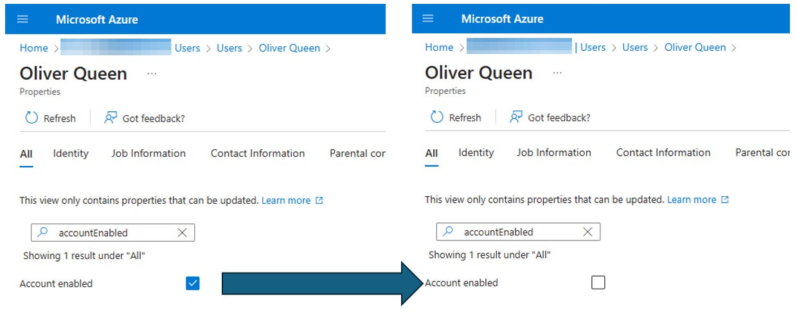
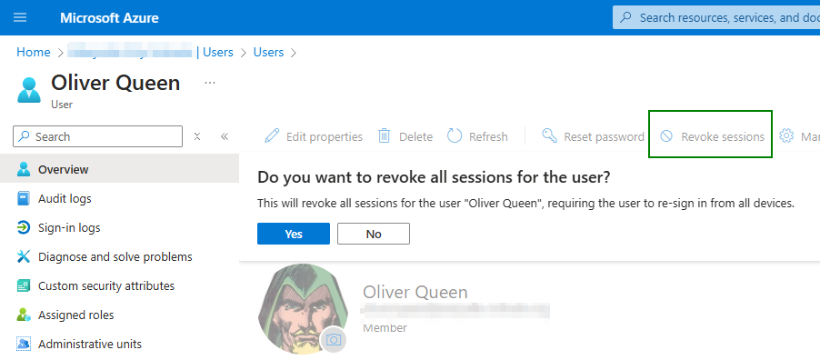
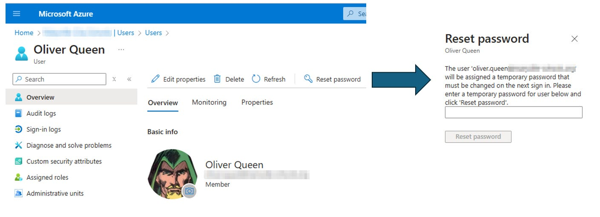
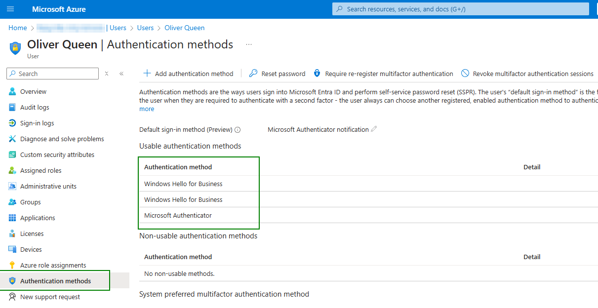
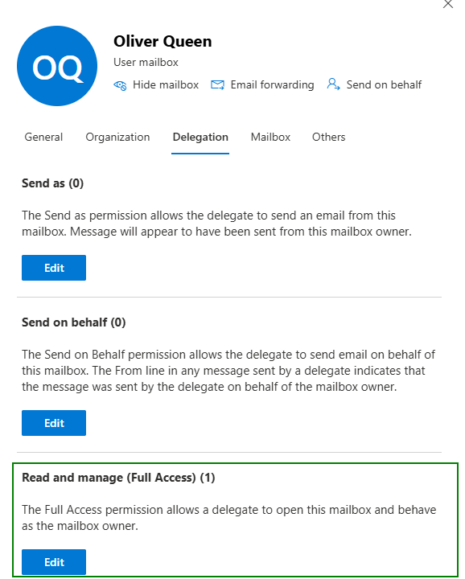
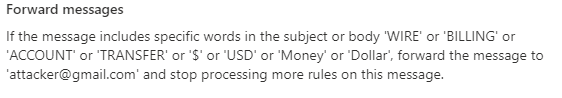
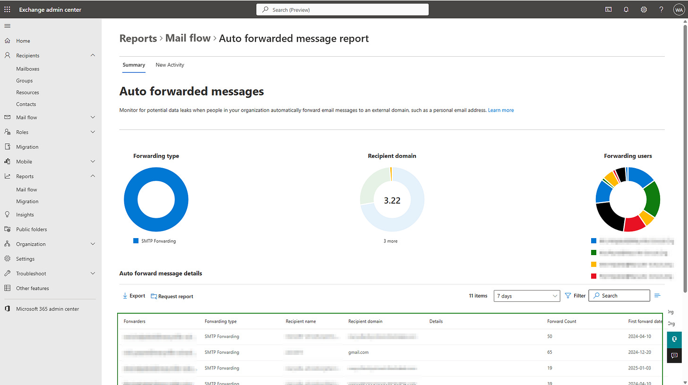

# Phishing Persistence: 10 Steps to Securing a Compromised M365 Account

*Modern account compromise is about persistence, not passwords*

[](images/bd903143-1ed2-4eb0-94d2-fdaa7a29a0fd_1200x800.png)

So, you have a compromised M365 mailbox. What should you do to make sure you’ve really kicked the bad guy out?

This is my general playbook for what to do when I’ve confirmed account compromise in M365.

It’s worth noting, [K12SIX](https://www.k12six.org/) has published an excellent compromised account response framework as part of their [Essentials Series](https://www.k12six.org/essentials-series). My goal here is to complement that guidance with the tactical, Microsoft 365–specific triage details that tend to matter once you’re already in the weeds.

If you have must-do steps that I’m missing, please let me know in the comments!

Disclaimer: Before making major changes, preserve relevant audit evidence and confirm whether the compromise is limited to one mailbox or part of a broader incident.

### Step 1: Disable the account

Blocking sign-in is the top priority, because it will give you time to enact the other steps below without trying to race the attacker. However, keep in mind that if the attacker has set up persistence using some of the methods below, just disabling the account and resetting the password is **not** enough.

[](images/0b624975-dab5-4003-b004-20fd5be48ae5_1240x493.png)

### Step 2: Initiate a logout of all sessions

The worst thing that can happen after investigating a compromised account is allowing the attacker to regain access after the account has been recovered. If the attacker is logged in and has a valid session token, it doesn’t matter if you change the password, because they’ll maintain their access in the places where they are already logged in. Revoking sessions will kill those existing sessions, requiring them to acquire new tokens. In Entra ID, “Revoke sessions” also invalidates refresh token reuse, forcing reauthentication across apps.

> Note: A revoked session may take several minutes to fully propagate across Microsoft 365 services.

[](images/8871cfef-4735-44ae-a646-520ffac58d43_902x396.png)

### Step 3: Change the password

While not the most effective step, changing the password is an important step in preventing your attacker from accessing the account again in the future.

[](images/73ddff00-58b4-455a-b198-c6f6597e3220_1409x511.png)

> Note: Remember to disable locally as well if you sync your identities with on-prem AD, otherwise AD might re-enable them on the next sync.

### Step 4: Audit MFA methods (and do NOT require re-registration of MFA while attacker still has control of the account)

Verify that each available authentication method is a legitimate MFA method in control of the account owner. When in doubt, delete authentication methods and re-enroll when the account is back in good standing. Also check for newly added passwordless methods or suspicious Temporary Access Pass issuance. If an attacker has added an MFA method on their own, especially a passwordless method, they will regain access immediately after the account is re-enabled.

[](images/7bda8597-624e-49f8-bd05-2de59ee543bd_1211x624.png)

Tip: You can click on the … next to the authentication method in M365 and click “View details” to see info on when the method was added

### Step 5: Audit app registrations / Revoke OAuth Refresh Tokens

Attackers increasingly abuse OAuth applications to maintain persistent access after an account compromise. In many cases, the attacker doesn’t need the user’s password long-term at all. Instead, they rely on delegated access through OAuth tokens and app consent.

This is why recovering an account through password reset alone is often incomplete.

OAuth refresh tokens can allow continued access until sessions are revoked and malicious consent is removed, especially if a malicious or overly-permissive application has been granted consent.

[This step is one of the most impactful persistence mechanisms, so I broke it into its own dedicated deep dive here.](https://www.edtechirl.com/p/m365-compromised-account-triage-oauth)

### Step 6: Delegate Mailbox Access

For the next few steps, you can technically sign in with the user’s credentials since you’ve reset them, but that muddies the audit trail. For the best experience, I delegate **Read and Manage** mailbox permissions in Exchange Online so I can investigate without generating misleading “user logged in” activity in the audit logs. While you’re here, also take a moment to make sure the attacker hasn’t set up any mailbox delegation rules themselves, and that if there are any users with additional mailbox permissions to a user’s mailbox, make sure there is a legitimate organizational need for that access.

[](images/1a36d18f-96e6-4240-86d8-6c0a7ab69703_578x720.png)

> NOTE: Remember to remove this permission at the end of your investigation.

### Step 7: Audit Inbox Rules (Mailbox Rules)

One of the easiest things that attackers do to maintain persistence is set up mailbox rules. For example, even if your session cookies have been revoked, your password has been changed, and the account is disabled, if the attacker created an inbox rule to forward all incoming mail to a Gmail address that they control, they have essentially maintained access. They may not be in full control of the account, but they are still intercepting your communications. In many cases, I’ve seen attackers set up mailbox rules to forward specific types of messages. For example, messages related to finance.

[](images/92799646-b5cd-4361-b13f-12ae5feceb47_562x98.png)

In addition to persistence, attackers can use mailbox rules to obfuscate their activity. I’ve seen multiple cases where an attacker will initiate conversations while posing as the compromised user, and they will create mailbox rules to send all of the received messages in that conversation to an obscure or unused folder. The RSS Subscriptions folder is a common location for these messages to go. I’ve seen multiple occasions where an account has been compromised, and the attacker is carrying on conversations with vendors, banks, and other employees, and all of the messages are kept intact in the RSS folder.

One thing that can be done proactively in this area is, if you have a SIEM that ingests logs from M365, you can configure alerts for when someone creates a new inbox rule. While I receive just a handful of these SIEM alerts a month, the occasions when I receive an alert that tips me off about a compromised account makes the false positives worth it. If you don’t have a SIEM solution, [Blumira](https://www.blumira.com) offers a FREE SIEM product for M365.

An additional step of threat hunting you can do is if there is a malicious mailbox rule title that you know is in your environment, you can use PowerShell to search all mailboxes for rules with that name. If there are specific accounts whose mailbox rules you’d like to audit, there are commands for that as well. I’m preparing a future article on this, so I won’t go into much more detail here, except to say that from talking to some folks in the DFIR space, one of the most common malicious mailbox rule titles is simply a period:

```
.
```

### Step 8: Audit forwarding rules

Similar to mailbox rules, forwarding rules can allow an attacker to maintain persistence in receiving your messages. The best proactive step here is to block mail forwarding to external domains in your tenant. If that’s not possible, the next best step is to configure alerting to notify you when a user sets up a new mail forwarding rule (see information on Blumira above). Short of that, the M365 Exchange Admin Center provides visibility into what accounts are forwarding mail to external domains. To access the report, from the Exchange Admin Center, go to **Reports → Mail Flow → Auto forwarded messages report**.

[](images/67bbcac7-22af-4c4b-8bb9-9f4c255fa8e9_1868x1046.png)

### Step 9: Audit Mail Folders

As an additional piggyback off the mailbox rule step, while you have access to the account, look through the user’s mail folders for any suspicious or unexpected conversations. While doing this, be sure to also check the Archive, Drafts, Sent, and Deleted folders.

### Step 10: Audit sign-in logs

More than likely, your sign-in logs are what made you suspicious of a compromised account in the first place, so as your investigation winds down, check out your sign-in logs for the impacted user again. Find the suspicious sign-ins for your user, and see if the unique attributes from that sign-in are present for any more of your users.

Pay special attention to non-interactive sign-ins, which often indicate token-based access rather than normal user login.

The obvious choice is to begin with the IP address, but beyond that you can check the user agent, the specific apps or tools that were used to sign-in, the ASN number of the owner of the IP address, etc. You may not be able to find the same IP used for logging in to another user’s account, but if it’s a non-standard ISP as determined by the ASN number, it may be worthwhile to audit accounts of other users with a similar login behavior.

One piece of information may not be unique enough to make decisions, but if you’re comparing a known-compromised account and a suspected-compromised account, and they have different IP addresses, but the IPs both belong to M246 (ASN# 9009) and the user agent is Python-based and the service being accessed was non-standard for a normal user (like a regular user trying to login to the Azure Admin portal), then a closer look is definitely warranted.

### Closing

Though outside the scope of this mailbox-focused checklist, a few broader cleanup steps are worth keeping in mind as you close out an account compromise:

- Verify the user wasn’t added to privileged roles or groups, and that no admin access was escalated
- Review Conditional Access and security policy changes for suspicious exclusions or weakening of controls
- Ensure the user’s primary device is clean, since infostealers or other malware can cause immediate re-compromise
- Quarantine or retract malicious emails sent from the account to prevent internal spread
- Check OneDrive/SharePoint activity for unusual downloads, sharing links, or data staging
- Validate connected third-party accounts that rely on the same identity or SSO
- Increase monitoring for the next 1 to 2 weeks and tune alerts based on what you learned

These steps help ensure you’ve not only regained control of the mailbox, but fully evicted the attacker from the identity and environment.

In the end, compromised account recovery is less about changing passwords and more about removing persistence. The goal is not just to regain control, but to ensure the attacker has no remaining delegated access, forwarding path, or hidden rule still siphoning data. Treat identity like infrastructure: verify, evict, and monitor.
