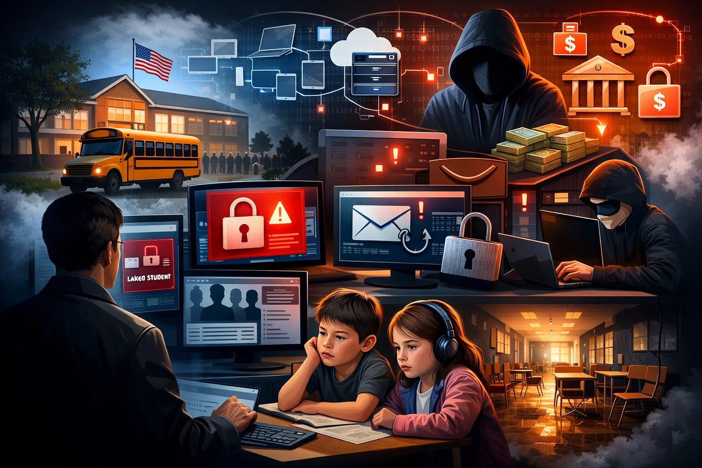
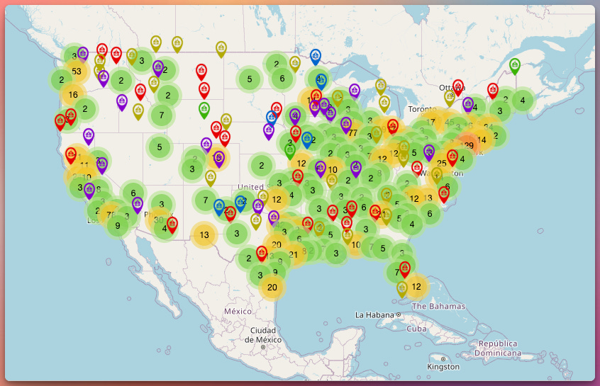

# The K12 Cyber Reality Check 

*Pt 1: It’s Not “If,” It’s “Every School Day”*

If you lead or support a U.S. public school district, cybersecurity can’t live in the “IT problem” bucket anymore. It’s a continuity-of-learning issue, a financial risk issue, and a student privacy issue, often all at once.

Here’s the reality that tends to get lost in broader “education sector” conversations: K12 public schools experience cyber incidents so frequently that, on average, more than one publicly reported incident occurs per school day. That’s not a prediction or a hypothetical. It’s what multi-year incident tracking and post-incident reporting patterns have shown across the country. This is easy to see with a glance at [K12SIX’s K12 Cyber Incident Map](https://www.k12six.org/map) that plots this data from 2016-2022.

[Click here to interact with K12SIX’s Cyber Incident Map](https://www.k12six.org/map)

If your first reaction is, “Why would anyone target a school district?”, then you’re asking the most common question district leadership asks right before (or right after) an incident.

This article is the first in a series that translates what the data says about K12 cybersecurity risk into a leadership-friendly frame: why districts are targeted, what actually happens in common incidents, and what decision makers can do this semester that measurably reduces risk. We will also avoid fear-based marketing while we focus on cyber threats specific to K12, and not the education or technology communities at large.

## Why K12 gets hit: “soft targets” with high leverage

School districts are targeted for the same reason thieves try car doors in a parking lot: it’s opportunistic, scalable, and it often works.

Most K12 cyber incidents aren’t the result of cinematic hacking. They’re the result of known weak points like stolen passwords, phishing emails, misconfigured systems, and vendor breaches, colliding with a sector that’s historically under-resourced for security.

Districts carry a unique combination of factors that attackers love:

- **High operational pressure.** When payroll, transportation, attendance, cafeteria systems, and student information systems are disrupted, districts can’t wait it out the way some organizations can. Instructional time is a hard deadline.
- **Sensitive data at scale.** K12 systems hold student and staff records that can include Social Security numbers, addresses, health information, discipline records, and more. Minors’ identities are especially valuable because misuse can go undetected for years.
- **Resource constraints.** Many districts have small IT teams, limited security staffing, and aging infrastructure. In many places, security is one responsibility among many and not a dedicated function. It’s frequently an entire knowledge domain that falls into the “other duties as assigned” bucket.
- **A large and expanding attack surface.** Districts now depend on a dense ecosystem of edtech platforms, vendor integrations, cloud tools, and connected devices. That’s progress for instruction, but the complexity increases risk. Anecdotally, my district has gone from 6 rostered applications when I started working there in the 2009, to close to a hundred today.

The result is that K12 is frequently treated as a soft target where the payoff (whether it’s money, data, or access to robust infrastructure) is meaningful and the resistance is inconsistent.

## “Education sector” stats can mislead: K12 is its own category

A second reason many districts underestimate their risk is the way cybersecurity data is commonly presented.

Many headlines and vendor reports bundle K12 schools, colleges, and universities into a single “education sector” story. But K12 and higher education operate in different contexts, and that difference matters when you’re deciding where to spend time and money.

Higher ed does face ransomware and fraud, but universities are also targets for nation-state espionage and intellectual property theft, especially where research is involved. K12 generally is not. K12 attacks are overwhelmingly driven by financially motivated criminals who focus on ransomware, scams, and data theft. There is also a healthy dose of insider and student-driven incidents. Recent changes to compliance requirements for controlled unclassified information (CUI) in higher ed have highlighted this different landscape with the recent mandate for CMMC compliance.

When K12 and higher ed are blended, district leaders can get the wrong impression, either that the threat is too exotic to plan for (“We’re not a research university, so why us?”) or that the only meaningful response is expensive technology. The K12 reality is more specific: it’s about resilience against common, repeatable attack patterns.

## What “cyber incident” really means in a district

Cybersecurity can feel abstract until you define it in operational terms. For K12 districts, the most common incident outcomes are straightforward:

### 1) Ransomware and extortion

Ransomware has become a defining K12 threat because it targets what districts need most: uptime. Attacks can encrypt servers, disable authentication, and disrupt core services for days or weeks. Increasingly, attackers also steal data first, then use public leaks as pressure.

For leaders, the defining feature of ransomware isn’t the malware, it’s the decision environment it creates: restore from backups under stress, manage communications, and absorb real costs whether you pay or not.

### 2) Data breaches (often through vendors)

Data breaches remain common in K12, and a striking share originate outside the district through third-party platforms, service providers, and software vendors. When a vendor is compromised, dozens or hundreds of districts can be affected at once, even if each district’s internal security is solid.

This is one of the most important leadership takeaways: district cybersecurity is only as strong as the vendor ecosystem you rely on. Procurement is security.

### 3) Email-based fraud and impersonation

Business email compromise (BEC) and invoice scams hit districts because districts process payments, contracts, payroll, and purchasing, often with lean staffing and high transaction volume.

These incidents aren’t “tech problems.” They’re workflow problems: verifying changes to bank details, confirming invoices, and hardening approvals for financial actions.

### 4) Disruption incidents: DDoS, student mischief, and misconfiguration

Districts also face “messy middle” incidents: denial-of-service attacks that knock systems offline, students attempting to bypass controls, or staff accidentally exposing data through a configuration mistake. These may be dismissed as pranks or glitches, but they’re signals that internal controls need tightening.

## The consequences aren’t hypothetical

A major K12 incident rarely stays contained to the server room. The impacts are the kinds that show up on a superintendent’s desk:

- **Instructional disruption.** Systems outages can cancel classes, disrupt attendance and grading, and break online learning workflows.
- **Financial cost.** Even without paying ransom, recovery can include external incident response support, device replacement, system rebuilds, and long-term security improvements.
- **Privacy harms.** When student and staff records are exposed, the downstream effects can include identity theft attempts, fraud, and long-term reputational harm for individuals.
- **Safety and trust impacts.** Some incidents involve harassment, threats, or the compromise of communication systems, shifting the event from an IT issue to a community safety concern.

The leadership reality is that cyber incidents create multi-domain emergencies: operations, communications, legal, and instruction all collide at once.

## Why risk perception lags behind reality

Even as districts increasingly rank cybersecurity as a top priority, many still underestimate their likelihood of being hit. That gap comes from a few predictable dynamics:

- **“We’re too small / too rural / too normal.”** Attackers don’t need your district to be special. They need you to be reachable and vulnerable.
- **Compliance confusion.** Being aligned with FERPA, CIPA, or state privacy requirements doesn’t automatically mean you have strong cybersecurity controls. Privacy rules and security controls overlap, but they aren’t the same thing.
- **Event-driven attention.** Big incidents make headlines. The steady drip of smaller incidents often doesn’t. That can create a false sense that cyber risk is rare. In my district of 1000 employees and 5500 students, we experience between 40,000-60,000 malicious M365 signin events EACH DAY.

A useful mental model for leaders is to treat K12 cybersecurity less like preventing every fire and more like fire safety: reduce ignition sources, limit spread, and practice evacuation. You still want prevention, but resilience is the goal.

## What this series will do (and what it won’t)

Over the next 8 posts, we’ll focus on what K12 incident data and post-2020 trends consistently show:

- Why districts are targeted and how attackers apply pressure
- The K12 threat actor landscape (ransomware crews, scammers, students, vendors)
- The most common entry points: phishing, credential compromise, remote access, and vendor pathways
- The operational and human impact: downtime, costs, privacy harms, and trust
- A leadership-ready action plan: the controls and governance moves that reduce risk fastest

What we won’t do: hype nation-state narratives where they don’t fit, exaggerate “attack counts” based on vendor marketing metrics, or prescribe a shopping list of tools without governance and process.

## A leadership starter checklist (for this week)

Before we go deeper, here are five questions every district leadership team can answer now, without being security experts:

1. Do we have MFA enforced for staff email, finance systems, and remote access?
2. Do we know which 5 vendors hold the most sensitive student data, and what their breach notification timelines are?
3. If the student information system is down for five days, what’s our continuity plan for attendance, IEP workflows, and parent communication?
4. Do we have an incident communication plan with clear roles (superintendent, legal, IT, communications, principals)?
5. Do we have **tested** backups and a **practiced** recovery process (not just backups that exist)?

I also want to frame this discussion: if the answers to any of those are unclear, that’s not failure: it’s a roadmap for improvement.
