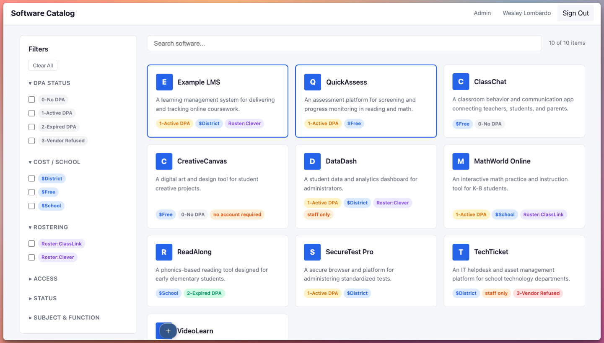
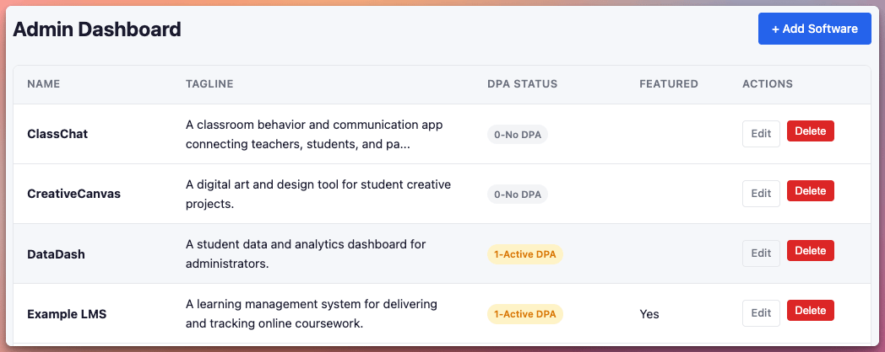
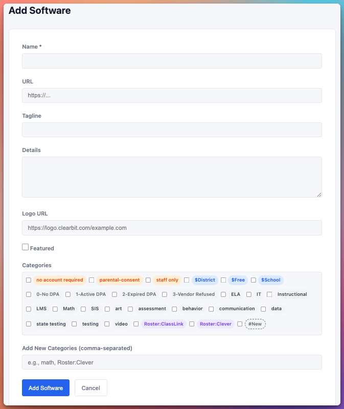

# Building a Searchable Software Catalog for School Districts

*Clone it and use as-is, or fork it and make it your own*

School districts often maintain long lists of approved educational software. These lists may live in spreadsheets, internal documents, ticketing systems, or, more chaotically, spread across multiple locations. This makes software catalogs historically difficult to generate, search, filter, and maintain. As the number of tools grows, so does the complexity of managing cost, privacy agreements, rostering methods, and approval status. Especially considering the SaaS explosion in EdTech, many districts were wholly unprepared to manage software at scale.

In my district, this problem existed in the back of my mind as a To Do that always fell into the “we’ll get to that next” category. Following legislation in my state regarding tracking appropriateness of software available to students, getting the software catalog for my district into order quickly rose to a top-level priority. Simultaneously, we doubled down on managing Data Privacy Agreements, and needed a home base to keep everything centralized and cataloged. Most importantly for generating buy-in, it also had to be easily accessible and searchable by teachers, administrators, and IT staff.

To address this challenge, I built a lightweight, searchable software catalog web application designed specifically for school district staff. The goal was simple: create a centralized, secure, and easy-to-manage directory of approved software tools.

GitHub Repo: <https://github.com/BardSec/software-catalog-public>   
(The Readme.md file has detailed installation instructions)

This article walks through the problem the tool solves, the architecture behind it, and lessons learned during development. For a more detailed step-by-step of how to set up the software catalog on your own, I’ve made [a quick video walkthrough here](https://www.youtube.com/playlist?list=PLGqXwsROZhsK96Ec9P6X7fIckf9OUBtuG). Fair warning… a professional streamer, I am not.

## The Problem: Software Sprawl in K12 Environments

In many districts, educators ask similar questions:

- Is this tool approved?
- Who manages it?
- Does it integrate with our rostering system?
- Has a data privacy agreement been signed?
- Is it free, licensed, or department-funded?

Without a central system, staff often rely on email threads or static documents. This creates inefficiencies and increases the risk of shadow IT.

The software catalog aims to bring clarity and structure to this process.

## **What the Application Does**

At its core, the application is a searchable, filterable directory of software used within a district. It includes:

- Real-time search by software name
- Filtering by categories and attributes
- Administrative controls for managing entries
- Secure single sign-on (SSO) integration with M365 of Google Workspace
- Responsive design for desktop and mobile use

District staff can quickly browse approved tools, while administrators maintain full control over the catalog’s content.

## **Authentication and Access Control**

Security is essential for internal district tools. The catalog integrates with existing identity providers using OIDC. Administrators can configure:

- Allowed email domains
- Designated admin accounts
- OAuth client credentials

This approach ensures only authorized staff can access the system while leveraging existing identity infrastructure. It also improves adoption by removing the need for separate usernames and passwords.

## **Deployment Workflow**

The project is designed for easy local development and production deployment using Docker. If you have experience with Docker, you should be able to go from start to finished product in 10-15 minutes. If you prefer a little bit of scaffolding, I’ve made [a separate video companion](https://www.youtube.com/playlist?list=PLGqXwsROZhsK96Ec9P6X7fIckf9OUBtuG) to this article where we walk through the process step by step installing to a virtual private server in the cloud. On-prem deployments work similarly with any VM running docker.

There are more details in the [GitHub Repos Readme file](https://github.com/BardSec/software-catalog-public/blob/main/README.md), but in general, the typical deployment workflow looks like this:

1. Clone the repository
2. Copy the environment configuration template
3. Add OAuth credentials and domain settings
4. Build and run using Docker Compose

The application seeds its initial data from a JSON file, making it easy to preload existing software records.

Because the entire application runs inside containers, it can be deployed on-premises, in the cloud, or behind services like reverse proxies or secure tunnels ([like we did here on our write up of Apache Guacamole in 2024](https://www.edtechirl.com/p/using-cloudflare-to-expose-local?utm_source=publication-search)).

## **Design Considerations for Educators**

When designing internal tools for school districts, usability matters as much as functionality. Some key design decisions included:

**Real-time filtering.** Educators need quick answers. Immediate filtering reduces friction and improves efficiency.

**Clear metadata display.** Important attributes—such as cost model, rostering method, and privacy status—should be easy to interpret at a glance.

**Administrative simplicity.** District IT teams are often small. The admin interface prioritizes straightforward creation and editing operations without complexity.

**Responsive layout.** Staff may access the catalog from a classroom laptop, district desktop, or mobile device.

The guiding principle was clarity over complexity from deployment to usage.

## **Lessons Learned**

Building this tool reinforced several important ideas about educational technology systems:

**1. Internal tools do not need to be over-engineered.** A simple application can solve real operational problems. If you’ve never done anything with Docker, dive in and it will rock your world.

**2. SSO dramatically improves adoption.** When staff can log in using familiar credentials, usage increases and support requests decrease.

**3. Centralization reduces redundancy.** A shared catalog helps prevent duplicate purchases and encourages better technology decision-making.

**4. Transparency builds trust.** When educators can see which tools are approved and why, they are more likely to follow established processes.

## **Potential Enhancements**

Future iterations could include workflows for new software approvals. There is also potential to expand this into a more comprehensive software governance platform.

I’d also like to setup automatic backups of the JSON file that contains all of the software entries.

If you’re so inclined, this project can be forked, edited, or tweaked to your heart’s content.

## **Why This Matters**

As districts continue adopting new digital tools, managing software effectively becomes a strategic priority. A searchable, secure catalog is a small but meaningful step toward better governance, stronger data privacy practices, and improved communication between IT and instructional staff.
