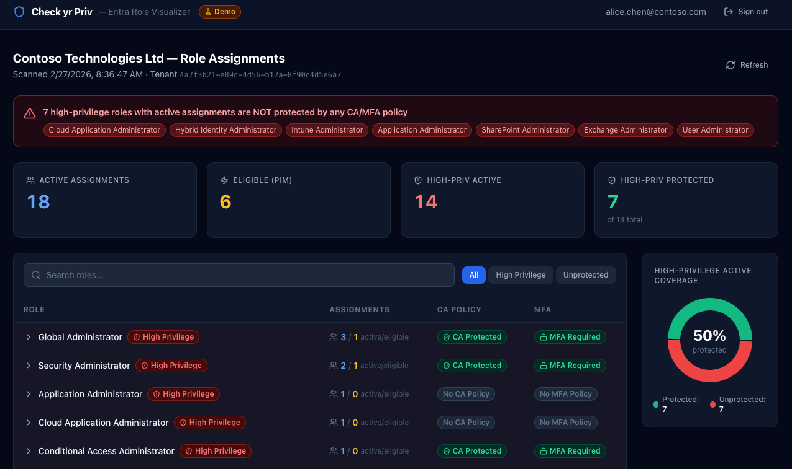
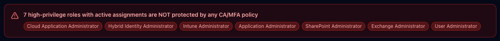
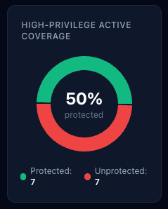
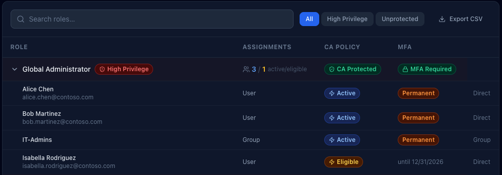

# Check Your (Least) Privilege

*Seeing Privilege Clearly in Microsoft Entra with Check yr Priv - Entra Role Visualizer*

Every Microsoft 365 tenant has a privilege story.

Not the one in the documentation. The real one.

The one shaped by staff turnover, emergency access, vendor onboarding, inherited configurations, and “just for now” role assignments that never quite got revisited.

Over time, privilege doesn’t explode. It drifts.

We all believe in least privilege, but belief and visibility aren’t the same thing. Unless you deliberately examine who holds power inside your tenant, and how that power is protected, “least privilege” becomes more principle than practice.

That’s what led me to build **[Check yr Priv](https://github.com/BardSec/check-yr-priv)** (short for *Check Your Privileges)*, a web application that connects to Microsoft Entra ID and answers a deceptively simple question:

Who actually holds the powerful roles in my tenant, and are those assignments properly protected?

## **The Visibility Problem**

Microsoft Entra provides all the raw ingredients. You can inspect directory roles. You can review Privileged Identity Management (PIM) assignments. You can analyze Conditional Access policies and MFA enforcement. You can comb through audit logs.

But answering a governance question requires jumping between blades, interpreting scopes, and mentally correlating role status with authentication controls.

Even experienced administrators can struggle to answer:

- Which high-privilege roles are permanently active?
- Which assignments are PIM-eligible versus always-on?
- Are our active Global Administrators protected by Conditional Access?
- Where are we exposed?

In K12 and higher education environments, where staffing shifts frequently, responsibility is distributed, and “temporary” access often becomes permanent, those questions aren’t theoretical. Privilege accumulates quietly. Check yr Priv is an attempt to make that accumulation visible.

## **What Check yr Priv Does**

The app connects to your Entra tenant using delegated Microsoft Graph permissions and reads:

- Directory role assignments
- PIM eligibility and activation status
- Conditional Access policies

It then overlays those datasets to surface something more meaningful than a list of roles: Are high-privilege assignments both necessary and protected?

When you sign in, you see a summary of active assignments, PIM-eligible roles, and how many high-privilege roles are covered by Conditional Access or MFA requirements. If there are permanently active high-privilege assignments without policy protection, they’re surfaced immediately with no hunting required.

There’s also a visual indicator showing the percentage of high-privilege active assignments covered by Conditional Access or MFA. It isn’t a compliance metric. It’s a clarity metric.

You can filter down to high-privilege roles only. Or to unprotected assignments only. Or export a CSV of the data. The goal isn’t exhaustiveness for its own sake. It’s focus.

Want to play in the dashboard? Go [explore a demo here](https://priv.bardsec.com). (There is a Microsoft signin button for show, but it won’t actually login to Microsoft… if you’re paranoid (like you should be), you can open it in incognito mode to feel at ease that it isn’t grabbing your tokens or anything).

## **What Counts as High Privilege?**

Not every role represents equal risk. Some are scoped and limited. Others grant broad tenant-wide or identity-level control.

Check yr Priv flags roles such as:

- Global Administrator
- Privileged Role Administrator
- Security Administrator
- Exchange, SharePoint, and Intune Administrator
- User Administrator
- Privileged Authentication Administrator
- Hybrid Identity Administrator
- Cloud Application and Application Administrator
- Conditional Access and Authentication Policy Administrator
- Directory Synchronization Accounts

These are the roles where permanent assignment without strong authentication controls becomes institutional risk. In an education tenant, a compromised Global Administrator account isn’t just an IT incident. It’s a district-wide operational event.

## **How It’s Built (Briefly)**

Check yr Priv is fully Dockerized. A React frontend handles visualization, while a FastAPI backend manages authentication and Microsoft Graph queries. Sessions are stored server-side in Redis, and all Graph calls use delegated permissions, meaning the app can only see what the signed-in administrator is authorized to see.

Tokens are stored server-side and never exposed to the browser beyond a signed session cookie. Cookies are configured with HttpOnly and appropriate security flags. No directory data is persisted beyond the session lifetime. Nginx rate-limits authentication and API endpoints.

In other words, the tool is built to sign in, assess, and sign out (though I have added CSV export so you can track changes over time).

## **Why This Matters in Education**

Educational institutions are uniquely prone to privilege drift.

We operate with small teams wearing many hats. We rely on contractors and vendors. We move quickly to solve instructional and operational needs. We often grant access to solve a problem and move on to the next one.

Over time, that creates invisible exposure.

Check yr Priv isn’t meant to replace formal auditing tools or governance frameworks. It’s a visibility layer. A conversation starter. A way to turn abstract role assignments into something tangible.

It helps IT leaders and technologists ask:

Are we relying too heavily on permanent assignments?

Are we using PIM the way we think we are?

Do our most powerful roles require strong authentication controls?

Sometimes the answers are reassuring. Sometimes they aren’t.

Either way, seeing clearly is better than assuming.

## **Getting Started**

If you’re comfortable with Docker and Entra app registrations, setup is straightforward. Clone the github repo: <https://github.com/BardSec/check-yr-priv> to your server and:

1. Create an Entra App Registration in Azure.
2. Grant delegated Microsoft Graph permissions for directory, role management, PIM, and policy read access.
3. Add a client secret.
4. Configure environment variables.
5. Run the container and sign in with your Work or School Microsoft account.

Within a few minutes, you’re looking at your tenant through a privilege lens rather than a configuration lens.

\*\*\*More detailed setup instructions are included in the [github repo’s Readme file](https://github.com/BardSec/check-yr-priv).

## Who Can Use Check Yr Priv

Unless you limit sign-ins to specific users or groups in Azure through the Enterprise Apps blade (**which I recommend**), anyone in your tenant can sign in to Check Yr Priv. However, what they see is based on their actual Microsoft roles coupled with what scopes are requested. The requested scopes are:

- User.Read: covers /me - always granted for any authenticated user with permission to access the app
- Directory.Read.All - covers /organization
- RoleManagement.Read.All - covers /rolemanagement/directory/roleDefinitions and /roleassignments
- PriviledAccess.Read.AzureAD - covers /roleAssignmentScheduleInstances and /roleEligibilityScheduleInstances
- Policy.Read.All - covers /identity/conditionalAccess/policies and /namedlocations
- AuditLog.Read.All - planned for V2

To be able to view all data, users must have one of these roles:

- Global Administrator
- Global Reader\*
- Privileged Role Administrator (can’t view Conditional Access details, so this part of the dashboard will be skewed if this is the only role the user has)
- Security Administrator
- Security Reader\*

To keep with the least privilege theme, the minimum recommended role for the app to work is either Global Reader or Security Reader. Both are read-only and cover all three data sources the dashboard renders.

## **Final Reflection**

Least privilege isn’t something you declare. It’s something you maintain, and maintenance requires feedback.

In educational technology, we spend much of our time enabling access, whether it be to systems, to data, or to tools that support teaching and learning. That work matters. But periodically, we have to step back and ask whether the access we’ve granted still aligns with our risk tolerance.

Check yr Priv is about understanding what an attacker could do with access to a compromised account, because once you can see clearly, you can decide what to change.
