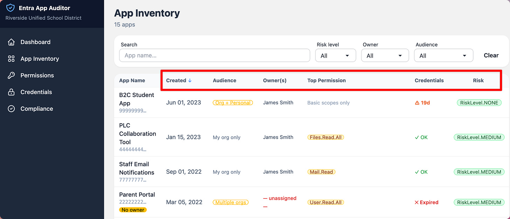
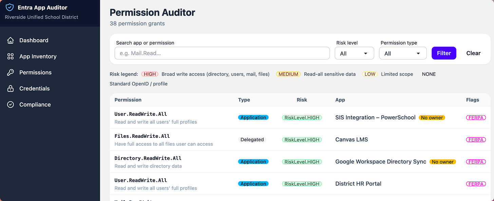
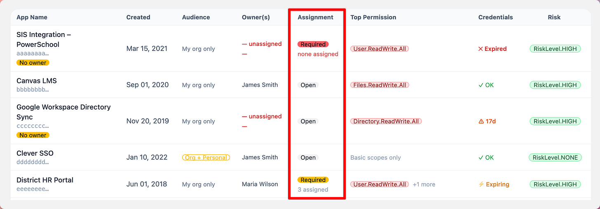
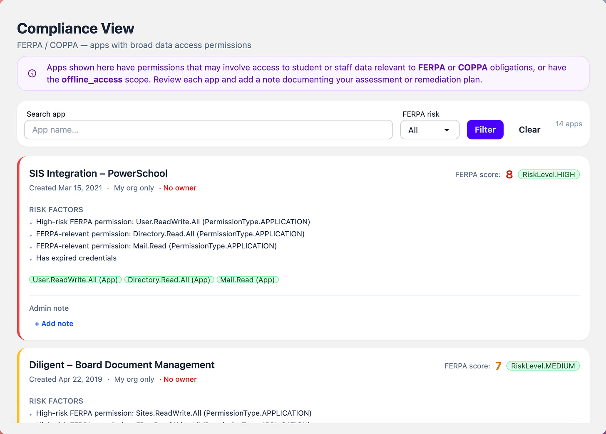
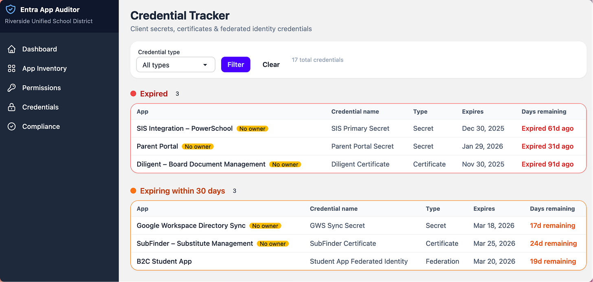
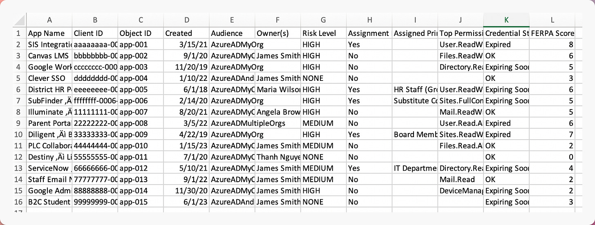

# Audit Azure App Registrations with Entra App Hunter

*What We Miss During Compromised Account Cleanup*

It usually starts the same way:

A suspicious sign-in.

An MFA fatigue report.

A staff member who clicked something they shouldn’t have.

You confirm it: the account was compromised.

The response playbook kicks in immediately. You reset the password. Revoke sessions. Force token invalidation. Review sign-in logs. Check mailbox rules for forwarding or hidden exfiltration. Audit SharePoint and OneDrive activity. Verify MFA methods ([like we talked about here](https://www.edtechirl.com/p/phishing-persistence-10-steps-to)).

The visible damage gets contained.

And then someone asks the harder question:

Are we sure they’re out?

A few weeks ago, I wrote about these hidden persistence mechanisms attackers use after a successful phishing compromise and why simply resetting a password often doesn’t remove an adversary from a Microsoft 365 environment. In *[Phishing Persistence: 10 Steps to Securing a Compromised M365 Account](https://www.edtechirl.com/p/phishing-persistence-10-steps-to)*, the focus was on digging into compromised accounts, auditing MFA methods, and hunting down OAuth refresh tokens and malicious app grants that keep attackers connected long after credentials change.

A week earlier, in *[M365 Compromised Account Triage: OAuth Persistence](https://www.edtechirl.com/p/m365-compromised-account-triage-oauth)*, I laid out why OAuth consent and refresh token persistence are among the most overlooked paths to long-term unauthorized access, and why defenders need to treat delegated app permissions as first-class persistence issues.

Both articles circled the same idea: identity is infrastructure. Visibility into identity — who can do what, under what conditions, and for how long — is central to risk management in modern education environments.

In both cases, the root problem wasn’t just how attackers got in. It was how long they could stay in, and what permissions they could leverage once inside. If phishing persistence and OAuth persistence expose gaps in session control and token hygiene, privilege visibility exposes gaps in oversight.

## **The Part of the Tenant We Don’t Check First**

In real-world compromises, attackers don’t always rely on passwords for persistence. They look for more durable access:

- OAuth consent grants
- Delegated Microsoft Graph permissions
- Service principals with broad directory access
- Applications capable of reading or modifying users
- Long-lived client secrets that bypass user authentication entirely

These aren’t hypothetical edge cases. They’re structural features of how modern cloud identity works. In K12 districts, where years of integrations pile up quietly, application permissions often outlive the staff who originally approved them.

An attacker who lands in a mailbox might pivot into:

- Directory reconnaissance
- User modification
- Group membership changes
- Data harvesting via Graph
- Creation of additional application credentials

Once an application-level foothold exists, password resets don’t necessarily touch it. That realization is what led me to build **Entra App Hunter**.

## **Built From the Cleanup Question**

Entra App Hunter is a security auditing tool for Microsoft Entra ID that’s designed specifically for K12 IT teams. It focuses on the layer most districts don’t systematically review during incident response: application access.

When connected to a tenant, App Hunter surfaces:

- Every app registration and enterprise application
- All Microsoft Graph API permissions, classified by risk
- High-impact scopes like Directory.ReadWrite.All, User.ReadWrite.All, and Application.ReadWrite.All
- Expired or long-lived client secrets
- Applications with no assigned owner
- Apps configured for multi-tenant or personal Microsoft account access

Instead of scrolling through the Azure portal during an active incident, you get a prioritized view of what could realistically expand blast radius.

It answers a critical question:

If this account was abused, what infrastructure could it have touched?

## **The K12 Reality**

Most school districts don’t have dedicated identity governance teams. They have small IT departments balancing help desk tickets, device rollouts, SIS integrations, state reporting, and cybersecurity at the same time.

Applications get registered out of operational necessity. Permissions get granted to make something work. Secrets get created during a deployment and rarely revisited.

No one intends to create risk, but over time, forgotten attack surface accumulates.

And that surface is rarely audited until something goes wrong.

## **Before the Next Incident**

Entra App Hunter is intentionally simple. It can run in mock mode for demonstration [(check it out at https://app-hunter.bardsec.com)](https://app-hunter.bardsec.com), or connect to a real tenant using app-only Microsoft Graph permissions.

App Hunter isn’t a SIEM. It’s an inspection tool built from the perspective of someone who has gone through compromised account cleanup and realized there was a second layer no one was reviewing carefully enough.

Compromised account response shouldn’t stop at resetting the password, revoking sessions, and re-enrolling MFA. It should also include inspecting the application layer, the quiet infrastructure that may persist long after the visible symptoms are addressed.

If identity is the control plane of Microsoft 365, then applications define the blast radius.

Entra App Hunter exists to help you measure that radius before — and after — an incident forces you to.

## Features

### Inventory Sorting

The app inventory can be sorted by creation date, audience, owners, permissions, or risk level. In the case of triaging a compromised account, the date sort makes it easy to look for apps created during the compromised period, and then quickly assess the risk level based on permissions.

### Permissions Audit

Using the Permissions Audit tab, you can hunt for overly permissive apps by looking for specific permission grants.

## Access Creep

Another danger of App Registrations/Enterprise Applications in M365 is over-permissive access. In M365 App Registrations, the default behavior is to let anyone in your tenant access the application. That makes it easy to set up an application and unintentionally make it available to more people than you intend. The App Inventory screen lets you view an app’s assignment scope at a glance. Ideally, access to an app should only be provided to users who need it. This view helps you see if an app that should only be used by IT staff is actually available to everyone in your tenant. This feature is also sortable.

### Compliance Check

Another app risk is the accidental over-exposure of student data. The Compliance view identifies apps with broad permissions to read directory data, an attribute that makes an app more likely to lead to a FERPA compliance issue.

### Secrets Housekeeping

Outside of compromised accounts, Entra app registrations also run the risk of interrupting operations if their client secrets expire. The dashboard also has a credential tracking that lets you know which applications have expired secrets or certificates, with a timeline of what’s expiring in the next 30 days, 31-60 days, and 61-90 days.

### CSV Export

Create archival history of your M365 app status by running CSV exports from the App Inventory page.

## How Can You Get App Hunter?

App Hunter is an application that runs inside of a Docker container, and it can run on a local server, or a cloud-based server through a service like Linode, Digital Ocean, AWS, GCP, or Azure. The project can be downloaded from [my GitHub here](https://github.com/BardSec/app-hunter). Quick start instructions can be found in the repo’s Readme file.
