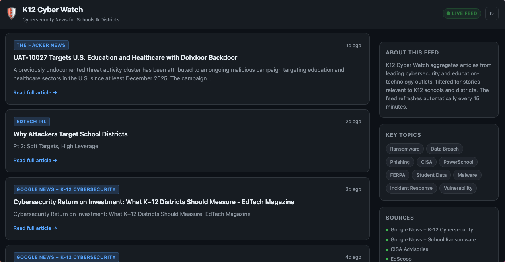

# K12 Cyber Watch: An EdTechIRL landing page for K12 cyber news

*Because even in 2026, RSS is still cool*

I’m launching something new under the EdTech IRL umbrella: **K12 Cyber Watch**, now live at **[news.edtechirl.com](https://news.edtechirl.com)**.

If you’ve ever tried to monitor school-focused security news through general industry feeds, you know how much noise there is. Important stories about districts, student data, and ransomware attacks are mixed in with enterprise breaches and consumer vulnerabilities. The signal is there, but it is hard to track consistently.

K12 Cyber Watch filters that signal.

The tool aggregates articles from 20+ sources, including CISA, EdScoop, StateScoop, Bleeping Computer, Dark Reading, SecurityWeek, targeted Google News searches, EdTech IRL, and the Zero Breach Zone podcast. General security feeds are checked against a K12 keyword list so that only education-relevant stories surface, and K12 feeds are checked against a cybersecurity keyword list. Articles are deduplicated and cached in memory, refreshing every fifteen minutes, with no database required.

The interface is simple. Users can search, filter by source, sort results, and browse through paginated articles. A quick-access tag cloud highlights common K12 topics such as ransomware, FERPA, and PowerSchool. The goal is to make it easy for district leaders, technologists, and security teams to see what matters at a glance.

If there is an RSS feed I’ve missed, please let me know in the comments to have it added to the filtered news sources!
