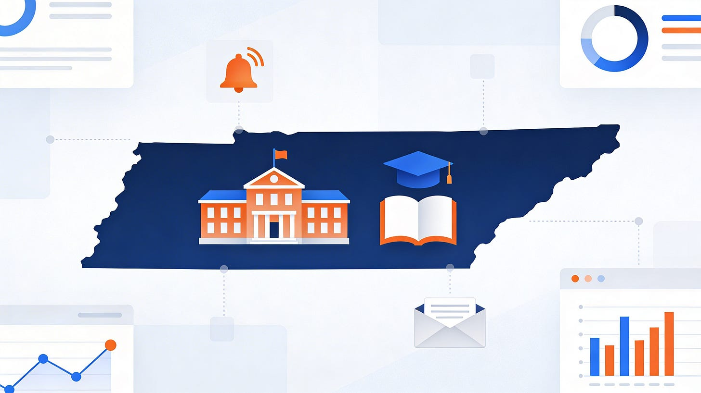
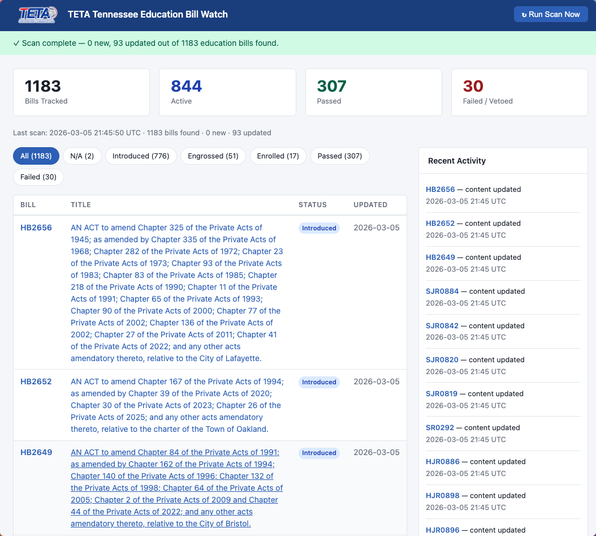

# Tennessee Bill Watch: A New Way to Stay Informed on Tennessee’s Education Legislation

*Don't worry: There are some nuggets for Non-TN folks as well*

Keeping track of what’s happening in the Tennessee legislature can feel like a full-time job, especially if your focus is education. With dozens of bills being introduced, amended, or voted on each session, it’s easy to miss key developments that impact teachers, students, and schools statewide. I’ve added [TN Bill Watch](https://bills.edtechirl.com) ([bills.edtechirl.com](https://bills.edtechirl.com)) to the EdTechIRL umbrella to help change that.

TN Bill Watch is an open-source tool that automatically monitors Tennessee legislative activity related to education. Using the LegiScan API, it identifies new bills, watches for status changes and text edits, and notifies you as soon as something new appears. All bill data is cached locally in the app.

Beyond its monitoring engine, TN Bill Watch includes a built-in web dashboard that turns raw data into clear, searchable insights. Users can browse all tracked bills, apply filters, view summaries and recent activity, and explore detailed bill pages complete with sponsors, subjects, and change histories. It’s a simple but powerful interface for staying connected to how education policy evolves day by day.

Behind the scenes, TN Bill Watch uses smart filtering to focus only on the bills that matter most. By checking over 38 education-related keywords and subject tags, it filters out unrelated items like honorary resolutions and keeps the reporting focused. Each legislative document is hashed for comparison so that changes are detected efficiently without wasting API calls or bandwidth.

The current project linked here is Tennessee-specific as I created it primarily for use with TETA, the Tennessee Educational Technology Association ([membership is free - join now!](https://www.teta.org/)), however the [repository linked here](https://github.com/BardSec/tn-bill-watch) can be adapted to any state with just a little tinkering and your own API key for LegiScan.

Whether you’re an educator, advocate, journalist, or engaged citizen, TN Bill Watch offers an efficient, transparent way to keep tabs on legislative developments that shape Tennessee’s classrooms. The project also supports Docker, letting you deploy it with a built-in daily scheduler or run it manually through the command line.

If you’d like to try it yourself, setup is straightforward: clone the repository, configure your  .env  file with a free LegiScan API key, and start watching bills in minutes. The code and documentation are [available now on GitHub](https://github.com/BardSec/tn-bill-watch).
