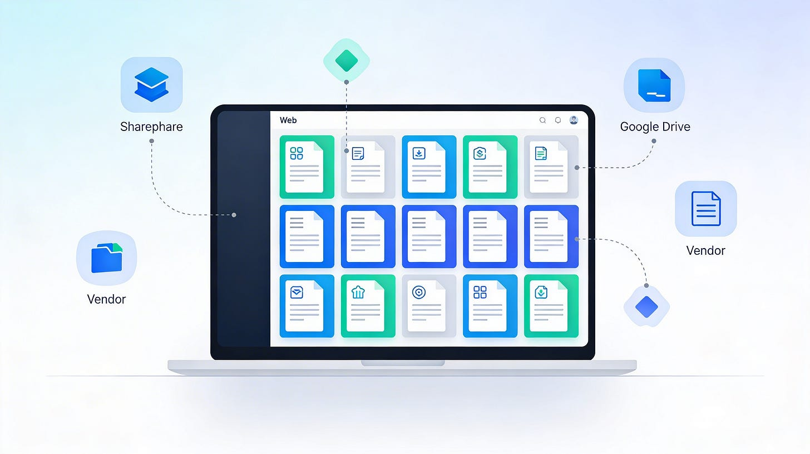
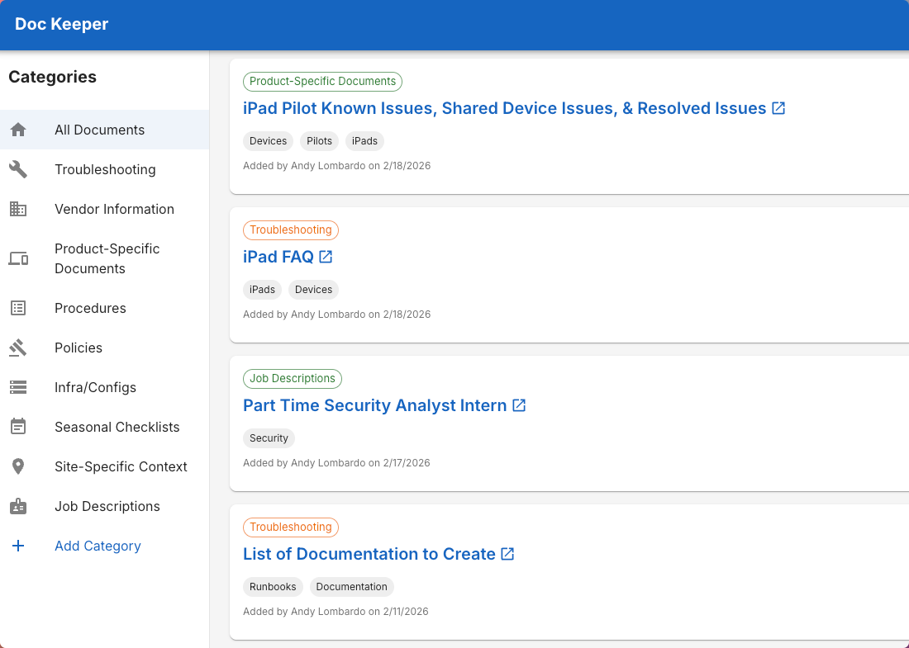
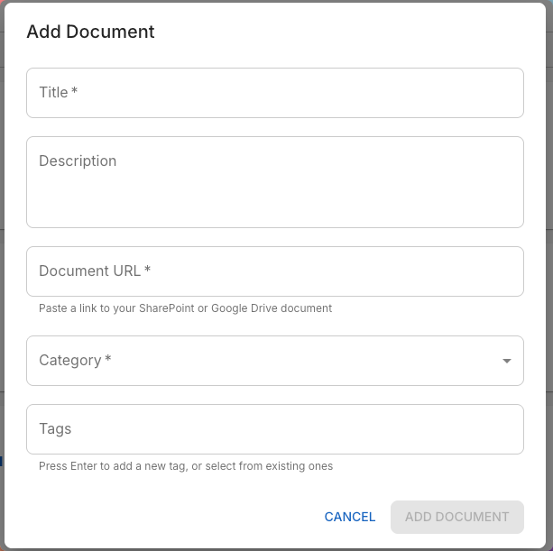

# Doc Keeper: Bringing Order to IT Documentation Chaos

If you work in IT, you know how documentation sprawls. Over time, your once-pristine Google Drive or SharePoint collection becomes a maze of folders within folders, each holding pieces of valuable technical knowledge: troubleshooting guides, vendor setups, install notes, license keys, and those one-off “don’t forget this” PDFs.

I’ve always loved SharePoint and Google Docs for what they are: reliable, familiar platforms with high availability and no vendor lock‑in beyond your organization’s core ecosystem. For many school districts, businesses, and IT teams, they make perfect sense as the home for documentation. But the more you use them, the more one problem becomes clear: scale turns simplicity into a slog.

Finding anything beyond your most recent document turns into a click‑fest. You can organize meticulously with folders and naming conventions, but every layer of organization adds more clicks between you and what you’re looking for.

That’s the idea behind DocKeeper, a simple overlay designed to make all that documentation navigable again.

## A Layer, Not a Replacement

Doc Keeper doesn’t store your documents. It links to them — whether they live in SharePoint, Google Drive, or somewhere else entirely. Think of it as your documentation dashboard: one lightweight interface that indexes, tags, and categorizes everything you already have, regardless of platform.

You can bring in links to internal files, external vendor PDFs, or even web‑based documentation. Each entry gets categorized (Troubleshooting, Vendor Information, or Product‑Specific Docs) and tagged with key terms that make future searches dramatically faster.

## Designed for Search, Speed, and Sanity

Instead of navigating folder trees, you can search across titles, descriptions, and tags in one place. Tags are reusable and flexible, so your team can develop an internal taxonomy of technologies and product names that stays consistent across documents.

The clean, responsive user interface makes it easy to browse on desktop or mobile, and since authentication runs through OAuth, users can sign in with their existing Microsoft 365 or Google Workspace accounts, which means no new passwords, no separate identity management, and an ability to provide role-based access.

For good measure (because I hate vendor lockin), you can also run JSON exports of anything you’ve added to DocKeeper. You can also restore the contents of DocKeeper from JSON if you migrate to a new container.

Behind the scenes, FastAPI powers the backend with a RESTful API, React and Material UI run the frontend, and PostgreSQL 16 handles data storage. Deployment is Docker‑based for simplicity, with optional Cloudflare Tunnel integration for secure external access.

## Why This Matters

Most IT departments already have good documentation. The issue isn’t content; it’s access. Every extra click slows down troubleshooting. Every confusing folder tree discourages new team members from learning the system. DocKeeper solves this not by replacing where your documentation lives, but by adding a smart layer on top that makes finding it effortless.

It’s a tool built not to disrupt your workflow, but to amplify the systems you already trust.

## Ready to Try It?

You can run DocKeeper locally or deploy it with Docker in a few simple steps. Once connected with either OAuth provider (Microsoft or Google), you’re ready to start tagging, organizing, and searching your documentation system with ease.

To explore a demo of the UI with dummy data, check it out here: <https://docdemo.bardsec.com/>

For setup instructions and full technical details, visit the project repository found here: <https://github.com/BardSec/doc-keeper>

If managing IT documentation feels like wrestling with folders, it’s time to let DocKeeper bring clarity back to your content.
