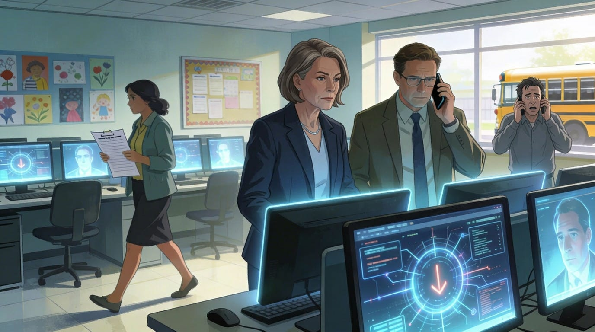

# When Systems Go Down

*Pt 5: Instructional Disruption, Costs, and the Human Impact of K12 Cyber Incidents*

For district leaders, a cyber incident doesn’t begin with malware or log files. It begins with phone calls.

A principal can’t take attendance. Payroll didn’t run. Transportation can’t access routes. Parents are calling to ask whether their child’s information is safe. Teachers stand in front of students without the systems they rely on. This is where cybersecurity stops being an abstract risk and becomes an instructional, financial, and human crisis.

In this post, we look at what actually happens after a K12 cyber incident: what breaks first, what costs accumulate, and why recovery almost always takes longer than leaders expect.

## Instructional disruption: the first visible impact

The most immediate consequence of a major cyber incident is loss of instructional continuity. When core systems go offline, student information systems can no longer track attendance, grades, or schedules. Learning management platforms and digital curriculum become inaccessible. Email, communications, transportation, food service, and even special education documentation often stall.

In ransomware cases, districts sometimes cancel classes altogether for days or even weeks. In others, instruction continues only in a degraded, improvised form. Handwritten attendance, paper-based lessons, and postponed assessments become the norm. While handling these traditional tasks in analog may not seem like a heavy burden, ask yourself this about your school or district: does a comprehensive master schedule and rosters exist in paper format? If not, handwritten attendance goes from an easy task like it was in 2006 to a Herculean task in 2026.

## Why disruption hits harder in K12

Unlike some other organizations, schools cannot simply pause operations. Learning time is finite and often state-regulated. Attendance, testing, and reporting are tied directly to funding and public accountability. Families also depend on schools for meals, supervision, and specialized services that can’t easily be replaced. This creates enormous pressure to restore systems quickly, sometimes before leaders fully understand what’s been compromised.

**Leadership takeaway:** Instructional continuity planning should assume technology outages are possible, not rare. The question is not whether instruction can continue, but how degraded it becomes under stress.

## Downtime is rarely measured in days

Public messaging after an incident often promises a short disruption: “Systems are expected to be restored soon.” Behind the scenes, however, recovery unfolds in several phases. First comes containment: isolating affected systems and shutting down access. Then stabilization begins, restoring only the most essential operations. The next phase, rebuilding, involves reimaging devices, restoring servers, and resetting credentials. Hardening follows, adding missing security controls. Finally, leaders must complete audits and notifications to understand what data was accessed and who needs to be informed.

While classrooms may reopen quickly, full recovery can take months. IT staff, administrators, and teachers endure ongoing instability long after public attention has faded.

**Leadership takeaway:** Short-term restoration does not equal full recovery. Plans and communication should reflect that reality.

## The financial impact

Cyber incidents impose costs whether or not a ransom is paid. Districts often spend heavily on incident response and forensic services, device replacement, infrastructure upgrades, legal consultation, and overtime for IT and administrative staff. If data is exposed, credit monitoring and identity protection may become necessary. Budgets rarely anticipate these unplanned expenses, which can climb from the tens of thousands into the millions.

Ransom payments pose an especially painful dilemma. Some districts reluctantly pay under intense pressure, but even then, there’s no guarantee of full restoration, deletion of stolen data, or protection from future targeting. Those who refuse payment may still face data leaks and reputational damage.

**Leadership takeaway:** Cyber risk is a budget issue, even if it’s not yet a budget line. Prevention costs are smaller—and far more predictable—than recovery costs.

## The long tail of data exposure

Data breaches are among the most common and enduring K12 cyber incidents. When student or staff data is exposed, the consequences extend far beyond financial loss. Victims may face identity theft and fraud, while families experience emotional distress and a lasting loss of trust. Leaked disciplinary or special education records can lead to stigma, and administrative workloads multiply as districts field questions and support affected families.

For minors, the damage may appear years later, when applying for credit, college enrollment, or employment.

**The trust factor:** Schools are custodians of some of the most sensitive data families possess. A breach erodes that trust and can fundamentally shift how a community views its district leadership. After such an event, districts must handle breach notifications, media scrutiny, and questions about competence and transparency, all while maintaining service continuity.

**Leadership takeaway:** Data protection is not merely a compliance requirement—it is a trust obligation. How leaders communicate after a breach often matters as much as the breach itself.

## When cyber becomes a safety issue

Some cyber incidents spill into physical or emotional safety risks. Attackers may send threatening messages through compromised systems, spread harassment or hate speech, or disable emergency communication tools. Even when threats are unfounded, fear and anxiety can disrupt learning and destabilize school communities.

On a very functional level, in the event of a substantial outage, schools may lose access to communication platforms like phones, email, and intercoms, as well as emergency response platforms, and other crucial tools schools have built their safety plans around.

Even in the event of a non-malicious cyber event, say an event cause by power outage or failed drives on critical district infrastructure, safety can be compromised. It’s important to never overlook the Availability leg of the CIA Triad: Confidentiality, Integrity, and Availability.

**Leadership takeaway:** Incident response must consider safety, counseling, and communication—not just technical recovery.

## Staff burnout and organizational strain

A cyber incident pushes district staff to their limits. IT teams often work around the clock. Administrators manage legal obligations, parent communication, board inquiries, and state reporting, all while chasing technical recovery. Teachers must adapt instruction with patchwork systems, unsure whether their data is safe or usable. Unsurprisingly, burnout becomes widespread, yet it’s rarely acknowledged in public reports.

**Leadership takeaway:** Recovery plans should account for human capacity, not just technical checklists. External support, delegation, and realistic timelines make recovery sustainable.

## Why recovery feels chaotic

Recovery often seems disorganized because few districts have practiced plans. Tabletop exercises are rare, and many teams haven’t clearly defined who decides when to shut systems down or who communicates with families. Vendor dependencies add complexity, as third parties control parts of the infrastructure and set their own timelines. Meanwhile, varying legal disclosure rules create additional uncertainty.

Without rehearsed processes, leaders are forced to make high-stakes decisions under pressure, which amplifies confusion and public frustration.

Even once systems come back online, the effects linger. Projects stall, initiatives are delayed, and risk aversion grows. Digital transformation efforts that once had strong support may pause indefinitely, not due to lack of vision, but from exhaustion and fear of recurrence.

## Questions to ask before the next incident

Leaders can strengthen readiness by asking tough, practical questions: Which systems would cause the greatest disruption if unavailable for a week? What offline processes exist for attendance or communication? Who leads incident communication, and has that person practiced? How will staff fatigue be managed during extended recovery? And does the district understand its true financial exposure to a major incident?

## Coming next in the series

Post #6: “The Vendor Problem: Why Third-Party Breaches Are the Biggest Blind Spot in K12.” We’ll take a deeper look at how edtech vendors, service providers, and supply chain dependencies amplify risk, and what district leaders can realistically do about it.
