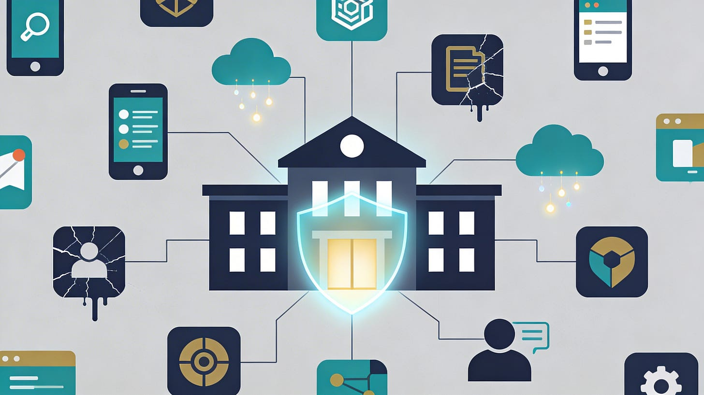

# The Vendor Problem

*Post 6: Why Third-Party Breaches Are the Biggest Blind Spot in K12*

When a school district suffers a data breach, the first question from the public tends to be direct: “How did the district get hacked?” Increasingly, though, the most accurate answer is that the district itself wasn’t actually hacked at all. A growing share of K12 cyber incidents now trace back to the companies providing the digital tools schools rely on every day. Student information systems, assessment platforms, communication apps, fundraising tools, transportation software, and countless learning apps all handle or store sensitive student and staff data, and most of these systems live outside a district’s direct control.

For school system leaders, this creates an uncomfortable truth: cybersecurity risk doesn’t stop at the boundaries of your network. Even when internal defenses are strong, vulnerabilities in the vendor ecosystem can turn into districtwide or even statewide crises. This piece explores why third-party risk continues to plague K12 institutions, how these risks manifest in real-world incidents, and what practical steps education leaders can take to manage exposure without slowing the pace of innovation or instruction.

## The growing scope of vendor-related breaches

Analyses of K12 cyber incidents over the past several years conducted by [K12 SIX](https://k12six.org) show a striking pattern: more than half of all reported student data breaches originate not from district systems, but from vendors. These are often the same vendors that power core district functions: student information systems, cloud-based learning environments, online payment portals, and even IT service providers working across multiple districts. In many documented cases, the affected districts had strong security policies, yet still suffered fallout because their data had already been entrusted to external platforms with weaker protections.

## Why vendor risk is hard to manage in education

Vendor risk management is complicated for any organization, but it’s uniquely difficult for K12 environments. Unlike large corporations, most districts depend on dozens or even hundreds of third-party systems, many of which are chosen quickly to meet classroom or administrative needs. Districts often have limited leverage to demand custom security improvements, and few maintain dedicated staff to oversee vendor risk. This combination creates a sprawling ecosystem where vulnerabilities accumulate slowly and invisibly. A great example of this leverage can be seen in cases like PowerSchool, who, after their data breach in 2024, are rumored to have begun pushing back on data privacy agreement terms in some states.

## Why vendors attract attackers

From a hacker’s perspective, a major educational vendor offers a higher return on effort. One breach can expose data from multiple districts at once, or even grant access to trusted communication pathways into district systems. Because vendor compromises often occur outside district monitoring, they can go undetected for weeks or months, allowing attackers to move quietly while districts remain unaware.

### The “blast radius” problem

When a district’s own network is breached, the impact is usually contained to that community. When a vendor is breached, the damage can spread across states or even countries. Districts may only learn of the incident after it becomes public, may not control the investigation timeline, and often have no clarity on exactly what data was taken. Still, they carry the public responsibility to notify families, coordinate recovery, and repair trust, regardless of whether the compromise originated within their systems.

## The procurement-security disconnect

Much of the vendor risk problem stems not from negligence, but from how school systems buy technology. Procurement processes are designed around instructional value, cost, ease of deployment, and customer support. These are criteria that rarely include detailed security assessments. As a result, contracts often lack basic provisions such as mandatory breach notification timelines, multi-factor authentication for vendor administrators, data deletion guarantees, or transparency about subcontractors. These gaps don’t reflect carelessness so much as structural reality: districts are expected to move quickly, and standardized cybersecurity requirements remain rare. Anecdotally, I’ve had multiple conversations with potential SaaS vendors who have answered questions about SOC2 compliance by saying they outsource their SOC to a 3rd party.

## The limits of FERPA compliance

A frequent misconception in education is that FERPA compliance equates to cybersecurity strength. In truth, FERPA governs data sharing practices, not system defense. A fully FERPA-compliant vendor can still maintain weak authentication, inconsistent patching, or poor incident response capabilities. That misunderstanding creates false confidence, and it’s often only after a breach that districts realize compliance and security are not the same thing.

## When vendor incidents become district crises

Vendor-related breaches often erupt into local crises because districts must act publicly without full information. Families don’t distinguish between district software and vendor software; to them, the district chose the tool and owns the outcome. Meanwhile, recovery depends on the vendor’s timeline for investigation, remediation, or system restoration, leaving districts stuck in reactive mode. Even if technically blameless, district leadership bears the reputational cost when repeated vendor incidents make the institution appear unprepared.

Given the risks, some might wonder why districts don’t simply avoid third-party systems altogether. The answer is practicality. Modern operations depend on vendors for instruction, assessment, communication, accessibility, compliance, and efficiency. The goal is not to eliminate vendors, but to govern their use intentionally, to understand which partnerships matter most and ensure they meet baseline security standards.

## Steps district leaders can take

While few districts can conduct deep audits on every vendor, targeted action still makes a measurable difference. The first step is identifying high-impact vendors—the ones that store sensitive data, have access to district systems, or support critical operations. Once identified, districts can require basic but meaningful safeguards such as multi-factor authentication for vendor admins, clear data retention rules, prompt notification of breaches, and disclosure of any subcontractors handling district data.

Equally important is aligning procurement and IT leadership so that security input is part of purchasing decisions from the start. Risk tradeoffs should be acknowledged openly rather than made by accident. Districts can also prepare for vendor breaches in advance by developing communication templates, outlining legal workflows, and designating points of contact for rapid coordination. Preparation not only limits damage but also conveys competence when crises occur.

Ultimately, vendor security is less about technology and more about governance. It touches procurement policy, budget priorities, and executive oversight. When boards and superintendents treat vendor risk as a systemic matter that deserves the same level of attention as staffing, finance, or operations, district readiness improves dramatically.

## Questions for leadership to consider

To begin that shift, district leaders can ask themselves a few key questions.

1. Which vendors would cause the most harm if breached tomorrow?
2. What security assurances do we actually enforce?
3. How quickly would we find out about a compromise?
4. Do we have a clear plan for communicating with families if it happens?
5. Above all, are the tradeoffs we make during procurement decisions explicit, documented, and understood?

## **Leadership questions to ask now**

To bring vendor risk into focus, district leaders can ask:

1. **Which vendors would cause the most harm if breached tomorrow?**
2. **What security assurances do we actually require—and enforce?**
3. **How quickly would we know if a vendor was compromised?**
4. **Do we have a plan for communicating vendor incidents to families?**
5. **Are security tradeoffs explicit in procurement decisions?**

---

### **Coming next in the series**

**Post #7: “Cyber Risk Is an Equity Issue: Why Disruptions Hit Some Students Harder Than Others”**

We’ll examine how cyber incidents disproportionately affect vulnerable students, and why resilience planning is also an equity strategy.
