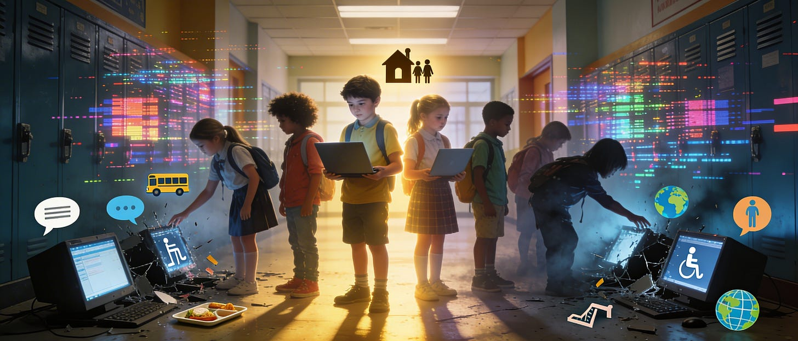

# Cyber Risk is an Equity Issue

*Pt 7: Why Disruptions Hit Some Students Harder Than Others*

When a cyber incident disrupts a school district, the technical impact may be uniform: systems go down for everyone. But the educational impact is not the same. Some students merely lose access to instruction temporarily, while others lose essential services, stability, and daily support systems they depend on. In this way, cybersecurity failures do more than interrupt learning; they expose and deepen existing inequities.

For district leaders, this reframing matters. Cyber resilience is not only about protecting data or restoring systems; it is about preventing the most vulnerable students from falling further behind when disruption occurs.

## Disruption is never evenly distributed

From a distance, a district-wide outage can appear neutral: everyone is offline, and the problem seems shared. In practice, however, students experience these disruptions very differently depending on their personal circumstances. Those most affected are often students with disabilities, students experiencing homelessness or housing instability, English learners, and those relying on school-provided meals, transportation, or counseling services. Many also lack reliable internet or devices at home. For these students, school technology isn’t a convenience… it’s a lifeline to legally required supports and daily stability. Equity planning that overlooks cyber disruption is therefore incomplete. True resilience means safeguarding access for all.

## Special education and compliance risks

Cyber incidents often strike directly at the systems that support special education services. When documentation tools for individualized education programs, scheduling software for therapy sessions, or communication platforms for family outreach go offline, the disruption extends beyond inconvenience. It can cause service delays, documentation gaps, increased legal exposure, and further strain on already overextended staff. Even brief outages can have lasting consequences for students who depend on consistent, compliant services. In this sense, cyber resilience is also compliance resilience. Protecting systems that support legally mandated services should be a top priority, not an afterthought.

## Students without digital buffers feel the impact first

When districts lose access to digital systems, recovery plans often assume that families can check email, students can shift to alternate online platforms, and teachers can communicate outside official systems. But that assumption doesn’t hold true for everyone. Students in lower-income households or rural areas often lack reliable home internet, share devices with siblings, or depend entirely on school-managed platforms. When those platforms fail, these students may have no alternatives, while their better-resourced peers can adapt more easily. Continuity plans that rely solely on digital fallback options risk excluding families without consistent access.

For many students, school is not just a place for learning. It’s a hub for essential services. A single cyber incident can paralyze systems tied to meal eligibility, transportation routing, attendance tracking, health alerts, and counseling workflows. When these systems are unavailable, the effects ripple outward into homes and communities, disrupting daily life and safety. Operational technology failures can quickly become student welfare issues that require coordinated, human-centered responses.

## Cyber resilience as an equity strategy

When viewed through an equity lens, cybersecurity investments look fundamentally different. The most impactful measures are those that protect student information systems and special education platforms first, ensure offline access to critical data where appropriate, and incorporate essential operations like meal and transportation services into continuity planning. Training staff on alternative workflows and communicating in multiple languages and formats during incidents are also key. These steps may not eliminate risk, but they significantly reduce harm.

Districts serving higher-need populations often work with fewer IT staff, older infrastructure, and limited budgets, relying heavily on free or low-cost tools. They may also experience higher student mobility, which compounds vulnerabilities. These conditions increase both the likelihood and the impact of cyber disruptions. Without external support, the gap between well-resourced and under-resourced districts continues to widen. Cybersecurity funding, therefore, is not merely a technical investment: it is an equity investment. State and federal support play an essential role in closing this gap.

## Reframing the conversation with boards and communities

For district leaders, discussing cybersecurity through an equity lens shifts the narrative from fear to purpose. Instead of saying, “We need to invest in cybersecurity because attacks are increasing,” leaders might say, “We need to invest in resilience so our most vulnerable students don’t lose access to learning and services when systems fail.” This approach ties cybersecurity spending directly to the district’s mission and values, reframing it as a matter of student equity and well-being.

## **Leadership questions to ask through an equity lens**

To assess readiness, district leaders can ask:

1. Which student populations are most affected if our core systems go down?
2. Do our continuity plans explicitly address special education, meals, and transportation?
3. How do we communicate with families who lack consistent digital access?
4. Are accessibility and language needs considered during incidents?
5. Who advocates for vulnerable students during cyber recovery decisions?

---

### **Coming next in the series**

**Post #8: “Ransomware, Insurance, and the Myth of the Quick Fix in K12”**

We’ll examine how cyber insurance, ransom decisions, and recovery realities interact, and why insurance is not a substitute for preparedness.
