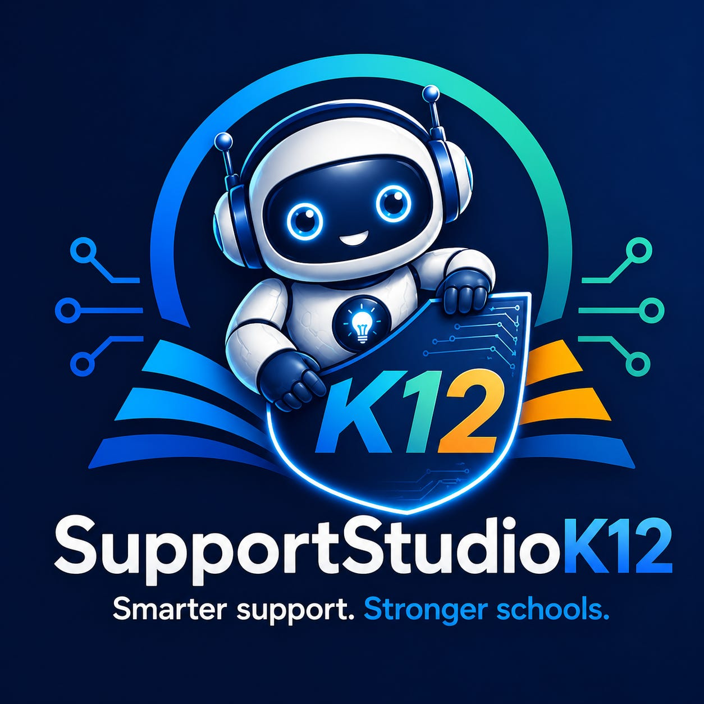
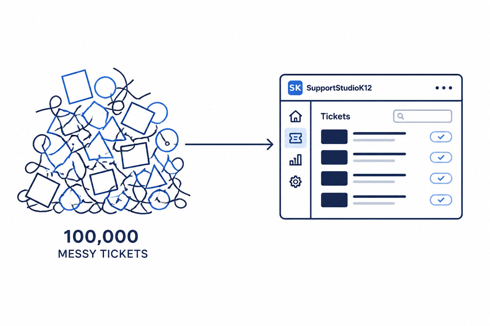
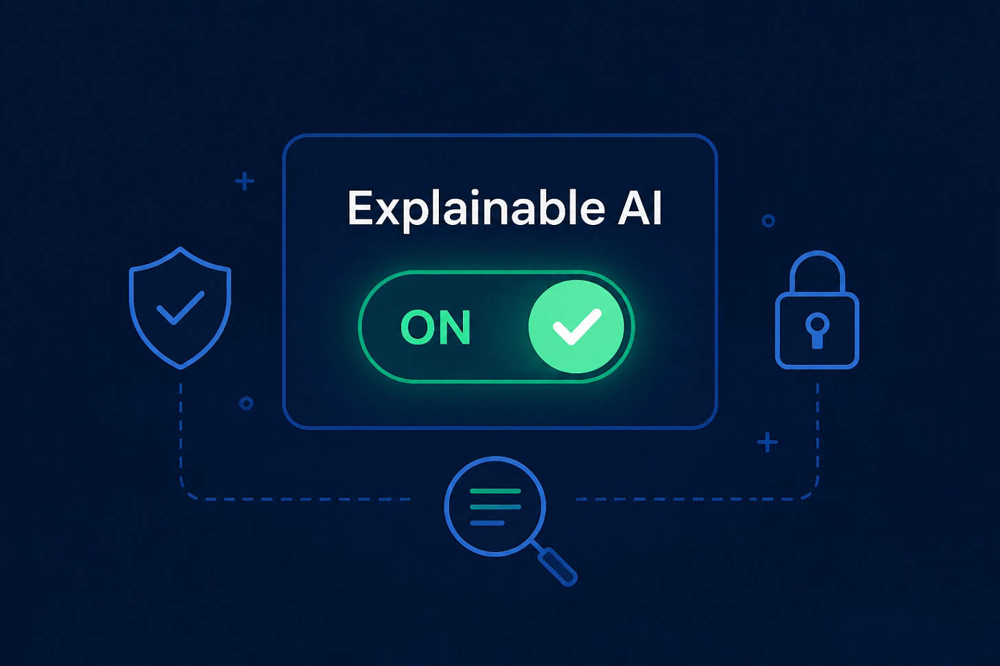

# SupportStudioK12.com is Live: Help Desk and Ticketing Software for How K12 Really Works

I don’t usually do this kind of self-promotional post, but today’s a big day. I’m launching a product I’ve been working on called SupportStudioK12. It’s a new help desk management and ticketing system built by K12 IT practitioners, for K12 IT practitioners. Finally, after a lot of late nights and a whole lot of “why is enterprise software like this?” moments, I’m pleased to announce that **[SupportStudioK12](https://www.supportstudiok12.com) is officially live.**

But not fake-live. Not “throw people into an empty dashboard and hope for the best” live. And definitely not “contact sales” live.

Instead, there’s a waitlist.

Yeah, I know. “Waitlist” can sound like a marketing stunt. That’s not what this is.

This is me being careful on purpose.

I’m an IT Director. I know what it feels like to try a new tool when your queue is already full, your techs are stretched thin, and a bad onboarding experience just becomes one more problem to own. I’m not interested in dumping that on the first districts that trust us.

**Why the waitlist?**

- **To get onboarding right.** The first few tenants get direct, hands-on help from me.
- **To watch the real-world clicks.** Where do people hesitate? What feels obvious under the hood to me but not to you?
- **To fix friction fast.** If something feels clunky, I want to tighten it up before opening the floodgates.
- **To keep it personal.** Early customers are partners, not anonymous signups in a CRM.
- **To avoid the usual software nonsense.** No pricing games. No rushed rollout. No “good luck, here’s your login.”

### **Why the “Soft” in Soft Launch?**

The platform is ready. The code is stable. The features are built. But “ready” on my side and “smooth” on your side are not always the same thing.

So I’m starting small.

I want to hand-pick the first few tenants. I want to walk through onboarding with you. I want to see what makes sense right away and what needs work. That’s the why behind the waitlist.

Not artificial scarcity. Not hype. Just making sure the first experience is solid.

By managing the intake, I can give every IT Director and Tech Coordinator who joins direct attention. If something isn’t intuitive, I’ll fix it. If a workflow feels clunky, I’ll smooth it out. That’s founder-led onboarding. And honestly, it’s the only way I wanted to launch this.

### **Built from 100,000 Real District Tickets**

Support Studio K12 isn’t another generic help desk with a school logo slapped on it. It was seeded from over 100,000 real K12 tickets I’ve lived through over the years.

I’ve been the one crawling under desks. I’ve been the one taking the “the internet is down” call while juggling a new device rollout. I’ve been the one trying to make six disconnected tools behave like one system. That’s why this product looks the way it does under the hood.

K12 IT is different. So the tool should be different too.

- Students and staff just walk in when things break. So we built a **walk-up kiosk** for instant, paperless intake.
- Classrooms need immediate identifiers. So we built **QR room tags**.
- Systems go down at 2:00 AM. So we built **Service Monitors** that auto-create tickets.
- Districts are drowning in privacy laws and shadow IT. So we built a **live-crawling software catalog** to track dependencies.
- Teams need to see the queue without refreshing a browser tab. So we built **help-desk wall displays** for the IT office.

We’re not guessing. We’re building the tool I’ve wanted for years. You can read more about why we started this on our [Mission page](https://www.supportstudiok12.com/mission).

### **“Us vs. Them”: Ending the Hostage Era**

Most software vendors in this space play games. They hold your data hostage. They hide pricing behind a form. They lock basic features behind upsells. They trap you in contracts and call it a partnership.

**I’m not doing that.**

This company is built around radical transparency because I’ve sat on the buyer side of the table. I know how frustrating the usual routine is.

That means:

- **No Hostage Exports:** Your data is yours. Export it with one click. Anytime.
- **No Annual Contracts:** Stay because the product works, not because legal says you have to.
- **Public Pricing:** No “Contact Sales” wall. No pricing games. The price is on the [home page](https://www.supportstudiok12.com/home), and every feature is included in every paid plan.
- **No Per-Agent Fees:** Your team grows. Your bill shouldn’t punish you for it.

### **No Opaque AI (Seriously)**

AI is the buzzword of the ~~year~~ decade. Every help desk seems to be stapling a “magic” button onto the interface and calling it innovation. In a school environment, that’s not clever. That’s risky.

Our AI features are toggleable and explainable. Your data never trains public models. We use AI to draft knowledge base articles and summarize long ticket threads, but we’re not pretending a black box should run your support operation. It’s there to help. Not to take the wheel from the people who actually know the district.

### **One Tool Instead of Six Subscriptions**

Fragmentation is the silent killer of IT teams. Most districts are juggling ticketing, a separate knowledge base, a docs tool, a change log, and way too many spreadsheets for repairs and inventory notes.

That stuff adds noise. It adds cognitive load. And it burns time you do not have.

Support Studio K12 pulls that work into one place.

- **Ticketing & Staff Portal**
- **Knowledge Base with AI Drafting**
- **Technical Documentation with Rich Editing**
- **Change Tracking with Risk Assessment**
- **MDM Integration (Mosyle & Intune, others on the roadmap)**
- **Unified IT Calendar**

Everything lives where it actually belongs. No more tab-switching. No more lost context. Less duct tape. More signal. Check out our [SLA](https://www.supportstudiok12.com/legal/sla) to see how serious we are about keeping these systems up and running for you.

### **What Happens Next?**

If you’re tired of the “Enterprise” tax and generic features that don’t match how districts actually work, I’d love to have you on the waitlist.

I’ll be reaching out to the first few folks on the list personally give you a tour and start onboarding if you want to join. We’ll keep it casual. We’ll talk through your current setup, your pain points, and what has to work on day one. Then we’ll get you configured the right way.

That’s the whole point of this launch.

Not to chase volume. To get the first few tenants live successfully. To learn fast. To improve the onboarding experience while it’s still small enough to be personal.

This is more than a software launch. It’s my attempt to build the kind of tool I wish existed when I was running school IT. Clear pricing. No hostage tactics. No pricing games. Just a platform built for the way K12 support actually works.

**Ready to see a better way to do K12 IT?**

[Join the Waitlist Today.](https://www.supportstudiok12.com/home)

Let’s build the help desk K12 deserves.

Andy Lombardo
Founder, [SupportStudioK12.com](https://www.supportstudiok12.com)
