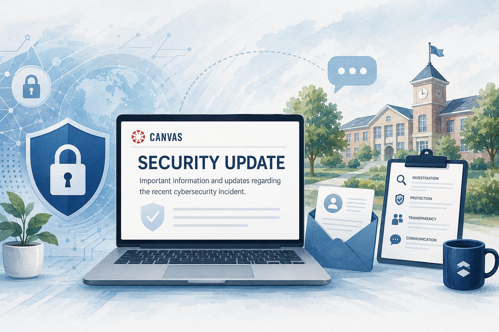

# Instructure/Canvas Incident Communications

UPDATE: Canvas has started to consolidate/archive messaging here:

Additionally, there is a Wikipedia article here:

So I’m going to take that cue to stop updating this post.

I’ve talked to a few impacted Canvas districts that have yet to receive any official communication from Canvas, and others that just aren’t sure if they’re impacted or not. In the sake of transparency and information sharing, I’ll be updating the list below with any official communications I come across. If you’re aware of additional communication, please consider sharing in the comments.

## May 1:

Instructure recently experienced a cybersecurity incident perpetrated by a criminal threat actor. We are actively investigating this incident with the help of outside forensics experts. We are working quickly to understand the extent of the incident and actively taking steps to minimize its impact. Maintaining your trust is our highest priority, and we are committed to transparency throughout this process. We will provide new information as it is confirmed.

Regards,
Steve Proud
Chief Security Officer

## May 2:

We are providing an update on the security incident we advised you of yesterday. While our investigation continues alongside our outside forensics experts, at this stage we believe the incident has been contained.

Here are the steps we have taken since we became aware of the incident. We have:

> - Revoked privileged credentials and access tokens associated with affected systems
>
> - Deployed patches to enhance system security
>
> - Out of an abundance of caution, we rotated certain keys, even though there is no evidence they were misused
>
> - Implemented increased monitoring across all platforms

While we continue actively investigating, thus far, indications are that the information involved consists of certain identifying information of users at affected institutions, such as names, email addresses, and student ID numbers, as well as messages among users. At this time, we have found no evidence that passwords, dates of birth, government identifiers, or financial information were involved. If that changes, we will notify any impacted institutions.

Thank you for your patience as we work to resolve this matter. We sincerely regret any inconvenience or concern this may cause. We will continue to keep you apprised as our investigation progresses. For up-to-date information on specific systems, please continue to visit our status page.

Regards,
Steve Proud

Chief Information Security Officer

## May 5:

We are writing with an important update on the recent Canvas security incident.

While our investigation remains ongoing with the assistance of outside forensic experts, we want to share that your organization has been impacted by a criminal threat actor who has obtained data associated with your account. Based on what we have found to date, the data involved appears to include personal information. At this time, we have found no indication that passwords, dates of birth, government identifiers, or financial information were involved.

On April 25, 2026, Instructure experienced a cybersecurity incident perpetrated by a criminal threat actor. We detected the attacker on April 29 and immediately revoked the access. On April 30, as the investigation expanded, we revoked additional suspicious access and addressed the underlying vulnerability. We have found no indicators of an ongoing threat.

**Actions we have taken**
From the moment we detected this malicious activity, we moved quickly to protect our platform and learn what happened. We:

> - Engaged a leading third-party forensics firm to support our investigation
>
> - Notified law enforcement, including the FBI, U.S. Cybersecurity and Infrastructure Security Agency (CISA), and international law enforcement partners
>
> - Disabled the compromised accounts and revoked all associated access and tokens
>
> - Remediated the underlying vulnerability and deployed platform-wide protections
>
> - Rotated internal keys and restricted token creation pathways across the platform

**Current status**
Canvas, Canvas Data 2, and Canvas Beta are fully operational and we continue to focus on bringing the Test environments back online this week. The broader platform is fully operational with enhanced monitoring and detection controls in place. Service updates are posted to our status page.

**Impact on your organization**
Our teams are working around the clock with outside forensics experts to gather the information you need to understand how this impacted your organization. Investigations of this nature take time to do properly, and we are committed to giving you accurate information as quickly as we are able. As always, your CSM and account team are available.

**Near-term impacts to your Canvas Experience**
Continuously hardening our infrastructure is a critical goal, and thus, there are some changes you will see. We know some of these changes may cause some inconvenience to you and your users, but we think it’s prudent given the ever-evolving security landscape.

**Recommended Actions for Your Organization**
We recommend you continue to observe industry best practices regarding data hygiene and security, including, but not limited to:

> - Enforce MFA on every privileged account, and audit admin role assignments to remove anyone who shouldn’t have access
>
> - Engage your security, privacy, and legal teams to review your organization’s own notification obligations under FERPA, state law, and any international privacy laws that apply
>
> - Watch for our follow-up with organization-specific data and identity-protection resources for affected individuals

We know this incident affects the trust you place in us, and we take that seriously. We are committed to sharing timely, accurate updates as our investigation progresses.

Sincerely,
Steve Daly
Chief Executive Officer, Instructure

Steve Proud
Chief Information Security Officer, Instructure

## May 8

We are writing to inform you of a significant update in a recent Canvas security incident that specifically impacted your institution.

On May 7, an unauthorized actor made changes to the pages that appeared when some students and teachers were logged in. We quickly identified this unauthorized activity and immediately took steps to contain it, including temporarily taking Canvas offline into maintenance mode as a precaution to prevent further unauthorized access. Working in coordination with our independent forensics partner, we have found no evidence that the unauthorized actor established persistence, obtained credentials for accounts within your institution, or exfiltrated any additional data.

Additionally, we have confirmed that the unauthorized actor carried out this activity by exploiting an issue related to our Free-For-Teacher accounts. The entry point for the incident last week was also through the Free-For-Teacher accounts. As a result, we have made the difficult decision to temporarily shut down our Free-For-Teacher accounts.

This decision was not made lightly. Our priority is to protect all Canvas users and ensure the platform’s security and integrity. Free-For-Teacher accounts have been a core part of our platform and we are committed to resolving the issues with these accounts. While we work through these issues, shutting down our Free-For-Teacher accounts gives us the confidence to restore access to Canvas, which is now fully back online and available for use.

We are working around the clock to resolve this matter, provide you with transparency about this incident, and deliver the best educational experience possible. We will continue to keep you informed as more information becomes available. Please visit  for the latest updates.

Sincerely,
Steve Daly
Chief Executive Officer
Instructure

## May 9

To our Instructure Community,

I’ll start where I should: with an apology.

Over the past few days, many of you dealt with real disruption. Stress on your teams. Missed moments in the classroom. Questions you couldn’t get answered. You deserved more consistent communication from us, and we didn’t deliver it. I’m sorry for that.

Here’s what we know.

This incident involved unauthorized access to part of our environment. The data fields involved include information like usernames, email addresses, course names, enrollment information and messages. Core learning data (course content, submissions, credentials) was not compromised. We’re still validating all findings, but we want to be clear about what we understand was and wasn’t affected.

We also identified a vulnerability regarding support tickets in our Free for Teacher environment that was exploited. We’ve temporarily disabled Free for Teacher while we complete a full security review. We know that’s disruptive, and we didn’t make that call lightly. But keeping the entire Canvas platform secure has to come first.

Last week, we made a call to get the facts right before speaking publicly. That instinct isn’t wrong, but we got the balance wrong. We focused on fact-finding and went quiet when you needed consistent updates. You’ve been clear about that, and it’s fair feedback. We will change that moving forward.

So here’s what we’re changing.

We’ve launched a dedicated Incident Update page, a single place with what we know, what we’re doing, and what’s next. We’ll post another update within 48 hours and we’re working on delivering a summary of the forensics report; which we’ll share as soon as it’s ready.

Two things you can count on right now:

- Canvas by Instructure is fully operational and remains safe to use. Core learning data is not compromised.
- We’ll give you clear guidance if any action is required on your end. Right now, there’s nothing you need to do.

Keep reaching out to your Customer Success teams and through our Community channels. Your feedback is shaping how we respond.

Rebuilding trust takes time. We’re going to earn it back through consistent action and honest communication. We’re in this for you and your community.

Thank you for your patience and for everything you do for learners.

Steve Daly CEO, Instructure
