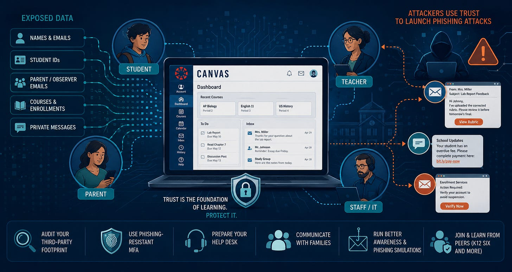
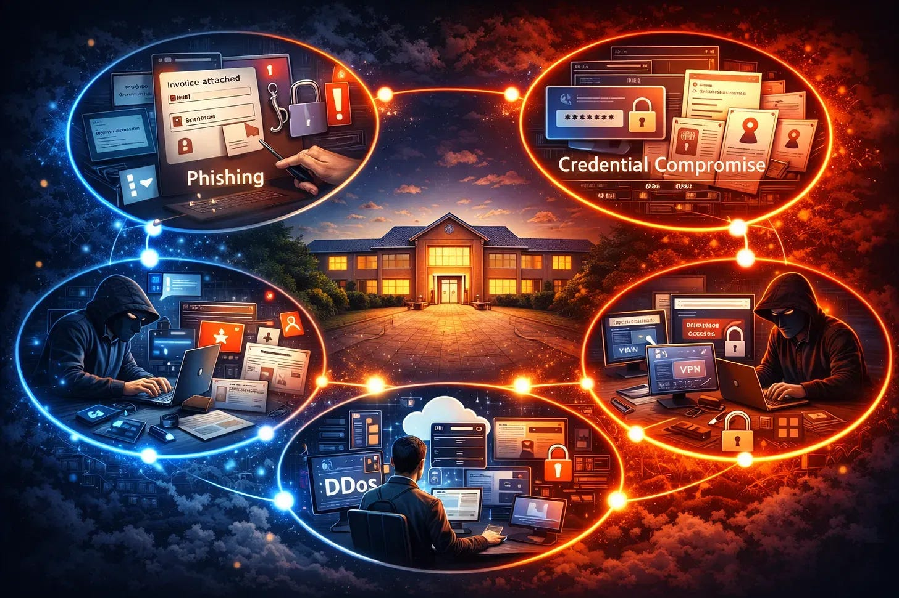
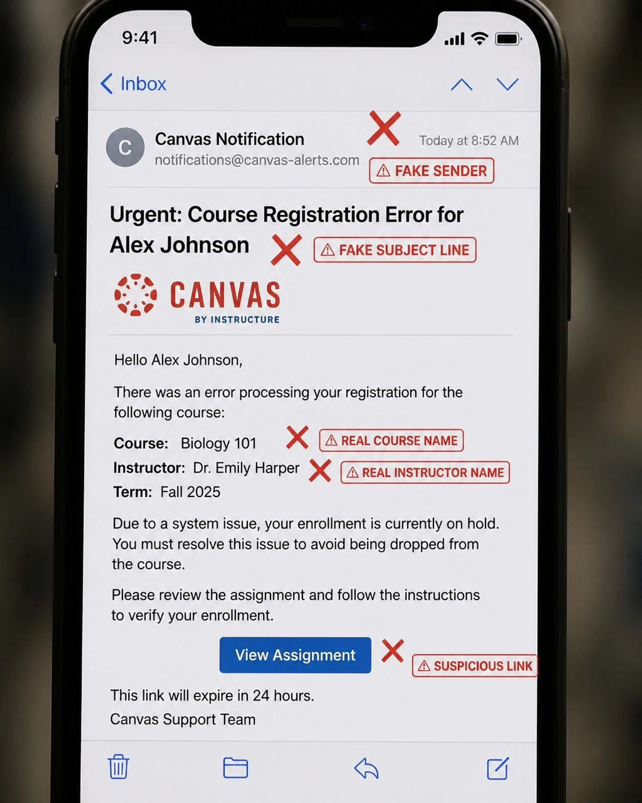

# The 2026 Canvas Incident: Could Your LMS Become a Phishing Playbook?

If you’ve been following the news this week, you’ve seen the headlines. Instructure, the parent company of Canvas, disclosed a major cybersecurity incident. Within days, we saw data claims from the threat group ShinyHunters, ransom notes, and a brief period where one of the most ubiquitous Learning Management Systems (LMS) in the world went dark.

But there’s a specific line in the official disclosures that I’ve heard repeated in most of the messaging over the last week: *“There is no evidence that passwords, dates of birth, or financial information were involved.”*

In the general, that sounds like a win. I definitely prefer it to the alternative. But in K12, that relief can be a distraction.

When an attacker gets hold of names, email addresses, student IDs, and, most importantly, private messages and enrollment data, they don’t need your password. You’re going to give it to them yourself. This incident isn’t just a data breach; it’s a compromise of the “Trust Layer” that keeps our schools running.

What Do We Know About What Happened?
The “Free-for-Teacher” Side Door
---

The public timeline is messy, and Canvas has been slow to confirm or release information, but here’s the gist: unauthorized access was detected in late April 2026. Based on Canvas Provisioning Log Audits of tenants impacted by the breach, it looks like April 28 and 29 are when substantial exfiltration of data was happening. By early May, the platform was defaced and temporarily taken offline. Instructure eventually traced the issue back to a vulnerability in **Free-for-Teacher accounts**.

If you’re a tech director, you know the drill. You have your managed, enterprise-grade Canvas instance that you’ve hardened and integrated with your SIS and federated SSO. But teachers are resourceful. They often spin up Free-for-Teacher accounts for side projects, professional development, when the district doesn’t provide their preferred tool, or when they’re moving between districts.

Instructure treats these as a separate hosted environment, but in the eyes of a threat actor, it’s all one big target. By compromising an adjacent surface like the Free-for-Teacher environment, attackers gained access to a mountain of user data that overlaps with other districts.

This is a classic “Supply Chain Lite” problem. Even if your core district tenant is locked down, if tenant isolation is vulnerable, access to your users’ data might be sitting in a less-secure corner of the same vendor’s ecosystem.

## Relationship Data: The Real Prize

We talk a lot about PII (Personally Identifiable Information), but we don’t talk enough about Relationship Data.

Standard PII tells an attacker *who you are*. Relationship data tells them *who you trust*.

The Canvas breach reportedly exposed:

- Names and emails.
- Student IDs.
- Observer (i.e., Parent) emails.
- Course names and enrollment status.
- **Private messages between students and teachers.**

Think about that for a second. If I’m a scammer and I know that “Johnny Smith” is in “Mrs. Miller’s AP Bio Class,” and I have a record of their recent messages about a lab report, I can craft the most believable phishing email Johnny has ever seen.

I don’t need to guess. I don’t need to use a generic “Click here to reset your password” template. I can send a message that says: *“Hi Johnny, I saw your message about the lab report. I’ve uploaded the corrected rubric here. Please review it before tomorrow’s final.”*

That is a 100% success rate email. This is why the “no passwords stolen” line is so hollow. The attackers didn’t steal the keys; they stole the map of the house and a list of everyone who lives there.

## Why Phishing is the Next Risk (and it’s going to be good)

In the initial blast radius of this event, much of the conversation has centered around the core question: Is it safe to connect our SIS or other systems to Canvas? Canvas has claimed that they are operational and secure, but it has opened a broad discussion of trust and third-party risk management and risk assessment. Those are big, systemic probelms in K12 that deserve a long, hard look.

However, if the compromised data is released, the more immediate short term threat will probably look very familiar to K12 IT and security practitioners.

If the compromised data is ultimately leaked, we will be entering a secondary abuse phase of this incident. The initial technical vulnerability is likely patched, but once the data is out there, it will be packaged into phishing playbooks.

Attackers will use this data to target:

1. **Students:** With fake assignment links or “account verification” requests.
2. **Parents:** With “overdue fee” notifications or “behavioral reports” that look like they’re coming from a real teacher.
3. **Staff:** With impersonation attempts against the help desk.

When a message contains a real student ID and a real class name, the human brain stops looking for the red flags. It looks “local,” and in K12, “local” equals “trustworthy.”

## What Schools Should Do Right Now

With the slow communcation timelines seen in this incident, you don’t have to wait for the next vendor update. You can be proactive:

### 1. Audit Your Third-Party Footprint

If a vulnerability in a “free” version of a tool can expose your data, you need to know what else is out there. This is a lofty goal and a weighty task. Like the adages of eating an elephant or taking a journey of 1000 miles, you have to start somewhere. You can begin by pulling data from systems you already have.

Google Workspace OAuth grants, Entra Enterprise Apps, and DNS logs will surface most of what's actually in use without deploying anything new. Pick one building or department and one week of activity to calibrate your process before scaling. Track findings in a simple spreadsheet with columns for tool, users, auth method, data sensitivity, and contract status, and supplement the log data with a short two-question Google Form to staff to catch what logs miss.

Triage by which tools touch student data and whether you have a DPA on file, then set a sustainable cadence (monthly OAuth review, quarterly full inventory) rather than treating it as a one-time project. The highest-leverage first move is just exporting your OAuth grants this week and looking at the list. That is usually eye-opening on its own.

If you want a more structured, instutitional approach than a spreadsheet, consider a helpdesk that integrates Software Catalog functionality. It is in pre-launch mode today, but [SupportStudioK12.com](https://www.SupportStudioK12.com) has this baked in. I’ve also created a free, open-source version of the Software Catalog you can spin up today, [available here](https://github.com/BardSec/software-catalog-public) (or take a look at a [demo here](https://softcat.bardsec.com/)). When it comes to auditing Microsoft Entra apps, I’ve also made a free Entra App auditing tool [available here](https://app-hunter.bardsec.com/) to demo, with a download link at the top of the page.

### 2. Move Toward Phishing-Resistant MFA

Traditional MFA (SMS codes or push notifications) is better than nothing, but it’s increasingly easy to bypass through “MFA fatigue” or session hijacking. Once the technique of experts, session hijacking is trivially easy today. Watch me show how it works in action [here](https://www.youtube.com/watch?v=2gCk0Z9T6Ko). If this incident has proven anything, it’s that we (and our vendors!) need phishing-resistant MFA (like FIDO2 keys or Windows Hello for Business). When the attacker’s phishing email looks 100% real, one of the only things that will save the account is a hardware-backed security layer that refuses to talk to a fake site.

### 3. Update Your Help Desk Scripts

Warn your IT staff that they will likely see an uptick in “sophisticated impersonation.” If someone calls or emails claiming to be a parent who lost access to Canvas, and they provide a valid Student ID and teacher name, your staff might be inclined to help. Require a secondary, out-of-band verification. Don’t let a breached ID number be the only key to a password reset.

### 4. Direct Communication with Families

This is a hard one, and varies based on your district’s disclosure policies and community preferences, but as a parent of a student, I know I would appreciate the district sending a clear, jargon-free message to its community. Tell them: *“Because of a national incident with a software vendor, scammers may use real student names or class info to send fake emails. We will NEVER ask you for a password or payment via an email link.”* This is a district-by-district decision, and balancing the need for speedy communication and not sowing fear, uncertainty, and doubt is a very nuanced decision. Your district may be more comfortable waiting for confirmation that the data set is in the wild before taking this path.

### 5. Run Better Awareness Training and Phishing Simulations

Don’t send another generic “your mailbox is full” test and call it training. If this breach exposed course names, enrollment changes, and teacher-student message context, use that reality to shape your awareness program. Build simulations that mirror the kinds of lures your community is actually likely to see now, like fake schedule changes, assignment follow-ups, enrollment notices, or parent messages that feel local and familiar. If you don’t control your phishing templates, use a vendor that “gets” K12 and included K12 technology stacks in their phishing templates. [Cybernut](https://www.cybernut.com) is the original player in the K12-specific security awareness space, and they *do* have Canvas/Instructure specific phishing templates in their library. With any security awareness campaign, it’s important to remember that the goal isn’t to trick people for sport. The goal is to build muscle memory: pause, verify, and use a known-good path before clicking. Keep it practical, debrief every campaign, and teach staff and families what to look for when an email feels *too* specific to be fake.

### 6. Make friends

Information sharing organizations like [K12 SIX](https://www.k12six.org) are invaluable when an event like this happens, providing a peer group of people experiencing the same event. When things are good, K12 SIX also provides guidance on topics like 3rd party risk, K12 threat models, dealing with compromised accounts, and planning for disaster. If you’re not familiar with K12 SIX, their [Essentials Series](https://www.k12six.org/essentials-series) is a great place to start.

## The Broader Lesson: Education is a Trust System

The Canvas incident is a reminder that in our industry, we aren’t just managing software; we are managing trust.

When we put a platform at the center of the student-teacher relationship, we are telling our community that this is a safe space to communicate. When that space is compromised, the damage lasts much longer than the outage.

We need to stop looking at cybersecurity as a “technical problem for the IT guys” and start looking at it as a core component of student safety and district operations.

The technical fix for the 2026 Canvas incident might (emphasis on *might*) be done, but the human exposure is just beginning. The best defense isn’t a better firewall: it’s a more skeptical, better-trained user base and a security architecture that doesn’t rely on trust alone.

Stay safe out there, and remember: if an email looks too familiar to be a scam, that’s exactly why you should double-check it.
