# Tools for your K12 MacAdmin Toolbelt

*Going over tools I've found for administering Macs*

[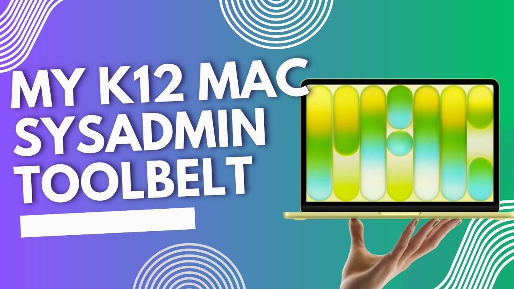](images/45674f4d-47ea-40b1-96b5-494ba3235e49_1280x720.png)

### Introduction

With the release of the new Macbook Neo, many school districts (including my own) are starting to flock towards the latest and greatest budget laptop to try and integrate into their edtech curriculum. And who can blame them? The Macbook Neo does a lot of things right. Both the build quality and performance of the device are unheard of in the price bracket.

With the introduction of this new budget device, I’m predicting we’ll see a lot more Apple adoption of devices in the K12 space. As we do our own adoption of Mac Neos, I wanted to share some tools I’ve found to solve common issues for MacOS in the K12 Envoirnment, as well as tools that I’ve found handy as a new up-and-coming K12MacSysAdmin.

### Tools tools tools…

We’ve got a wide variety of tools here. I’ll provide a link on where to get it, and what exactly it does.

#### **[Squircle](https://apps.apple.com/us/app/squircle-resize-app-icons/id6499279814?mt=12%20Squircle:%20Resize%20App%20Icons) - an Icon formatter to make the mac ‘squircle’ shaped icons**

You ever notice how all of the icons on mac are these squares with rounded corners? That right there is (unofficially) called a squircle! The Squircle app allows for easy conversions of boring square images into their hipster counterpart.

[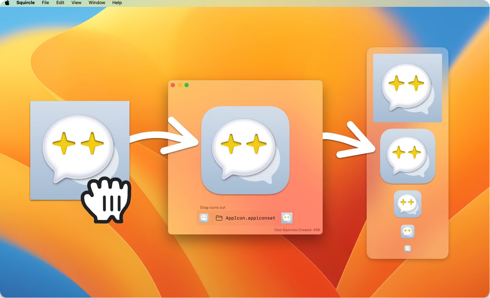](images/c4410670-89c7-46d8-bfdf-4dd00a35f5cd_2752x1678.png)

#### [Discovery](https://apps.apple.com/us/app/discovery-dns-sd-browser/id1381004916?mt=12%20Discovery%20-%20DNS-SD%20Browser) - A Bonjour Service Scanner

As I started learning more and more about mac, the more I’ve learned that a lot of components of the Apple Ecosystem rely on Bonjour. Bonjour is a network software that allows for discovery of services on your network. Things like Airdrop, AirPrinting, AirPlay, etc. rely on the bonjour service. Discovery allows for a network scan on your network to see what Bonjour Services your mac can see. This can be handy for troubleshooting these Apple Specific services.

[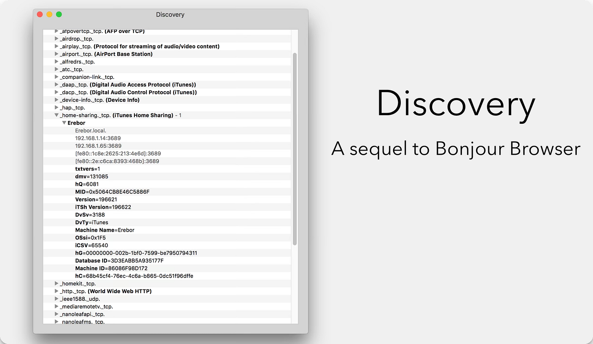](images/c7e09d95-03d5-4072-a393-93b7b82e0397_2694x1564.png)

#### [LowProfile](https://github.com/ninxsoft/LowProfile?scrlybrkr=1094b021) - A Profile Inspection Tool for MacOS

LowProfile is a way to view the MDM profile payloads you have pushed to your mac and what they are set to. You can do this as well through the settings app on mac, but I find that LowProfile gives you more detail and is easier to navigate. LowProfile also will let you know if it finds issues within your apple profiles, such as using deprecated payloads.

[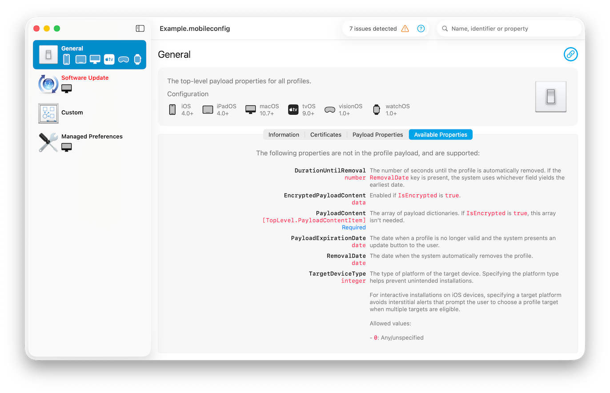](images/d960939f-390c-4008-b67e-4490cbf4a1e7_1372x884.png)

#### [SuspiciousPackage](https://mothersruin.com/software/SuspiciousPackage/) - A pkg inspection and debugging tool

SuspiciousPackage is a tool used for inspecting what a pkg installer does before running it on your mac. Pkgs in mac are effectively zip files with a script that gets executed to move the files inside the pkg to the mac. SuspiciousPackage allows you to open that pkg file up and inspect the script and contents before running it. It is extremely helpful for learning on pkg files work and especially for repackaging pkg files.

[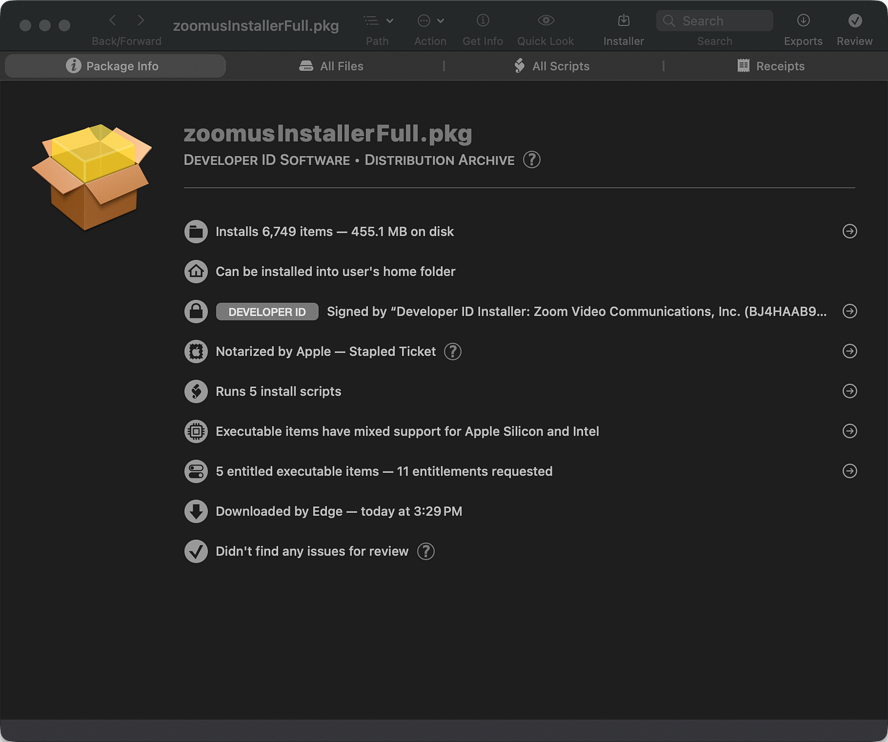](images/55b6bf08-ab2b-4532-b79e-9100bd8f33cf_1820x1522.png)

#### [Packages](http://s.sudre.free.fr/Software/Packages/about.html) - A GUI tool for creating .pkg files

(warning, the site for this one looks pretty iffy, but I’ve seen it highly recommended on multiple reddit and JAMF threads). Packages allows for an easy way to create .pkg files. This can be handy so you can push things like scripts or custom apps on devices through your MDM.

[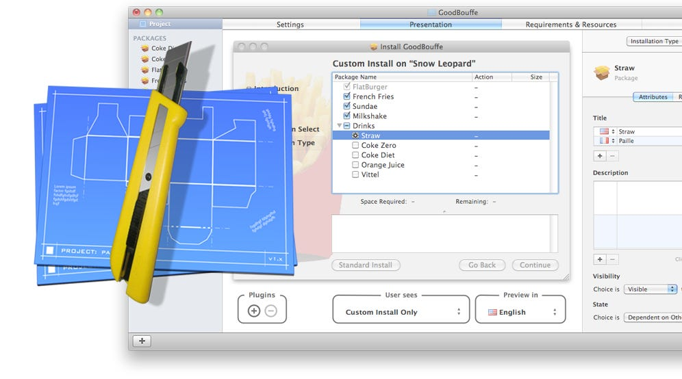](images/8514ebee-98e8-449a-b8ae-fcdaabc0e0f5_996x554.png)

#### [desktoppr](https://github.com/scriptingosx/desktoppr) - CLI tool for managing the wallpaper on Mac

One odd thing about managing macs is that Apple likes to limit some permissions from the Admin in favor of the end user. For example, if you want to push to your macs to allow screen recording permissions for an app (let’s say zoom), you’ll run into issues as Apple no longer allows admins to grant screen recording permissions to an app, and instead requires user level agreement before giving the application access to screen recording permissions. While I can understand and agree with Apple on some of these decisions, some of this makes it a lot harder to manage macs in the K12 space. Another example of one of these permissions is setting the wallpaper on a mac. Apple will allow you to set a wallpaper, but they won’t let you lock it. This can be an issue as in K12, students being able to change their wallpaper creates some unnecessary chaos. That’s where desktoppr comes in. Desktoppr is a CLI tool that allows you to set a wallpaper. Pair this with a reoccuring script to set the wallpaper on your student’s mac every 10 minutes, and suddenly you have control over student wallpapers again.

#### [iMazing Profile Editor](https://imazing.com/profile-editor) - **A GUI based tool for creating apple management profiles**

I’ve been using this iMazing tool for a long time, because I used to need to create .mobileconfig files on my windows computer and Apple Configurator was no longer available on Windows. However, I just recently learned how power it really is. It turns out, .mobileconfig files can also be used to managed apps that have built in support for it. On top of giving you the option to create .mobileconfig files for managing the system settings on your Macs, iMazing Profile Editor also has templates for managing settings for common MacOS apps that allow for settings management through .mobileconfig. This allows for a consistent way to set settings for some of your Mac apps.

[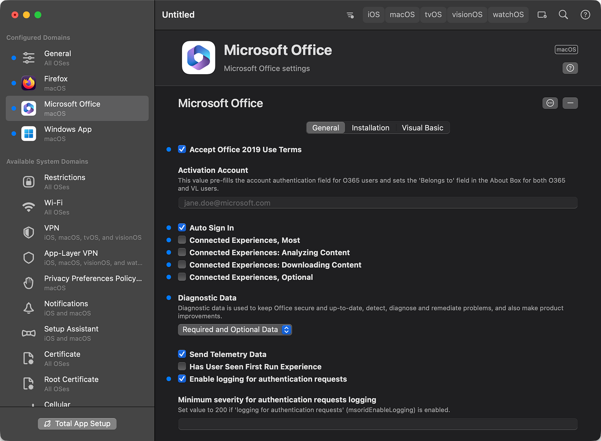](images/af52ef68-d5cf-4c1b-ad11-e4dbf1c3c833_2094x1538.png)

#### [Homebrew](https://brew.sh/) - The Package Manager for MacOS

We’ve mentioned Homebrew a bunch of times on this site. I’m sure most people are familiar with it by now, but there’s an [awesome tool on github from Honestpuck](https://github.com/Honestpuck/homebrew.sh). That allows for MDM agnostic deployment of Homebrew, as well as sample scripts for installing packages for HomeBrew, through your MDM!

#### [Royal TSX](https://www.royalapps.com/ts/mac/features) - RDP, VNC, SSH Connection Manager

Royal TSX is the remote connection manager that I didn’t know I needed. Note, this is a ‘freemium’ software. For free, you can have up to 10 connections, but for $65 one time, you get full access to the software and a year of updates. Royal TS (the windows version of the same software) quickly became my favorite remote management software because of many of the features it has built in. Royal TSX, the mac counter part, is no different. What really makes Royal stand out for me is their approach to credential management. They treat credentials as its own object in the interface and assign different credential identities to each of your connections, or to a parent folder and let everything inside inherit the same credentials. Now, whenever you have a password change, all you have to do is change the password to the credential object, opposed to editing the settings on every single connection you have saved. It’s a real time saver and has so many cool features, I could write an entire article just for it. I highly recommend you give it a try!

[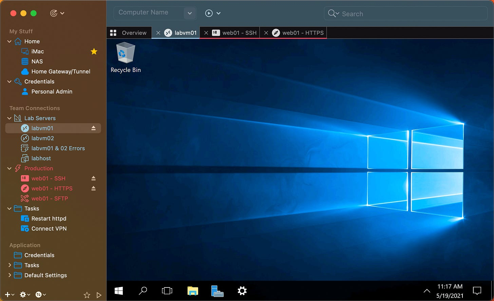](images/07e94ef2-f2b8-41c1-b2c7-db16a978bd3b_1960x1200.png)

#### [Munki](https://www.munki.org/munki/) - MDM Agnostic Software Deployment and Management

Full disclaimer, this is a tool I’m not currently using, but it’s so notorious in the Mac Admin space that I felt like I should atleast mention it here. Munki allows for an MDM agnostic experience to deploy software and updates, at scale. Originally developed by Walt Disney Animation Studios of all companies, Munki was created to address mac software deployment, at a time where most MDM solutions were lack luster in this right. There’s some debate online as to whether Munki is still really necesarry, now that many of the popular Mac MDMs have caught up and have reasonable software management. My school district is using Mosyle, and so far I’ve been pleased with their handling of software, so I’ve yet to feel a need for it. That being said, depending on the MDM you’re using, this may be a life saver.

[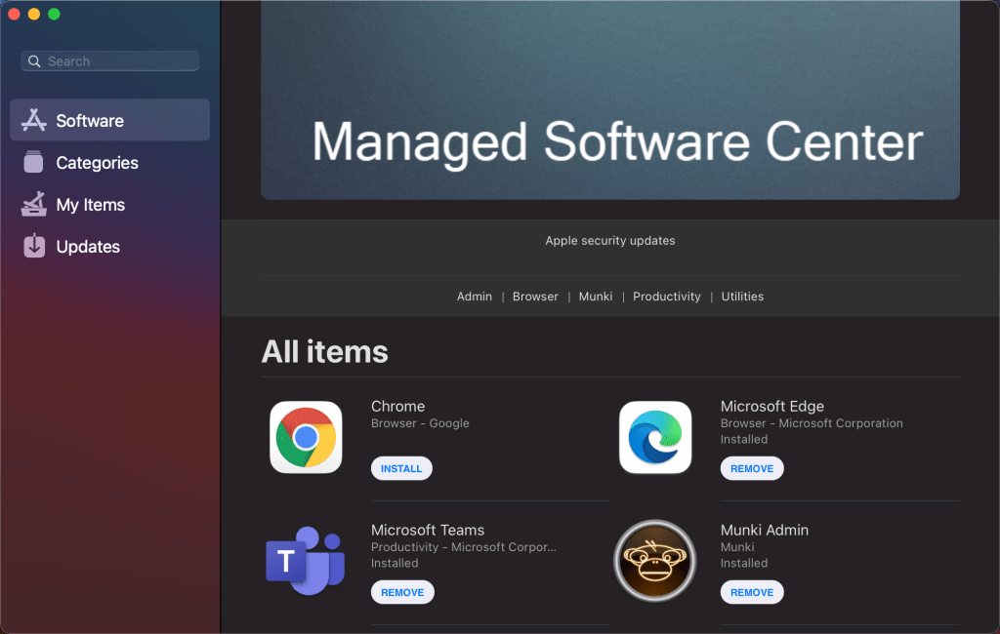](images/a6c1a25d-5c90-4af7-9563-e63916325601_1024x650.png)

#### PPPC Utility - A GUI tool for creating permission profiles

The more you get into managing macs, the more you will realize that permissions are a bigger bear here than they are on Windows. From what I can tell, Apple has a different philosophy on user permissions and requires some app permissions (like screen recording, microphone access, location access, etc.) require consent from the user and can’t be automatically allowed by an admin in the background. This can be **very** annoying at times. However, Apple does have a system for allowing you to manage app permission for the user called Privacy Preferences Policy Control, or PPPC. PPPC Utility is a tool where you can point it to an app (or multiple apps) and quickly define all the app permissions you’d like to set on a given device. Once you have it configured, it will generate a .mobileconfig file to deploy to your devices. Note, this app is developed by JAMF, but you can use it with any MDM.

[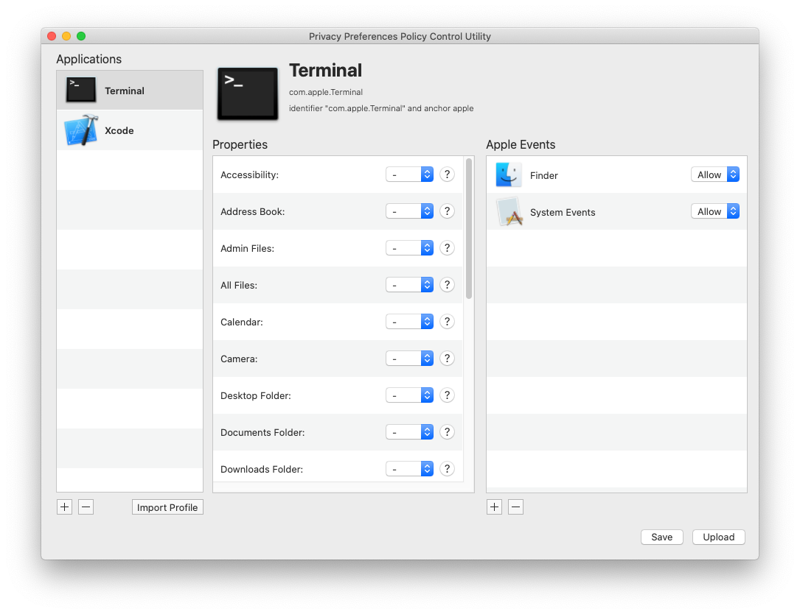](images/7a5954a4-17aa-46a5-a69b-92ba08a6a14f_1085x834.png)

#### [UTM](https://mac.getutm.app/) - Type2 Virtualization on Mac

There are many different options for virtualization on mac, but UTM has been my favorite because it is free and simple to use. As someone who is making a transition to managing mac, I still manage a lot of windows devices and often still need access to windows tools. Instead of carrying an extra laptop with me, I’ve opted to make a VM on my MacBook that has Windows 11 installed on it and is managed in Intune so I can continue to test my policies and apps that I push from my one laptop. UTM is has lots of great Quality of Life features like a shared folder between your mac and VMs, great clipboard syncing, USB pass through, etc.)

[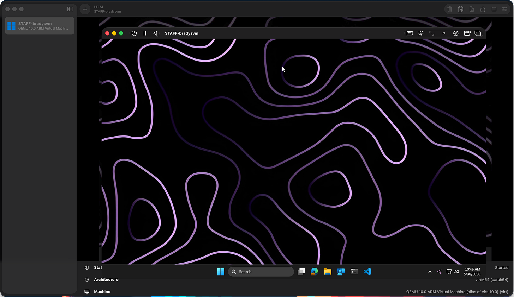](images/20871349-77d7-4e85-abe4-b72d44a71f6f_3416x1980.png)

### Conclusion

There are many great tools for Mac out there. If you have any others I’ve missed, please leave a comment with one! Below I’m also leaving some resources that have been helpful on my Mac Learning Journey.

Ciao!
