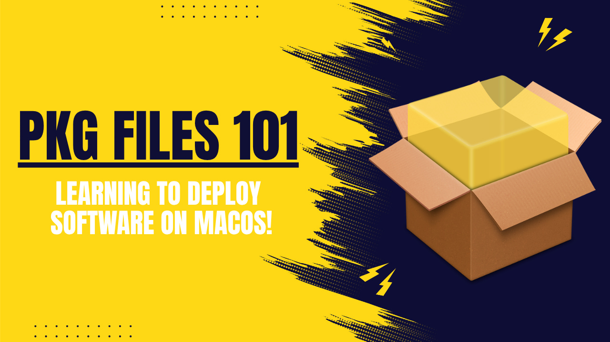
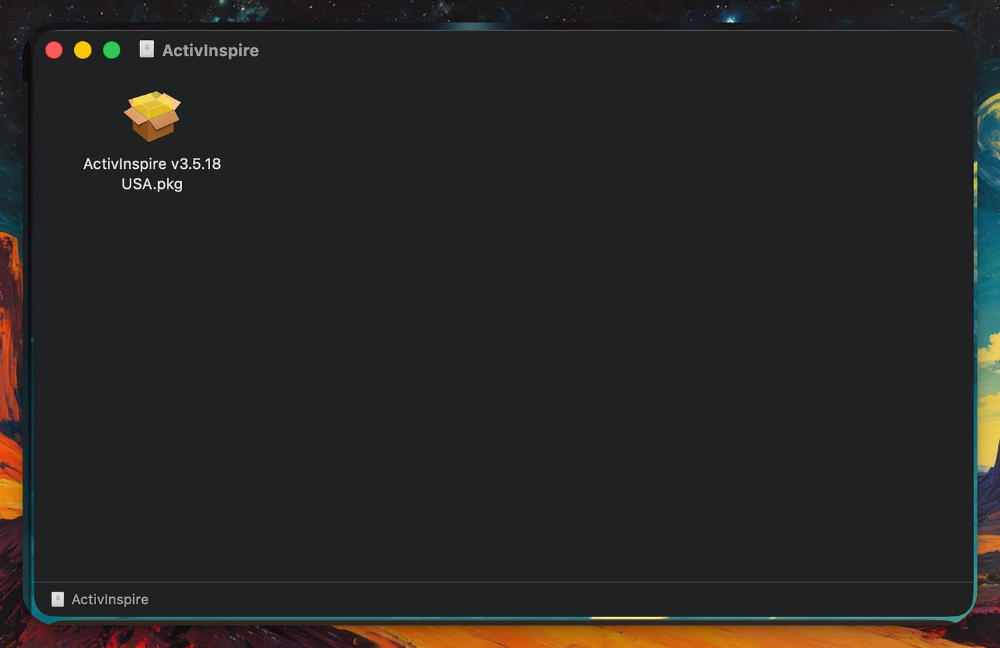
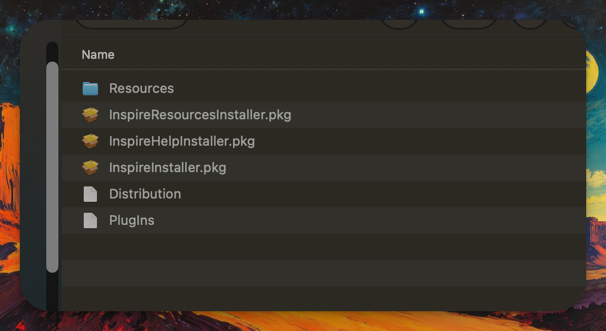
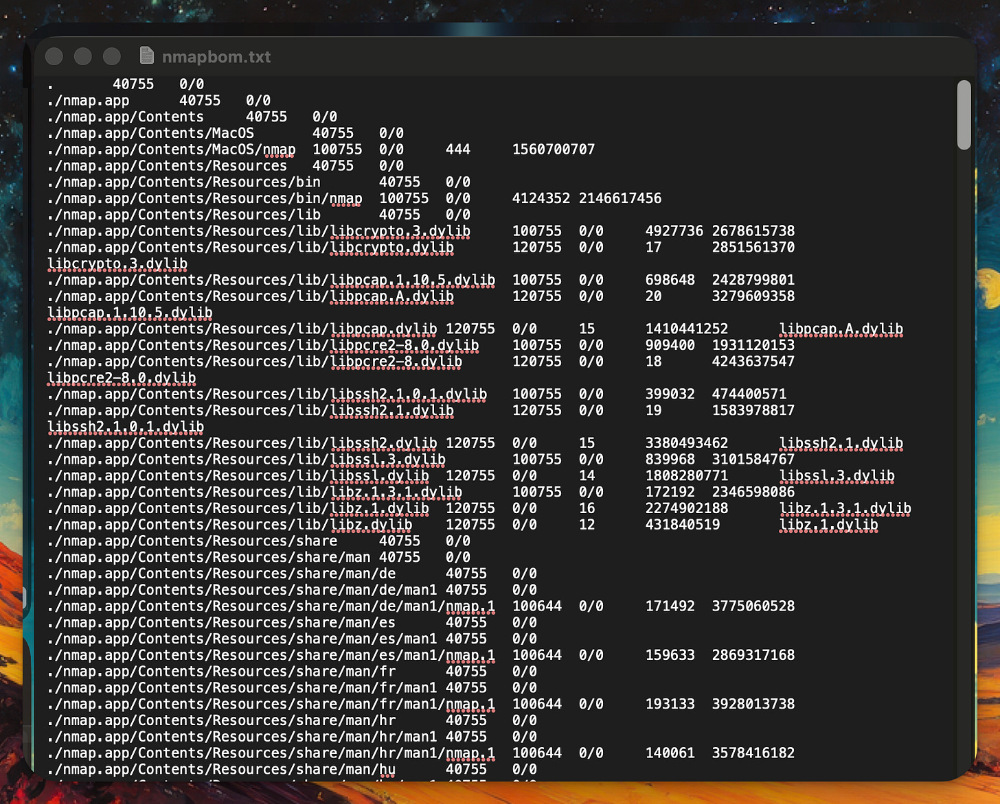
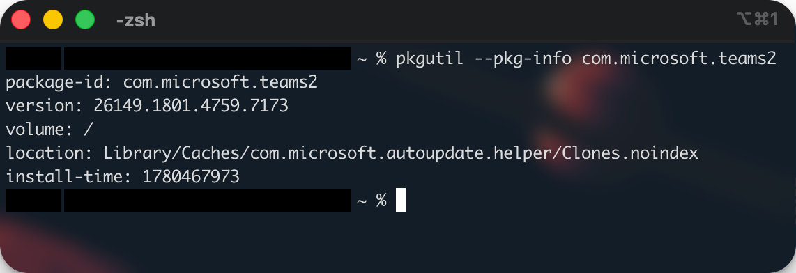
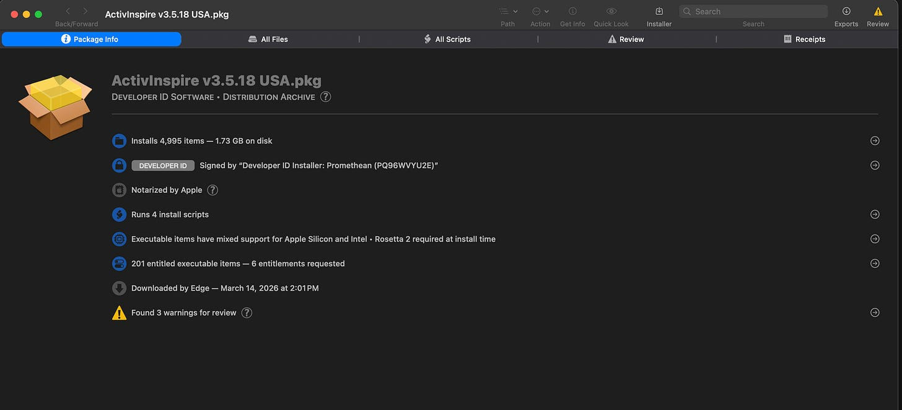
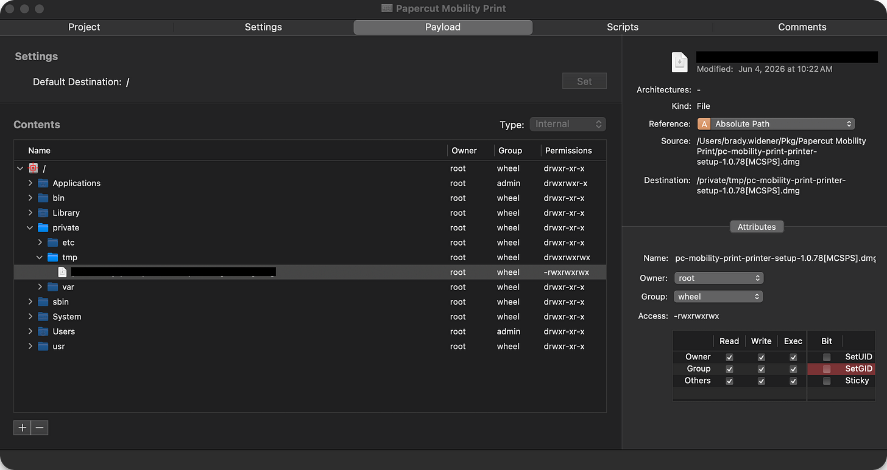
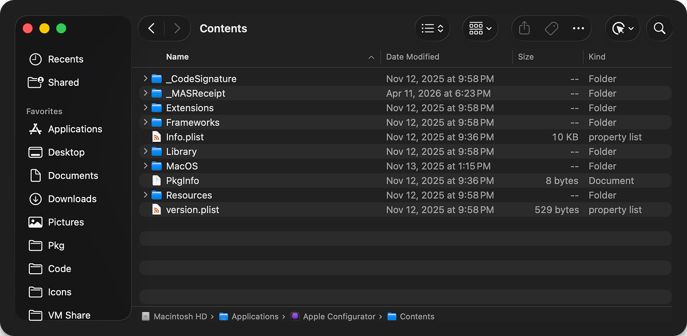

# App Packaging 101 on MacOS

*Exploring .pkg files and showing how to use them for MDM app packaging!*

[](images/9bde5432-8b2d-4310-a614-01d07554bca6_1280x720.png)

With the release of the Macbook Neo, many SysAdmins (like myself) are trying to level up on their MacOS skills in preparation. Over the last couple of months, I’ve been doing a deep dive on MacOS app packaging and wanted to share my notes with you! Enjoy.

## What is a .pkg file?

In short, pkg files are the MacOS way to install applications on your MacOS device. They are effectively the msi equivalent for MacOS. Under the hood, .pkg files are just flattened folders usually containing files, folders, and scripts to perform the actual installation. Note that though Pkgs are the main way to deploy apps, there are other varieties you may see and not all app publishers release their software with a .pkg installer, though this is the most common way to deploy apps on mac through MDMs. Because of this, it’s important to understand how to analyze and build pkgs so you can shape your software deployments to meet your needs.

The contents of a .pkg file can be discovered by using the CLI utility, **pkgutil**.
Below is an example of me unzipping a .pkg file to view the contents.

[](images/59ab706c-4ef9-425e-ab32-2b7a65f74c64_1594x1034.png)

I then copied the file over to its own directory and used the following command format to unzip it.
**pkgutil --expand-full ./installer.pkg /path/to/directory**
After this, I found the .pkg file has multiple installers inside of it, along with other dependancies.

[](images/8a9d3956-1b6c-439a-b232-3077a3b2a50a_1100x602.png)


Alternatively, you can also use **pkgutil** to create .pkg files from contents by using the --flatten flag. Below is an example of what this would look like.
**pkgutil --flatten ./path/to/directory ./ActivInspire.pkg**
This can be used to do things like editing the install script to modify how the .pkg file works, but note that repackaging removes the .pkg code signatures.

## History of .pkg files stored on Mac

A history of .pkg files installed on a mac can be found in the following directory.
**/var/db/receipts**
When going to this directory, you’ll notice lots of .bom files, or Bill Of Materials.

By default, these files are not readable, but you can use a command line utility to convert it to readable text. Below is an example on using this command line utility.
**/usr/bin/lsbom ./org.insecure.nmap.bom > nmapbom.txt**

[](images/25dc15f1-f4ea-4a3f-a1e7-bd57fa9fba53_1592x1282.png)


This will then provide a breakdown of the files and folders created during installation, the permissions of said files and folders, who owns the files, the file sizes, and checksum. In addition, you could also see things such as updates being applied to the package here.

Note, pkgutil can also be used to see a list of installed pkgs on your system, along with more detailed information on them. If you can’t for a .bom file for you application of choice, this is another way to get that information.

**pkgutil —pkgs #to get a list of pkgs**

**pkgutil —pkg-info \ #to get info on a single installed pkg**

[](images/2d5828c6-49ff-4eca-9a02-7667f543143f_1142x392.png)

There is a tool called **Suspicious Package** that is a free tool for analyzing .pkg files.

This utility allows you to choose a .pkg file and see the contents inside, the scripts being ran during the installation, if the app is signed correctly and notarized by Apple, what permissions the app will need, and if it detects any suspicious activity in the package, hints the name.

Suspicious Pakage is also a very helpful tool for looking at what all a package does without the need of having to unzip it every time.

[](images/5e7cff2f-6f43-4d20-87f4-59cedfa77289_3008x1370.png)

## Building .pkg files

You can do this through the CLI, or through a GUI application called **[Packages](http://s.sudre.free.fr/Packaging.html)**. Remember how I mentioned that .pkg files are basically just flattened folders with some files and a script? Well, this tool lets you create your own pkgs from scratch, but unlike pkgutil, this has a nice clean GUI to go along with it. I will say, when you go to the website for this one, it looks kind of sketchy. However, I’ve seen many reddit and jamf forums from recent saying it’s still a staple tool for mac admins. Below is a screenshot of a pkg I made using Packages that puts a dmg in a tmp folder, and then using a post install script, it will mount and install the software inside of it.

[](images/8553679e-586c-4291-a2cf-1b22de50e86c_2388x1268.png)

Note there are two different kind of pkgs.
**Component Package** - A .pkg file that installs a single app. Made for more simplified installations.
**Bundle Package** - A .pkg file that is composed of multiple component packages, plus a distribution xml that is used for defining things like permissions, building a custom install UI, etc.

Since pkgs are just payloads with scripts tied to them, this give sysadmins a lot of freedom on things they can deploy using a pkg. For example, you technically don’t have to put any payloads/files on the target computer and can instead just add a script. This gives you a consistent way to push scripts as pkgs to your endpoints.

### What if my program gives me a dmg or app file?

So one common thing you may notice when downloading software for Mac are .dmg and .app files. The good news is these can also be deployed as pkgs, but I think it’s important to understand the difference first.

**DMG** - Dmg are Mac’s Disk Image File Format. In short, whenever you download a dmg file online, you’re effectively downloading a virtual disk. Often when you open a .dmg file, it will contain a .app file and a shortcut to your applications folder so you can simply drag and drop it into the Applications shortcut for an easy install. However, I have also run into cases where the .dmg file contains an actual pkg. In general, when working with .dmg files, I try to extract the .pkg or .app inside and push it through your MDM by either pushing the .pkg directly, or packaging the .app file into a .pkg and going through it that way. However, I’ve also seen some apps that require you deploy the software using a .dmg for it to work correctly. If that is the case, I will then add the .dmg to the payload of a custom pkg and use a script (like below) that will automatically mount the disk and run the .pkg file contained inside for the end user.

```
#!/bin/bash

DMG="/private/tmp/example.dmg"
MOUNT="/private/tmp/example"

hdiutil detach "$MOUNT" 2>/dev/null
mkdir -p "$MOUNT"
hdiutil attach "$DMG" -mountpoint "$MOUNT" -nobrowse -noverify -noautoopen

INNER_PKG=$(find "$MOUNT" -maxdepth 1 -name "*.pkg" | head -n 1)

if [ -n "$INNER_PKG" ]; then
    installer -pkg "$INNER_PKG" -target /
    RESULT=$?
else
    echo "No pkg found in DMG"
    RESULT=1
fi

hdiutil detach "$MOUNT" 2>/dev/null
rm -f "$DMG"
rmdir "$MOUNT" 2>/dev/null

exit $RESULT
```

**APP** - .app files are interesting. You may be surprised to learn that they are actually just disguised folders! Whenever you right click on a .app file, you have an option for ‘Show Packaged Cotent’. Clicking this will reveal the contained files required for your application to run. Below are the inside contents of the Apple Configurator app.

[](images/2490264d-5441-4170-b28b-6ec0e9d3e0eb_1886x924.png)


I say all of this to say, that deploying a .app file is as simple as making a pkg with your app file as the payload, and have it deploy directly to the computer’s application folder. Note that some MDM’s like Mosyle have built in ways where you can give it a .app file and it will automatically convert it to a .pkg ready for deployment. If your MDM has a tool that does this, I would recommend using it instead of overcomplicating it.

I hope you’ve enjoyed this article and learned a thing or two. Cya!
